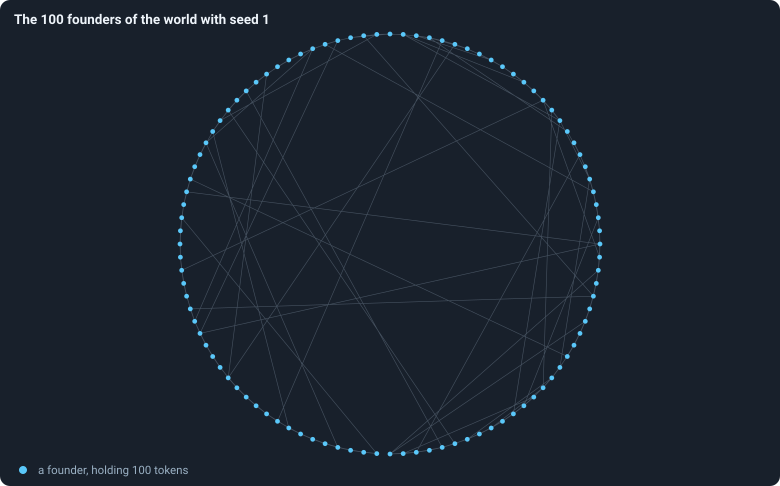

# The world: tokens, agents and a network

This chapter describes what a world is made of and how it begins.
[Chapter 3](03-one-iteration.md) describes how it changes, and
[Chapter 4](04-the-brain.md) how its agents decide.

> [!question] Questions of this chapter
> - What exactly is a world: what does it consist of, and what stays fixed?
> - How is a world built at the start, from its settings and its seed?
> - What is written down about it as it runs?

## The network

A world is a **graph** *G* = (*V*, *E*): a set *V* of **nodes** and a set *E*
of **connections** (in graph theory, *edges*). A connection joins two
different nodes; it has no direction, so the connection {*u*, *v*} is the same
as {*v*, *u*}; and two nodes are joined at most once. The **neighbours** of a
node *u* are the nodes it is joined to,

$$
N(u) = \{\, v \in V : \{u, v\} \in E \,\},
$$

and its **degree** is how many there are, deg(*u*) = |*N*(*u*)|. Because
every connection has two ends, the degrees add up to twice the number of
connections, so the **mean degree** — the number of connections an agent has
on average — is

$$
\bar k = \frac{1}{|V|} \sum_{u \in V} \deg(u) = \frac{2\,|E|}{|V|} .
$$

(For more on degrees, see [Degree](../notes/degree.md).)

Every node carries a whole-number **id**. Ids are handed out in increasing
order and never reused, so an id names one agent for its whole life — and a
smaller id means an older agent.

## Agents and tokens

On every node lives one **agent**; in this book "agent" and "node" mean the
same thing. An agent has:

- a number of **tokens** τ(*u*), a whole number. After every phase every
  living agent holds at least one: an agent left with none dies
  ([Chapter 3](03-one-iteration.md));
- a **brain** *B*(*u*): a neural network that takes all its decisions
  ([Chapter 4](04-the-brain.md));
- an **age**: the number of iterations since it was born
  ([Age and lifetime](../notes/age-and-lifetime.md));
- a **genotype**, the identity of its brain. An agent can lose its genotype:
  when another agent wins its node in the game, the node takes on a copy of
  the winner's brain ([Genotypes](../notes/genotype.md)).

The world holds a fixed number of tokens, *T*. Tokens move between agents but
are never made or destroyed, so after every phase of every iteration

$$
\sum_{u \in V} \tau(u) = T .
$$

[Chapter 3](03-one-iteration.md) checks that every rule keeps this sum.
Tokens are the only thing of value: an agent needs them to have a child, and
in the game they are what it fights with. Since every living agent holds at
least one token, a world can never hold more than *T* agents.

## How a world begins

A world is fixed by its **settings** and its **seed**. The settings are 23
numbers and switches; [Every setting](../notes/settings.md) lists them all,
with the values of the baseline **B1** that Part II uses. The ones that
shape the start are the number of tokens *T* = 10,000, the number of founders
and their ring.

From them the world is built in three steps.

**1. The founders.** The world starts with

$$
n = \left\lfloor \frac{T}{100} \right\rfloor
$$

agents, the **founders** — one for every hundred tokens (⌊*x*⌋ is *x*
rounded down). With *T* = 10,000 there are 100 founders, with ids 0 to 99.
Each gets ⌊*T* / *n*⌋ tokens, here exactly 100. Each founder gets a brain whose
weights are drawn at random ([Chapter 4](04-the-brain.md)), so every founder
starts with a genotype of its own, numbered 1 to 100.

**2. The ring.** The founders are joined into a **small-world ring**, the
construction of Watts and Strogatz (1998). Picture them on a circle, in order
of id. Each is joined to its nearest neighbours on either side — with the
baseline's settings, 2 on each side, so every founder starts with degree 4
and the ring has 100 · 4 / 2 = 200 connections. Then each connection is, with
probability 0.2, **rewired**: one of its ends is moved to a founder chosen at
random. Rewiring moves connections but never adds or removes one.
[The starting ring](../notes/starting-ring.md) gives the exact procedure.

Why a small world? A ring lattice is **clustered** — two neighbours of a
founder are usually neighbours of each other — but **long**: getting from one
side of the circle to the other takes many steps. A handful of random
shortcuts keeps most of the clustering and makes every distance short. Here
is the real starting network of one baseline run:

<!-- figure world/ring -->

**The 100 founders of the world with seed 1.** The starting graph of `B1-10000-s001`: 100 founders placed around a circle in the order of the ring, each joined to its two nearest neighbours on either side; 37 of the 200 connections were moved to a founder chosen at random, and cross the circle.

> [!example]- How to make this figure
> **Runs.** `B1-10000-s001`.
>
> **Data.** From its settings.
>
> 1. Build the graph exactly as the engine does: `networkx.watts_strogatz_graph(n=100, k=5, p=0.2, seed=1)` — with k = 5 networkx joins every node to ⌊5/2⌋ = 2 neighbours on either side.
> 2. Place node i at angle 2πi / 100 on a circle and draw every connection.
>
> **To make it again:** `python3 book_figures.py world`.
<!-- /figure -->

Without rewiring, this ring would have a clustering of 0.5
([Clustering](../notes/clustering.md)) and its founders would be 12.9 steps
apart on average ([Path length](../notes/path-length.md)). Rewired, 37 of its
200 connections are shortcuts; the clustering is 0.27 and the average
distance 4.4 steps.

**3. The random stream.** The ring is drawn by the networkx library from a
random generator of its own, started from the seed. Every other random choice
a world ever makes — the founders' brains, every probabilistic decision,
every random input of a brain, every share-out of tokens — is drawn from one
stream of pseudo-random numbers, started from the same seed. A run therefore
depends on its settings and its seed and on nothing else
([Seeds and the random stream](../notes/random-numbers.md));
[Chapter 7](07-is-a-run-reproducible.md) tests this.

## What is recorded

After every phase the world is written down as a **frame**: frame 2*t* after
the reproduction phase of iteration *t*, frame 2*t* + 1 after its game. A
frame holds every living agent's id, tokens, genotype and parent genotype and
age; every connection; and every decision taken in the phase. From each frame
a row of about seventy **statistics** is computed — the number of agents, of
connections, the inequality of wealth, and so on — and kept in the run's
`stats.jsonl`. [What a run records](../notes/frames-and-stats.md) lists the
fields and links each statistic to the note that defines it.

A baseline run of 10,000 tokens and 3,000 iterations writes 6,000 frames,
about 300 megabytes on disk.

> [!summary] In short
> A world is a network of agents on nodes. Each agent holds a whole number of
> tokens and a brain. The total *T* never changes. A world starts as *T*/100
> founders of 100 tokens each on a small-world ring, and everything about it
> follows from its settings and its seed.

<!-- turns -->
---

← [Chapter 1 · What this book is about](01-what-this-book-is-about.md) · [Contents](../README.md) · [Chapter 3 · One iteration, step by step](03-one-iteration.md) →
<!-- /turns -->
