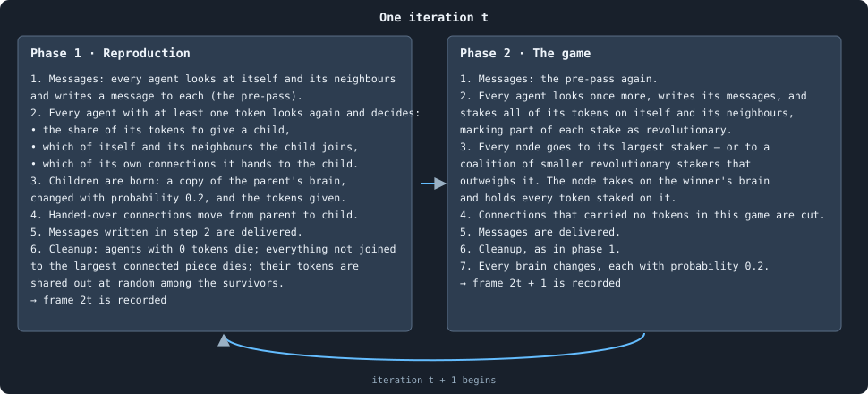
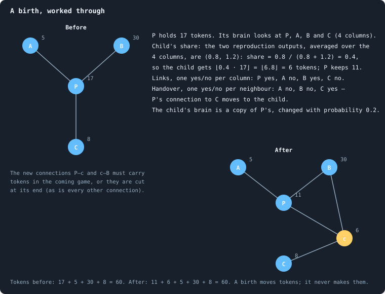
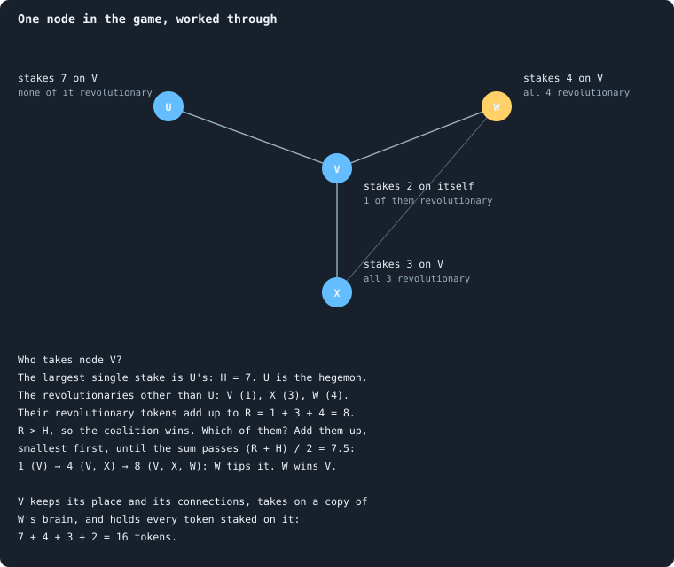
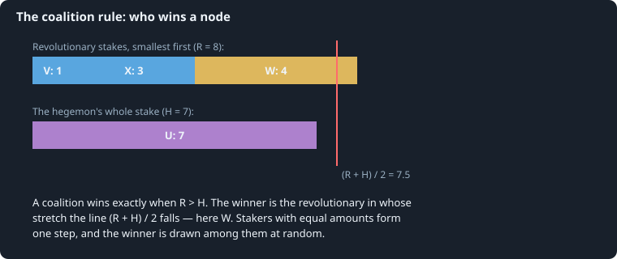
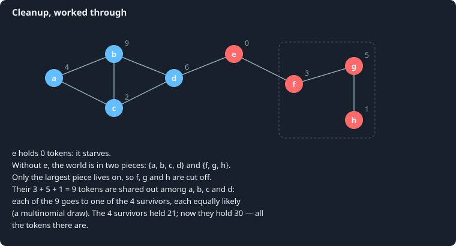
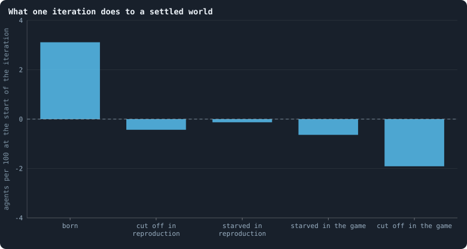

# One iteration, step by step

Time in a world advances in **iterations**, *t* = 0, 1, 2, …. Every iteration
has two phases: first **reproduction**, then **the game**. This chapter goes
through both in the exact order the program runs them. Where the brain is
asked for a decision, this chapter only says *which* decision and how its
answer is used; [Chapter 4](04-the-brain.md) says how the brain arrives at it.

> [!question] Questions of this chapter
> - In what order does everything happen in one iteration?
> - How exactly does a decision of the brain turn into tokens moved,
>   children born and nodes won?
> - Why does the number of tokens never change?
> - What does one iteration do, on average, to a settled world?

## Three tools used everywhere

Three small rules turn the brain's real-valued outputs into whole-numbered
actions. Each has a note of its own with examples.

**A share from two numbers.** Many decisions come out of the brain as a pair
of real numbers (*a*, *b*), to be turned into a share between 0 and 1.
Negative values count as zero, and the share is *a*'s part of the total
([The share function](../notes/share-function.md)):

$$
f(a, b) = \frac{\max(a, 0)}{\max(a, 0) + \max(b, 0)}, \qquad f(a, b) = \tfrac12 \ \text{ if } a \le 0 \text{ and } b \le 0 .
$$

For example *f*(0.8, 1.2) = 0.4, *f*(3, −1) = 1, *f*(−2, −5) = ½.

**A yes-or-no decision, read as the brain chooses.** A yes/no decision comes
out as two pairs: (*y*, *n*), how strongly the brain says yes and no, and
(*m*₁, *m*₂), how it wants that pair read. If *m*₁ > *m*₂, the answer is yes
with probability *f*(*y*, *n*). Otherwise the larger of *y* and *n* wins
outright, and an exact tie is decided by a fair coin
([A yes-or-no decision](../notes/binary-decision.md)).

**Splitting whole tokens.** When τ tokens are split in proportion to scores,
every candidate first gets its exact share rounded down, and the tokens left
over go one each to the candidates that lost the most in the rounding — the
*largest-remainder* method. No token is lost or made
([Splitting tokens into whole numbers](../notes/largest-remainder.md)).
Splitting 11 tokens by the scores (2, 1, −0.5, 0.5) gives (6, 3, 0, 2).

## Phase 1: reproduction

1. **Measure.** The tokens and degree of every agent, and the summaries of
   every neighbourhood, are measured once, now. Every decision in this phase
   reads these numbers, so the order in which agents act does not change
   what they see.
2. **Everyone speaks.** Every agent looks at its **candidates** — itself and
   its neighbours, in increasing order of id — and writes a message to each.
   The messages are delivered before anyone acts ([Messages](../notes/messages.md)).
3. **Every agent with tokens decides.** The agents are taken one at a time,
   in increasing order of id. Agent *u*, holding τ(*u*) ≥ 1 tokens, looks at
   its candidates again; its brain gives one column of outputs per candidate
   ([What a brain says](../notes/brain-outputs.md)). From them:
   - **How much to give a child.** The two child-share outputs are averaged
     over all of *u*'s columns, giving (*ā*, *b̄*), and the child gets
     $c = \lfloor f(\bar a, \bar b) \cdot \tau(u) \rfloor$ tokens. If *c* = 0,
     there is no child, and *u* is done.
   - **The child is born.** It gets a new node and the next unused id, and
     holds *c* tokens; the parent keeps τ(*u*) − *c*. The child's brain is a
     copy of the parent's, which then changes with probability 0.2
     ([How a brain changes](../notes/mutation.md)) — a changed brain is a new
     genotype.
   - **Whom the child joins.** For each candidate — the parent itself
     included — a yes-or-no decision: join the child to it or not. The
     connections are made at once.
   - **Which connections to hand over.** For each neighbour *v* of the
     parent, a yes-or-no decision: give the connection {*u*, *v*} to the
     child. These are noted, not yet done.
4. **Handovers.** After every agent has decided, each noted connection moves:
   {*u*, *v*} is removed and {child, *v*} added (unless the child is already
   joined to *v*).
5. **Messages** written in step 3 are delivered.
6. **Cleanup** (below).

Children born in this phase do not themselves reproduce in it: the list of
agents in step 3 is made before the first child is born.

Two kinds of death follow from this phase. A child joined to nobody is not
part of the world's network, and the cleanup removes it at once — its tokens
are shared out among the survivors. And a parent that gave all its tokens
(*f* = 1) is left with none, and starves in the same cleanup.

## Phase 2: the game

1. **Measure**, as in phase 1.
2. **Everyone speaks**, as in phase 1.
3. **Everyone stakes.** Every agent looks at its candidates once more, and
   writes its messages again. If it holds τ(*u*) ≥ 1 tokens, it stakes
   **all** of them on its candidates. Its brain gives one **stake score** per
   candidate and a pair, averaged over its columns, that says how to use the
   scores:
   - *spread* (if the pair's first number is larger): the τ(*u*) tokens are
     split in proportion to the scores, by largest remainder;
   - *all in* (otherwise): all τ(*u*) tokens go to the candidate with the
     highest score (the first one in candidate order, if several tie).

   For each candidate that receives *a* > 0 tokens, a further pair gives the
   share of the stake marked **revolutionary**: ⌊*f* · *a*⌋ of the *a* tokens.
4. **Every node goes to someone.** For each node *v*, collect every stake
   placed on it, including its own agent's. Let *H* be the largest single
   stake and *h* the agent who made it — the **hegemon** (a tie is broken at
   random). Let the **coalition** be every other staker who marked part of its
   stake on *v* revolutionary, and *R* the sum of those revolutionary parts.

   $$
   \text{the coalition wins} \iff R > H .
   $$

   If the coalition wins, its winning member is found by sorting the
   coalition from the smallest revolutionary part to the largest and adding
   the parts up in that order: the winner is the member at whose part the
   running sum first exceeds (*R* + *H*)/2 (members with equal parts are added
   together, and one of them drawn at random). Otherwise the hegemon wins.
   [How a coalition takes a node](../notes/revolution.md) derives this rule
   from the program's and works an example.

   Whoever wins, two things happen to node *v*: it takes on a **copy of the
   winner's brain**, and it holds **every token staked on it** — the winner's,
   the losers', its own. The node keeps its id and its age; only its brain
   changes. A node on which nobody staked anything is left with no tokens.
5. **Unused connections are cut.** A connection across which no tokens were
   staked in this game, in either direction, is removed. So a connection a
   newborn got in phase 1 survives only if it carries tokens now.
6. **Messages** are delivered.
7. **Cleanup** (below).
8. **Change.** Every brain in the world changes with probability 0.2 —
   independently, brain by brain ([How a brain changes](../notes/mutation.md)).
9. **Forgetting.** Messages to or from anyone who is no longer a neighbour
   are deleted.

The game is a version of **Colonel Blotto** (Borel 1921): players spread a
fixed force over several battlefields, and each battlefield goes to whoever
committed more to it. Here every node is a battlefield and every agent a
player who can only reach its own neighbourhood; winning a battlefield wins
its tokens and plants the winner's brain there. [Chapter 6](06-the-ideas-this-builds-on.md)
says more.

## Cleanup

After each phase, three steps:

1. **Starvation.** Every agent holding no tokens dies.
2. **Cut off.** Of the network that remains, only the **largest connected
   piece** survives: every agent that cannot reach it along connections dies.
3. **Sharing out.** All tokens held by the agents who died — only the cut-off
   ones hold any — are pooled and dealt out among the survivors, each token
   to a survivor chosen uniformly at random (one multinomial draw).

If an iteration ends — after its game — with 20 agents or fewer, the world
counts as **extinct** and the run stops ([When a world ends](../notes/extinction.md)).

[Births and the four ways to die](../notes/births-and-deaths.md) sums up who
dies where: starved or cut off, after reproduction or after the game.

## Why the tokens add up

The total *T* never changes, and the reason can be checked rule by rule:

- A birth moves *c* tokens from parent to child.
- In the game every agent stakes exactly its τ(*u*) tokens — the
  largest-remainder split loses none, and all-in puts all on one — and every
  staked token lands on exactly one node, which keeps it. So the tokens held
  after the game are a rearrangement of those staked.
- The cleanup gives every token of the dead to a survivor.

So after every phase Σ τ(*u*) = *T*.

## What an iteration does, on average

Once a world has settled ([Chapter 9](09-a-worlds-life.md)), how many agents
does one iteration add and remove? Here is the average over iterations 500
to 2,999 of the 26 baseline worlds that lived that long, per hundred agents
alive at the start of the phase:

<!-- figure iteration/flows -->

**What one iteration does to a settled world.** Agents added (above zero) and removed (below), per 100 agents alive at the start of an iteration, averaged over iterations 500 to 2,999 of the 26 worlds that lived to the end, pooled: every iteration of every world counts once. The bars add up to 0.00: the population hardly changes from one iteration to the next, while about three in a hundred agents are replaced.

> [!example]- How to make this figure
> **Runs.** The 26 surviving ones of the 30 baseline runs `B1-10000-s001` … `B1-10000-s030`: the baseline B1 at 10,000 tokens, seeds 1 to 30, 3,000 iterations each (every setting is listed in [Chapter 8](08-thirty-worlds.md)). They are made with `python3 gol_lab.py run E02`.
>
> **Data.** From each run's `GraphOfLifeRuns/<run>/stats.jsonl`, which holds one row per recorded phase: `phase` 1 is the world just after reproduction, `phase` 2 just after the game, and every statistic is a field of the row (see [What a run records](../notes/frames-and-stats.md)).
>
> 1. For every iteration 500 ≤ t ≤ 2,999 of every run, take from the row with `phase` = 1: `nodes_before`, `births`, `orphaned`, `starved`; from the row with `phase` = 2: `starved`, `orphaned`.
> 2. Sum each over all iterations and runs; divide by the sum of `nodes_before` of the rows with `phase` = 1, and multiply by 100.
>
> **To make it again:** `python3 book_figures.py iteration`.
<!-- /figure -->

Of every 100 agents alive at the start of an iteration, about 3.1 have a
child that is born, and about the same number die: 0.4 cut off during
reproduction (most of them newborns joined to no one), 0.1 parents that gave
everything, 0.6 starved in the game — no one, not even they themselves,
staked a token on their node — and 1.9 cut off in the game, when the
connections that held their part of the network were cut. The population
hardly moves from one iteration to the next, while three in a hundred of its
members are replaced.

But the game changes far more than that: in a settled baseline world only
about 45% of agents keep their node through a game; the rest take on another
agent's brain ([Chapter 14](14-how-the-game-is-played.md)). The members of a
world stay; their brains are replaced all the time.

> [!summary] In short
> An iteration is reproduction, then the game, each followed by a cleanup. In
> reproduction, agents give part of their tokens to children joined to their
> neighbourhood. In the game, every agent stakes all its tokens on itself and
> its neighbours; every node takes the brain of the largest staker or of a
> coalition, and every token staked on it. Unused connections are cut, the
> disconnected and the penniless die, and every brain may change.

<!-- turns -->
---

← [Chapter 2 · The world: tokens, agents and a network](02-the-world.md) · [Contents](../README.md) · [Chapter 4 · The brain](04-the-brain.md) →
<!-- /turns -->
