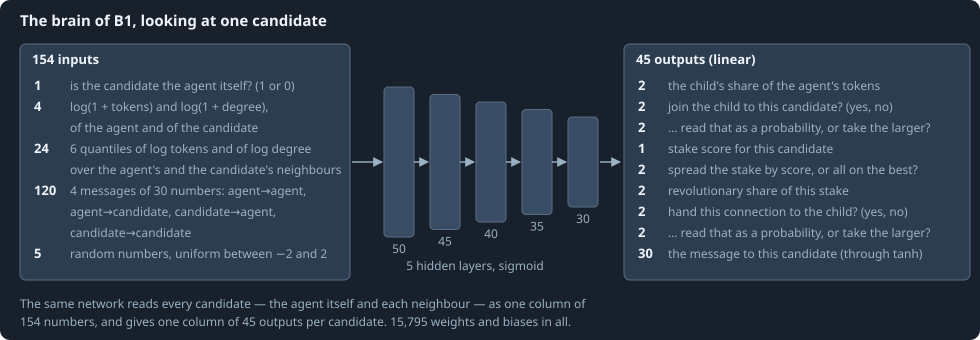
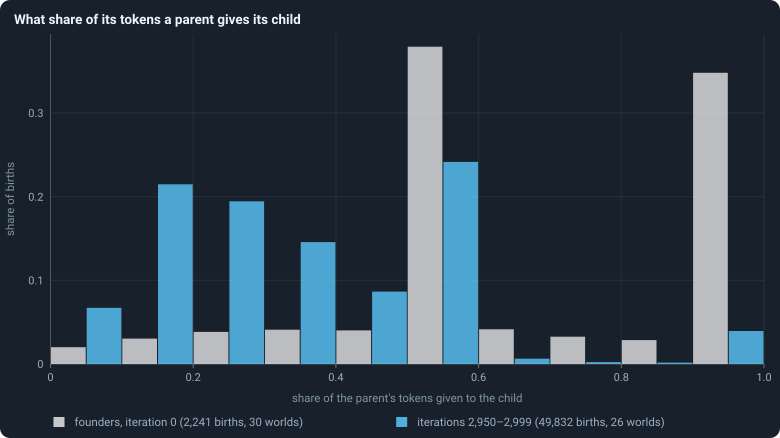

# The brain

Every decision of [Chapter 3](03-one-iteration.md) — how much to give a child,
whom it joins, which connections to hand over, where to stake and how much of
it to mark revolutionary, what to say to each neighbour — is taken by the
agent's **brain**. This chapter describes the brain of the baseline B1
completely: what it reads, how it computes, how its outputs become decisions,
and how it changes from one generation to the next.

> [!question] Questions of this chapter
> - What does a brain see, and what does it compute from it?
> - How do its outputs become the decisions of Chapter 3?
> - How is a brain inherited, and how does it change?
> - Do brains end up deciding differently from the random brains they start as?

## One look: a column per candidate

When agent *u* looks at its candidates (*u*, *v*₁, …, *v*_d) — itself and its
*d* neighbours, in increasing order of id — it builds one column of **154
inputs** for each candidate, and feeds all *d* + 1 columns through the same
network at once. The inputs, in order (the full list, row by row, with a
worked example, is in [What a brain sees](../notes/brain-inputs.md)):

- **1** — whether the candidate is the agent itself: 1 for the first column,
  0 for the others.
- **4** — ln(1 + τ) of the agent and of the candidate, and ln(1 + deg) of
  both: tokens and connections on a logarithmic scale, so that 10 against 100
  tokens looks as different as 100 against 1,000.
- **24** — summaries of the two neighbourhoods: for the agent and for the
  candidate, six quantiles (the smallest, the 20th, 40th, 60th and 80th
  percentiles, and the largest) of ln(1 + τ) over their neighbours, and the
  same for ln(1 + deg). That is 6 × 2 × 2 = 24 numbers.
- **120** — four messages of 30 numbers each: what the agent last wrote to
  itself, what it wrote to the candidate, what the candidate wrote to it, and
  what the candidate wrote to itself ([Messages](../notes/messages.md)).
- **5** — random numbers, each drawn uniformly between −2 and 2, new for
  every candidate in every look. They let two agents in the same position, or
  one agent looking twice, act differently.

## The network

The brain is a **feed-forward neural network** with five hidden layers of
50, 45, 40, 35 and 30 units and an output layer of 45. Writing *x* for a
column of 154 inputs, layer ℓ = 1, …, 6 computes

$$
z^{(\ell)} = W^{(\ell)} a^{(\ell-1)} + b^{(\ell)}, \qquad a^{(0)} = x,
$$

$$
a^{(\ell)} = \sigma\bigl(z^{(\ell)}\bigr) \ \text{ for the hidden layers } \ell = 1, \dots, 5,
\qquad \sigma(z) = \frac{1}{1 + e^{-z}},
$$

$$
y = z^{(6)} \quad \text{for the output layer (no squashing).}
$$

*W*⁽ˡ⁾ is a matrix of **weights**, with one row per unit of layer ℓ and one
column per unit of the layer before; *b*⁽ˡ⁾ is a vector of **biases**. The
sigmoid σ squashes every hidden sum into (0, 1). Counting the numbers:

$$
154 \cdot 50 + 50 \cdot 45 + 45 \cdot 40 + 40 \cdot 35 + 35 \cdot 30 + 30 \cdot 45 = 15{,}550 \ \text{weights},
$$

$$
50 + 45 + 40 + 35 + 30 + 45 = 245 \ \text{biases},
$$

15,795 numbers in all. They are the brain's **genome**: nothing else about an
agent is inherited.

**A founder's brain** gets every weight drawn from a normal distribution with
mean 0 and standard deviation 1/√*k*, where *k* — the layer's **fan-in** — is
the number of units feeding it (154 for the first layer, 50 for the second,
and so on); every bias starts at 0. The scale 1/√*k* keeps the sums *z* of a
layer about as large as its inputs, whatever the layer's width: a sum of *k*
products, each of standard deviation about 1/√*k* times its input, has
standard deviation about that of one input.

**Precision.** B1 stores its weights as 16-bit floating-point numbers
(`float16`), which keep about three significant decimal digits, and computes
with them in 64-bit arithmetic. A brain then takes a quarter of the memory of
one stored in 64 bits.

## From outputs to decisions

A look produces one column of 45 outputs per candidate. Rows counted from 0,
as in the code:

| rows | what | read as | used in |
|---|---|---|---|
| 0–1 | child share | *f*(row 0, row 1), averaged over columns first | reproduction |
| 2–3 | join the child to this candidate? | yes/no, per candidate | reproduction |
| 4–5 | how to read rows 2–3 | probability or sharp, per candidate | reproduction |
| 6 | stake score | one score per candidate | game |
| 7–8 | spread or all in | spread if row 7 > row 8, averaged over columns first | game |
| 9–10 | revolutionary share | *f*(row 9, row 10), per candidate | game |
| 11–12 | hand this connection to the child? | yes/no, per neighbour | reproduction |
| 13–14 | how to read rows 11–12 | probability or sharp, per neighbour | reproduction |
| 15–44 | message | tanh of each, one message per candidate | both |

*f* is [the share function](../notes/share-function.md); "probability or
sharp" is [the yes-or-no rule](../notes/binary-decision.md); the split of a
spread stake is [the largest-remainder method](../notes/largest-remainder.md).
[What a brain says](../notes/brain-outputs.md) goes through the table row by
row. Three things in it are easy to miss:

- the **child's share** and the choice between **spreading and going all
  in** are each one decision for the whole agent: their rows are averaged
  over all candidate columns before they are read;
- everything else is decided **per candidate**: whether the child joins it,
  how much to stake on it, how much of that stake is revolutionary;
- the **message** to a candidate is rows 15–44 of that candidate's column,
  each passed through tanh, which squeezes any number into (−1, 1). The
  message an agent writes to itself is in the column of itself.

## How a brain changes

A brain changes in two situations: when it is copied into a child, and —
every brain in the world, independently — after every game. Each time, with
probability *p* = 0.2, the brain is **mutated**; otherwise it is left exactly
as it was. A mutation treats every weight matrix and every bias vector
separately, with *s* = 0.1 and σ = 0.2 ([How a brain changes](../notes/mutation.md)
has the details):

1. **Jitter.** Each number, independently with probability *s*, has a normal
   random number of standard deviation σ/√*k* added to it — a fifth of the
   spread of the layer's starting weights.
2. **Reset**, rarely. With probability *s*, a fraction *s* of the matrix's
   numbers — each independently with probability *s* — are drawn afresh: a
   weight from the starting distribution, normal with standard deviation
   1/√*k*; a bias from a normal with standard deviation σ/√*k*.

So a mutation nudges about one number in ten, a little; and about one matrix
in ten also has about one number in ten replaced outright.

**Genotypes.** Every brain carries an id, its **genotype**. A copy keeps the
id: a child whose brain did not mutate, and a node that took on a
conqueror's brain, carry the same genotype as the brain they copied. A
mutation gives the brain a new id and remembers the old one as its parent.
The ids therefore form a family tree ([Genotypes and the family
tree](../notes/genotype.md)), which [Chapter 16](16-genotypes-and-lineages.md)
climbs.

## What brains end up doing

No one designs these brains, and nothing rewards any behaviour. Do they still
change what they do over a run? Take one decision, the share of its tokens a
parent gives a child:

<!-- figure brain/child-share -->

**What share of its tokens a parent gives its child.** For every birth: the tokens the child received divided by the tokens its parent held just before, in bins of 0.1. Grey: the founders' births in the very first reproduction phase, decided by brains of random weights. Blue: the births of the last 50 iterations, decided by brains descended from them through 2,950 iterations of copying, changing and conquering. Only parents that gave at least one whole token had a child and are counted.

> [!example]- How to make this figure
> **Runs.** The 30 baseline runs `B1-10000-s001` … `B1-10000-s030`: the baseline B1 at 10,000 tokens, seeds 1 to 30, 3,000 iterations each (every setting is listed in [Chapter 8](08-thirty-worlds.md)). They are made with `python3 gol_lab.py run E02`.
>
> **Data.** From each run's frames, `GraphOfLifeRuns/<run>/frames/`, read with `gol_store.read_frame(run, index)`; frame `2·t` is iteration *t* after reproduction and frame `2·t + 1` after the game.
>
> 1. In the frames with `phase` 1 of iteration 0, and of iterations 2,950 to 2,999, read `decisions.births`: each entry has the parent's `tokens_before` and the child's `invested`.
> 2. Put `invested / tokens_before` into ten bins of width 0.1 and divide each count by the number of births.
>
> **To make it again:** `python3 book_figures.py brain`.
<!-- /figure -->

The founders' random brains give their children a median of half their
tokens. A third of them (33%) give everything — and die of it, since a parent
left with no tokens starves — and another third give exactly half, which is
what *f* says when both of its outputs are negative. In the last fifty
iterations of the runs the typical parent gives a third, and only 4% give
everything. Other decisions moved just as far. In the first game, half of the
agents (49% in the median world) spread their stake over several candidates
rather than putting it all on one, and half of all staked tokens (50%) were
marked revolutionary — what brains of random weights do, since each of these
choices depends on which of two random outputs is the larger. From iteration
500 on it was 97% and 96% ([Chapter 14](14-how-the-game-is-played.md)).

Nobody chose these numbers. Are they the work of selection — brains that did
otherwise losing their tokens and their nodes — or only of the churn of
copying and changing brains? Parts II and III come back to this question
([Chapter 14](14-how-the-game-is-played.md), [Chapter 18](18-do-the-brains-matter.md)).

## The control: decisions by chance

One setting replaces the brain by noise: with
[`random_decisions`](../notes/settings.md#random_decisions) on, every one of
the 45 outputs of every column is drawn from a standard normal distribution
instead of being computed, and every decision is read from that noise exactly
as above. Nothing else changes. [Chapter 18](18-do-the-brains-matter.md) shows
what becomes of a world run that way.

> [!summary] In short
> A brain is a neural network of 15,795 numbers: 154 inputs per candidate
> (tokens, connections, neighbourhood summaries, messages and noise), five
> sigmoid layers, and 45 linear outputs that the rules of Chapter 3 turn into
> decisions. It is inherited by copying, and changed with probability 0.2 at
> every birth and after every game.

<!-- turns -->
---

← [Chapter 3 · One iteration, step by step](03-one-iteration.md) · [Contents](../README.md) · [Chapter 5 · How worlds are measured](05-how-worlds-are-measured.md) →
<!-- /turns -->
