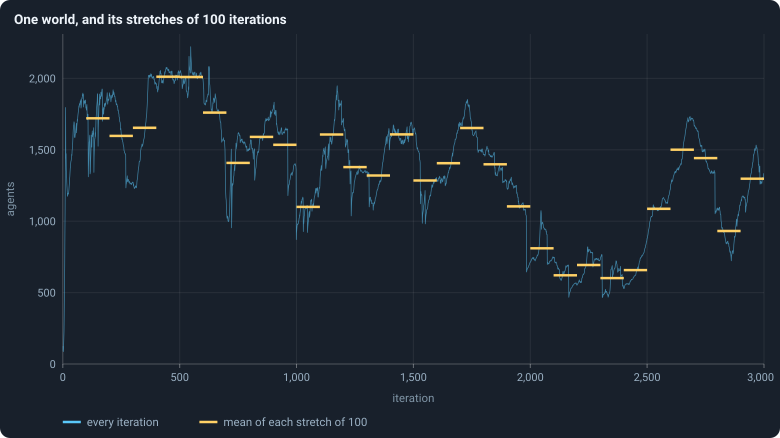
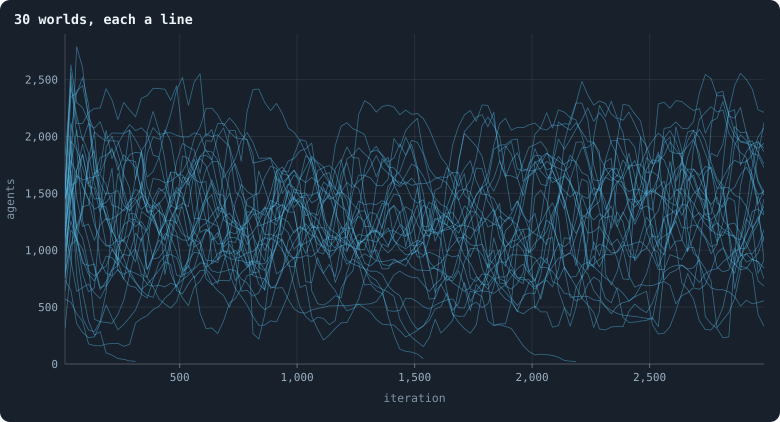

# How worlds are measured

A world of 10,000 tokens holds about 1,300 agents and lives 3,000
iterations: some four million agent-moments, recorded twice per iteration.
This chapter explains, step by step, how that becomes the numbers and figures
of the rest of the book — and, because a single world depends on chance, how
worlds are compared with each other. Each step links to a note that defines
it exactly and works an example.

> [!question] Questions of this chapter
> - What is measured in a world, and when?
> - How is one world summed up in a number?
> - How are thirty worlds drawn in one figure?
> - How do we tell whether two kinds of world differ, or only chance does?

## Step 1 · A row of statistics per phase

After every phase the world is recorded as a frame, and from every frame a
**row** of statistics is computed: the number of agents, of connections, how
unequal the tokens are, how many agents starved, and so on
([What a run records](../notes/frames-and-stats.md)). A row with `phase` = 1
describes the world just after a reproduction phase, one with `phase` = 2
just after a game. Unless a figure says otherwise, the book reads the rows of
phase 2: the world **at the end of each iteration**. Births are the
exception: they are counted in the rows of phase 1, where they happen.

Most statistics are computed for every row. Those that need a walk through
the whole network — bridges, the core, clustering, distances — are computed
every 25 iterations.

## Step 2 · One world: means over stretches

A statistic jumps about from one iteration to the next. To say where a world
*is* at some time, the book takes its **mean over a stretch** of iterations
*a* to *b*, both included:

$$
\bar x[a, b] = \frac{1}{m} \sum_{t=a}^{b} x(t),
$$

where *m* is the number of rows in the stretch that hold the statistic.

<!-- figure measure/stretches -->

**One world, and its stretches of 100 iterations.** The world with seed 1: its number of agents after every game (blue), and its mean over each of the 29 stretches of 100 iterations from iteration 100 to 2,999 (yellow). Many measurements in this book are means over such stretches.

> [!example]- How to make this figure
> **Runs.** `B1-10000-s001`.
>
> **Data.** From each run's `GraphOfLifeRuns/<run>/stats.jsonl`, which holds one row per recorded phase: `phase` 1 is the world just after reproduction, `phase` 2 just after the game, and every statistic is a field of the row (see [What a run records](../notes/frames-and-stats.md)).
>
> 1. Plot `nodes` of the rows with `phase` = 2.
> 2. For a = 100, 200, …, 2,900, average `nodes` over a ≤ `iteration` ≤ a + 99.
>
> **To make it again:** `python3 book_figures.py measure`.
<!-- /figure -->

A world spends its first hundred iterations or so in a **youth** unlike the
rest of its life ([Chapter 11](11-the-first-hundred-iterations.md)), and then
**wanders** ([Chapter 10](10-a-worlds-life.md)). So when the book asks where a
world **settles**, it takes the mean from iteration 500 to its end — its
[settled life](../notes/settled-life.md).

## Step 3 · Many worlds: lines, bands and dots

Every world is a matter of chance: the seed decides the starting ring, the
founders' brains and every random decision after. So the book makes many
worlds — thirty for each setting — with seeds 1, 2, …, 30. Drawn one line per
world, they look like this:

<!-- figure measure/thirty -->

**30 worlds, each a line.** The number of agents of each of the 30 baseline worlds, every line one world, averaged over stretches of 25 iterations so that the lines stay legible.

> [!example]- How to make this figure
> **Runs.** The 30 baseline runs `B1-10000-s001` … `B1-10000-s030`: the baseline B1 at 10,000 tokens, seeds 1 to 30, 3,000 iterations each (every setting is listed in [Chapter 9](09-thirty-worlds.md)). They are made with `python3 gol_lab.py run E02`.
>
> **Data.** From each run's `GraphOfLifeRuns/<run>/stats.jsonl`, which holds one row per recorded phase: `phase` 1 is the world just after reproduction, `phase` 2 just after the game, and every statistic is a field of the row (see [What a run records](../notes/frames-and-stats.md)).
>
> 1. Take every run's rows with `phase` = 2 and `nodes`; average them in stretches of 25 iterations; draw one line per run.
>
> **To make it again:** `python3 book_figures.py measure`.
<!-- /figure -->

Thirty lines are hard to read. The book usually draws them as a **band**: in
each short stretch of iterations, the median of the worlds is the line, the
middle half of the worlds the darker band, and nine worlds in ten the paler
band ([Bands](../notes/bands.md); [Median and quantiles](../notes/median-and-quantiles.md)).

<!-- figure measure/bands -->

**The same 30 worlds, as a band.** The line is the median of the worlds at each iteration, the darker band holds the middle half of them (from the 25th to the 75th percentile) and the paler band nine in ten (5th to 95th).

> [!example]- How to make this figure
> **Runs.** The 30 baseline runs `B1-10000-s001` … `B1-10000-s030`: the baseline B1 at 10,000 tokens, seeds 1 to 30, 3,000 iterations each (every setting is listed in [Chapter 9](09-thirty-worlds.md)). They are made with `python3 gol_lab.py run E02`.
>
> **Data.** From each run's `GraphOfLifeRuns/<run>/stats.jsonl`, which holds one row per recorded phase: `phase` 1 is the world just after reproduction, `phase` 2 just after the game, and every statistic is a field of the row (see [What a run records](../notes/frames-and-stats.md)).
>
> 1. Take every run's rows with `phase` = 2 and `nodes`.
> 2. Cut the iterations into stretches of 5 (600 stretches over 3,000 iterations) and take each world's mean in each stretch.
> 3. In each stretch, take the median, the 25th and 75th and the 5th and 95th percentiles of those means over the worlds that still have a value there (a world that died has none after its death).
>
> **To make it again:** `python3 book_figures.py measure`.
<!-- /figure -->

A band shows the **typical** world and the spread around it at each moment.
It does not show how any single world moves; for that, the book draws single
worlds.

When the question is not *when* but *where*, the book draws a **dot plot**:
one dot per world, at its mean over a stretch, with a short bar at the
median. The dots are spread sideways at random only so that they do not hide
each other; their sideways position means nothing. [Chapter 13](13-how-much-does-the-seed-decide.md)
and [Chapter 37](37-do-the-brains-matter.md) are full of them.

## Step 4 · How different are worlds?

- The **spread** of worlds is the standard deviation of their levels divided
  by their mean, *c* = *s*/*x̄*: a spread of 0.17 means worlds typically lie
  about a sixth of the mean away from it ([Spread between worlds](../notes/spread-between-worlds.md)).
- Whether two quantities go together is their **correlation** *r*, between −1
  and 1 ([Correlation](../notes/correlation.md)).
- How long a world **remembers** its level is the correlation of the world
  with itself some iterations later ([Autocorrelation](../notes/autocorrelation.md)).
- How much of all variation lies **between** worlds and how much **within**
  each over time is split by comparing two variances ([Between and within](../notes/between-and-within.md)).

## Step 5 · Comparing two kinds of world

An experiment changes one setting and compares the worlds made with it
against the baseline's. Each world is summed up by its level, and the
question is whether the two groups of levels differ by more than chance
would make them differ.

1. **The difference and its interval.** The difference of the two means,
   with a 95% interval from the [bootstrap](../notes/bootstrap.md): resample
   the worlds with replacement 10,000 times and keep the middle 95% of the
   resampled differences. Worlds made with the same seed are paired.
2. **Could it be chance?** A [permutation test](../notes/permutation-test.md):
   if the setting made no difference, the labels "baseline" and "changed"
   would be arbitrary, so shuffle them 10,000 times and see how often a
   difference at least as large appears. That share is the *p*-value.
3. **Enough seeds?** How many worlds per condition a change of a given size
   needs to be found four times in five ([How many seeds](../notes/seeds-needed.md)).
   Results from fewer than thirty seeds per condition are called
   **indicative**, not effects.

Worlds that died out are not averaged in; they are an outcome of their own,
counted with a [Wilson interval](../notes/wilson-interval.md) for the share
that died.

## Step 6 · How long things last

For lifetimes — of agents, of genotypes — the book draws the share that
lasted **at least** *L* iterations, for every *L*, as a
[Kaplan–Meier survival curve](../notes/kaplan-meier.md), which counts lives
still going at the end of a run correctly. Such curves, and many
distributions, are drawn on [logarithmic axes](../notes/logarithmic-axes.md).

## Every figure can be made again

Under every figure, folded away, is **how to make this figure**: the runs,
the file and fields it reads, each step of the calculation in the words of
this chapter, and the command that makes it from the runs — `python3
book_figures.py` followed by the chapter's short name. The program that makes
the figures (`book_figures.py`, with the package `book_chapters/`, drawing with
`book_svg.py`) does nothing the recipe does not say.

<!-- turns -->
---

← [Chapter 4 · The brain](04-the-brain.md) · [Contents](../README.md) · [Chapter 6 · The ideas this builds on](06-the-ideas-this-builds-on.md) →
<!-- /turns -->
