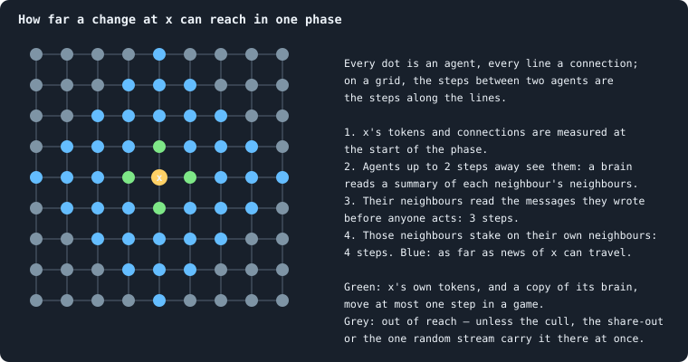
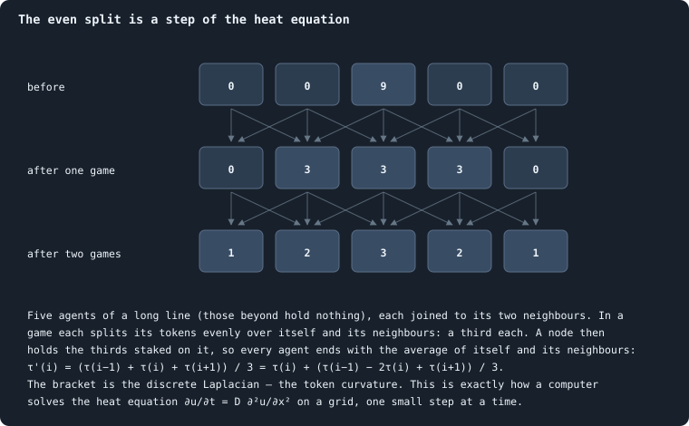

# Physical inspiration

Graph of Life was not built to simulate our universe. But its rules were
chosen with physics in mind, in the hope that a world made of very simple,
local and conserving rules might grow, by itself, the kinds of thing physics
describes: a space with a few dimensions, stable things that persist in it,
and — in rare places — something that lives. This is the book's second aim,
beside open-ended evolution ([Chapter 1](01-what-this-book-is-about.md)), and
as this chapter will show, the two keep meeting.

The chapter teaches the physical ideas behind the rules, one at a time. For
each it says where the algorithm follows the idea, where it breaks it, and
what question that raises — a question the book can measure.

> [!warning] Analogies are questions, not answers
> An analogy says "this might work like that". It does not say that it does.
> Tokens are not energy and agents are not particles; a brain that "decides"
> is a function that turns 154 numbers into a few dozen others. Every
> analogy below is offered as a way to ask a sharper question — and each
> section ends by saying where it stops.

> [!question] Questions of this chapter
> - Which ideas from physics shaped the rules of Graph of Life?
> - Where does the algorithm follow them, and where does it break them?
> - What would it mean for a space, a particle or life to emerge here — and
>   how would one measure it?

## Space made of relations

In everyday physics, space is the stage: things happen *in* it. Several
attempts to unite gravity with quantum theory turn this around, and build
space itself out of discrete pieces and the relations between them: causal
sets (Bombelli, Lee, Meyer and Sorkin 1987), causal dynamical triangulations
(Ambjørn, Jurkiewicz and Loll 2005), and the hypergraph models of Wolfram
(2020). Space, in these pictures, is what a very large network looks like
from far away.

Graph of Life takes the same view. There is no space outside the network.
Agents are not *somewhere*; they are joined. The distance between two agents
is the number of connections on the shortest path between them
([Path length](../notes/path-length.md)), and nothing else.

A network is a good substrate for this because it can take any shape: a line,
a sheet, a lattice of cubes, a tree, a tangle. Which shape a world takes is
not chosen by anyone — it follows from the rules. So the first question is:
**which rules make a network that, seen from far away, looks like a space of
three dimensions?**

### How to read a dimension off a network

A network has no coordinates, but it has distances, and distances are enough.
Four ways of measuring a dimension, each exact on a lattice:

- **How balls grow.** In *d* dimensions, the number of agents within *r*
  steps grows as *r*^*d* ([Dimension and curvature](../notes/ball-dimension-and-curvature.md)).
- **How wide a lump is.** *N* agents packed into *d* dimensions span about
  *N*^(1/*d*) steps.
- **How many boxes cover it** ([Box dimension](../notes/box-dimension.md)).
- **How a random walk returns.** A walker that wanders at random is back where
  it started after *t* steps with a probability that falls as *t*^(−*d*/2) —
  the **spectral dimension**, the one quantum-gravity models measure. (In
  causal dynamical triangulations it is about 4 at large scales and about 2 at
  the smallest: Ambjørn, Jurkiewicz and Loll 2005.)

On a tree, the first two give no finite answer at all: the number of agents
within *r* steps grows faster than any power of *r*.

### What the book has found so far

The baseline worlds measure as about **three-dimensional** by the first two:
their balls grow as *r*^3 over the first few steps, at every size from a few
hundred agents to sixty thousand
([Chapter 31](31-the-geometry-of-a-world.md),
[Chapter 38](38-how-does-a-worlds-size-follow-its-tokens.md)), and their width
grows as *N*^0.30 — as a body of 3.3 dimensions would. That is a surprise
worth taking seriously, and also with care: by box covering they measure
about 1.85; they are full of stars and trees; and a third of their connections
are **bridges**, some of which hold half a world to the rest
([Chapter 32](32-how-a-world-breaks.md)). A three-dimensional lattice has no
bridges at all: to cut a cube of *N* points in two, you must cut about
*N*^(2/3) connections — a whole cross-section.
[Chapter 23](23-how-many-dimensions-does-a-world-have.md) measured the
dimension with two rulers calibrated on known spaces. By the room within *r*
steps, worlds of 60,000 agents read 3.3, steady from 3 steps to 14; by how a
random walker spreads, they read about 2. Random networks with the same
connections read neither. The worlds are spaces, with room like a
three-dimensional body, but full of dead ends that slow anything spreading
through them — a fractal more than a solid.

So the aim can be put precisely. Find rules under which a world grows into a
network that is three-dimensional by every measure at large scales and **well
knit**: bridges will always exist, but they should hold twigs, not half the
world. The tools are ready — the dimensions above, the cut risk
([Cut risk](../notes/cut-risk.md)), and the spectral gap, which for a
*d*-dimensional body shrinks as *N*^(−2/*d*) and for a network with cheap cuts
is tiny ([The spectral gap](../notes/spectral-gap.md)). One hint is already in:
bigger worlds have more loops per connection and fewer leaves
([Chapter 38](38-how-does-a-worlds-size-follow-its-tokens.md)).

## A speed limit

Nothing in physics travels faster than light. Whatever happens at a point can
only affect what lies inside its **light cone**: the region light could reach
from it, a sphere growing at the speed of light. This is **locality**, and it
is one of the deepest facts we know about the world.

Graph of Life is built to be local. In one phase, an agent reads only itself,
its neighbours, summaries of its neighbours' neighbourhoods, and the messages
its neighbours wrote before anyone acted ([What a brain sees](../notes/brain-inputs.md));
and it acts only on its own node and its neighbours'. Follow a difference at
one agent, *x*, through one phase:

So news of *x* can travel at most **four connections per phase**, eight per
iteration. Tokens and brains are slower: a token moves one connection per
game (a stake goes only to a neighbour), and a brain one connection per game
(a node is won only by a neighbour). This mirrors physics too: light is the
fastest thing there is, and matter moves more slowly.

### Where the speed limit is broken

Three rules reach across the whole world at once.

1. **The cull.** After every phase only the largest connected piece survives
   ([Chapter 3](03-one-iteration.md)). Whether a region lives depends on the
   connectivity of the entire world, at that instant: action at a distance.
   [Chapter 32](32-how-a-world-breaks.md) found that most big losses happen
   this way, and [Chapter 38](38-how-does-a-worlds-size-follow-its-tokens.md)
   that the regions lost grow with the world.
2. **The share-out.** The tokens of agents cut off are dealt out to survivors
   chosen at random from the whole world. They are conserved, but they jump:
   a token can leave one end of a world and arrive at the other in one step.
3. **The one random stream.** Every random number in a world — every tie, every
   probabilistic decision, every mutation — is drawn from a single sequence, in
   a fixed order ([Seeds and the random stream](../notes/random-numbers.md)).
   This is what makes a run exactly repeatable. But it also couples
   everything: if one agent anywhere takes one more random number, every
   later draw everywhere shifts. Two worlds that differ in one detail cannot
   keep their difference inside a light cone.

Each can be made local. A piece that separates could live on as a world of its
own; the tokens of the dead could go to their former neighbours; and every
agent could draw its random numbers from a stream of its own, fixed by the
seed, its id and the iteration — "counter-based" generators do exactly this
(Salmon, Moraes, Dror and Shaw 2011), and keep a run exactly repeatable. The
first two changes were proposed for quite another reason in
[Meta II](36-meta-2.md): they stand in the way of open-ended evolution.
Physics and evolution, asked separately, point at the same rules.

### A word of care about long-range connections

[Meta II](36-meta-2.md) also proposed letting distant agents connect, to renew
the world's shortcuts. Locality argues for care: a connection between two
agents that were a hundred steps apart is a message that travelled a hundred
steps in an instant. Births already respect the speed limit — a child joins
its parent's neighbourhood, so any two agents it joins were at most two steps
apart. New connections could do the same: form only between agents a few
steps apart, or with a reach that costs tokens to extend.

### A test: how far does a difference travel?

Locality makes a prediction that can be checked. Run two worlds that are
identical except for one token at one agent, and watch where they differ, game
after game. Under local rules, the difference must stay inside a cone growing
by at most four connections per phase; how fast it actually spreads, and
whether it grows or dies away, says how chaotic the world is. This is "damage
spreading", a standard experiment on cellular automata and random networks
(Derrida and Weisbuch 1986). It needs local random numbers first: with one
shared stream, the difference is everywhere at once.

## Conservation

Energy is conserved: it changes form, but the total never changes. Emmy
Noether (1918) showed why — conservation of energy follows from the laws being
the same at every moment.

Tokens are conserved the same way: every game moves them, every birth splits
them, every death passes them on, and the total stays exactly what it was at
the start ([Chapter 3](03-one-iteration.md)). They also come in whole units,
like quanta.

Physics asks more than a constant total: energy is conserved **locally**. The
energy in a region changes only by what flows across its boundary — a
continuity equation. Stakes respect this: a token moves only along a
connection. The share-out does not, as above.

## Agents as little calculators

The laws of physics are written as differential equations: how a quantity at
a point changes, given its values nearby. To solve them, a computer cuts space
into a grid and lets each point update itself from its own value and its
neighbours' — a **finite-difference** scheme. Every grid point is a little
calculator that looks only at itself and its neighbours; information moves one
cell per step. Physicists, in this sense, already simulate the world with
local agents.

Graph of Life's agents are such calculators, with one difference: their
calculator — the brain — is not given by any equation; it evolves. And yet
the evolved brains have arrived at something an equation would give. They
spread their stakes almost evenly over themselves and their neighbours
([Chapter 27](27-where-the-tokens-flow.md)), and an even split is exactly one
step of the **heat equation**:

On a network the same holds with the discrete Laplacian — the
[token curvature](../notes/token-curvature.md): for agents with *d* neighbours
each, an even split changes an agent's tokens by its curvature divided by
*d* + 1 ([Chapter 26](26-gains-and-losses.md)). A settled world, in its
tokens, behaves almost like a computer solving the heat equation on its own
network — down to a numerical artefact. An explicit step of the heat
equation that moves more than half of a cell's content to its neighbours
overshoots, and the solution flips about its resting value every step. A hub
keeps only 1/(*d* + 1) of its tokens, and [Chapter 20](20-do-the-rich-stay-rich.md)
found exactly that flip: wealth swings between hubs and leaves with a period
of two games.

That is also a limitation. The heat equation **forgets**: it smooths every
difference away, and its world ends uniform — "heat death" in miniature. The
fundamental equations of physics are of another kind: wave equations, which
carry signals and energy without losing them and run as well backwards as
forwards. Diffusion appears in physics only when many particles are averaged.
So a question: **can rules make tokens move like waves** — slosh back and
forth with a characteristic frequency — rather than spread like heat? A
frequency would show as a peak in a power spectrum
([The power spectrum](../notes/power-spectrum.md)); the spectrum of the number
of agents shows none, only the smooth slope of a random walk
([Chapter 29](29-power-laws-real-and-apparent.md)). The two-game swing of
[Chapter 20](20-do-the-rich-stay-rich.md) is no such wave: it is the
overshoot of a step that is too large, damped in every game, and it carries
nothing from place to place. In physics a frequency is
an energy (*E* = *hν*); whether the rate of an exchange could play that part
here is an open, speculative question.

## A beginning

The universe began small, dense and hot, expanded and cooled, and formed
structure — atoms, stars, galaxies — out of a nearly uniform start.

A world of Graph of Life begins the same way, at least in outline. A hundred
founders hold a hundred tokens each, in a ring: small, dense in tokens and
uniform. Then the network — which is space here — grows explosively: about 75
births per hundred agents in each of the first ten iterations
([Chapter 11](11-the-first-hundred-iterations.md)). In the median world, the
founders' 100 become 1,132 agents by iteration 10 and about 1,850 by iteration
20, while the tokens per agent fall from 100 to under 9 and then to about 5 —
expansion, and cooling, if tokens per agent are read as a temperature. Then
comes a crash and a bottleneck — the families fall from a hundred to about
twenty, and every later brain descends from a single founder — and then
structure: inequality, hubs, a settled world after about a hundred
iterations.

The differences matter as much. Space here does not stretch everywhere at
once; new places are born one at a time, next to their parents. And nothing
here plays the part of gravity, which in the real universe gathers matter into
clumps.

## Everywhere the same

On large scales the universe looks the same everywhere and in every direction
— the cosmological principle. Look closely at any part and you see only
elementary particles, all of a few kinds, all alike; structure appears only
when very many are taken together.

Graph of Life's agents are its elementary particles: every one follows the
same rules and differs only in its state — its tokens, its connections, its
brain. And its worlds are statistically homogeneous:
[Chapter 38](38-how-does-a-worlds-size-follow-its-tokens.md) found that
inequality, home stakes, births and genotype diversity are the same in worlds
of three hundred agents and of sixty thousand. Structure, where there is any,
shows only in collective patterns: families side by side
([Chapter 33](33-one-world-many-colours.md)), hubs with their stars. And it
does not reach far. [Chapter 22](22-like-next-to-like.md) measured how alike
agents are at a distance: tokens, ages, connections and kin are alike only
within one or two steps, and beyond three every part of a world is like
every other.

### No scale at all

Many natural systems have **no characteristic scale**. At a critical point —
water at 374 °C and 218 atmospheres, a magnet at its Curie temperature —
fluctuations of every size appear at once, and correlations span the whole
system; quantities follow power laws. Bak, Tang and Wiesenfeld (1987)
proposed that some systems tune themselves to such a point —
**self-organised criticality** — and that this is why sandpiles, earthquakes
and perhaps evolution show events of every size (Bak and Sneppen 1993). Some
have argued that complex structure and computation live best near such a
point, "at the edge of chaos" (Langton 1990).

What the book has found so far is mixed
([Chapter 29](29-power-laws-real-and-apparent.md)): the richest agents' tokens
follow a clean power law; the best-connected agents' connections plausibly
do; deaths do not come in avalanches of every size; and the wander of a world
has the spectrum of a random walk, not the 1/*f* of a critical system. But
[Chapter 38](38-how-does-a-worlds-size-follow-its-tokens.md) found one
property with no scale: the share of a world that one game can cut off has
the same distribution in a world of five hundred agents and one of sixty
thousand. Finding such scaleless properties systematically — by measuring the
same thing at many sizes and asking whether, rescaled, it is the same — is now
an aim of the book. Two measurements since sharpen the picture. What agents
hold is correlated over one or two steps only, a short correlation length,
far from critical ([Chapter 22](22-like-next-to-like.md)). But the space
itself has no scale: within *r* steps lie about *r*^3.3 agents, the same
law from 3 steps to 14 ([Chapter 23](23-how-many-dimensions-does-a-world-have.md)).

## Why life is possible: a flow of low entropy

If energy is conserved and disorder always grows — the second law of
thermodynamics — how is anything as ordered as life possible? The answer,
given by Boltzmann (1886) and made famous by Schrödinger (1944), is that the
Earth is not a closed system. It takes in energy as **sunlight**, a few
energetic photons from the Sun's surface at about 5,800 kelvin, and sends the
same energy back to space as **infrared**, many feeble photons from a planet at
about 255 kelvin. Energy in equals energy out. But the radiation it sends out
carries about twenty times the entropy of the radiation it takes in — roughly
the ratio of the two temperatures, 5,800/255 ≈ 23. That export of entropy is
what pays for every ordered thing on Earth, from a cloud to a cell. The Sun, in
turn, is a reservoir: gravity gathered its hydrogen, and fusion releases the
energy slowly, over billions of years — a gradient that lasts.

Graph of Life has the conservation, and not the gradient. A token is a token,
wherever it came from: there are no fresh tokens to feed on and no spent
tokens to shed. And the even split drives a world towards its resting state,
in which every agent holds tokens in proportion to its connections plus one
([Chapter 27](27-where-the-tokens-flow.md)) — towards the miniature heat death
above. Two ways a gradient could be built in:

- **Tokens with a quality.** Fresh tokens that become spent when used, and
  only slowly fresh again — the count conserved, the quality not. The
  research plan's token colours (`research/Research.md`, §4.3) are one version.
- **Sources and sinks.** A few "stars" that release tokens slowly, and a way
  for tokens to leave — a driven, open world. Physics knows what can form in
  such a flow: **dissipative structures** (Nicolis and Prigogine 1977), like the
  hexagonal convection cells that appear in a pan of oil heated from below.

Either would make a world in which order can feed on a flow — the condition,
on Earth, for life.

## Particles: stable things in a restless world

Conway's Game of Life (Gardner 1970) is a grid of cells, each alive or dead,
with three local rules. Out of them come **gliders**: small patterns that move
across the grid and persist, although every cell under them keeps changing.
They behave like particles — they travel, collide, annihilate, make new
patterns — and they are made of nothing but the rule.

In Graph of Life, a particle would be the same kind of thing: a pattern that
persists while the agents, tokens and brains that carry it change. That is
exactly the third rung of the ladder towards open-ended evolution — P3, an
organisation ([Chapter 1](01-what-this-book-is-about.md)). Something as
humble as an electron, emerging here, would already be a win for both aims.
What to look for:

- **Bound tokens**: tokens that keep going round a closed loop of agents
  instead of spreading. [Chapter 27](27-where-the-tokens-flow.md) looked, and
  found almost no circulation once exchanges were cancelled.
- **Groups that outlast their members**: a set of agents whose membership
  turns over while the set persists.
- **A beat**: a pattern with a characteristic frequency, local in the
  network.

### Vacuum and matter

Most of the universe is nearly empty; matter is a tiny fraction of it. Most
of a world of Graph of Life is a restless sea of ordinary agents playing a
near-even split — a kind of vacuum. Could something stable form in it, rarely
and locally, as matter did? One way to ask is an experiment planned for later:
a sea of agents that all decide as the average evolved agent decides, and,
placed in it, a single agent or a small group with a brain of its own. Can it
draw tokens from the sea without exhausting it and without being cut off? Can
a group hold together in it? Biologists know this as the question whether a
rare mutant can **invade** a resident population (Maynard Smith and Price
1973; Metz, Nisbet and Geritz 1992); physicists, as a small system in contact
with a **reservoir**.

## Clocks, cones and relativity

Special relativity says there is no absolute "now": two observers moving
past each other disagree about which distant events happen at the same time,
and the laws of physics are the same for both. Graph of Life has one clock
for everyone — iterations and phases — so it is not relativistic, and a speed
limit alone does not make it so: a grid with a speed limit still has a
preferred frame, its own.

But one idea points the way. To compute the future of one agent, you do not
need the whole world — only its past cone: the agents near it, then the agents
near those, back to the start. Different regions could then be computed to
different "times", as long as no region gets ahead of what can reach it.
Computer scientists use exactly this to run large simulations in parallel:
every part keeps its own clock, "virtual time" (Jefferson 1985). And Wolfram
(2020) argues that when the outcome of a system of local updates does not
depend on the order in which they are applied — **causal invariance** —
observers who order them differently must agree on what happens, and special
relativity follows in the large. Graph of Life is not there: its three global
rules make every agent's future depend on the whole world, so no cone can be
computed on its own. Making them local is the first step towards even asking
the question.

There is a second, looser parallel, with general relativity, in which space
is not fixed but shaped by what is in it. Wheeler put it in one line:
"Spacetime tells matter how to move; matter tells spacetime how to curve"
(Wheeler and Ford 1998). In Graph of Life, the network tells the
tokens where they can flow — only along connections — and the tokens tell the
network which connections remain: a connection that no token crosses is cut
([Chapter 32](32-how-a-world-breaks.md)).

## Where the analogy stops

- There is nothing quantum here: no superposition, no interference.
- The rules have no continuous symmetries — no rotations, no boosts — and the
  network is no smooth space.
- Agents carry brains, functions that evolve; particles carry no such thing,
  and the laws of physics, as far as anyone knows, do not evolve.
- Three rules are global, as above.
- And the "beginning" is a choice of the program, not an event.

## What this asks of the book

The second aim adds its own questions, and its own planned chapters, in a new
part of the book (see [the contents](../README.md)):

- **How many dimensions does a world have?** Every measure of dimension —
  ball growth, width, boxes, the spectral dimension — on the largest worlds the
  book can afford.
- **How far does a difference travel?** Damage spreading: the light cone,
  measured — once random numbers are local.
- **Which properties have no scale?** The same quantities across many sizes,
  rescaled.
- **Local rules only.** The cull, the share-out and the random stream, each
  made local, and what changes.
- **A source and a sink.** Tokens with a quality, or stars: a world with a
  flow running through it.
- **Particles.** Bound tokens, persistent groups, beats.
- **One agent in a sea of average agents.** The invasion experiment above.

## What this means

- **The rules were made local, conserving and uniform on purpose**, so that
  space, stable things and life could emerge rather than be built in.
- **Three rules break locality**: the cull, the share-out and the single
  random stream. Making them local is what physics asks — and what open-ended
  evolution asked for independently.
- **The baseline already looks three-dimensional in some ways** — in how its
  balls grow and how its width grows — and in others like a tree held
  together by bridges: a walker reads only two dimensions in it
  ([Chapter 23](23-how-many-dimensions-does-a-world-have.md)).
- **The evolved brains compute, in effect, the heat equation.** A world that
  only diffuses ends uniform; a world in which something lasting forms will
  need more — a flow, a gradient, something that holds tokens together.
- **Particles and organisations are the same question.** A pattern that
  persists while what carries it changes is what both aims are looking for.

<!-- turns -->
---

← [Chapter 6 · The ideas this builds on](06-the-ideas-this-builds-on.md) · [Contents](../README.md) · [Chapter 8 · Is a run reproducible?](08-is-a-run-reproducible.md) →
<!-- /turns -->
