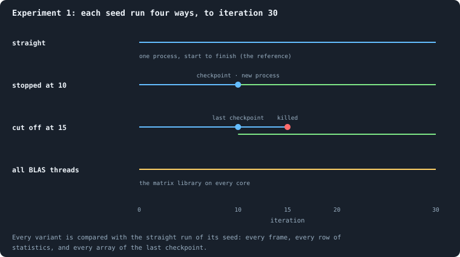

# Is a run reproducible?

Every later chapter compares worlds: thirty seeds against thirty, one setting
against another. That only means something if a world is decided by its
settings and its seed and by **nothing else** — not by when it was stopped
and continued, not by a crash, not by which computer or how many processor
cores ran it.

> [!question] Questions of this chapter
> - Does the same seed always give the same world, frame for frame?
> - Does stopping a run and continuing it later, in a new process, change it?
> - Does a crash, after which the run is resumed from its last save, change it?
> - Does the number of processor threads the matrix library uses change it?

## Why it could be true

A computer program that uses random numbers can still be exactly repeatable,
if three things hold.

1. **Every random number comes from a seeded stream.** A pseudo-random
   generator produces a fixed sequence of numbers from its starting value. In
   Graph of Life every world owns its own generator, started from its seed,
   and draws everything from it ([Seeds and the random stream](../notes/random-numbers.md)).
2. **Everything is done in a fixed order.** Agents act in increasing order of
   id; neighbours are listed in increasing order of id; messages written in a
   phase are held back and delivered together at its end, so that no agent
   reads a message another agent wrote a moment earlier in the same phase.
3. **A saved world is the whole world.** To stop a run and continue it later,
   the program saves a **checkpoint**: every agent's tokens, brain weights,
   genotype and age, every connection and when it last carried tokens, every
   message in flight — and the state of the random generator. A run continued
   from a checkpoint first deletes any frames recorded after it, then lives
   those iterations again.

What these do not cover is arithmetic itself. Adding real numbers on a
computer is not associative: (*a* + *b*) + *c* can differ from
*a* + (*b* + *c*) in its last bit, because each sum is rounded. A brain adds
up thousands of products. The library that multiplies matrices (BLAS) may
split such a sum over several processor cores, and then the order of the
additions — and so the last bit of the result — depends on how many cores it
uses.

## The experiment

<!-- runs E01 -->
> [!info] The runs behind this chapter
> **12 runs.** Every condition below is run once for every seed (1 to 3), for 30 iterations — or until its world dies out. Every setting is that of the baseline **B1** (the algorithm exactly as a new run is offered it) unless the condition changes it.
>
> - **straight** — changes nothing: B1 as it is; 10,000 tokens. Runs `B1-10000-s001-straight` … `B1-10000-s003-straight`.
> - **stopped at 10** — changes nothing: B1 as it is; 10,000 tokens. Runs `B1-10000-s001-stopped-at-10` … `B1-10000-s003-stopped-at-10`.
> - **cut off at 15** — changes nothing: B1 as it is; 10,000 tokens. Runs `B1-10000-s001-cut-off-at-15` … `B1-10000-s003-cut-off-at-15`.
> - **all BLAS threads** — changes nothing: B1 as it is; 10,000 tokens. Runs `B1-10000-s001-all-blas-threads` … `B1-10000-s003-all-blas-threads`.
>
> To make these runs again: `python3 gol_lab.py run E01`, or ▶ in the Book tab of a computer running `gol_server.py`. Each run writes its settings, seed and engine version beside its frames, in `GraphOfLifeRuns/<run>/meta.json` and `provenance.json`.

> [!info]- Every setting of these runs
> | setting | straight | stopped at 10 | cut off at 15 | all BLAS threads | what it is |
> |---|---|---|---|---|---|
> | [`total_tokens`](../notes/settings.md#total_tokens) | 10,000 | 10,000 | 10,000 | 10,000 | The number of tokens in the world, *T*. It never changes during a run. |
> | [`n_nodes`](../notes/settings.md#n_nodes) | 0 | 0 | 0 | 0 | How many founders the world starts with. 0 means one founder per hundred tokens: *n* = ⌊*T* / 100⌋. |
> | [`k_neighbors`](../notes/settings.md#k_neighbors) | 0 | 0 | 0 | 0 | How many neighbours each founder starts with in the ring. 0 means *k* = max(⌊*n* / 100⌋, 5); an odd *k* is wired as *k* − 1. |
> | [`rewire_p`](../notes/settings.md#rewire_p) | 0.2 | 0.2 | 0.2 | 0.2 | In the starting ring, the probability that a connection is moved to a founder chosen at random (Watts–Strogatz). |
> | [`hidden_layers`](../notes/settings.md#hidden_layers) | 50, 45, 40, 35, 30 | 50, 45, 40, 35, 30 | 50, 45, 40, 35, 30 | 50, 45, 40, 35, 30 | The widths of the brain's hidden layers, in order from input to output. |
> | [`brain_kind`](../notes/settings.md#brain_kind) | float16 | float16 | float16 | float16 | How weights are stored: `float` (64-bit), `float16` (16-bit, computed in 64-bit) or `binary` (−1, 0, +1). |
> | [`brain_bits`](../notes/settings.md#brain_bits) | 16 | 16 | 16 | 16 | Only for binary brains: how many input rows encode one number. Unused by float and float16 brains. |
> | [`message_amount`](../notes/settings.md#message_amount) | 30 | 30 | 30 | 30 | How many numbers one message holds. Each agent sends one message to itself and one to each neighbour, every phase. |
> | [`random_input_amount`](../notes/settings.md#random_input_amount) | 5 | 5 | 5 | 5 | How many random numbers, drawn uniformly from −2 to 2, a brain reads per neighbour, every time it looks. |
> | [`exchange_messages`](../notes/settings.md#exchange_messages) | on | on | on | on | Whether agents send and read messages at all. |
> | [`message_prepass`](../notes/settings.md#message_prepass) | on | on | on | on | Whether every phase begins with an extra look in which agents only write messages, so the look that acts reads messages written this phase. |
> | [`allow_handover`](../notes/settings.md#allow_handover) | on | on | on | on | Whether a parent may move some of its own connections to its newborn child. |
> | [`allow_revolutions`](../notes/settings.md#allow_revolutions) | on | on | on | on | Whether a coalition of smaller stakers can take a node from its largest staker (see the note *How a coalition takes a node*). |
> | [`allow_gifting`](../notes/settings.md#allow_gifting) | off | off | off | off | Whether agents may give tokens to neighbours during reproduction. Off in every run of this book. |
> | [`random_decisions`](../notes/settings.md#random_decisions) | off | off | off | off | The control: every number a brain would produce is replaced by a random draw from the standard normal distribution. |
> | [`prune_after`](../notes/settings.md#prune_after) | blotto | blotto | blotto | blotto | After which phase connections that carried no tokens are cut: `blotto` (the game), `reproduction`, or `both`. |
> | [`inactive_window`](../notes/settings.md#inactive_window) | phase | phase | phase | phase | How long a connection may go unused: `phase` means it must carry tokens in the phase being judged; `iteration` allows the two last phases. |
> | [`redistribution`](../notes/settings.md#redistribution) | uniform | uniform | uniform | uniform | How the tokens of removed agents are shared: `uniform` gives every survivor the same chance at each token; `by_tokens` weights by what a survivor holds. |
> | [`tokens_created_per_phase`](../notes/settings.md#tokens_created_per_phase) | 0 | 0 | 0 | 0 | Tokens added to the world at every cleanup. 0 keeps the supply fixed. |
> | [`mutation_probability`](../notes/settings.md#mutation_probability) | 0.2 | 0.2 | 0.2 | 0.2 | The probability that a brain changes when it is copied to a child, and again, for every brain, after every game. |
> | [`mutation_noise_std`](../notes/settings.md#mutation_noise_std) | 0.2 | 0.2 | 0.2 | 0.2 | How large a change to one weight is: a normal draw with standard deviation this times 1/√(fan-in) of its layer. |
> | [`mutation_sparsity`](../notes/settings.md#mutation_sparsity) | 0.1 | 0.1 | 0.1 | 0.1 | The share of a brain's numbers a change touches; also the probability, for each weight matrix and bias vector, of a rarer reset that redraws that share of it. |
> | [`extinction_threshold`](../notes/settings.md#extinction_threshold) | 20 | 20 | 20 | 20 | A run stops, as extinct, when an iteration ends (after its game) with this many agents or fewer. |
> | seeds | 1 to 3 | 1 to 3 | 1 to 3 | 1 to 3 | one run per seed |
> | iterations | 30 | 30 | 30 | 30 | how far each run goes, unless its world dies first |
>
> A value in **bold** differs from the baseline B1.
<!-- /runs -->

Each of three seeds is run four ways, each to iteration 30:

- **straight** — in one process, from start to finish. This is the reference.
- **stopped at 10** — stopped at iteration 10, saved, and continued in a
  *new* process from the checkpoint on disk.
- **cut off at 15** — the process is killed at iteration 15 without saving,
  as if the power went. Its last checkpoint is from iteration 10, so it
  resumes from there and lives iterations 10 to 15 a second time.
- **all BLAS threads** — the matrix library may use every core. Every other
  run in this book uses exactly one.

Each variant is compared with the straight run of the same seed: all 60
frames, written out as text with their keys sorted so that two identical
frames give identical text; all 60 rows of statistics; and every one of the
29 arrays of the final checkpoint, including the random generator's state and
the messages in flight. (Files cannot be compared byte by byte, because
compressed files carry the time they were written.)

<!-- thesis E01 -->
> [!quote] The thesis of Experiment 1, written down before any of its runs existed
> **The claim.** A run is decided by its settings and its seed, and by nothing else. Run it again, stop it and load it again in a new process, cut it off without warning and resume it, or let the matrix library use as many threads as it likes: every frame and the final state come out the same, bit for bit.
>
> **Why it would be so.** Every random draw a world makes comes from its own stream, seeded from the seed, and a checkpoint stores that stream with everything else the world is. A resumed run deletes whatever was recorded after its checkpoint and lives those iterations again.
>
> **It holds if:** Every frame of every variant is identical to the reference run with the same seed, and so are the statistics recorded from them and the final checkpoints, array for array, the random stream included.
>
> **It fails if:** Anything differs anywhere. Then a result cannot be reproduced from its seed, and nothing later in this book can be trusted until that is fixed.
<!-- /thesis -->

## What happened

**Stopping and crashing change nothing.** For all three seeds, the run
stopped at 10 and the run cut off at 15 recorded exactly what the straight
run recorded: every frame, every row, every array. Their records also show
what they went through: the stopped runs were made in two processes,
iterations 0 to 10 and 10 to 30; the cut-off runs too, the first ending at
iteration 15 without a checkpoint and the second starting again from
iteration 10.

**Threads change the last digits.** On all cores, seed 1 was identical to its
reference. Seeds 2 and 3 recorded the same 60 frames and the same 60 rows —
every agent, token, connection and decision — but their final checkpoints
differed in one array: the messages in flight, the numbers agents had just
written to each other, differed in their last bits. Run again on all cores,
seed 2 gave exactly what it had given on all cores the first time; run again
on one core, exactly what it gave on one. So each thread count is repeatable,
and the two are not the same as each other. Over 150 iterations, seeds 2 and
3 on one core and on all cores still never recorded a different frame: a
last-bit difference in a message had not yet changed a single decision.
Nothing guarantees it never will — a decision that hangs on a comparison of
two nearly equal numbers can flip.

**Made again from nothing.** Some hours later, all twelve runs were made
again from their settings and seeds, each in a fresh process and an empty
folder, and compared frame by frame and row by row: every one was identical.

**Two simulations in one program.** Before this experiment, all worlds in one
program drew their random numbers from numpy's single shared stream, and
starting a world reset that stream for all of them. The server runs
simulations side by side in one program, so two simulations running at the
same time disturbed each other, and neither could be made again from its
seed. Giving every world a stream of its own fixed it. A world on its own
draws the same numbers as before, so its results did not change.

By its own rule — anything differing anywhere refutes it — the thesis is
**refuted**, but only by the number of threads, and only in the last bits of
numbers that had changed no decision in 150 iterations. For stopping,
continuing and crashing it holds exactly.

## What this means

A run is decided by its settings and its seed — given one thread for the
matrix library, which every run in this book uses. Stopping it, continuing it
or crashing it changes nothing, so the lab can pause and resume runs freely,
and every difference between two runs in later chapters comes from what was
changed, not from how they were run.

The limits that remain:

- **Other machines.** A different processor or library version can round a
  sum differently, just as a different number of threads does. So every run
  records its Python, numpy, networkx and BLAS versions, its processor and
  instruction set, and the lab refuses to continue a run under different ones.
- **The browser.** The version of the program that runs in a web page uses
  other builds of numpy and networkx and is not expected to give the same
  runs.

> [!info] Where everything came from
> - **Runs:** 12 — `B1-10000-s001-straight` … `-s003-straight`, each also as
>   `-stopped-at-10`, `-cut-off-at-15` and `-all-blas-threads`.
> - **Engine:** snapshot `f39288e90b003df0`, commit `ccba58f`.
> - **Made again:** all 12, with `python3 gol_lab.py verify E01 --runs 12 --iterations 30`,
>   on engines `f39288e90b003df0` and `f820369a1583af53`: identical.
> - **Environment:** Python 3.12.3, numpy 2.5.1, networkx 3.6.1, OpenBLAS
>   (scipy-openblas 0.3.33), Intel Core Ultra 7 258V, numpy dispatch AVX2.
> - **Results:** `book/results/E01.json`, made with `python3 gol_lab.py analyse E01`.
> - **Tests:** `tests/test_engine.py` and `tests/test_lab.py` hold these
>   checks: two worlds in turn, two runs in two threads, a stop and resume, a
>   run cut between checkpoints, a worker terminated mid-run, and the server
>   keeping the matrix library to one thread.

<!-- turns -->
---

← [Chapter 7 · Physical inspiration](07-physical-inspiration.md) · [Contents](../README.md) · [Chapter 9 · Thirty worlds](09-thirty-worlds.md) →
<!-- /turns -->
