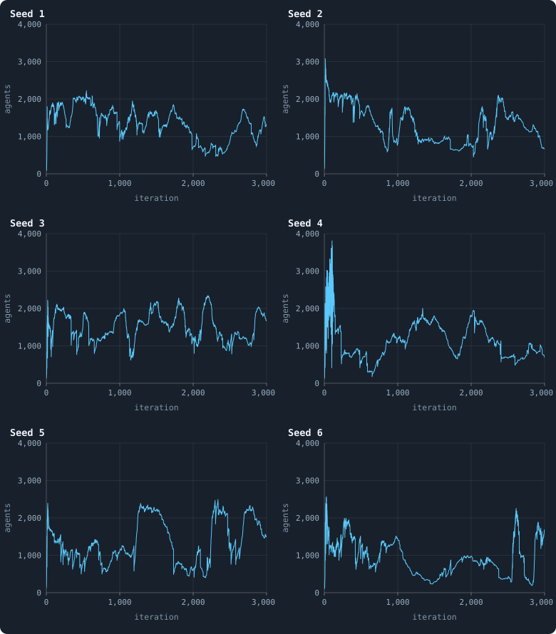
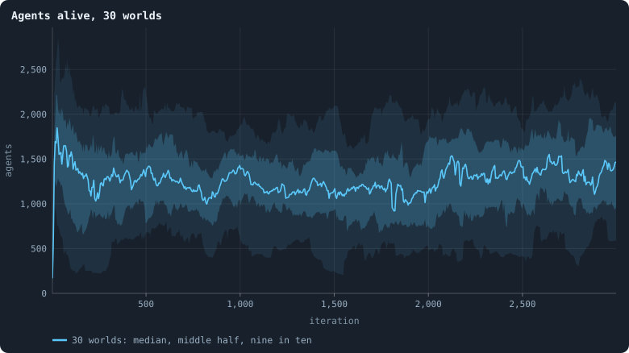
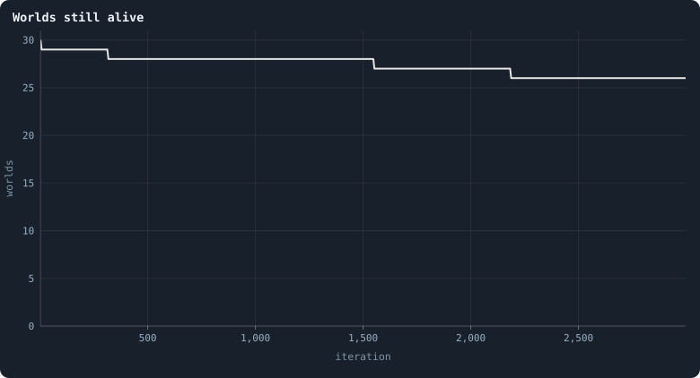
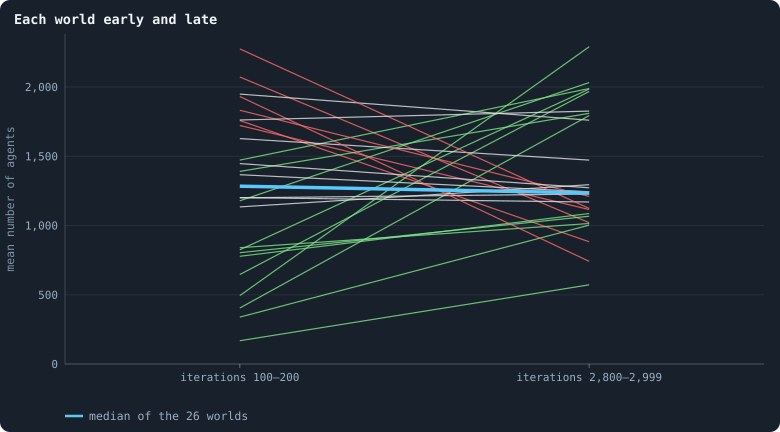
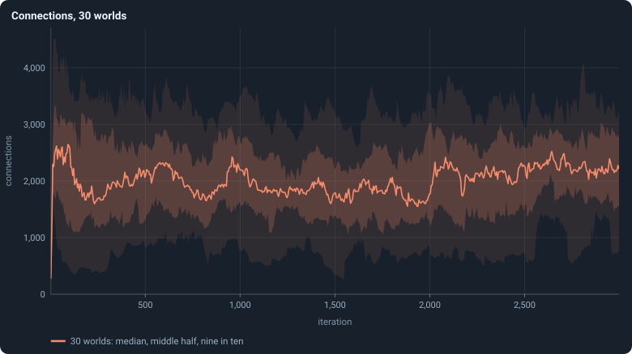
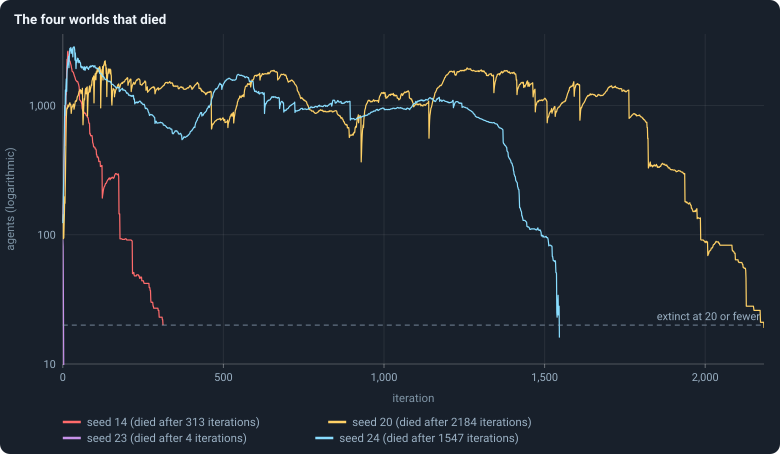

# A world's life

> [!question] Questions of this chapter
> - What does a world do over 3,000 iterations? Does it grow to some size and
>   stay there, or does it keep changing?
> - Is "the" baseline world even a thing — do thirty worlds do the same?
> - Do worlds die, and how?

<!-- runs E02 -->
> [!info] The runs behind this chapter
> **30 runs.** Every condition below is run once for every seed (1 to 30), for 3,000 iterations — or until its world dies out. Every setting is that of the baseline **B1** (the algorithm exactly as a new run is offered it) unless the condition changes it.
>
> - **baseline** — changes nothing: B1 as it is; 10,000 tokens. Runs `B1-10000-s001` … `B1-10000-s030`.
>
> To make these runs again: `python3 gol_lab.py run E02`, or ▶ in the Book tab of a computer running `gol_server.py`. Each run writes its settings, seed and engine version beside its frames, in `GraphOfLifeRuns/<run>/meta.json` and `provenance.json`.

> [!info]- Every setting of these runs
> | setting | baseline | what it is |
> |---|---|---|
> | [`total_tokens`](../notes/settings.md#total_tokens) | 10,000 | The number of tokens in the world, *T*. It never changes during a run. |
> | [`n_nodes`](../notes/settings.md#n_nodes) | 0 | How many founders the world starts with. 0 means one founder per hundred tokens: *n* = ⌊*T* / 100⌋. |
> | [`k_neighbors`](../notes/settings.md#k_neighbors) | 0 | How many neighbours each founder starts with in the ring. 0 means *k* = max(⌊*n* / 100⌋, 5); an odd *k* is wired as *k* − 1. |
> | [`rewire_p`](../notes/settings.md#rewire_p) | 0.2 | In the starting ring, the probability that a connection is moved to a founder chosen at random (Watts–Strogatz). |
> | [`hidden_layers`](../notes/settings.md#hidden_layers) | 50, 45, 40, 35, 30 | The widths of the brain's hidden layers, in order from input to output. |
> | [`brain_kind`](../notes/settings.md#brain_kind) | float16 | How weights are stored: `float` (64-bit), `float16` (16-bit, computed in 64-bit) or `binary` (−1, 0, +1). |
> | [`brain_bits`](../notes/settings.md#brain_bits) | 16 | Only for binary brains: how many input rows encode one number. Unused by float and float16 brains. |
> | [`message_amount`](../notes/settings.md#message_amount) | 30 | How many numbers one message holds. Each agent sends one message to itself and one to each neighbour, every phase. |
> | [`random_input_amount`](../notes/settings.md#random_input_amount) | 5 | How many random numbers, drawn uniformly from −2 to 2, a brain reads per neighbour, every time it looks. |
> | [`exchange_messages`](../notes/settings.md#exchange_messages) | on | Whether agents send and read messages at all. |
> | [`message_prepass`](../notes/settings.md#message_prepass) | on | Whether every phase begins with an extra look in which agents only write messages, so the look that acts reads messages written this phase. |
> | [`allow_handover`](../notes/settings.md#allow_handover) | on | Whether a parent may move some of its own connections to its newborn child. |
> | [`allow_revolutions`](../notes/settings.md#allow_revolutions) | on | Whether a coalition of smaller stakers can take a node from its largest staker (see the note *How a coalition takes a node*). |
> | [`allow_gifting`](../notes/settings.md#allow_gifting) | off | Whether agents may give tokens to neighbours during reproduction. Off in every run of this book. |
> | [`random_decisions`](../notes/settings.md#random_decisions) | off | The control: every number a brain would produce is replaced by a random draw from the standard normal distribution. |
> | [`prune_after`](../notes/settings.md#prune_after) | blotto | After which phase connections that carried no tokens are cut: `blotto` (the game), `reproduction`, or `both`. |
> | [`inactive_window`](../notes/settings.md#inactive_window) | phase | How long a connection may go unused: `phase` means it must carry tokens in the phase being judged; `iteration` allows the two last phases. |
> | [`redistribution`](../notes/settings.md#redistribution) | uniform | How the tokens of removed agents are shared: `uniform` gives every survivor the same chance at each token; `by_tokens` weights by what a survivor holds. |
> | [`tokens_created_per_phase`](../notes/settings.md#tokens_created_per_phase) | 0 | Tokens added to the world at every cleanup. 0 keeps the supply fixed. |
> | [`mutation_probability`](../notes/settings.md#mutation_probability) | 0.2 | The probability that a brain changes when it is copied to a child, and again, for every brain, after every game. |
> | [`mutation_noise_std`](../notes/settings.md#mutation_noise_std) | 0.2 | How large a change to one weight is: a normal draw with standard deviation this times 1/√(fan-in) of its layer. |
> | [`mutation_sparsity`](../notes/settings.md#mutation_sparsity) | 0.1 | The share of a brain's numbers a change touches; also the probability, for each weight matrix and bias vector, of a rarer reset that redraws that share of it. |
> | [`extinction_threshold`](../notes/settings.md#extinction_threshold) | 20 | A run stops, as extinct, when an iteration ends (after its game) with this many agents or fewer. |
> | seeds | 1 to 30 | one run per seed |
> | iterations | 3,000 | how far each run goes, unless its world dies first |
>
> A value in **bold** differs from the baseline B1.
<!-- /runs -->

## One world at a time

Here are six of the thirty worlds — seeds 1 to 6 — each drawn alone, all on
the same scale. Each line is the number of agents alive after every game.

<!-- figure life/worlds -->

**Six worlds, one at a time.** The number of agents alive after every game in the worlds with seeds 1 to 6, each in a chart of its own and all on the same scale (0 to 4,000 agents, iterations 0 to 3,000). Each line has one point per iteration.

> [!example]- How to make this figure
> **Runs.** `B1-10000-s001` … `B1-10000-s006`, six of the 30 baseline runs (their settings are listed in [Chapter 8](08-thirty-worlds.md)).
>
> **Data.** From each run's `GraphOfLifeRuns/<run>/stats.jsonl`, which holds one row per recorded phase: `phase` 1 is the world just after reproduction, `phase` 2 just after the game, and every statistic is a field of the row (see [What a run records](../notes/frames-and-stats.md)).
>
> 1. Take the rows with `phase` = 2.
> 2. Plot `nodes` against `iteration`, one point per iteration, joined.
>
> **To make it again:** `python3 book_figures.py life`.
<!-- /figure -->

Three things are visible in every one of them:

- **A youth.** Within the first twenty or so iterations, the 100 founders
  become well over a thousand agents, and the line jumps up and down before
  it settles into a calmer motion. [Chapter 10](10-the-first-hundred-iterations.md) zooms in on this.
- **No fixed level.** After the youth, no world stays at one size. Each
  drifts, over hundreds of iterations, between roughly 500 and 2,500 agents,
  and the six worlds drift differently.
- **Calm stretches.** In some stretches a world's size barely changes from
  one iteration to the next; in others it swings.

## All thirty together

Drawn as a band ([Bands](../notes/bands.md)): the line is the typical world
at each moment, the shading how far the others spread around it.

<!-- figure life/agents -->

**Agents alive, 30 worlds.** The line is the median of the worlds at each iteration, the darker band holds the middle half of them (from the 25th to the 75th percentile) and the paler band nine in ten (5th to 95th). Four worlds die out; after a world's death it is no longer counted, so the bands of the last thousand iterations are those of 26 worlds.

> [!example]- How to make this figure
> **Runs.** The 30 baseline runs `B1-10000-s001` … `B1-10000-s030`: the baseline B1 at 10,000 tokens, seeds 1 to 30, 3,000 iterations each (every setting is listed in [Chapter 8](08-thirty-worlds.md)). They are made with `python3 gol_lab.py run E02`.
>
> **Data.** From each run's `GraphOfLifeRuns/<run>/stats.jsonl`, which holds one row per recorded phase: `phase` 1 is the world just after reproduction, `phase` 2 just after the game, and every statistic is a field of the row (see [What a run records](../notes/frames-and-stats.md)).
>
> 1. Take every run's rows with `phase` = 2 and the statistic `nodes`.
> 2. Cut the iterations into stretches of 5 (600 stretches over 3,000 iterations) and take each world's mean in each stretch.
> 3. In each stretch, take the median, the 25th and 75th and the 5th and 95th percentiles of those means over the worlds that still have a value there (a world that died has none after its death).
>
> **To make it again:** `python3 book_figures.py life`.
<!-- /figure -->

<!-- figure life/alive -->

**Worlds still alive.** How many of the 30 worlds are still alive. A world dies when an iteration ends with 20 agents or fewer; four did, after 4, 313, 1,547 and 2,184 iterations.

> [!example]- How to make this figure
> **Runs.** The 30 baseline runs `B1-10000-s001` … `B1-10000-s030`: the baseline B1 at 10,000 tokens, seeds 1 to 30, 3,000 iterations each (every setting is listed in [Chapter 8](08-thirty-worlds.md)). They are made with `python3 gol_lab.py run E02`.
>
> **Data.** From each run's `GraphOfLifeRuns/<run>/stats.jsonl`, which holds one row per recorded phase: `phase` 1 is the world just after reproduction, `phase` 2 just after the game, and every statistic is a field of the row (see [What a run records](../notes/frames-and-stats.md)).
>
> 1. For every stretch of 5 iterations, count the worlds that have a row with `phase` = 2 in it.
>
> **To make it again:** `python3 book_figures.py life`.
<!-- /figure -->

The band says something the single worlds do not: although every world
wanders, the **typical** world hardly changes after its youth. From iteration
100 to the end, the median of the thirty worlds stays between about 1,050 and
1,450 agents nine tenths of the time; the middle half of the worlds stays
within a few hundred agents of it.

## Each world, early and late

To see how far single worlds move, measure each surviving world twice — by
its mean number of agents over iterations 100 to 200, early in its settled
life, and over iterations 2,800 to 2,999, at its end — and join the two:

<!-- figure life/early-late -->

**Each world early and late.** One line per surviving world, from its mean number of agents over iterations 100–200 (left) to its mean over iterations 2,800–2,999 (right). Green: the late mean is more than 1.2 times the early one; red: less than 0.8 times; grey: in between. The thick blue line joins the medians of the 26 worlds.

> [!example]- How to make this figure
> **Runs.** The 26 surviving ones of the 30 baseline runs `B1-10000-s001` … `B1-10000-s030`: the baseline B1 at 10,000 tokens, seeds 1 to 30, 3,000 iterations each (every setting is listed in [Chapter 8](08-thirty-worlds.md)). They are made with `python3 gol_lab.py run E02`.
>
> **Data.** From each run's `GraphOfLifeRuns/<run>/stats.jsonl`, which holds one row per recorded phase: `phase` 1 is the world just after reproduction, `phase` 2 just after the game, and every statistic is a field of the row (see [What a run records](../notes/frames-and-stats.md)).
>
> 1. For each run that reached iteration 3,000, take the rows with `phase` = 2.
> 2. Average `nodes` over the rows with 100 ≤ `iteration` ≤ 200, and again over 2,800 ≤ `iteration` ≤ 2,999.
> 3. Draw one line from the first mean to the second; colour it by their ratio.
> 4. Join the two medians over the 26 runs.
>
> **To make it again:** `python3 book_figures.py life`.
<!-- /figure -->

The median hardly moves: 1,284 agents early, 1,235 late, over the 26 worlds
that lived to the end. But only 8 of the 26 lines stay within a fifth of where
they began; 12 end more than a fifth higher, 6 more than a fifth lower. The
most extreme world ended with 0.38 times its early size, another with 4.6
times. **A typical world exists; a single world does not stay put.** Chapter
12 measures this wandering and asks how much of it the seed decides.

## Connections

<!-- figure life/connections -->

**Connections, 30 worlds.** The number of connections after every game. The line is the median of the worlds at each iteration, the darker band holds the middle half of them (from the 25th to the 75th percentile) and the paler band nine in ten (5th to 95th).

> [!example]- How to make this figure
> **Runs.** The 30 baseline runs `B1-10000-s001` … `B1-10000-s030`: the baseline B1 at 10,000 tokens, seeds 1 to 30, 3,000 iterations each (every setting is listed in [Chapter 8](08-thirty-worlds.md)). They are made with `python3 gol_lab.py run E02`.
>
> **Data.** From each run's `GraphOfLifeRuns/<run>/stats.jsonl`, which holds one row per recorded phase: `phase` 1 is the world just after reproduction, `phase` 2 just after the game, and every statistic is a field of the row (see [What a run records](../notes/frames-and-stats.md)).
>
> 1. Take every run's rows with `phase` = 2 and the statistic `edges`.
> 2. Cut the iterations into stretches of 5 (600 stretches over 3,000 iterations) and take each world's mean in each stretch.
> 3. In each stretch, take the median, the 25th and 75th and the 5th and 95th percentiles of those means over the worlds that still have a value there (a world that died has none after its death).
>
> **To make it again:** `python3 book_figures.py life`.
<!-- /figure -->

The number of connections follows the number of agents, at about 1.6
connections per agent (a mean degree of 3.3: every agent is joined to three or
four others on average, [Chapter 15](15-what-shape-does-the-network-take.md)). Its median over iterations 100 to 200
was 2,037, over the last two hundred 2,161.

## Births and deaths slow down

The population holds, but its turnover does not. Over iterations 100 to 200
the median world had 68 births per iteration; over its last two hundred
iterations, 40 — 41% fewer. Agents starving in the game fell from 10 per
iteration to 5.6, agents cut off in the game from 41 to 23. Fewer births and
fewer deaths around a population of the same size means the living get older.
[Chapter 11](11-births-deaths-and-ages.md) follows this.

## Four worlds died

<!-- figure life/dead -->

**The four worlds that died.** The number of agents after every game in the four worlds that died, on a logarithmic axis, so that a fall from 1,000 to 100 looks as long as one from 100 to 10. A world stops when an iteration ends with 20 agents or fewer.

> [!example]- How to make this figure
> **Runs.** `B1-10000-s014`, `-s020`, `-s023` and `-s024`, the four of the 30 baseline runs that died out.
>
> **Data.** From each run's `GraphOfLifeRuns/<run>/stats.jsonl`, which holds one row per recorded phase: `phase` 1 is the world just after reproduction, `phase` 2 just after the game, and every statistic is a field of the row (see [What a run records](../notes/frames-and-stats.md)).
>
> 1. Take the rows with `phase` = 2 and plot `nodes` against `iteration` on a logarithmic axis.
>
> **To make it again:** `python3 book_figures.py life`.
<!-- /figure -->

Seed 23 never left its youth: its 100 founders became 92, 81, 35 and 7
agents, and it died after 4 iterations. The other three died late, and none
suddenly. Each had held about a thousand agents; each fell, over one to two
and a half hundred iterations, below a hundred agents, and then lingered there
— for the last 135 iterations of its life (seed 14), 57 (seed 24) and 198
(seed 20) — before an iteration ended with 20 agents or fewer: after 313,
1,547 and 2,184 iterations ([When a world ends](../notes/extinction.md) says
exactly what "died after" means). Four of thirty is 13%; with so few worlds,
the true rate could be anywhere from 5% to 30%
([The Wilson interval](../notes/wilson-interval.md)).

## What was expected

Before the runs, this was written down as Experiment 2:

<!-- thesis E02 -->
> [!quote] The thesis of Experiment 2, written down before any of its runs existed
> **The claim.** A world has a short youth and a long, steady middle age. From its hundred founders it grows within the first hundred iterations to a population it then keeps, rising and falling around the same level, for the rest of its three thousand iterations. Births, deaths and connections settle the same way.
>
> **Why it would be so.** The token supply is fixed, and every agent needs at least one token, so the population has a ceiling it reaches quickly: a founder holds a hundred tokens and can afford many children. After that, every birth has to be paid for with tokens someone else loses, and starvation, pruning and conquest remove agents as fast as they arrive.
>
> **It holds if:** Across the thirty runs, the median population over iterations 100 to 200 is within 20% of its median over iterations 2,800 to 3,000, and the same holds for connections and births. No run dies out.
>
> **It fails if:** The population still trends up or down after iteration 200 by more than 20%, or swings between very different levels for long stretches, or some runs die out. Then a world has more than one phase of life, and the chapters after this one must say which phase they describe.
<!-- /thesis -->

The thesis is **refuted**. Two of its tests pass: the median number of agents
(1,367 over iterations 100–200, among the 29 worlds alive then; 1,236 over
2,800–2,999, among the 26 alive then — 10% fewer) and the median number of
connections (2,037 and 2,161 — 6% more) stayed within the 20% the thesis
allowed. Two fail: births fell by 41%, and four worlds of thirty died out,
where the thesis allowed none. And what the thesis did not test fails too:
single worlds wandered far from where they began.

So a world has more than one phase of life: a **youth** of about a hundred
iterations; a long **middle**, in which the *typical* world holds still while
every *single* world wanders and turnover slows; and for some worlds a
**decline**, and death.

## What follows from this

- **The youth is set apart.** Wherever the book asks where a world settles,
  it measures from iteration 500 on ([The settled life](../notes/settled-life.md)).
- **The end of a run is a moment in a wander.** Where a world stands at
  iteration 3,000 is not where it "settled"; a world's mean over a long
  stretch says more ([Chapter 12](12-how-much-does-the-seed-decide.md)).
- **Dying out is an outcome of its own.** Where worlds end up is measured over
  the worlds that lived to the end, and the dead are counted apart.

To make every figure of this chapter: `python3 book_figures.py life`.

<!-- turns -->
---

← [Chapter 8 · Thirty worlds](08-thirty-worlds.md) · [Contents](../README.md) · [Chapter 10 · The first hundred iterations](10-the-first-hundred-iterations.md) →
<!-- /turns -->
