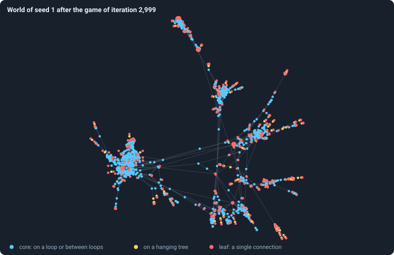

# Thirty worlds

Part II looks at one kind of world, the baseline B1, from every side. It does
so with thirty worlds that differ only in their seed. This chapter introduces
them: every chapter up to [Chapter 24](24-meta-1.md) reads these same thirty
runs, and [Chapter 37](37-do-the-brains-matter.md) compares them with worlds
made under other rules.

## The runs

<!-- runs E02 -->
> [!info] The runs behind this chapter
> **30 runs.** Every condition below is run once for every seed (1 to 30), for 3,000 iterations — or until its world dies out. Every setting is that of the baseline **B1** (the algorithm exactly as a new run is offered it) unless the condition changes it.
>
> - **baseline** — changes nothing: B1 as it is; 10,000 tokens. Runs `B1-10000-s001` … `B1-10000-s030`.
>
> To make these runs again: `python3 gol_lab.py run E02`, or ▶ in the Book tab of a computer running `gol_server.py`. Each run writes its settings, seed and engine version beside its frames, in `GraphOfLifeRuns/<run>/meta.json` and `provenance.json`.

> [!info]- Every setting of these runs
> | setting | baseline | what it is |
> |---|---|---|
> | [`total_tokens`](../notes/settings.md#total_tokens) | 10,000 | The number of tokens in the world, *T*. It never changes during a run. |
> | [`n_nodes`](../notes/settings.md#n_nodes) | 0 | How many founders the world starts with. 0 means one founder per hundred tokens: *n* = ⌊*T* / 100⌋. |
> | [`k_neighbors`](../notes/settings.md#k_neighbors) | 0 | How many neighbours each founder starts with in the ring. 0 means *k* = max(⌊*n* / 100⌋, 5); an odd *k* is wired as *k* − 1. |
> | [`rewire_p`](../notes/settings.md#rewire_p) | 0.2 | In the starting ring, the probability that a connection is moved to a founder chosen at random (Watts–Strogatz). |
> | [`hidden_layers`](../notes/settings.md#hidden_layers) | 50, 45, 40, 35, 30 | The widths of the brain's hidden layers, in order from input to output. |
> | [`brain_kind`](../notes/settings.md#brain_kind) | float16 | How weights are stored: `float` (64-bit), `float16` (16-bit, computed in 64-bit) or `binary` (−1, 0, +1). |
> | [`brain_bits`](../notes/settings.md#brain_bits) | 16 | Only for binary brains: how many input rows encode one number. Unused by float and float16 brains. |
> | [`message_amount`](../notes/settings.md#message_amount) | 30 | How many numbers one message holds. Each agent sends one message to itself and one to each neighbour, every phase. |
> | [`random_input_amount`](../notes/settings.md#random_input_amount) | 5 | How many random numbers, drawn uniformly from −2 to 2, a brain reads per neighbour, every time it looks. |
> | [`exchange_messages`](../notes/settings.md#exchange_messages) | on | Whether agents send and read messages at all. |
> | [`message_prepass`](../notes/settings.md#message_prepass) | on | Whether every phase begins with an extra look in which agents only write messages, so the look that acts reads messages written this phase. |
> | [`allow_handover`](../notes/settings.md#allow_handover) | on | Whether a parent may move some of its own connections to its newborn child. |
> | [`allow_revolutions`](../notes/settings.md#allow_revolutions) | on | Whether a coalition of smaller stakers can take a node from its largest staker (see the note *How a coalition takes a node*). |
> | [`allow_gifting`](../notes/settings.md#allow_gifting) | off | Whether agents may give tokens to neighbours during reproduction. Off in every run of this book. |
> | [`random_decisions`](../notes/settings.md#random_decisions) | off | The control: every number a brain would produce is replaced by a random draw from the standard normal distribution. |
> | [`prune_after`](../notes/settings.md#prune_after) | blotto | After which phase connections that carried no tokens are cut: `blotto` (the game), `reproduction`, or `both`. |
> | [`inactive_window`](../notes/settings.md#inactive_window) | phase | How long a connection may go unused: `phase` means it must carry tokens in the phase being judged; `iteration` allows the two last phases. |
> | [`redistribution`](../notes/settings.md#redistribution) | uniform | How the tokens of removed agents are shared: `uniform` gives every survivor the same chance at each token; `by_tokens` weights by what a survivor holds. |
> | [`tokens_created_per_phase`](../notes/settings.md#tokens_created_per_phase) | 0 | Tokens added to the world at every cleanup. 0 keeps the supply fixed. |
> | [`mutation_probability`](../notes/settings.md#mutation_probability) | 0.2 | The probability that a brain changes when it is copied to a child, and again, for every brain, after every game. |
> | [`mutation_noise_std`](../notes/settings.md#mutation_noise_std) | 0.2 | How large a change to one weight is: a normal draw with standard deviation this times 1/√(fan-in) of its layer. |
> | [`mutation_sparsity`](../notes/settings.md#mutation_sparsity) | 0.1 | The share of a brain's numbers a change touches; also the probability, for each weight matrix and bias vector, of a rarer reset that redraws that share of it. |
> | [`extinction_threshold`](../notes/settings.md#extinction_threshold) | 20 | A run stops, as extinct, when an iteration ends (after its game) with this many agents or fewer. |
> | seeds | 1 to 30 | one run per seed |
> | iterations | 3,000 | how far each run goes, unless its world dies first |
>
> A value in **bold** differs from the baseline B1.
<!-- /runs -->

Thirty runs of the baseline at 10,000 tokens — so a hundred founders of a
hundred tokens each — with seeds 1 to 30, each run for 3,000 iterations
unless its world died first. Every frame was kept, with every decision; every
statistic was recorded for every frame, and the statistics that walk the whole
network (bridges, the core, clustering, distances) every 25 iterations
([What a run records](../notes/frames-and-stats.md)).

Together they took 26 hours of computing, done in 7.2 hours on four
processor cores, and fill 7.8 GB. Four of the thirty worlds died before
iteration 3,000; 26 lived to the end.

To replicate any figure of Part II, you need exactly these runs: on a
computer with Python 3, numpy and networkx and a copy of this repository,
`python3 gol_lab.py run E02` makes them into the folder `GraphOfLifeRuns/`,
and `python3 book_figures.py` then redraws every figure of the book from
them. Each figure says, folded beneath it, which of the runs it reads and how.

## A first look

One world after 3,000 iterations — every agent a dot, every connection a
line, the dots placed so that joined agents lie near each other:

<!-- figure shape/world-2999 -->

**World of seed 1 after the game of iteration 2,999.** Every agent alive after the game of iteration 2,999 is a dot, every connection a line. Blue: agents in the core, which is what is left when agents with one connection or none are removed again and again until none remains ([Core, trees and leaves](../notes/core-trees-leaves.md)); yellow: the rest of the hanging trees; red: leaves, agents with a single connection. Where a dot is drawn means nothing in itself: a layout (networkx's ForceAtlas2, seed 1) pulls joined agents together and pushes the rest apart.

> [!example]- How to make this figure
> **Runs.** `B1-10000-s001`.
>
> **Data.** From each run's frames, `GraphOfLifeRuns/<run>/frames/`, read with `gol_store.read_frame(run, index)`; frame `2·t` is iteration *t* after reproduction and frame `2·t + 1` after the game.
>
> 1. Read frame `5999` (iteration 2,999, after the game): `ids` and `edges`.
> 2. Peel: remove every agent with one connection or none, again and again, until none is left; the agents never removed are the core. Leaves are agents with exactly one connection.
> 3. Lay the graph out with `networkx.forceatlas2_layout(G, max_iter=200, seed=1)`.
>
> **To make it again:** `python3 book_figures.py shape`.
<!-- /figure -->

The hundred founders on their ring ([Chapter 2](02-the-world.md)) have become
1,336 agents in a network of dense clusters joined by long, thin paths, with
many agents that hang on by a single connection.
[Chapter 16](16-what-shape-does-the-network-take.md) takes this shape apart.

Any of the thirty can be opened in the **Viewer** of the Graph of Life app,
which replays a run frame by frame.

## The questions of Part II

- [Chapter 10](10-a-worlds-life.md) — What does a world do over 3,000
  iterations? Does it settle?
- [Chapter 11](11-the-first-hundred-iterations.md) — What happens in its first
  hundred iterations?
- [Chapter 12](12-births-deaths-and-ages.md) — How often are agents born and
  how do they die? How old do they get?
- [Chapter 13](13-how-much-does-the-seed-decide.md) — How much of what a world
  does is decided by its seed?
- [Chapter 14](14-where-do-the-tokens-go.md) — Where do the tokens go — how
  unequal does a world become?
- [Chapter 15](15-how-the-game-is-played.md) — How is the game played: where
  do agents stake, who wins the nodes?
- [Chapter 16](16-what-shape-does-the-network-take.md) — What shape does the
  network take?
- [Chapter 17](17-genotypes-and-lineages.md) — How long do genotypes last, and
  do lineages take over?
- [Chapter 24](24-meta-1.md) — What the baseline world is, in sum.

Five of these chapters (9, 12, 13, 15 and 16) were planned as experiments,
with a thesis written down before the runs; they quote it and say whether it
held. The others only ask.

<!-- turns -->
---

← [Chapter 8 · Is a run reproducible?](08-is-a-run-reproducible.md) · [Contents](../README.md) · [Chapter 10 · A world's life](10-a-worlds-life.md) →
<!-- /turns -->
