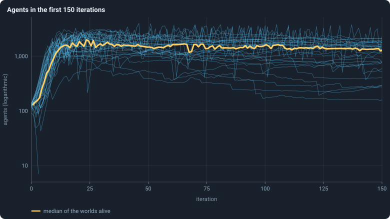
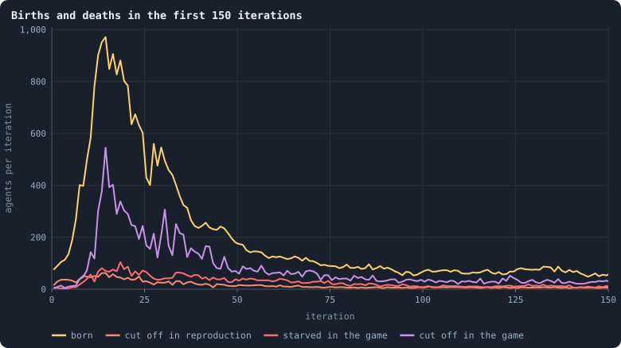
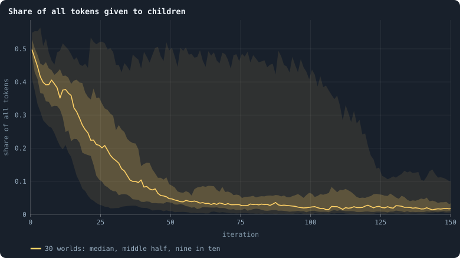
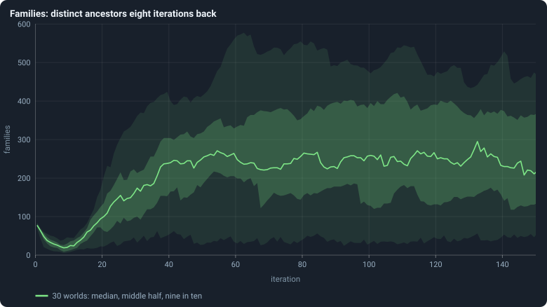
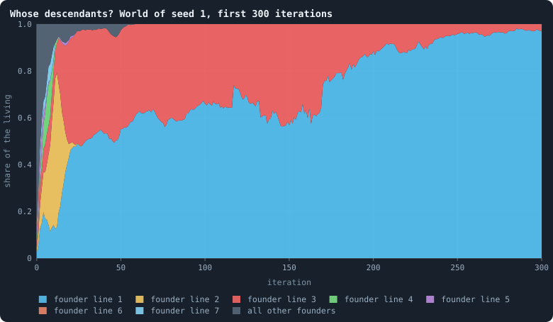
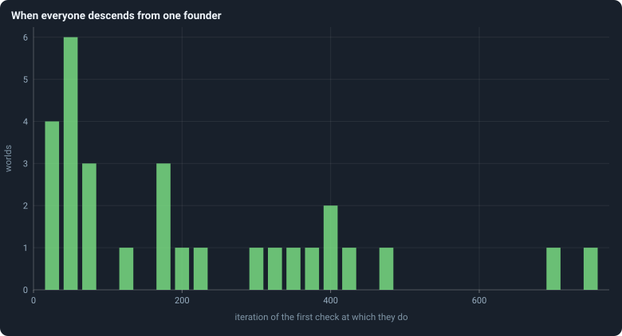

# The first hundred iterations

[Chapter 10](10-a-worlds-life.md) found that every world begins with a
**youth** unlike the rest of its life. This chapter looks at it closely.

> [!question] Questions of this chapter
> - How do a hundred founders, each with a random brain and a hundred tokens,
>   become a world of a thousand agents and more?
> - Where do the agents come from in the youth, and how do they die?
> - Whose descendants are the agents of a settled world?

<!-- runs E02 -->
> [!info] The runs behind this chapter
> **30 runs.** Every condition below is run once for every seed (1 to 30), for 3,000 iterations — or until its world dies out. Every setting is that of the baseline **B1** (the algorithm exactly as a new run is offered it) unless the condition changes it.
>
> - **baseline** — changes nothing: B1 as it is; 10,000 tokens. Runs `B1-10000-s001` … `B1-10000-s030`.
>
> To make these runs again: `python3 gol_lab.py run E02`, or ▶ in the Book tab of a computer running `gol_server.py`. Each run writes its settings, seed and engine version beside its frames, in `GraphOfLifeRuns/<run>/meta.json` and `provenance.json`.

> [!info]- Every setting of these runs
> | setting | baseline | what it is |
> |---|---|---|
> | [`total_tokens`](../notes/settings.md#total_tokens) | 10,000 | The number of tokens in the world, *T*. It never changes during a run. |
> | [`n_nodes`](../notes/settings.md#n_nodes) | 0 | How many founders the world starts with. 0 means one founder per hundred tokens: *n* = ⌊*T* / 100⌋. |
> | [`k_neighbors`](../notes/settings.md#k_neighbors) | 0 | How many neighbours each founder starts with in the ring. 0 means *k* = max(⌊*n* / 100⌋, 5); an odd *k* is wired as *k* − 1. |
> | [`rewire_p`](../notes/settings.md#rewire_p) | 0.2 | In the starting ring, the probability that a connection is moved to a founder chosen at random (Watts–Strogatz). |
> | [`hidden_layers`](../notes/settings.md#hidden_layers) | 50, 45, 40, 35, 30 | The widths of the brain's hidden layers, in order from input to output. |
> | [`brain_kind`](../notes/settings.md#brain_kind) | float16 | How weights are stored: `float` (64-bit), `float16` (16-bit, computed in 64-bit) or `binary` (−1, 0, +1). |
> | [`brain_bits`](../notes/settings.md#brain_bits) | 16 | Only for binary brains: how many input rows encode one number. Unused by float and float16 brains. |
> | [`message_amount`](../notes/settings.md#message_amount) | 30 | How many numbers one message holds. Each agent sends one message to itself and one to each neighbour, every phase. |
> | [`random_input_amount`](../notes/settings.md#random_input_amount) | 5 | How many random numbers, drawn uniformly from −2 to 2, a brain reads per neighbour, every time it looks. |
> | [`exchange_messages`](../notes/settings.md#exchange_messages) | on | Whether agents send and read messages at all. |
> | [`message_prepass`](../notes/settings.md#message_prepass) | on | Whether every phase begins with an extra look in which agents only write messages, so the look that acts reads messages written this phase. |
> | [`allow_handover`](../notes/settings.md#allow_handover) | on | Whether a parent may move some of its own connections to its newborn child. |
> | [`allow_revolutions`](../notes/settings.md#allow_revolutions) | on | Whether a coalition of smaller stakers can take a node from its largest staker (see the note *How a coalition takes a node*). |
> | [`allow_gifting`](../notes/settings.md#allow_gifting) | off | Whether agents may give tokens to neighbours during reproduction. Off in every run of this book. |
> | [`random_decisions`](../notes/settings.md#random_decisions) | off | The control: every number a brain would produce is replaced by a random draw from the standard normal distribution. |
> | [`prune_after`](../notes/settings.md#prune_after) | blotto | After which phase connections that carried no tokens are cut: `blotto` (the game), `reproduction`, or `both`. |
> | [`inactive_window`](../notes/settings.md#inactive_window) | phase | How long a connection may go unused: `phase` means it must carry tokens in the phase being judged; `iteration` allows the two last phases. |
> | [`redistribution`](../notes/settings.md#redistribution) | uniform | How the tokens of removed agents are shared: `uniform` gives every survivor the same chance at each token; `by_tokens` weights by what a survivor holds. |
> | [`tokens_created_per_phase`](../notes/settings.md#tokens_created_per_phase) | 0 | Tokens added to the world at every cleanup. 0 keeps the supply fixed. |
> | [`mutation_probability`](../notes/settings.md#mutation_probability) | 0.2 | The probability that a brain changes when it is copied to a child, and again, for every brain, after every game. |
> | [`mutation_noise_std`](../notes/settings.md#mutation_noise_std) | 0.2 | How large a change to one weight is: a normal draw with standard deviation this times 1/√(fan-in) of its layer. |
> | [`mutation_sparsity`](../notes/settings.md#mutation_sparsity) | 0.1 | The share of a brain's numbers a change touches; also the probability, for each weight matrix and bias vector, of a rarer reset that redraws that share of it. |
> | [`extinction_threshold`](../notes/settings.md#extinction_threshold) | 20 | A run stops, as extinct, when an iteration ends (after its game) with this many agents or fewer. |
> | seeds | 1 to 30 | one run per seed |
> | iterations | 3,000 | how far each run goes, unless its world dies first |
>
> A value in **bold** differs from the baseline B1.
<!-- /runs -->

## A boom and a crash

<!-- figure youth/boom -->

**Agents in the first 150 iterations.** Each thin blue line is one of the 30 worlds: the number of agents alive after every game. The yellow line is their median. The axis is logarithmic, so equal heights are equal factors: the step from 100 to 1,000 is as tall as the one from 1,000 to 10,000.

> [!example]- How to make this figure
> **Runs.** The 30 baseline runs `B1-10000-s001` … `B1-10000-s030`: the baseline B1 at 10,000 tokens, seeds 1 to 30, 3,000 iterations each (every setting is listed in [Chapter 9](09-thirty-worlds.md)). They are made with `python3 gol_lab.py run E02`.
>
> **Data.** From each run's `GraphOfLifeRuns/<run>/stats.jsonl`, which holds one row per recorded phase: `phase` 1 is the world just after reproduction, `phase` 2 just after the game, and every statistic is a field of the row (see [What a run records](../notes/frames-and-stats.md)).
>
> 1. Take every run's rows with `phase` = 2 and 0 ≤ `iteration` ≤ 150.
> 2. Draw `nodes` against `iteration` for each run.
> 3. At each iteration, take the median of `nodes` over the runs that have a row there.
>
> **To make it again:** `python3 book_figures.py youth`.
<!-- /figure -->

At the start every founder holds a hundred tokens and has a brain nobody has
selected. In the first reproduction phase most of them give a large part of
their tokens to a child ([Chapter 4](04-the-brain.md): a median of half). The children give in
turn, and the median world grows from 100 founders to 127 agents after the
first game, 254 after the fifth, 904 after the tenth and 1,508 after the
twentieth. It peaks at about 1,980 agents around iteration 23, falls back,
and stays near 1,500 from iteration 50 to 100.

The axis is logarithmic. On it, steady growth by a constant factor per
iteration is a straight line, and the first ten or so iterations are close to
one: the population doubles about every three and a half iterations. Then the lines
break, and many fall steeply for a few iterations: the boom ends in a crash.

## Where the agents come from, and where they go

<!-- figure youth/flows -->

**Births and deaths in the first 150 iterations.** For each iteration, the median over the worlds of: the children born in the reproduction phase (yellow); the agents removed by the cleanup of that phase because they were joined to no one or to a piece smaller than the largest (orange — mostly newborns joined to no one); the agents removed by the cleanup of the game because nobody, not even themselves, staked a token on their node (red); and those removed in the game's cleanup because they were cut off (violet).

> [!example]- How to make this figure
> **Runs.** The 30 baseline runs `B1-10000-s001` … `B1-10000-s030`: the baseline B1 at 10,000 tokens, seeds 1 to 30, 3,000 iterations each (every setting is listed in [Chapter 9](09-thirty-worlds.md)). They are made with `python3 gol_lab.py run E02`.
>
> **Data.** From each run's `GraphOfLifeRuns/<run>/stats.jsonl`, which holds one row per recorded phase: `phase` 1 is the world just after reproduction, `phase` 2 just after the game, and every statistic is a field of the row (see [What a run records](../notes/frames-and-stats.md)).
>
> 1. For iterations 0 to 150, take `births` and `orphaned` from the rows with `phase` = 1, and `starved` and `orphaned` from the rows with `phase` = 2.
> 2. At each iteration, take the median of each over the runs that have a row there.
>
> **To make it again:** `python3 book_figures.py youth`.
<!-- /figure -->

Births peak at a median of 971 in iteration 14. Deaths follow: agents cut off
in the game peak at 545 per iteration in the same iteration, starvation at 104
per iteration four iterations later. So the crash is mostly the network
breaking apart: at the peak, five agents are cut off for every one that
starves. A newborn is joined to its parent and some of its parent's neighbours
([Chapter 3](03-one-iteration.md)), and every one of those connections is cut at the end of the game
unless tokens cross it. In the boom, most agents hold a few tokens and many
new connections carry nothing; whole branches of the network lose their link
to the largest piece and are removed, with everyone on them.

<!-- figure youth/children-share -->

**Share of all tokens given to children.** In each reproduction phase, the tokens all parents together gave their children, as a share of all 10,000 tokens. The line is the median of the worlds at each iteration, the darker band holds the middle half of them (from the 25th to the 75th percentile) and the paler band nine in ten (5th to 95th), here at every single iteration.

> [!example]- How to make this figure
> **Runs.** The 30 baseline runs `B1-10000-s001` … `B1-10000-s030`: the baseline B1 at 10,000 tokens, seeds 1 to 30, 3,000 iterations each (every setting is listed in [Chapter 9](09-thirty-worlds.md)). They are made with `python3 gol_lab.py run E02`.
>
> **Data.** From each run's `GraphOfLifeRuns/<run>/stats.jsonl`, which holds one row per recorded phase: `phase` 1 is the world just after reproduction, `phase` 2 just after the game, and every statistic is a field of the row (see [What a run records](../notes/frames-and-stats.md)).
>
> 1. Take the rows with `phase` = 1 and 0 ≤ `iteration` ≤ 150, and the statistic `reproTokenShare` — the sum of `invested` over the births of that phase, divided by the 10,000 tokens.
> 2. At each iteration take the median, quartiles and 5th and 95th percentiles over the runs.
>
> **To make it again:** `python3 book_figures.py youth`.
<!-- /figure -->

Giving so much to children does not last. In the first reproduction phase
parents together gave 50% of all tokens to their children; at iteration 10,
38%; at iteration 20, 26%; at iteration 50, 5%; at iteration 100, 2%. Two
things lower it. Far fewer agents have a child at all: about 75 in every
hundred in each of the first ten iterations, about 3 in a settled world
([Chapter 12](12-births-deaths-and-ages.md)). And parents give smaller shares
([Chapter 4](04-the-brain.md)). Part of the first is plain rounding: a parent
gives ⌊*f* · τ⌋ tokens, and an agent holding 3 tokens that would give a
fifth gives ⌊0.6⌋ = 0 and has no child. The founders held 100 tokens each;
the median agent of a settled world holds about 5
([Chapter 14](14-where-do-the-tokens-go.md)).

## A bottleneck of lines

<!-- figure youth/families -->

**Families: distinct ancestors eight iterations back.** After every game, how many different genotypes of eight iterations earlier the living descend from (before iteration 8: how many founders). The line is the median of the worlds at each iteration, the darker band holds the middle half of them (from the 25th to the 75th percentile) and the paler band nine in ten (5th to 95th), at every iteration.

> [!example]- How to make this figure
> **Runs.** The 30 baseline runs `B1-10000-s001` … `B1-10000-s030`: the baseline B1 at 10,000 tokens, seeds 1 to 30, 3,000 iterations each (every setting is listed in [Chapter 9](09-thirty-worlds.md)). They are made with `python3 gol_lab.py run E02`.
>
> **Data.** From each run's `GraphOfLifeRuns/<run>/stats.jsonl`, which holds one row per recorded phase: `phase` 1 is the world just after reproduction, `phase` 2 just after the game, and every statistic is a field of the row (see [What a run records](../notes/frames-and-stats.md)).
>
> 1. Take the rows with `phase` = 2 and 0 ≤ `iteration` ≤ 150, and the statistic `cladesInWindow` ([Families](../notes/families.md): for every living agent, follow its genotype's parents back to the newest one born at or before iteration t − 8, or to a founder's; count the distinct ones).
> 2. At each iteration take the median, quartiles and 5th and 95th percentiles over the runs.
>
> **To make it again:** `python3 book_figures.py youth`.
<!-- /figure -->

The number of **families** counts the different genotypes of eight
iterations earlier that the living descend from ([Families](../notes/families.md)). Before
iteration 8, "eight iterations earlier" is before the world began, so it counts
how many of the 100 founders still have descendants. It falls fast: in the
median world, around iteration 8, the living descend from only about 19 of the
genotypes that were alive in iteration 0. Later the count rises again, because by then
there are many more genotypes to descend from.

Why do lines die so fast? In the game, a node that is won takes on the
**winner's brain**. A founder whose node is won, and whose children's nodes
are won, has no descendants left even though its node still exists.

Following every founder's line in one world shows it plainly:

<!-- figure youth/founder-lines -->

**Whose descendants? World of seed 1, first 300 iterations.** After every game, the share of the living agents that descend from each of the 100 founders, stacked. Each coloured layer is the line of one founder; the seven founders whose lines ever held the most are drawn in colour, the other 93 together in grey. Where a layer reaches the full height, everyone alive descends from that founder.

> [!example]- How to make this figure
> **Runs.** `B1-10000-s001`, one of the 30 baseline runs.
>
> **Data.** From each run's frames, `GraphOfLifeRuns/<run>/frames/`, read with `gol_store.read_frame(run, index)`; frame `2·t` is iteration *t* after reproduction and frame `2·t + 1` after the game.
>
> 1. Read every frame in order and remember each genotype's parent genotype (`brain_ids`, `parent_brain_ids`).
> 2. After each game up to iteration 300, follow every living agent's genotype back to its founder and count the agents per founder; divide by the number of agents.
> 3. Stack the shares, the founders with the largest share ever at the bottom.
>
> **To make it again:** `python3 book_figures.py youth`.
<!-- /figure -->

In the world with seed 1, one founder's descendants make up 52% of the world
by iteration 10. By iteration 100 only two founders' lines are left, holding
66% and 34% of the agents; at iteration 300, 97% and 3%. Shortly after, every
agent alive descends from a single founder.

## One founder for everyone

How soon does that happen in each world? Every 25 iterations the family tree
of genotypes was climbed from the living ([The common ancestor](../notes/common-ancestor.md)
explains how), and the
first check at which every living agent descends from one and the same
founder was noted:

<!-- figure youth/one-founder -->

**When everyone descends from one founder.** For each world, the first of the checks — made every 25 iterations — at which every living agent descends from one and the same founder. 29 of the 30 worlds got there; the world with seed 23 died after 4 iterations, first.

> [!example]- How to make this figure
> **Runs.** The 30 baseline runs `B1-10000-s001` … `B1-10000-s030`: the baseline B1 at 10,000 tokens, seeds 1 to 30, 3,000 iterations each (every setting is listed in [Chapter 9](09-thirty-worlds.md)). They are made with `python3 gol_lab.py run E02`.
>
> **Data.** From the runs' frames, through the lineage analysis of Experiment 6 (`python3 gol_lab.py analyse E06`), whose results file `book/results/E06.json` holds every run's `oneFounder`.
>
> 1. Read every frame of a run in order and remember, for every genotype (brain id), the genotype it was copied from (`parent_brain_ids`).
> 2. After the game of every 25th iteration, follow every living agent's genotype back through its parents to a founder's genotype (one with no parent).
> 3. The first iteration at which they all lead to the same founder is the world's value.
> 4. Count the worlds at each value.
>
> **To make it again:** `python3 book_figures.py youth`.
<!-- /figure -->

Of the 29 worlds that lived past their fourth iteration, all got there. Half
did by iteration 175, a quarter by iteration 50, and 13 by iteration 100; the
slowest took 750 iterations. **Within a few hundred iterations, every world
descends from a single one of its hundred founders.** The other 99 founders'
lines are gone. A line ends when the last agent carrying one of its brains
either dies or has its node won by an agent of another line, whose brain then
replaces its own.

## What this means

The youth of a world is a boom, a crash and a bottleneck. Its numbers —
about 75 births per hundred agents in each of the first ten iterations,
some 25 times the settled rate, and families falling from a hundred to about
twenty — are
unlike anything later in a world's life, and that is why the rest of the book
measures settled worlds from iteration 500 on. It also means that every
settled world is, in its brains, the descendants of one founder: whatever
diversity of brains a world later holds, it has made since.

To make every figure of this chapter: `python3 book_figures.py youth`.

<!-- turns -->
---

← [Chapter 10 · A world's life](10-a-worlds-life.md) · [Contents](../README.md) · [Chapter 12 · Births, deaths and ages](12-births-deaths-and-ages.md) →
<!-- /turns -->
