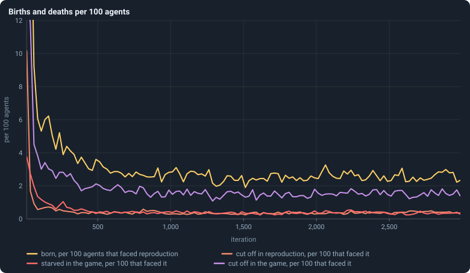
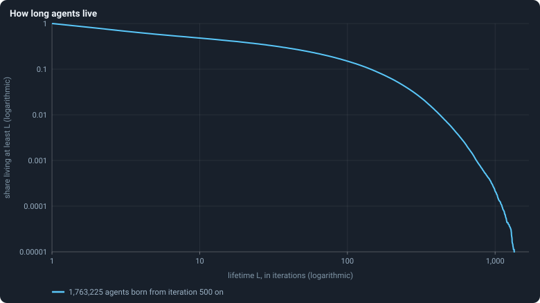
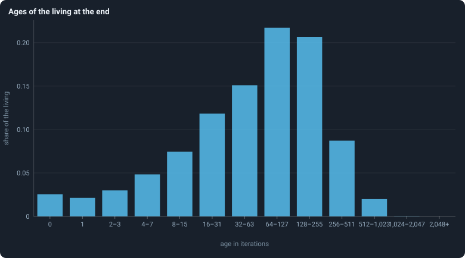
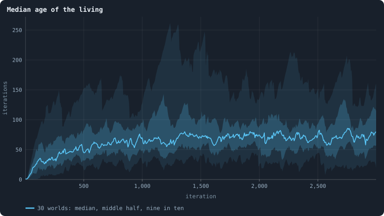

# Births, deaths and ages

A settled world keeps its size ([Chapter 10](10-a-worlds-life.md)), but its
members come and go.

> [!question] Questions of this chapter
> - How often is an agent born?
> - How do agents die, and which way of dying is the most common?
> - How long do agents live?
> - How old are the living — and why is that a different question?

<!-- runs E02 -->
> [!info] The runs behind this chapter
> **30 runs.** Every condition below is run once for every seed (1 to 30), for 3,000 iterations — or until its world dies out. Every setting is that of the baseline **B1** (the algorithm exactly as a new run is offered it) unless the condition changes it.
>
> - **baseline** — changes nothing: B1 as it is; 10,000 tokens. Runs `B1-10000-s001` … `B1-10000-s030`.
>
> To make these runs again: `python3 gol_lab.py run E02`, or ▶ in the Book tab of a computer running `gol_server.py`. Each run writes its settings, seed and engine version beside its frames, in `GraphOfLifeRuns/<run>/meta.json` and `provenance.json`.

> [!info]- Every setting of these runs
> | setting | baseline | what it is |
> |---|---|---|
> | [`total_tokens`](../notes/settings.md#total_tokens) | 10,000 | The number of tokens in the world, *T*. It never changes during a run. |
> | [`n_nodes`](../notes/settings.md#n_nodes) | 0 | How many founders the world starts with. 0 means one founder per hundred tokens: *n* = ⌊*T* / 100⌋. |
> | [`k_neighbors`](../notes/settings.md#k_neighbors) | 0 | How many neighbours each founder starts with in the ring. 0 means *k* = max(⌊*n* / 100⌋, 5); an odd *k* is wired as *k* − 1. |
> | [`rewire_p`](../notes/settings.md#rewire_p) | 0.2 | In the starting ring, the probability that a connection is moved to a founder chosen at random (Watts–Strogatz). |
> | [`hidden_layers`](../notes/settings.md#hidden_layers) | 50, 45, 40, 35, 30 | The widths of the brain's hidden layers, in order from input to output. |
> | [`brain_kind`](../notes/settings.md#brain_kind) | float16 | How weights are stored: `float` (64-bit), `float16` (16-bit, computed in 64-bit) or `binary` (−1, 0, +1). |
> | [`brain_bits`](../notes/settings.md#brain_bits) | 16 | Only for binary brains: how many input rows encode one number. Unused by float and float16 brains. |
> | [`message_amount`](../notes/settings.md#message_amount) | 30 | How many numbers one message holds. Each agent sends one message to itself and one to each neighbour, every phase. |
> | [`random_input_amount`](../notes/settings.md#random_input_amount) | 5 | How many random numbers, drawn uniformly from −2 to 2, a brain reads per neighbour, every time it looks. |
> | [`exchange_messages`](../notes/settings.md#exchange_messages) | on | Whether agents send and read messages at all. |
> | [`message_prepass`](../notes/settings.md#message_prepass) | on | Whether every phase begins with an extra look in which agents only write messages, so the look that acts reads messages written this phase. |
> | [`allow_handover`](../notes/settings.md#allow_handover) | on | Whether a parent may move some of its own connections to its newborn child. |
> | [`allow_revolutions`](../notes/settings.md#allow_revolutions) | on | Whether a coalition of smaller stakers can take a node from its largest staker (see the note *How a coalition takes a node*). |
> | [`allow_gifting`](../notes/settings.md#allow_gifting) | off | Whether agents may give tokens to neighbours during reproduction. Off in every run of this book. |
> | [`random_decisions`](../notes/settings.md#random_decisions) | off | The control: every number a brain would produce is replaced by a random draw from the standard normal distribution. |
> | [`prune_after`](../notes/settings.md#prune_after) | blotto | After which phase connections that carried no tokens are cut: `blotto` (the game), `reproduction`, or `both`. |
> | [`inactive_window`](../notes/settings.md#inactive_window) | phase | How long a connection may go unused: `phase` means it must carry tokens in the phase being judged; `iteration` allows the two last phases. |
> | [`redistribution`](../notes/settings.md#redistribution) | uniform | How the tokens of removed agents are shared: `uniform` gives every survivor the same chance at each token; `by_tokens` weights by what a survivor holds. |
> | [`tokens_created_per_phase`](../notes/settings.md#tokens_created_per_phase) | 0 | Tokens added to the world at every cleanup. 0 keeps the supply fixed. |
> | [`mutation_probability`](../notes/settings.md#mutation_probability) | 0.2 | The probability that a brain changes when it is copied to a child, and again, for every brain, after every game. |
> | [`mutation_noise_std`](../notes/settings.md#mutation_noise_std) | 0.2 | How large a change to one weight is: a normal draw with standard deviation this times 1/√(fan-in) of its layer. |
> | [`mutation_sparsity`](../notes/settings.md#mutation_sparsity) | 0.1 | The share of a brain's numbers a change touches; also the probability, for each weight matrix and bias vector, of a rarer reset that redraws that share of it. |
> | [`extinction_threshold`](../notes/settings.md#extinction_threshold) | 20 | A run stops, as extinct, when an iteration ends (after its game) with this many agents or fewer. |
> | seeds | 1 to 30 | one run per seed |
> | iterations | 3,000 | how far each run goes, unless its world dies first |
>
> A value in **bold** differs from the baseline B1.
<!-- /runs -->

## Four ways in and out

An agent enters a world one way, by birth in a reproduction phase. It leaves
in one of four ways ([Chapter 3](03-one-iteration.md)): it is **cut off in reproduction** — mostly a
newborn joined to no one —; it **starves in reproduction**, a parent that gave
its last token to its child; it **starves in the game**, when no one, not even
itself, staked a token on its node; or it is **cut off in the game**, when the
connections that tied its part of the network to the rest are cut
([Births and the four ways to die](../notes/births-and-deaths.md)). Each is
counted per hundred agents alive when its phase began:

<!-- figure births/rates -->

**Births and deaths per 100 agents.** Each line is the median over the worlds, in stretches of 25 iterations, of a count divided by the agents present when the phase began, times 100. The first iterations run far above the top of the axis ([Chapter 11](11-the-first-hundred-iterations.md)).

> [!example]- How to make this figure
> **Runs.** The 30 baseline runs `B1-10000-s001` … `B1-10000-s030`: the baseline B1 at 10,000 tokens, seeds 1 to 30, 3,000 iterations each (every setting is listed in [Chapter 9](09-thirty-worlds.md)). They are made with `python3 gol_lab.py run E02`.
>
> **Data.** From each run's `GraphOfLifeRuns/<run>/stats.jsonl`, which holds one row per recorded phase: `phase` 1 is the world just after reproduction, `phase` 2 just after the game, and every statistic is a field of the row (see [What a run records](../notes/frames-and-stats.md)).
>
> 1. For every row, divide the count (`births` or `orphaned` in rows with `phase` = 1; `starved` or `orphaned` in rows with `phase` = 2) by the row's `nodes_before`, the agents present when that phase began, and multiply by 100.
> 2. Cut the 3,000 iterations into 120 stretches of 25; take each run's mean in each.
> 3. Draw the median over the runs that have a value in the stretch.
>
> **To make it again:** `python3 book_figures.py births`.
<!-- /figure -->

From iteration 500 on, the median world sees 3.1 births per hundred agents in
every reproduction phase, and loses 0.4 per hundred to cutting off in
reproduction, 0.5 to starvation in the game and 1.7 to cutting off in the
game. (Starving in reproduction is rarer still, about 0.1; it is not drawn.)
Of every four agents who die, about three die because the network around
them came apart, and one because nobody staked on its node. (The figure of
[Chapter 3](03-one-iteration.md) gives slightly higher numbers — 0.6 and 1.9 —
because it pools every iteration of all 26 worlds into one sum, so that the
bigger and busier worlds weigh more; here each world counts once, and the
typical world is the median one.)

The rates are steady from about iteration 500 on, after falling from the
youth, and they differ little between worlds: the middle half of the worlds
have between 2.7 and 3.3 births per hundred agents. [Chapter 31](31-do-the-brains-matter.md) shows how
remarkable that is.

## How long agents live

Follow every agent born at iteration 500 or later in the 26 worlds that lived
to the end — 1.76 million of them — from its birth to the last game after
which it was alive ([Age and lifetime](../notes/age-and-lifetime.md)). Agents
still alive at the end of a run are counted as having lived *at least* that
long, by the [Kaplan–Meier estimate](../notes/kaplan-meier.md). The share
that lived at least *L* iterations:

<!-- figure births/lifetimes -->

**How long agents live.** Of all agents born at iteration 500 or later in the 26 worlds that lived to the end and that took part in at least one game, the share that lived at least L iterations, for every L. A life is counted from the iteration of birth to the last iteration after whose game the agent was alive, both included. Lives still going when a run ended are counted as far as they went (Kaplan–Meier). Both axes are logarithmic.

> [!example]- How to make this figure
> **Runs.** The 26 surviving ones of the 30 baseline runs `B1-10000-s001` … `B1-10000-s030`: the baseline B1 at 10,000 tokens, seeds 1 to 30, 3,000 iterations each (every setting is listed in [Chapter 9](09-thirty-worlds.md)). They are made with `python3 gol_lab.py run E02`.
>
> **Data.** From each run's frames, `GraphOfLifeRuns/<run>/frames/`, read with `gol_store.read_frame(run, index)`; frame `2·t` is iteration *t* after reproduction and frame `2·t + 1` after the game.
>
> 1. Read every frame with `phase` = 2. For every agent id note its birth iteration (the frame's `iteration` minus its `ages` entry) and the last iteration it appears.
> 2. Keep agents born at iteration 500 or later. An agent still present in the last frame is censored: its life is known to be at least that long.
> 3. Compute the Kaplan–Meier estimate S(L) = Π over lifetimes ℓ < L of (1 − d(ℓ) / n(ℓ)), with d(ℓ) the lives that ended at ℓ and n(ℓ) those still at risk.
>
> **To make it again:** `python3 book_figures.py births`.
<!-- /figure -->

On these logarithmic axes the curve shows several things at once:

- 79% of agents live at least 2 iterations, 58% at least 5, 48% at least 10:
  **about half of all agents are gone within ten iterations.**
- 26% live at least 50 iterations and 15% at least 100. The curve falls slowly
  there: an agent that has survived its first ten iterations has good chances
  of surviving many more.
- Then it drops: 0.6% live at least 500 iterations, 0.02% at least 1,000.

A curve that fell along a straight line on these axes would be a power law;
this one bends. Early deaths are common; long lives exist, but not without
limit.

## How old the living are

The lifetimes above are of all agents ever born. The **living** are a
different sample: an agent that lives long is alive at many moments, so the
living are older than the typical agent at death.

<!-- figure births/ages -->

**Ages of the living at the end.** The ages of all 35,554 agents alive after the last game of the 26 worlds that lived to the end, in bins that double in width: age 0 is born in this iteration, age 1 in the one before, and so on.

> [!example]- How to make this figure
> **Runs.** The 26 surviving ones of the 30 baseline runs `B1-10000-s001` … `B1-10000-s030`: the baseline B1 at 10,000 tokens, seeds 1 to 30, 3,000 iterations each (every setting is listed in [Chapter 9](09-thirty-worlds.md)). They are made with `python3 gol_lab.py run E02`.
>
> **Data.** From each run's frames, `GraphOfLifeRuns/<run>/frames/`, read with `gol_store.read_frame(run, index)`; frame `2·t` is iteration *t* after reproduction and frame `2·t + 1` after the game.
>
> 1. Read each run's last frame (iteration 2,999, `phase` 2) and its `ages`.
> 2. Count the ages in the bins 0, 1, 2–3, 4–7, …, and divide by the number of agents.
>
> **To make it again:** `python3 book_figures.py births`.
<!-- /figure -->

After the last game of the 26 surviving worlds, 35,554 agents were alive. Their
median age was 72 iterations; 2.5% had been born in that very iteration; 39%
were 100 iterations old or more; and ten were over a thousand.

<!-- figure births/median-age -->

**Median age of the living.** After every game, the median age of the agents alive. The line is the median of the worlds at each iteration, the darker band holds the middle half of them (from the 25th to the 75th percentile) and the paler band nine in ten (5th to 95th).

> [!example]- How to make this figure
> **Runs.** The 30 baseline runs `B1-10000-s001` … `B1-10000-s030`: the baseline B1 at 10,000 tokens, seeds 1 to 30, 3,000 iterations each (every setting is listed in [Chapter 9](09-thirty-worlds.md)). They are made with `python3 gol_lab.py run E02`.
>
> **Data.** From each run's frames, `GraphOfLifeRuns/<run>/frames/`, read with `gol_store.read_frame(run, index)`; frame `2·t` is iteration *t* after reproduction and frame `2·t + 1` after the game.
>
> 1. After every game (frames with `phase` = 2) take the median of `ages`.
> 2. Cut the iterations into stretches of 5 (600 stretches over 3,000 iterations) and take each world's mean in each stretch.
> 3. In each stretch, take the median, the 25th and 75th and the 5th and 95th percentiles of those means over the worlds that still have a value there (a world that died has none after its death).
>
> **To make it again:** `python3 book_figures.py births`.
<!-- /figure -->

And the living keep getting older: the median age of the living was 26
iterations at iteration 100, 46 at iteration 500, 70 at 1,000 and 80 at
iteration 2,999. Births and deaths fall slowly over the whole run ([Chapter 10](10-a-worlds-life.md)),
so each agent is replaced less often.

## What this means

A settled world replaces about 3 of every 100 agents in every iteration, and
most of those that die are cut off from the network rather than starved. Half
of all agents are gone within ten iterations, while a few live more than a
thousand. And the population ages through the whole 3,000 iterations — the
baseline world is not in a steady state, even when its size is.

To make every figure of this chapter: `python3 book_figures.py births`.

<!-- turns -->
---

← [Chapter 11 · The first hundred iterations](11-the-first-hundred-iterations.md) · [Contents](../README.md) · [Chapter 13 · How much does the seed decide?](13-how-much-does-the-seed-decide.md) →
<!-- /turns -->
