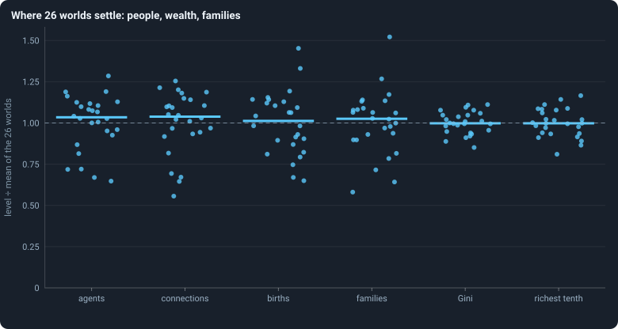
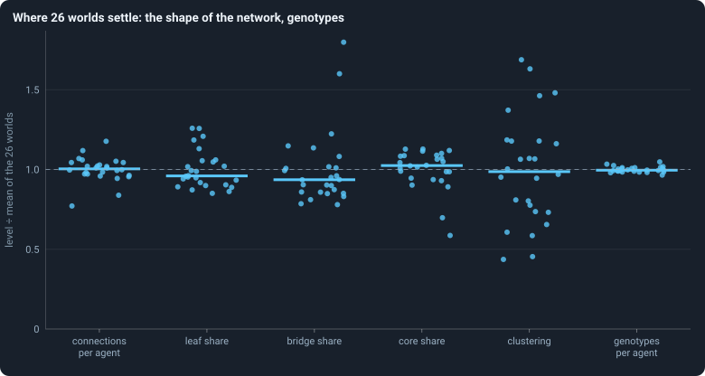
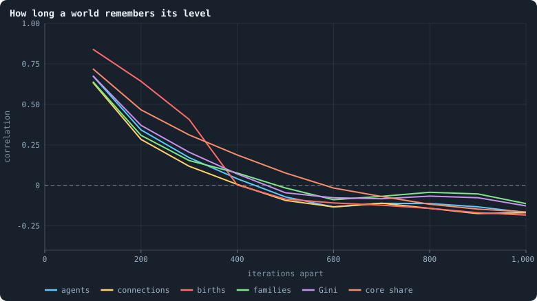
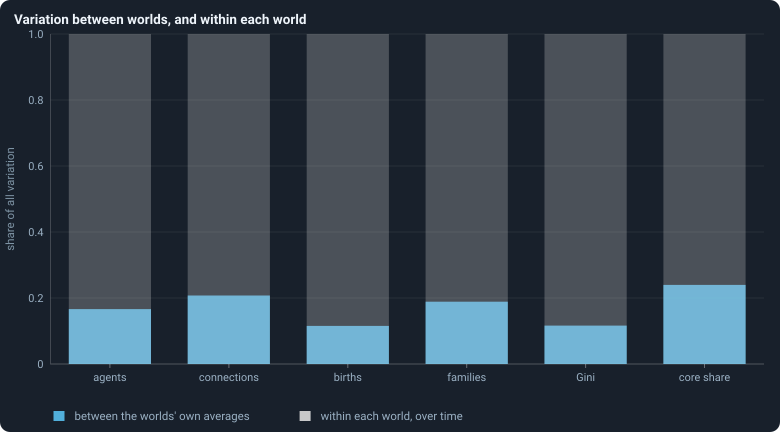
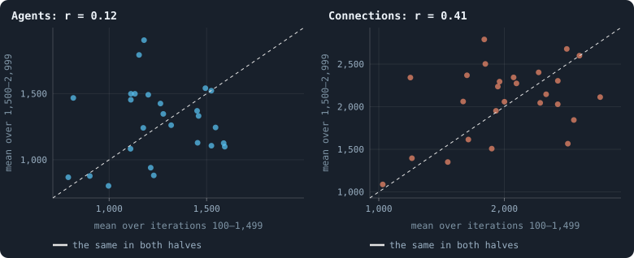
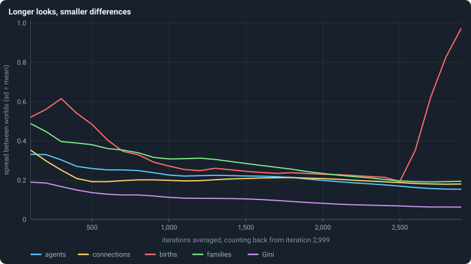
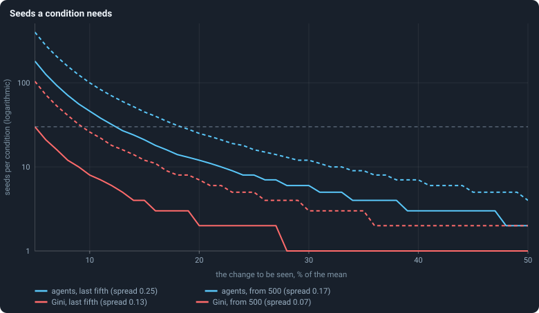

# How much does the seed decide?

Thirty worlds of the same settings differ only in their seed — and therefore
in their starting ring, their founders' brains and every random choice they
ever make.

> [!question] Questions of this chapter
> - How different do thirty such worlds end up?
> - Is the difference something each seed fixes for good, or does it come and
>   go?
> - How many seeds does an experiment need to see that a change of setting
>   changed something?

<!-- runs E03 -->
> [!info] The runs behind this chapter
> These are the runs of Experiment 2; nothing new was run for this chapter.
>
> **30 runs.** Every condition below is run once for every seed (1 to 30), for 3,000 iterations — or until its world dies out. Every setting is that of the baseline **B1** (the algorithm exactly as a new run is offered it) unless the condition changes it.
>
> - **baseline** — changes nothing: B1 as it is; 10,000 tokens. Runs `B1-10000-s001` … `B1-10000-s030`.
>
> To make these runs again: `python3 gol_lab.py run E02`, or ▶ in the Book tab of a computer running `gol_server.py`. Each run writes its settings, seed and engine version beside its frames, in `GraphOfLifeRuns/<run>/meta.json` and `provenance.json`.

> [!info]- Every setting of these runs
> | setting | baseline | what it is |
> |---|---|---|
> | [`total_tokens`](../notes/settings.md#total_tokens) | 10,000 | The number of tokens in the world, *T*. It never changes during a run. |
> | [`n_nodes`](../notes/settings.md#n_nodes) | 0 | How many founders the world starts with. 0 means one founder per hundred tokens: *n* = ⌊*T* / 100⌋. |
> | [`k_neighbors`](../notes/settings.md#k_neighbors) | 0 | How many neighbours each founder starts with in the ring. 0 means *k* = max(⌊*n* / 100⌋, 5); an odd *k* is wired as *k* − 1. |
> | [`rewire_p`](../notes/settings.md#rewire_p) | 0.2 | In the starting ring, the probability that a connection is moved to a founder chosen at random (Watts–Strogatz). |
> | [`hidden_layers`](../notes/settings.md#hidden_layers) | 50, 45, 40, 35, 30 | The widths of the brain's hidden layers, in order from input to output. |
> | [`brain_kind`](../notes/settings.md#brain_kind) | float16 | How weights are stored: `float` (64-bit), `float16` (16-bit, computed in 64-bit) or `binary` (−1, 0, +1). |
> | [`brain_bits`](../notes/settings.md#brain_bits) | 16 | Only for binary brains: how many input rows encode one number. Unused by float and float16 brains. |
> | [`message_amount`](../notes/settings.md#message_amount) | 30 | How many numbers one message holds. Each agent sends one message to itself and one to each neighbour, every phase. |
> | [`random_input_amount`](../notes/settings.md#random_input_amount) | 5 | How many random numbers, drawn uniformly from −2 to 2, a brain reads per neighbour, every time it looks. |
> | [`exchange_messages`](../notes/settings.md#exchange_messages) | on | Whether agents send and read messages at all. |
> | [`message_prepass`](../notes/settings.md#message_prepass) | on | Whether every phase begins with an extra look in which agents only write messages, so the look that acts reads messages written this phase. |
> | [`allow_handover`](../notes/settings.md#allow_handover) | on | Whether a parent may move some of its own connections to its newborn child. |
> | [`allow_revolutions`](../notes/settings.md#allow_revolutions) | on | Whether a coalition of smaller stakers can take a node from its largest staker (see the note *How a coalition takes a node*). |
> | [`allow_gifting`](../notes/settings.md#allow_gifting) | off | Whether agents may give tokens to neighbours during reproduction. Off in every run of this book. |
> | [`random_decisions`](../notes/settings.md#random_decisions) | off | The control: every number a brain would produce is replaced by a random draw from the standard normal distribution. |
> | [`prune_after`](../notes/settings.md#prune_after) | blotto | After which phase connections that carried no tokens are cut: `blotto` (the game), `reproduction`, or `both`. |
> | [`inactive_window`](../notes/settings.md#inactive_window) | phase | How long a connection may go unused: `phase` means it must carry tokens in the phase being judged; `iteration` allows the two last phases. |
> | [`redistribution`](../notes/settings.md#redistribution) | uniform | How the tokens of removed agents are shared: `uniform` gives every survivor the same chance at each token; `by_tokens` weights by what a survivor holds. |
> | [`tokens_created_per_phase`](../notes/settings.md#tokens_created_per_phase) | 0 | Tokens added to the world at every cleanup. 0 keeps the supply fixed. |
> | [`mutation_probability`](../notes/settings.md#mutation_probability) | 0.2 | The probability that a brain changes when it is copied to a child, and again, for every brain, after every game. |
> | [`mutation_noise_std`](../notes/settings.md#mutation_noise_std) | 0.2 | How large a change to one weight is: a normal draw with standard deviation this times 1/√(fan-in) of its layer. |
> | [`mutation_sparsity`](../notes/settings.md#mutation_sparsity) | 0.1 | The share of a brain's numbers a change touches; also the probability, for each weight matrix and bias vector, of a rarer reset that redraws that share of it. |
> | [`extinction_threshold`](../notes/settings.md#extinction_threshold) | 20 | A run stops, as extinct, when an iteration ends (after its game) with this many agents or fewer. |
> | seeds | 1 to 30 | one run per seed |
> | iterations | 3,000 | how far each run goes, unless its world dies first |
>
> A value in **bold** differs from the baseline B1.
<!-- /runs -->

## Where the worlds settle

Measure each of the 26 surviving worlds by its mean over its settled life,
iterations 500 to 2,999, and divide by the mean of the 26, so that 1 is the
average world:

<!-- figure seed/dots-1 -->

**Where 26 worlds settle: people, wealth, families.** One dot per world: its mean over iterations 500 to 2,999, divided by the mean of that value over the 26 worlds, so that every statistic is on the same scale and 1 is the average world. The bar is the median. A column of dots close to 1 means the worlds settle alike; a tall column, that they do not. The dots are spread sideways only so they do not hide one another.

> [!example]- How to make this figure
> **Runs.** The 26 surviving ones of the 30 baseline runs `B1-10000-s001` … `B1-10000-s030`: the baseline B1 at 10,000 tokens, seeds 1 to 30, 3,000 iterations each (every setting is listed in [Chapter 8](08-thirty-worlds.md)). They are made with `python3 gol_lab.py run E02`.
>
> **Data.** From each run's `GraphOfLifeRuns/<run>/stats.jsonl`, which holds one row per recorded phase: `phase` 1 is the world just after reproduction, `phase` 2 just after the game, and every statistic is a field of the row (see [What a run records](../notes/frames-and-stats.md)).
>
> 1. For each run and statistic, average the statistic over the rows with 500 ≤ `iteration` ≤ 2,999 (rows with `phase` 1 for births, 2 for the rest; `a/b` means the row's `a` divided by its `b`).
> 2. Divide each run's average by the mean of the 26 averages.
> 3. Plot one dot per run, with a bar at the median.
>
> **To make it again:** `python3 book_figures.py seed`.
<!-- /figure -->

<!-- figure seed/dots-2 -->

**Where 26 worlds settle: the shape of the network, genotypes.** One dot per world: its mean over iterations 500 to 2,999, divided by the mean of that value over the 26 worlds, so that every statistic is on the same scale and 1 is the average world. The bar is the median. A column of dots close to 1 means the worlds settle alike; a tall column, that they do not. The dots are spread sideways only so they do not hide one another.

> [!example]- How to make this figure
> **Runs.** The 26 surviving ones of the 30 baseline runs `B1-10000-s001` … `B1-10000-s030`: the baseline B1 at 10,000 tokens, seeds 1 to 30, 3,000 iterations each (every setting is listed in [Chapter 8](08-thirty-worlds.md)). They are made with `python3 gol_lab.py run E02`.
>
> **Data.** From each run's `GraphOfLifeRuns/<run>/stats.jsonl`, which holds one row per recorded phase: `phase` 1 is the world just after reproduction, `phase` 2 just after the game, and every statistic is a field of the row (see [What a run records](../notes/frames-and-stats.md)).
>
> 1. For each run and statistic, average the statistic over the rows with 500 ≤ `iteration` ≤ 2,999 (rows with `phase` 1 for births, 2 for the rest; `a/b` means the row's `a` divided by its `b`).
> 2. Divide each run's average by the mean of the 26 averages.
> 3. Plot one dot per run, with a bar at the median.
>
> **To make it again:** `python3 book_figures.py seed`.
<!-- /figure -->

The columns differ a great deal in height. The share of agents that are
distinct genotypes is almost the same in every world (a
[spread](../notes/spread-between-worlds.md), sd ÷ mean, of
0.02); inequality (Gini, 0.07), connections per agent (0.08) and the share
held by the richest tenth (0.09) vary little; the number of agents (0.17),
connections (0.19), births (0.19) and families (0.20) vary more; and
clustering varies most (0.34). No column falls into separate clumps: the
worlds spread evenly between their lowest and highest values, as one kind of
world would.

## A world forgets

The single worlds of [Chapter 9](09-a-worlds-life.md) wander. How fast? Correlate each world's level
in a stretch of 100 iterations with its level some iterations later:

<!-- figure seed/memory -->

**How long a world remembers its level.** For each statistic, the correlation between a world's level in one stretch of 100 iterations and its level a given number of iterations later, over all pairs of stretches in the 26 worlds. 1 would mean a world stays exactly where it was; 0 that where it was says nothing about where it will be.

> [!example]- How to make this figure
> **Runs.** The 26 surviving ones of the 30 baseline runs `B1-10000-s001` … `B1-10000-s030`: the baseline B1 at 10,000 tokens, seeds 1 to 30, 3,000 iterations each (every setting is listed in [Chapter 8](08-thirty-worlds.md)). They are made with `python3 gol_lab.py run E02`.
>
> **Data.** From each run's `GraphOfLifeRuns/<run>/stats.jsonl`, which holds one row per recorded phase: `phase` 1 is the world just after reproduction, `phase` 2 just after the game, and every statistic is a field of the row (see [What a run records](../notes/frames-and-stats.md)).
>
> 1. For each run, cut iterations 100 to 2,999 into 29 stretches of 100 and take the mean of the statistic in each.
> 2. Subtract from each run's 29 values their own mean, so that only the run's movement remains.
> 3. For a lag of L stretches, pair every stretch with the one L later, in every run, and take the Pearson correlation of all the pairs together.
>
> **To make it again:** `python3 book_figures.py seed`.
<!-- /figure -->

A hundred iterations on, a world is still much where it was: the correlation
is 0.68 for the number of agents and for inequality. Two hundred on, it is
about half that; three hundred on, little is left (0.17 for agents); five
hundred on, nothing. Births are remembered a little longer (0.41 after 300
iterations), and so is the share of agents in the core (0.31).

The values below zero after about 500 iterations are not a real
anti-memory. Each world was measured against its own average, so a world
above it in one stretch is below it in others; with 29 stretches per world and
correlations at neighbouring lags adding to *S* = 1 + 2(0.68 + 0.34 + 0.17 +
0.04) ≈ 3.5, that pulls the curve down by about *S* / 29 ≈ 0.12 ([Autocorrelation](../notes/autocorrelation.md)) —
about what is seen.

## The seed, or time?

All the variation in a statistic's 100-iteration levels — 29 stretches in
each of 26 worlds — can be split into the part that lies between the worlds'
own averages and the part that is each world moving around its own average
([Between and within](../notes/between-and-within.md)):

<!-- figure seed/between -->

**Variation between worlds, and within each world.** All the variation of a statistic's 100-iteration levels — 29 stretches in each of 26 worlds — split into the part that lies between the worlds' own averages (blue) and the part that is each world moving around its own average (the rest of the column, grey).

> [!example]- How to make this figure
> **Runs.** The 26 surviving ones of the 30 baseline runs `B1-10000-s001` … `B1-10000-s030`: the baseline B1 at 10,000 tokens, seeds 1 to 30, 3,000 iterations each (every setting is listed in [Chapter 8](08-thirty-worlds.md)). They are made with `python3 gol_lab.py run E02`.
>
> **Data.** From each run's `GraphOfLifeRuns/<run>/stats.jsonl`, which holds one row per recorded phase: `phase` 1 is the world just after reproduction, `phase` 2 just after the game, and every statistic is a field of the row (see [What a run records](../notes/frames-and-stats.md)).
>
> 1. Take each run's 29 stretch means as for the figure above.
> 2. Between: the variance (n − 1 in the denominator) of the 26 runs' own averages.
> 3. Within: the mean over runs of the variance of each run's 29 values.
> 4. Draw between ÷ (between + within).
>
> **To make it again:** `python3 book_figures.py seed`.
<!-- /figure -->

Between a tenth and a quarter of the variation lies between the worlds — 17%
for the number of agents. The rest, four fifths or more, is each world
wandering. And even the part between worlds is partly wandering that 2,900
iterations did not average away.

A sharper test: is a world that is crowded in the first half of its life
also crowded in the second?

<!-- figure seed/halves -->

**First half against second half.** One dot per surviving world. Left: its mean number of agents over iterations 100–1,499 (x) against its mean over iterations 1,500–2,999 (y). Right: the same for connections. A dot on the dashed diagonal had the same mean in both halves. r is the correlation over the 26 dots.

> [!example]- How to make this figure
> **Runs.** The 26 surviving ones of the 30 baseline runs `B1-10000-s001` … `B1-10000-s030`: the baseline B1 at 10,000 tokens, seeds 1 to 30, 3,000 iterations each (every setting is listed in [Chapter 8](08-thirty-worlds.md)). They are made with `python3 gol_lab.py run E02`.
>
> **Data.** From each run's `GraphOfLifeRuns/<run>/stats.jsonl`, which holds one row per recorded phase: `phase` 1 is the world just after reproduction, `phase` 2 just after the game, and every statistic is a field of the row (see [What a run records](../notes/frames-and-stats.md)).
>
> 1. For `nodes` and `edges`, average over the rows with `phase` = 2 and 100 ≤ `iteration` ≤ 1,499, and over 1,500 ≤ `iteration` ≤ 2,999.
> 2. Plot the second against the first, one dot per run; r is their Pearson correlation ([correlation](../notes/correlation.md)).
>
> **To make it again:** `python3 book_figures.py seed`.
<!-- /figure -->

For the number of agents, hardly: the correlation between the halves over the
26 worlds is 0.12, and random pairings of first and second halves
([a permutation test](../notes/permutation-test.md)) give one at
least that large 28 times in 100. Connections are the exception: 0.41, which
random pairings reach only 2 times in 100. A world keeps something of its own
in how densely it is connected — perhaps a trace of its starting ring — but
little in how many agents it holds.

## Longer looks, smaller differences

A world forgets its level within a few hundred iterations, so its mean over a
longer stretch averages more of its wandering away, and the worlds look more
alike:

<!-- figure seed/stretch -->

**Longer looks, smaller differences.** For each statistic, how much the 26 worlds differ — the standard deviation of their averages divided by the mean — when each world is measured by its average over its last L iterations, for L from 100 to 2,900.

> [!example]- How to make this figure
> **Runs.** The 26 surviving ones of the 30 baseline runs `B1-10000-s001` … `B1-10000-s030`: the baseline B1 at 10,000 tokens, seeds 1 to 30, 3,000 iterations each (every setting is listed in [Chapter 8](08-thirty-worlds.md)). They are made with `python3 gol_lab.py run E02`.
>
> **Data.** From each run's `GraphOfLifeRuns/<run>/stats.jsonl`, which holds one row per recorded phase: `phase` 1 is the world just after reproduction, `phase` 2 just after the game, and every statistic is a field of the row (see [What a run records](../notes/frames-and-stats.md)).
>
> 1. For each length L, average the statistic over the rows with 3,000 − L ≤ `iteration` ≤ 2,999 in each run.
> 2. Divide the standard deviation of the 26 averages (n − 1 in the denominator) by their mean.
>
> **To make it again:** `python3 book_figures.py seed`.
<!-- /figure -->

Measured over its last 100 iterations, the number of agents varies between
worlds by 0.33 of the mean; over the last 600 — the last fifth — by 0.25; over
iterations 500 to 2,999 by 0.17. Inequality falls from 0.19 to 0.07, families
from 0.49 to 0.20. Connections fall at first and then level off at about 0.19:
the part of them a world keeps of its own does not average away. Births are
the exception at the longest stretches: from iteration 100 on, one world's
(seed 17's) boom-and-crash cycles of its early life dominate its average.

## How many seeds an experiment needs

From the spread *c* follows how many worlds each condition needs ([How many seeds](../notes/seeds-needed.md)):

<!-- figure seed/seeds-needed -->

**Seeds a condition needs.** How many worlds each of two conditions needs for a change of a given size in the average to be found four times in five at the 5% level, if worlds vary as much as these do. Dashed: worlds measured over their last fifth (iterations 2,400–2,999); solid: over iterations 500–2,999. The grey line is 30 seeds.

> [!example]- How to make this figure
> **Runs.** The 26 surviving ones of the 30 baseline runs `B1-10000-s001` … `B1-10000-s030`: the baseline B1 at 10,000 tokens, seeds 1 to 30, 3,000 iterations each (every setting is listed in [Chapter 8](08-thirty-worlds.md)). They are made with `python3 gol_lab.py run E02`.
>
> **Data.** From each run's `GraphOfLifeRuns/<run>/stats.jsonl`, which holds one row per recorded phase: `phase` 1 is the world just after reproduction, `phase` 2 just after the game, and every statistic is a field of the row (see [What a run records](../notes/frames-and-stats.md)).
>
> 1. Measure each run by its average over the stretch, and compute the spread c = sd ÷ mean of the 26 averages.
> 2. For a change Δ (as a share of the mean), n = 2 (z₁ + z₂)² c² / Δ², with z₁ = 1.960 (5%, two-sided) and z₂ = 0.842 (power 80%); round up.
>
> **To make it again:** `python3 book_figures.py seed`.
<!-- /figure -->

Measured over the last fifth of the runs (dashed), seeing a change of 10% in
the number of agents takes 100 seeds per condition; measured over the settled
life (solid), 46. For inequality, 26 and 8. With 30 seeds per condition and
the settled-life measure, the smallest change that can be seen four times in
five is about 12% in the number of agents, 14% in connections and 5% in
inequality.

Two more things this means for experiments:

- **Pairing by seed helps little.** Two conditions run with the same seed
  share their starting ring and founders — and, since the seed hardly decides
  where a world goes, little else. A comparison seed by seed is about as noisy
  as one between unrelated worlds.
- **Dying out is rare and hard to compare.** Four of the thirty worlds died:
  13%, with a [Wilson interval](../notes/wilson-interval.md) of 5% to 30%. To see a rise from 13% to 30%
  four times in five would take about 90 seeds per condition.

## What was expected

Before the runs, as Experiment 3:

<!-- thesis E03 -->
> [!quote] The thesis of Experiment 3, written down before any of its runs existed
> **The claim.** Thirty seeds give thirty different histories, but the same kind of world. Where a world ends up — how many agents, how many connections, how unequal — differs from seed to seed by less than a fifth of its typical value. Thirty seeds per condition are enough to see a change of a tenth in those.
>
> **Why it would be so.** A seed decides the starting ring and every coin the world throws, so no two runs share a single event. But each run is made of thousands of agents and thousands of iterations, and a world with that much going on averages its own accidents away, the way two different shuffles of a large deck still hold the same number of each suit.
>
> **It holds if:** For the population, the connections and the Gini coefficient of wealth at the end of the runs, the standard deviation across the thirty seeds is below a fifth of the mean, and the number of seeds needed to see a 10% change is at most thirty.
>
> **It fails if:** One of these varies across seeds by more than a fifth of its mean, or the endings fall into separate groups — some seeds settling at one level, others at another. Then the seed is part of the story, and every later experiment needs more seeds than planned, or must look at the seeds one by one.
<!-- /thesis -->

It was checked, as planned, on the last fifth of each run (iterations
2,400–2,999). Inequality passes both of its tests: its spread was 0.13, and 26
seeds would see a change of a tenth. Connections pass the first and fail the
second (0.19; 58 seeds). The number of agents fails both (0.25; 100 seeds). So
the thesis is refuted, narrowly — and it holds in what it says about *kind*:
there are no separate groups of worlds.

What it missed is where the spread comes from. It is not the seed but time:
each world wanders, and the end of a run catches it wherever it happens to
be. That is why every later chapter measures worlds over their settled life,
from iteration 500 on.

To make every figure of this chapter: `python3 book_figures.py seed`.

<!-- turns -->
---

← [Chapter 11 · Births, deaths and ages](11-births-deaths-and-ages.md) · [Contents](../README.md) · [Chapter 13 · Where do the tokens go?](13-where-do-the-tokens-go.md) →
<!-- /turns -->
