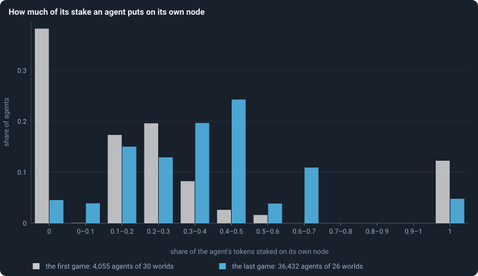
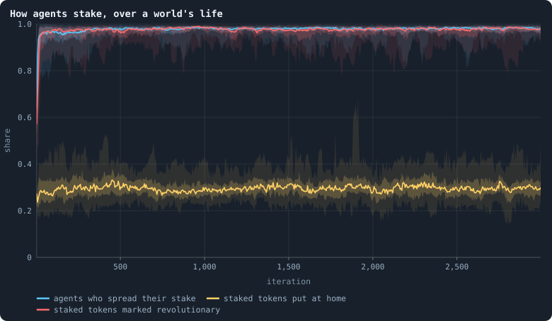
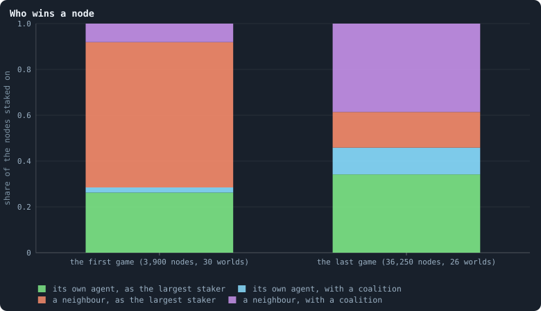
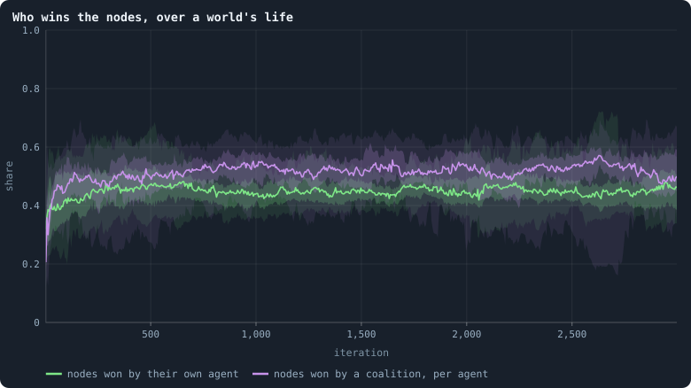
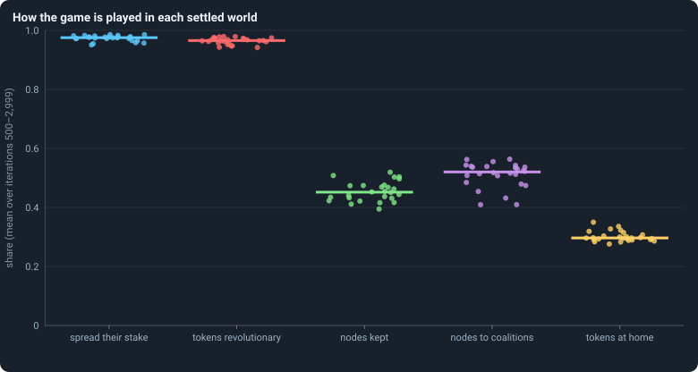

# How the game is played

The game is where tokens and brains change hands. Every agent stakes all its
tokens on itself and its neighbours, every node goes to the largest staker or
to a coalition, and the winner's brain is copied into the node
([Chapter 3](03-one-iteration.md)). The rules leave everything else to the
brains: how much to stake at home, whether to spread or go all in, how much
to mark revolutionary. This chapter looks at what the brains of the baseline
actually do.

> [!question] Questions of this chapter
> - How much of their tokens do agents stake on their own node?
> - Do they spread their stakes or put everything on one candidate?
> - Who wins the nodes — the agent living there, or a neighbour; the largest
>   staker, or a coalition?
> - Do the answers change between the founders' first game and a settled
>   world, and do the worlds agree?

<!-- runs E02 -->
> [!info] The runs behind this chapter
> **30 runs.** Every condition below is run once for every seed (1 to 30), for 3,000 iterations — or until its world dies out. Every setting is that of the baseline **B1** (the algorithm exactly as a new run is offered it) unless the condition changes it.
>
> - **baseline** — changes nothing: B1 as it is; 10,000 tokens. Runs `B1-10000-s001` … `B1-10000-s030`.
>
> To make these runs again: `python3 gol_lab.py run E02`, or ▶ in the Book tab of a computer running `gol_server.py`. Each run writes its settings, seed and engine version beside its frames, in `GraphOfLifeRuns/<run>/meta.json` and `provenance.json`.

> [!info]- Every setting of these runs
> | setting | baseline | what it is |
> |---|---|---|
> | [`total_tokens`](../notes/settings.md#total_tokens) | 10,000 | The number of tokens in the world, *T*. It never changes during a run. |
> | [`n_nodes`](../notes/settings.md#n_nodes) | 0 | How many founders the world starts with. 0 means one founder per hundred tokens: *n* = ⌊*T* / 100⌋. |
> | [`k_neighbors`](../notes/settings.md#k_neighbors) | 0 | How many neighbours each founder starts with in the ring. 0 means *k* = max(⌊*n* / 100⌋, 5); an odd *k* is wired as *k* − 1. |
> | [`rewire_p`](../notes/settings.md#rewire_p) | 0.2 | In the starting ring, the probability that a connection is moved to a founder chosen at random (Watts–Strogatz). |
> | [`hidden_layers`](../notes/settings.md#hidden_layers) | 50, 45, 40, 35, 30 | The widths of the brain's hidden layers, in order from input to output. |
> | [`brain_kind`](../notes/settings.md#brain_kind) | float16 | How weights are stored: `float` (64-bit), `float16` (16-bit, computed in 64-bit) or `binary` (−1, 0, +1). |
> | [`brain_bits`](../notes/settings.md#brain_bits) | 16 | Only for binary brains: how many input rows encode one number. Unused by float and float16 brains. |
> | [`message_amount`](../notes/settings.md#message_amount) | 30 | How many numbers one message holds. Each agent sends one message to itself and one to each neighbour, every phase. |
> | [`random_input_amount`](../notes/settings.md#random_input_amount) | 5 | How many random numbers, drawn uniformly from −2 to 2, a brain reads per neighbour, every time it looks. |
> | [`exchange_messages`](../notes/settings.md#exchange_messages) | on | Whether agents send and read messages at all. |
> | [`message_prepass`](../notes/settings.md#message_prepass) | on | Whether every phase begins with an extra look in which agents only write messages, so the look that acts reads messages written this phase. |
> | [`allow_handover`](../notes/settings.md#allow_handover) | on | Whether a parent may move some of its own connections to its newborn child. |
> | [`allow_revolutions`](../notes/settings.md#allow_revolutions) | on | Whether a coalition of smaller stakers can take a node from its largest staker (see the note *How a coalition takes a node*). |
> | [`allow_gifting`](../notes/settings.md#allow_gifting) | off | Whether agents may give tokens to neighbours during reproduction. Off in every run of this book. |
> | [`random_decisions`](../notes/settings.md#random_decisions) | off | The control: every number a brain would produce is replaced by a random draw from the standard normal distribution. |
> | [`prune_after`](../notes/settings.md#prune_after) | blotto | After which phase connections that carried no tokens are cut: `blotto` (the game), `reproduction`, or `both`. |
> | [`inactive_window`](../notes/settings.md#inactive_window) | phase | How long a connection may go unused: `phase` means it must carry tokens in the phase being judged; `iteration` allows the two last phases. |
> | [`redistribution`](../notes/settings.md#redistribution) | uniform | How the tokens of removed agents are shared: `uniform` gives every survivor the same chance at each token; `by_tokens` weights by what a survivor holds. |
> | [`tokens_created_per_phase`](../notes/settings.md#tokens_created_per_phase) | 0 | Tokens added to the world at every cleanup. 0 keeps the supply fixed. |
> | [`mutation_probability`](../notes/settings.md#mutation_probability) | 0.2 | The probability that a brain changes when it is copied to a child, and again, for every brain, after every game. |
> | [`mutation_noise_std`](../notes/settings.md#mutation_noise_std) | 0.2 | How large a change to one weight is: a normal draw with standard deviation this times 1/√(fan-in) of its layer. |
> | [`mutation_sparsity`](../notes/settings.md#mutation_sparsity) | 0.1 | The share of a brain's numbers a change touches; also the probability, for each weight matrix and bias vector, of a rarer reset that redraws that share of it. |
> | [`extinction_threshold`](../notes/settings.md#extinction_threshold) | 20 | A run stops, as extinct, when an iteration ends (after its game) with this many agents or fewer. |
> | seeds | 1 to 30 | one run per seed |
> | iterations | 3,000 | how far each run goes, unless its world dies first |
>
> A value in **bold** differs from the baseline B1.
<!-- /runs -->

## What the rules leave open

Three decisions per agent and game ([What a brain says](../notes/brain-outputs.md)):

1. **Spread or all in.** Either the agent splits its tokens over its
   candidates in proportion to its stake scores, or it puts all of them on
   the candidate with the highest score.
2. **How much at home.** Its own node is one of its candidates, so the share
   it stakes there follows from the scores — anything from nothing to
   everything ([Staking at home](../notes/home-stake.md)).
3. **How much is revolutionary.** Of what it stakes on each candidate, the
   share it marks revolutionary, which counts for a coalition against the
   largest staker ([How a coalition takes a node](../notes/revolution.md)).

## How much is staked at home

<!-- figure game/home-stake -->

**How much of its stake an agent puts on its own node.** For every agent that staked in a game: the share of its tokens it put on its own node. '0' and '1' are exact: nothing at home, everything at home. Grey: the game of iteration 0, played by the founders and their first children, whose brains no selection has touched yet. Blue: the game of iteration 2,999.

> [!example]- How to make this figure
> **Runs.** The 30 baseline runs `B1-10000-s001` … `B1-10000-s030`: the baseline B1 at 10,000 tokens, seeds 1 to 30, 3,000 iterations each (every setting is listed in [Chapter 8](08-thirty-worlds.md)). They are made with `python3 gol_lab.py run E02`.
>
> **Data.** From each run's frames, `GraphOfLifeRuns/<run>/frames/`, read with `gol_store.read_frame(run, index)`; frame `2·t` is iteration *t* after reproduction and frame `2·t + 1` after the game.
>
> 1. In the frames of iteration 0 and 2,999 with `phase` 2, read `decisions.allocations`: for each agent, `alloc[0]` is what it staked on its own node (its first target is itself) and `tokens` all it staked.
> 2. Put `alloc[0] / tokens` into the bins; divide each count by the number of agents.
>
> **To make it again:** `python3 book_figures.py game`.
<!-- /figure -->

The founders and their first children, with brains nobody selected, are
extreme: in the first game 38% of them put **nothing** on their own node, and
12% put **everything** there. By the last game both extremes have almost
gone — 4.6% stake nothing at home, 4.8% everything — and most agents put
between a tenth and two thirds of their tokens on their own node. The mean
share rose from 0.25 to 0.39.

Why do the bars in the last game have peaks? A question to keep in mind: an
agent holds few tokens — half of all agents hold 4 or fewer
([Chapter 13](13-where-do-the-tokens-go.md)) — and stakes whole tokens. An
agent with 3 tokens can only put 0, ⅓, ⅔ or all of them at home; one with 2,
only 0, ½ or all. So the shares cluster at simple fractions.

## How agents stake

<!-- figure game/doctrine -->

**How agents stake, over a world's life.** After every game of the 30 baseline worlds. Blue: the share of the agents that staked who spread their tokens over several candidates rather than putting all on one (`spreadShare`). Yellow: of all tokens staked, the share staked by agents on their own node (`selfAllocationShare`). Red: of all tokens staked, the share marked revolutionary (`revoltShare`). For each, the line is the median of the worlds at each iteration, the darker band holds the middle half of them (from the 25th to the 75th percentile) and the paler band nine in ten (5th to 95th) ([Bands](../notes/bands.md)).

> [!example]- How to make this figure
> **Runs.** The 30 baseline runs `B1-10000-s001` … `B1-10000-s030`: the baseline B1 at 10,000 tokens, seeds 1 to 30, 3,000 iterations each (every setting is listed in [Chapter 8](08-thirty-worlds.md)). They are made with `python3 gol_lab.py run E02`.
>
> **Data.** From each run's `GraphOfLifeRuns/<run>/stats.jsonl`, which holds one row per recorded phase: `phase` 1 is the world just after reproduction, `phase` 2 just after the game, and every statistic is a field of the row (see [What a run records](../notes/frames-and-stats.md)).
>
> 1. Take the rows with `phase` = 2 and the statistics `spreadShare`, `selfAllocationShare`, `revoltShare` (`a/b` is the row's `a` divided by its `b`; [Staking at home](../notes/home-stake.md) defines each).
> 2. Cut the iterations into stretches of 5 (600 stretches over 3,000 iterations) and take each world's mean in each stretch.
> 3. In each stretch, take the median, the 25th and 75th and the 5th and 95th percentiles of those means over the worlds that still have a value there (a world that died has none after its death).
>
> **To make it again:** `python3 book_figures.py game`.
<!-- /figure -->

Three shares, over the life of the worlds:

- **Spreading** becomes the rule. In the first game 49% of the agents that
  staked (in the median world) spread their tokens over several candidates —
  about what random brains give, since the choice turns on which of two
  random outputs is larger; from iteration 500 on, 97%.
- **Nearly every token is revolutionary.** The share of staked tokens marked
  revolutionary rose from 50% in the first game to 96%. So nearly every stake
  on a neighbour's node counts for a coalition against that node's largest
  staker.
- **Tokens at home**, counted as a share of all staked *tokens*, rose only a
  little, from 25% in the first game to 30%. It is lower than the average
  agent's share (0.39 in the last game, above) because each agent counts by
  its tokens here: the richer an agent, the smaller the share it keeps at
  home.

## Who wins the nodes

For every node on which anyone staked, there are four possible outcomes: it
is won by the agent living on it or by a neighbour, and the winner is either
the largest single staker or a member of a coalition that outweighed the
largest staker.

<!-- figure game/winners -->

**Who wins a node.** Every node on which anyone staked in the game, by who won it: the agent living on it (green and cyan) or one of its neighbours (orange and violet), and whether the winner was the largest single staker (green, orange) or the member of a coalition that outweighed the largest staker (cyan, violet; see [How a coalition takes a node](../notes/revolution.md)). Each column adds up to 1. Left: the game of iteration 0; right: the game of iteration 2,999.

> [!example]- How to make this figure
> **Runs.** The 30 baseline runs `B1-10000-s001` … `B1-10000-s030`: the baseline B1 at 10,000 tokens, seeds 1 to 30, 3,000 iterations each (every setting is listed in [Chapter 8](08-thirty-worlds.md)). They are made with `python3 gol_lab.py run E02`.
>
> **Data.** From each run's frames, `GraphOfLifeRuns/<run>/frames/`, read with `gol_store.read_frame(run, index)`; frame `2·t` is iteration *t* after reproduction and frame `2·t + 1` after the game.
>
> 1. Read frame 1 of each of the 30 runs (the game of iteration 0) and frame 5,999 of the 26 that reached it (the game of iteration 2,999).
> 2. For every entry of `decisions.winners`, note whether `winner` is the `node` itself, and whether `revolt` is true (the node was won by a coalition).
> 3. Count the four kinds over all runs of a column, divide by the number of entries, and stack them.
>
> **To make it again:** `python3 book_figures.py game`.
<!-- /figure -->

In the **first game**, 72% of the nodes went to a neighbour — almost all of
them (63% of all nodes) to a neighbour that simply staked the most there. The
founders' random brains staked heavily on others and left their own nodes
open.

In the **last game**, the agent living on a node won it 46% of the time —
34% as the largest staker, 12% with a coalition. Neighbours won 54%, and most
of them (39% of all nodes) as members of a coalition. **Coalitions decided
half of all nodes** (12% + 39%).

<!-- figure game/kept-taken -->

**Who wins the nodes, over a world's life.** After every game of the 30 baseline worlds. Green: of all nodes on which anyone staked, the share won by the agent living on it (`heldHomeShare`). Violet: the number of nodes won by a coalition, divided by the number of agents at the start of the game (`revolutions/nodes_before`). For each, the line is the median of the worlds at each iteration, the darker band holds the middle half of them (from the 25th to the 75th percentile) and the paler band nine in ten (5th to 95th) ([Bands](../notes/bands.md)).

> [!example]- How to make this figure
> **Runs.** The 30 baseline runs `B1-10000-s001` … `B1-10000-s030`: the baseline B1 at 10,000 tokens, seeds 1 to 30, 3,000 iterations each (every setting is listed in [Chapter 8](08-thirty-worlds.md)). They are made with `python3 gol_lab.py run E02`.
>
> **Data.** From each run's `GraphOfLifeRuns/<run>/stats.jsonl`, which holds one row per recorded phase: `phase` 1 is the world just after reproduction, `phase` 2 just after the game, and every statistic is a field of the row (see [What a run records](../notes/frames-and-stats.md)).
>
> 1. Take the rows with `phase` = 2 and the statistics `heldHomeShare`, `revolutions/nodes_before` (`a/b` is the row's `a` divided by its `b`; [Staking at home](../notes/home-stake.md) defines each).
> 2. Cut the iterations into stretches of 5 (600 stretches over 3,000 iterations) and take each world's mean in each stretch.
> 3. In each stretch, take the median, the 25th and 75th and the 5th and 95th percentiles of those means over the worlds that still have a value there (a world that died has none after its death).
>
> **To make it again:** `python3 book_figures.py game`.
<!-- /figure -->

The change happened in the first few hundred iterations and then held. From
iteration 500 on, the median world's agents kept their node in 45% of games,
and the number of nodes won by a coalition was 52% of the number of agents.

That 45% is an average over very different places.
[Chapter 20](20-where-the-tokens-flow.md) sorts the nodes by their
connections: an agent with one connection keeps its node in 73% of games, an
agent with fifty or more in only 2%. On a node with *d* connections, the agent
living there is one of *d* + 1 stakers, and it wins about as often as one of
them would — because agents spread their stakes almost evenly over everyone
they can reach. **Hubs are places, not individuals**: the brain on a hub is
replaced in nearly every game.

## Do the worlds agree?

<!-- figure game/settled -->

**How the game is played in each settled world.** One dot per world that lived to the end: its mean over iterations 500 to 2,999 of each statistic of the two figures above; the bar is the median of the 26. From left: the share of stakers who spread their stake, the share of staked tokens marked revolutionary, the share of nodes kept by their own agent, nodes won by a coalition per agent, and the share of staked tokens put at home. The dots are spread sideways only so that they do not hide each other.

> [!example]- How to make this figure
> **Runs.** The 26 surviving ones of the 30 baseline runs `B1-10000-s001` … `B1-10000-s030`: the baseline B1 at 10,000 tokens, seeds 1 to 30, 3,000 iterations each (every setting is listed in [Chapter 8](08-thirty-worlds.md)). They are made with `python3 gol_lab.py run E02`.
>
> **Data.** From each run's `GraphOfLifeRuns/<run>/stats.jsonl`, which holds one row per recorded phase: `phase` 1 is the world just after reproduction, `phase` 2 just after the game, and every statistic is a field of the row (see [What a run records](../notes/frames-and-stats.md)).
>
> 1. For each run, average each statistic over the rows with `phase` = 2 and 500 ≤ `iteration` ≤ 2,999.
> 2. Draw one dot per run and statistic, and a bar at the median.
>
> **To make it again:** `python3 book_figures.py game`.
<!-- /figure -->

Remarkably well. Over the settled life, every one of the 26 worlds has
between 95% and 99% of its stakers spreading and between 94% and 98% of its
staked tokens marked revolutionary. The share of nodes kept lies between 39%
and 52%, the nodes won by coalitions between 41% and 56% per agent, the tokens
at home between 28% and 35%. Whatever the founders started with, every world
ends up playing the game in much the same way.

## What this means

- **Brains spread mostly by conquest.** In a settled world of about 1,300
  agents, about 54% of nodes — some 700 — go to a neighbour in every game, and
  each takes on the winner's brain. Against that, about 40 children are born
  per iteration ([Chapter 11](11-births-deaths-and-ages.md)). A brain's
  descendants are mostly the nodes it conquers, not its children.
- **The game is a game of coalitions.** With 96% of staked tokens marked
  revolutionary, a node on which the other stakers together put more than its
  largest single staker did is, nearly always, won by one of them — which may
  be the agent living on it.
- **The stakes are nearly an even split.** [Chapter 20](20-where-the-tokens-flow.md)
  shows that agents stake on almost all of their candidates and keep a little
  more than an even share at home; a game moves tokens almost as a random walk
  would.
- **The behaviour converges.** Founders' random brains play every way there
  is; all 26 surviving worlds end up at nearly the same shares. Is that
  selection — brains that play otherwise losing their nodes — or would any
  way of copying and changing brains end there? [Chapter 30](30-do-the-brains-matter.md)
  compares worlds whose brains never change.

To make every figure of this chapter: `python3 book_figures.py game`.

<!-- turns -->
---

← [Chapter 13 · Where do the tokens go?](13-where-do-the-tokens-go.md) · [Contents](../README.md) · [Chapter 15 · What shape does the network take?](15-what-shape-does-the-network-take.md) →
<!-- /turns -->
