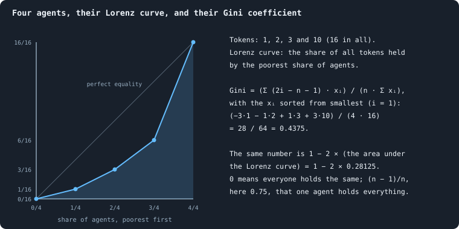
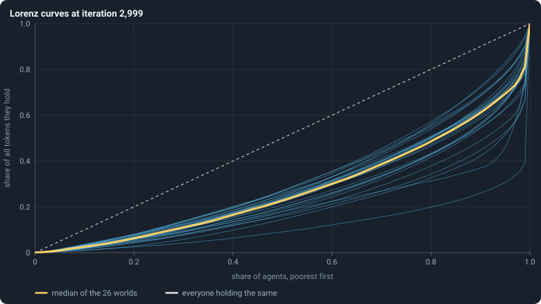
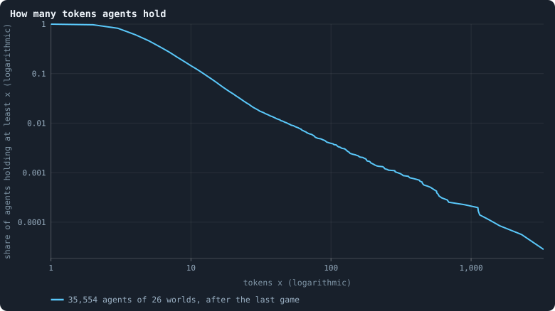
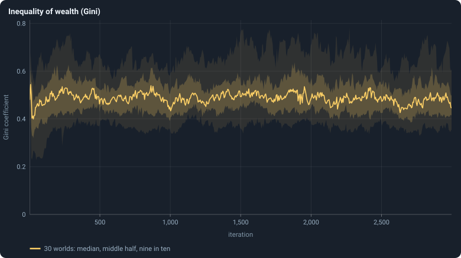
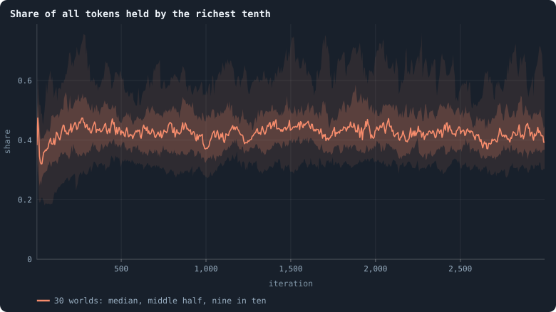
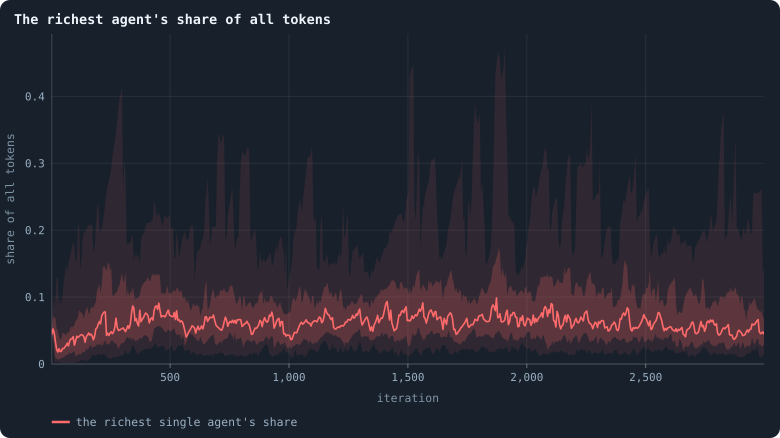
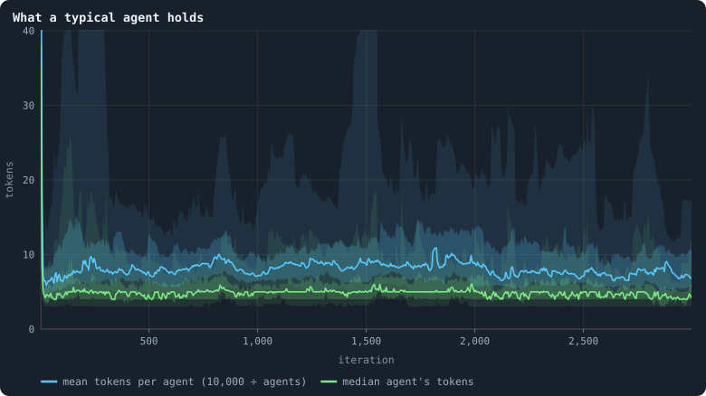
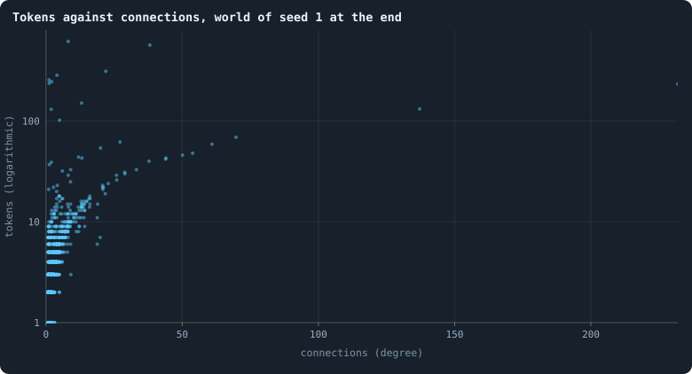
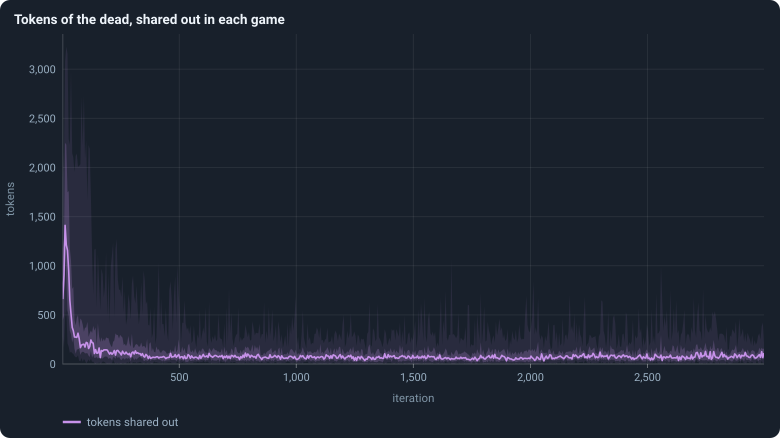

# Where do the tokens go?

Tokens are the only thing of value in a world, and the only thing conserved.
The founders start exactly equal: a hundred tokens each.

> [!question] Questions of this chapter
> - Who holds the tokens later? How unequal does a world become?
> - Does inequality keep growing, or does it settle?
> - Are the rich agents special in some way we can see?

<!-- runs E04 -->
> [!info] The runs behind this chapter
> These are the runs of Experiment 2; nothing new was run for this chapter.
>
> **30 runs.** Every condition below is run once for every seed (1 to 30), for 3,000 iterations — or until its world dies out. Every setting is that of the baseline **B1** (the algorithm exactly as a new run is offered it) unless the condition changes it.
>
> - **baseline** — changes nothing: B1 as it is; 10,000 tokens. Runs `B1-10000-s001` … `B1-10000-s030`.
>
> To make these runs again: `python3 gol_lab.py run E02`, or ▶ in the Book tab of a computer running `gol_server.py`. Each run writes its settings, seed and engine version beside its frames, in `GraphOfLifeRuns/<run>/meta.json` and `provenance.json`.

> [!info]- Every setting of these runs
> | setting | baseline | what it is |
> |---|---|---|
> | [`total_tokens`](../notes/settings.md#total_tokens) | 10,000 | The number of tokens in the world, *T*. It never changes during a run. |
> | [`n_nodes`](../notes/settings.md#n_nodes) | 0 | How many founders the world starts with. 0 means one founder per hundred tokens: *n* = ⌊*T* / 100⌋. |
> | [`k_neighbors`](../notes/settings.md#k_neighbors) | 0 | How many neighbours each founder starts with in the ring. 0 means *k* = max(⌊*n* / 100⌋, 5); an odd *k* is wired as *k* − 1. |
> | [`rewire_p`](../notes/settings.md#rewire_p) | 0.2 | In the starting ring, the probability that a connection is moved to a founder chosen at random (Watts–Strogatz). |
> | [`hidden_layers`](../notes/settings.md#hidden_layers) | 50, 45, 40, 35, 30 | The widths of the brain's hidden layers, in order from input to output. |
> | [`brain_kind`](../notes/settings.md#brain_kind) | float16 | How weights are stored: `float` (64-bit), `float16` (16-bit, computed in 64-bit) or `binary` (−1, 0, +1). |
> | [`brain_bits`](../notes/settings.md#brain_bits) | 16 | Only for binary brains: how many input rows encode one number. Unused by float and float16 brains. |
> | [`message_amount`](../notes/settings.md#message_amount) | 30 | How many numbers one message holds. Each agent sends one message to itself and one to each neighbour, every phase. |
> | [`random_input_amount`](../notes/settings.md#random_input_amount) | 5 | How many random numbers, drawn uniformly from −2 to 2, a brain reads per neighbour, every time it looks. |
> | [`exchange_messages`](../notes/settings.md#exchange_messages) | on | Whether agents send and read messages at all. |
> | [`message_prepass`](../notes/settings.md#message_prepass) | on | Whether every phase begins with an extra look in which agents only write messages, so the look that acts reads messages written this phase. |
> | [`allow_handover`](../notes/settings.md#allow_handover) | on | Whether a parent may move some of its own connections to its newborn child. |
> | [`allow_revolutions`](../notes/settings.md#allow_revolutions) | on | Whether a coalition of smaller stakers can take a node from its largest staker (see the note *How a coalition takes a node*). |
> | [`allow_gifting`](../notes/settings.md#allow_gifting) | off | Whether agents may give tokens to neighbours during reproduction. Off in every run of this book. |
> | [`random_decisions`](../notes/settings.md#random_decisions) | off | The control: every number a brain would produce is replaced by a random draw from the standard normal distribution. |
> | [`prune_after`](../notes/settings.md#prune_after) | blotto | After which phase connections that carried no tokens are cut: `blotto` (the game), `reproduction`, or `both`. |
> | [`inactive_window`](../notes/settings.md#inactive_window) | phase | How long a connection may go unused: `phase` means it must carry tokens in the phase being judged; `iteration` allows the two last phases. |
> | [`redistribution`](../notes/settings.md#redistribution) | uniform | How the tokens of removed agents are shared: `uniform` gives every survivor the same chance at each token; `by_tokens` weights by what a survivor holds. |
> | [`tokens_created_per_phase`](../notes/settings.md#tokens_created_per_phase) | 0 | Tokens added to the world at every cleanup. 0 keeps the supply fixed. |
> | [`mutation_probability`](../notes/settings.md#mutation_probability) | 0.2 | The probability that a brain changes when it is copied to a child, and again, for every brain, after every game. |
> | [`mutation_noise_std`](../notes/settings.md#mutation_noise_std) | 0.2 | How large a change to one weight is: a normal draw with standard deviation this times 1/√(fan-in) of its layer. |
> | [`mutation_sparsity`](../notes/settings.md#mutation_sparsity) | 0.1 | The share of a brain's numbers a change touches; also the probability, for each weight matrix and bias vector, of a rarer reset that redraws that share of it. |
> | [`extinction_threshold`](../notes/settings.md#extinction_threshold) | 20 | A run stops, as extinct, when an iteration ends (after its game) with this many agents or fewer. |
> | seeds | 1 to 30 | one run per seed |
> | iterations | 3,000 | how far each run goes, unless its world dies first |
>
> A value in **bold** differs from the baseline B1.
<!-- /runs -->

## Measuring inequality

How do we measure inequality? Sort a world's agents from poorest to richest,
and draw, for every share *x* of the agents counted from the poorest, the
share of all tokens they hold:
that is the **Lorenz curve** (Lorenz 1905). If everyone holds the same, it is
the diagonal; the more unequal the world, the further it sags below. The
**Gini coefficient** (Gini 1912) turns the sag into one number between 0
(everyone the same) and almost 1 (one agent holds everything):

For *n* agents with tokens sorted from smallest, *x*₍₁₎ ≤ … ≤ *x*₍ₙ₎,

$$
G = \frac{\sum_{i=1}^{n} (2i - n - 1)\, x_{(i)}}{n \sum_{i=1}^{n} x_{(i)}} ,
$$

which equals 1 minus twice the area under the Lorenz curve. A Gini of 0.5 has
a concrete meaning: two agents picked at random differ, on average, by as much
as the average agent holds. [The Gini coefficient](../notes/gini-coefficient.md)
shows why, and works an example by hand.

## The Lorenz curves of the worlds

<!-- figure tokens/lorenz -->

**Lorenz curves at iteration 2,999.** For each of the 26 surviving worlds (thin blue lines), after its last game: the poorest share x of its agents holds the share y of all tokens. The yellow line is the median over the worlds at each x; the dashed diagonal is a world where everyone holds the same. The further a curve sags below the diagonal, the more unequal the world ([Chapter 5](05-how-worlds-are-measured.md), and the diagram there).

> [!example]- How to make this figure
> **Runs.** The 26 surviving ones of the 30 baseline runs `B1-10000-s001` … `B1-10000-s030`: the baseline B1 at 10,000 tokens, seeds 1 to 30, 3,000 iterations each (every setting is listed in [Chapter 9](09-thirty-worlds.md)). They are made with `python3 gol_lab.py run E02`.
>
> **Data.** From each run's frames, `GraphOfLifeRuns/<run>/frames/`, read with `gol_store.read_frame(run, index)`; frame `2·t` is iteration *t* after reproduction and frame `2·t + 1` after the game.
>
> 1. Read each run's last frame (iteration 2,999, `phase` 2) and its `tokens`.
> 2. Sort the tokens from smallest to largest; the curve passes through the points (i / n, (t₁ + … + tᵢ) / T) for i = 0 … n.
> 3. Interpolate each curve at x = 0, 0.01, …, 1 and take the median there.
>
> **To make it again:** `python3 book_figures.py tokens`.
<!-- /figure -->

After the last game of the 26 surviving worlds, in the median world the poorest
half of the agents hold 23% of all tokens; the poorest 80% hold 49%, so the
richest fifth hold 51%; and the richest tenth hold 39%. The worlds' curves lie
close together.

## How many tokens an agent holds

<!-- figure tokens/distribution -->

**How many tokens agents hold.** Of all agents alive after the last game of the 26 surviving worlds, the share that hold at least x tokens, for every x. Both axes are logarithmic: a straight falling line here would be a power law.

> [!example]- How to make this figure
> **Runs.** The 26 surviving ones of the 30 baseline runs `B1-10000-s001` … `B1-10000-s030`: the baseline B1 at 10,000 tokens, seeds 1 to 30, 3,000 iterations each (every setting is listed in [Chapter 9](09-thirty-worlds.md)). They are made with `python3 gol_lab.py run E02`.
>
> **Data.** From each run's frames, `GraphOfLifeRuns/<run>/frames/`, read with `gol_store.read_frame(run, index)`; frame `2·t` is iteration *t* after reproduction and frame `2·t + 1` after the game.
>
> 1. Pool the `tokens` of the last frame of every run.
> 2. For every value x that occurs, the share of agents with at least x tokens.
>
> **To make it again:** `python3 book_figures.py tokens`.
<!-- /figure -->

Of the 35,554 agents alive at the end, half hold 4 tokens or fewer (65% hold
5 or fewer), 3% hold exactly one, and 0.4% hold 100 or more; the richest agent
of all held 3,296 tokens. The mean is 7.3. On logarithmic axes the curve falls
slowly at first and then faster and faster: there is no straight stretch of
the kind a power law would make.

## Inequality over time

<!-- figure tokens/gini -->

**Inequality of wealth (Gini).** After every game. The line is the median of the worlds at each iteration, the darker band holds the middle half of them (from the 25th to the 75th percentile) and the paler band nine in ten (5th to 95th).

> [!example]- How to make this figure
> **Runs.** The 30 baseline runs `B1-10000-s001` … `B1-10000-s030`: the baseline B1 at 10,000 tokens, seeds 1 to 30, 3,000 iterations each (every setting is listed in [Chapter 9](09-thirty-worlds.md)). They are made with `python3 gol_lab.py run E02`.
>
> **Data.** From each run's `GraphOfLifeRuns/<run>/stats.jsonl`, which holds one row per recorded phase: `phase` 1 is the world just after reproduction, `phase` 2 just after the game, and every statistic is a field of the row (see [What a run records](../notes/frames-and-stats.md)).
>
> 1. Take every run's rows with `phase` = 2 and the statistic `gini` ([What a run records](../notes/frames-and-stats.md)).
> 2. Cut the iterations into stretches of 5 (600 stretches over 3,000 iterations) and take each world's mean in each stretch.
> 3. In each stretch, take the median, the 25th and 75th and the 5th and 95th percentiles of those means over the worlds that still have a value there (a world that died has none after its death).
>
> **To make it again:** `python3 book_figures.py tokens`.
<!-- /figure -->

The founders are equal, but the first reproduction phase ends that: a child
gets only part of its parent's tokens. In the first five iterations the median
world's Gini is already 0.48. Over the settled life, iterations 500 to 2,999,
the median world's average is 0.49, and the 26 worlds lie between 0.42 and
0.55. Inequality appears at once and then neither grows nor shrinks.

<!-- figure tokens/rich-tenth -->

**Share of all tokens held by the richest tenth.** After every game. The line is the median of the worlds at each iteration, the darker band holds the middle half of them (from the 25th to the 75th percentile) and the paler band nine in ten (5th to 95th).

> [!example]- How to make this figure
> **Runs.** The 30 baseline runs `B1-10000-s001` … `B1-10000-s030`: the baseline B1 at 10,000 tokens, seeds 1 to 30, 3,000 iterations each (every setting is listed in [Chapter 9](09-thirty-worlds.md)). They are made with `python3 gol_lab.py run E02`.
>
> **Data.** From each run's `GraphOfLifeRuns/<run>/stats.jsonl`, which holds one row per recorded phase: `phase` 1 is the world just after reproduction, `phase` 2 just after the game, and every statistic is a field of the row (see [What a run records](../notes/frames-and-stats.md)).
>
> 1. Take every run's rows with `phase` = 2 and the statistic `topDecileShare` ([What a run records](../notes/frames-and-stats.md)).
> 2. Cut the iterations into stretches of 5 (600 stretches over 3,000 iterations) and take each world's mean in each stretch.
> 3. In each stretch, take the median, the 25th and 75th and the 5th and 95th percentiles of those means over the worlds that still have a value there (a world that died has none after its death).
>
> **To make it again:** `python3 book_figures.py tokens`.
<!-- /figure -->

<!-- figure tokens/richest -->

**The richest agent's share of all tokens.** After every game, the tokens of the richest agent divided by all 10,000. The line is the median of the worlds at each iteration, the darker band holds the middle half of them (from the 25th to the 75th percentile) and the paler band nine in ten (5th to 95th).

> [!example]- How to make this figure
> **Runs.** The 30 baseline runs `B1-10000-s001` … `B1-10000-s030`: the baseline B1 at 10,000 tokens, seeds 1 to 30, 3,000 iterations each (every setting is listed in [Chapter 9](09-thirty-worlds.md)). They are made with `python3 gol_lab.py run E02`.
>
> **Data.** From each run's `GraphOfLifeRuns/<run>/stats.jsonl`, which holds one row per recorded phase: `phase` 1 is the world just after reproduction, `phase` 2 just after the game, and every statistic is a field of the row (see [What a run records](../notes/frames-and-stats.md)).
>
> 1. Take the rows with `phase` = 2; divide `maxTokens` by 10,000.
> 2. Cut the iterations into stretches of 5 (600 stretches over 3,000 iterations) and take each world's mean in each stretch.
> 3. In each stretch, take the median, the 25th and 75th and the 5th and 95th percentiles of those means over the worlds that still have a value there (a world that died has none after its death).
>
> **To make it again:** `python3 book_figures.py tokens`.
<!-- /figure -->

The richest tenth ([The richest tenth's share](../notes/richest-tenth.md))
hold on average 44% of all tokens over the settled life (36% to 51% between
worlds); the single richest agent holds about 8% (from 5% to 13%).

<!-- figure tokens/typical -->

**What a typical agent holds.** After every game: the mean number of tokens per agent, which is 10,000 divided by the number of agents (blue), and the median agent's tokens (green). The median lies below the mean because a few agents hold a lot. The line is the median of the worlds at each iteration, the darker band holds the middle half of them (from the 25th to the 75th percentile) and the paler band nine in ten (5th to 95th).

> [!example]- How to make this figure
> **Runs.** The 30 baseline runs `B1-10000-s001` … `B1-10000-s030`: the baseline B1 at 10,000 tokens, seeds 1 to 30, 3,000 iterations each (every setting is listed in [Chapter 9](09-thirty-worlds.md)). They are made with `python3 gol_lab.py run E02`.
>
> **Data.** From each run's `GraphOfLifeRuns/<run>/stats.jsonl`, which holds one row per recorded phase: `phase` 1 is the world just after reproduction, `phase` 2 just after the game, and every statistic is a field of the row (see [What a run records](../notes/frames-and-stats.md)).
>
> 1. Take the rows with `phase` = 2 and the statistics `meanTokens` and `medianTokens`.
> 2. Cut the iterations into stretches of 5 (600 stretches over 3,000 iterations) and take each world's mean in each stretch.
> 3. In each stretch, take the median, the 25th and 75th and the 5th and 95th percentiles of those means over the worlds that still have a value there (a world that died has none after its death).
>
> **To make it again:** `python3 book_figures.py tokens`.
<!-- /figure -->

The mean number of tokens per agent is 10,000 divided by the number of agents,
about 9 in the median world over its settled life; the median agent holds
about 5. The median lies below the mean because a few agents hold a lot.

## Rich agents are connected agents

<!-- figure tokens/tokens-degree -->

**Tokens against connections, world of seed 1 at the end.** Each dot is one of the 1,336 agents alive after the last game of the world with seed 1: how many connections it has (spread sideways a little so that agents with the same number do not hide each other) and how many tokens it holds.

> [!example]- How to make this figure
> **Runs.** `B1-10000-s001`.
>
> **Data.** From each run's frames, `GraphOfLifeRuns/<run>/frames/`, read with `gol_store.read_frame(run, index)`; frame `2·t` is iteration *t* after reproduction and frame `2·t + 1` after the game.
>
> 1. Read the last frame (iteration 2,999, `phase` 2); count each agent's connections in `edges`.
> 2. Plot `tokens` against that count, one dot per agent.
>
> **To make it again:** `python3 book_figures.py tokens`.
<!-- /figure -->

In the world with seed 1 at the end, agents with more connections hold more
tokens: the median agent with one connection holds 2 tokens, with four 5,
with nine 10, with thirteen 14. (The correlation between the number of
connections and the logarithm of the tokens is 0.50.) The game explains the
direction of this: an agent gets every token staked on its node, and an agent
with more neighbours can be staked on by more of them. Whether connections
make agents rich, or rich agents attract connections, this figure cannot say.

Part III found the law behind it. Agents spread their stakes nearly evenly
over their own node and their neighbours' ([Chapter 27](27-where-the-tokens-flow.md)),
and stakes spread that way move tokens like a random walk, which comes to rest
when every agent holds tokens in proportion to its connections **plus one**.
The median agent of every class of connections holds close to that resting
share ([Chapter 30](30-how-properties-scale-together.md)). So, in the main,
connections make agents rich — and a rich agent with few connections drains
back to its share within a few games ([Chapter 26](26-gains-and-losses.md)).

## The tokens of the dead

<!-- figure tokens/shared-out -->

**Tokens of the dead, shared out in each game.** In the cleanup of every game, the tokens of the agents removed — those cut off from the largest piece; agents that starved hold none — which are shared out at random among the survivors. The line is the median of the worlds at each iteration, the darker band holds the middle half of them (from the 25th to the 75th percentile) and the paler band nine in ten (5th to 95th).

> [!example]- How to make this figure
> **Runs.** The 30 baseline runs `B1-10000-s001` … `B1-10000-s030`: the baseline B1 at 10,000 tokens, seeds 1 to 30, 3,000 iterations each (every setting is listed in [Chapter 9](09-thirty-worlds.md)). They are made with `python3 gol_lab.py run E02`.
>
> **Data.** From each run's `GraphOfLifeRuns/<run>/stats.jsonl`, which holds one row per recorded phase: `phase` 1 is the world just after reproduction, `phase` 2 just after the game, and every statistic is a field of the row (see [What a run records](../notes/frames-and-stats.md)).
>
> 1. Take the rows with `phase` = 2 and the statistic `redistributed`.
> 2. Cut the iterations into stretches of 5 (600 stretches over 3,000 iterations) and take each world's mean in each stretch.
> 3. In each stretch, take the median, the 25th and 75th and the 5th and 95th percentiles of those means over the worlds that still have a value there (a world that died has none after its death).
>
> **To make it again:** `python3 book_figures.py tokens`.
<!-- /figure -->

When agents are cut off, their tokens are shared out among the survivors. In
the median settled world, that is about 110 tokens per game — 1.1% of all
tokens, handed out at random, one token at a time.

## What was expected

Before the runs, as Experiment 4:

<!-- thesis E04 -->
> [!quote] The thesis of Experiment 4, written down before any of its runs existed
> **The claim.** Tokens pool. The founders start exactly equal, and within a hundred iterations the richest tenth of agents hold more than 40% of all tokens, with a Gini coefficient above 0.5 — and it stays that way. Most of what an agent stakes in the game it stakes on its own node.
>
> **Why it would be so.** A node goes to whoever stakes most on it, and the winner takes everything staked there, so being big makes it easier to become bigger. Staking on your own node is the one stake that is never lost to someone else's brain. The shared-out tokens of the dead pull the other way, but only a little.
>
> **It holds if:** From iteration 100 on, the median Gini across the thirty runs is above 0.5 and the richest tenth hold more than 40% of the tokens, and the median share of tokens staked at home is above one half.
>
> **It fails if:** Wealth stays close to even (Gini below 0.3), or concentrates and then evens out again, or agents stake most of their tokens on their neighbours. Then the game is not a winner-takes-all contest, and what keeps wealth spread out is worth its own chapter.
<!-- /thesis -->

Checked from iteration 100 on, as planned: the median world's average Gini was
0.496, just below the 0.5 asked for (10 of 26 worlds were above it); the
richest tenth held 44% (23 of 26 above 40%) — that part holds; and agents put a
median 30% of what they staked on their own node, in no world more than 34% —
far from the half the thesis expected. So the thesis is refuted, and refuted
mostly in its explanation: wealth pools moderately and stays steady, but not
because agents defend their own nodes. [Chapter 15](15-how-the-game-is-played.md) looks at how the game is
played instead.

To make every figure of this chapter: `python3 book_figures.py tokens`.

<!-- turns -->
---

← [Chapter 13 · How much does the seed decide?](13-how-much-does-the-seed-decide.md) · [Contents](../README.md) · [Chapter 15 · How the game is played](15-how-the-game-is-played.md) →
<!-- /turns -->
