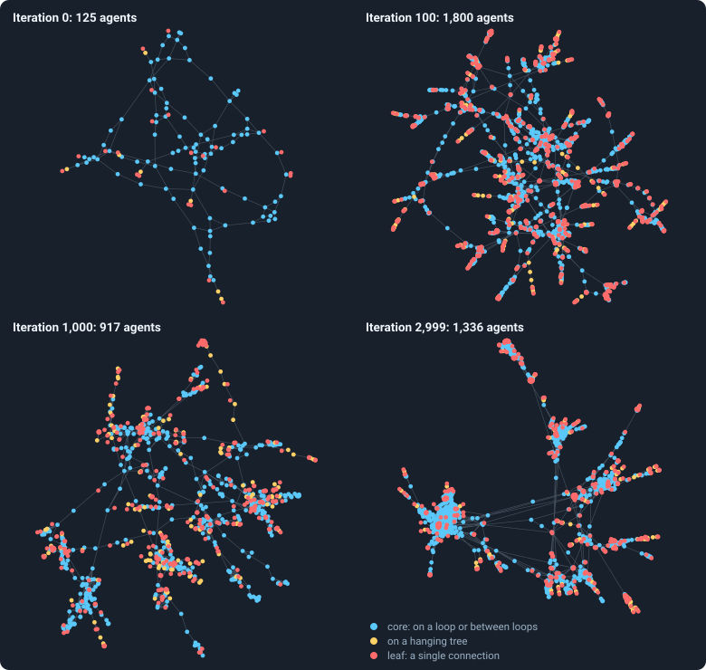
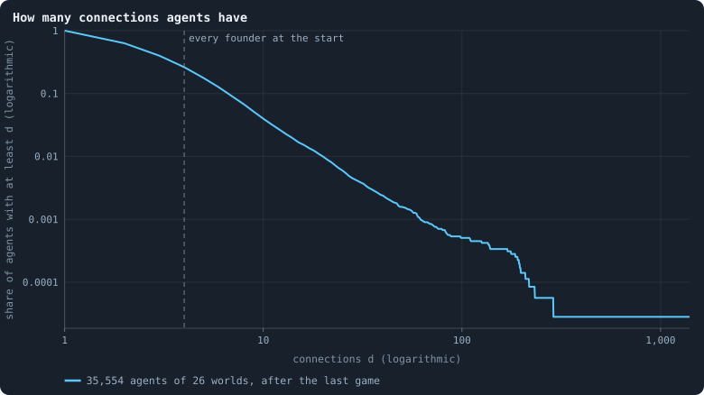
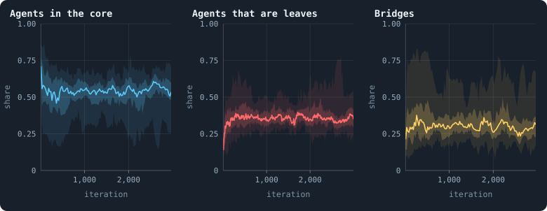
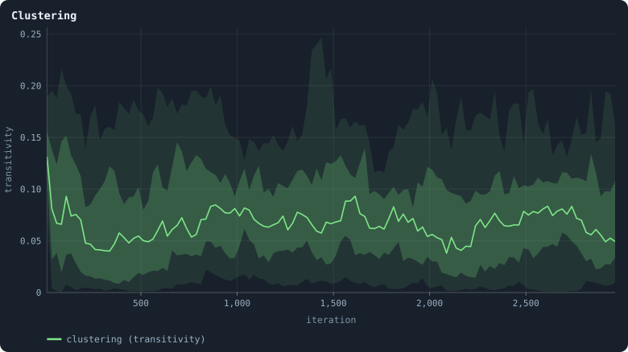
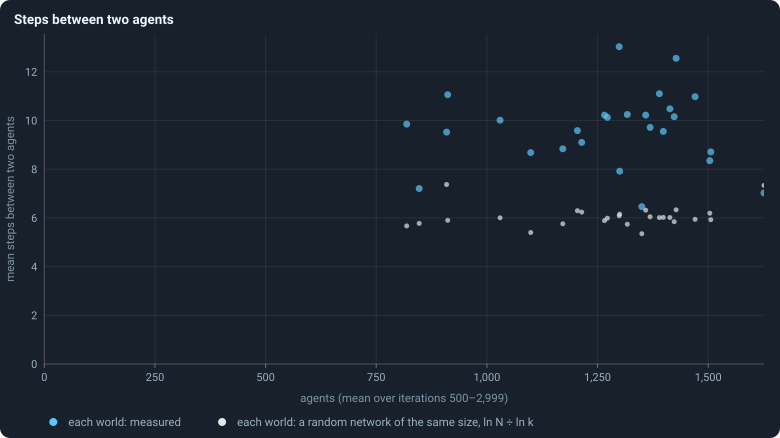

# What shape does the network take?

The founders start on a small-world ring ([Chapter 2](02-the-world.md)). From
then on the agents themselves make and lose every connection: a child is
joined to some of its parent's candidates, a parent may hand connections to
it, and every connection that carries no tokens in a game is cut at its end
([Chapter 3](03-one-iteration.md)). Nothing in the rules aims at any shape.
So what shape comes out?

> [!question] Questions of this chapter
> - What happens to the founders' ring?
> - How many connections does an agent have, and how unequally are they
>   spread?
> - Is the network a tree, a web, or something in between?
> - How far apart are two agents?

<!-- runs E05 -->
> [!info] The runs behind this chapter
> These are the runs of Experiment 2; nothing new was run for this chapter.
>
> **30 runs.** Every condition below is run once for every seed (1 to 30), for 3,000 iterations — or until its world dies out. Every setting is that of the baseline **B1** (the algorithm exactly as a new run is offered it) unless the condition changes it.
>
> - **baseline** — changes nothing: B1 as it is; 10,000 tokens. Runs `B1-10000-s001` … `B1-10000-s030`.
>
> To make these runs again: `python3 gol_lab.py run E02`, or ▶ in the Book tab of a computer running `gol_server.py`. Each run writes its settings, seed and engine version beside its frames, in `GraphOfLifeRuns/<run>/meta.json` and `provenance.json`.

> [!info]- Every setting of these runs
> | setting | baseline | what it is |
> |---|---|---|
> | [`total_tokens`](../notes/settings.md#total_tokens) | 10,000 | The number of tokens in the world, *T*. It never changes during a run. |
> | [`n_nodes`](../notes/settings.md#n_nodes) | 0 | How many founders the world starts with. 0 means one founder per hundred tokens: *n* = ⌊*T* / 100⌋. |
> | [`k_neighbors`](../notes/settings.md#k_neighbors) | 0 | How many neighbours each founder starts with in the ring. 0 means *k* = max(⌊*n* / 100⌋, 5); an odd *k* is wired as *k* − 1. |
> | [`rewire_p`](../notes/settings.md#rewire_p) | 0.2 | In the starting ring, the probability that a connection is moved to a founder chosen at random (Watts–Strogatz). |
> | [`hidden_layers`](../notes/settings.md#hidden_layers) | 50, 45, 40, 35, 30 | The widths of the brain's hidden layers, in order from input to output. |
> | [`brain_kind`](../notes/settings.md#brain_kind) | float16 | How weights are stored: `float` (64-bit), `float16` (16-bit, computed in 64-bit) or `binary` (−1, 0, +1). |
> | [`brain_bits`](../notes/settings.md#brain_bits) | 16 | Only for binary brains: how many input rows encode one number. Unused by float and float16 brains. |
> | [`message_amount`](../notes/settings.md#message_amount) | 30 | How many numbers one message holds. Each agent sends one message to itself and one to each neighbour, every phase. |
> | [`random_input_amount`](../notes/settings.md#random_input_amount) | 5 | How many random numbers, drawn uniformly from −2 to 2, a brain reads per neighbour, every time it looks. |
> | [`exchange_messages`](../notes/settings.md#exchange_messages) | on | Whether agents send and read messages at all. |
> | [`message_prepass`](../notes/settings.md#message_prepass) | on | Whether every phase begins with an extra look in which agents only write messages, so the look that acts reads messages written this phase. |
> | [`allow_handover`](../notes/settings.md#allow_handover) | on | Whether a parent may move some of its own connections to its newborn child. |
> | [`allow_revolutions`](../notes/settings.md#allow_revolutions) | on | Whether a coalition of smaller stakers can take a node from its largest staker (see the note *How a coalition takes a node*). |
> | [`allow_gifting`](../notes/settings.md#allow_gifting) | off | Whether agents may give tokens to neighbours during reproduction. Off in every run of this book. |
> | [`random_decisions`](../notes/settings.md#random_decisions) | off | The control: every number a brain would produce is replaced by a random draw from the standard normal distribution. |
> | [`prune_after`](../notes/settings.md#prune_after) | blotto | After which phase connections that carried no tokens are cut: `blotto` (the game), `reproduction`, or `both`. |
> | [`inactive_window`](../notes/settings.md#inactive_window) | phase | How long a connection may go unused: `phase` means it must carry tokens in the phase being judged; `iteration` allows the two last phases. |
> | [`redistribution`](../notes/settings.md#redistribution) | uniform | How the tokens of removed agents are shared: `uniform` gives every survivor the same chance at each token; `by_tokens` weights by what a survivor holds. |
> | [`tokens_created_per_phase`](../notes/settings.md#tokens_created_per_phase) | 0 | Tokens added to the world at every cleanup. 0 keeps the supply fixed. |
> | [`mutation_probability`](../notes/settings.md#mutation_probability) | 0.2 | The probability that a brain changes when it is copied to a child, and again, for every brain, after every game. |
> | [`mutation_noise_std`](../notes/settings.md#mutation_noise_std) | 0.2 | How large a change to one weight is: a normal draw with standard deviation this times 1/√(fan-in) of its layer. |
> | [`mutation_sparsity`](../notes/settings.md#mutation_sparsity) | 0.1 | The share of a brain's numbers a change touches; also the probability, for each weight matrix and bias vector, of a rarer reset that redraws that share of it. |
> | [`extinction_threshold`](../notes/settings.md#extinction_threshold) | 20 | A run stops, as extinct, when an iteration ends (after its game) with this many agents or fewer. |
> | seeds | 1 to 30 | one run per seed |
> | iterations | 3,000 | how far each run goes, unless its world dies first |
>
> A value in **bold** differs from the baseline B1.
<!-- /runs -->

## One world, four moments

<!-- figure shape/worlds -->

**One world at four moments.** The world with seed 1 after the games of iterations 0, 100, 1,000 and 2,999. Every agent alive is a dot, every connection a line. Blue: agents in the core, which is what is left when agents with one connection or none are removed again and again until none remains ([Core, trees and leaves](../notes/core-trees-leaves.md)); yellow: the rest of the hanging trees; red: leaves, agents with a single connection. Where a dot is drawn means nothing in itself: a layout (networkx's ForceAtlas2, seed 1) pulls joined agents together and pushes the rest apart.

> [!example]- How to make this figure
> **Runs.** `B1-10000-s001`, one of the 30 baseline runs.
>
> **Data.** From each run's frames, `GraphOfLifeRuns/<run>/frames/`, read with `gol_store.read_frame(run, index)`; frame `2·t` is iteration *t* after reproduction and frame `2·t + 1` after the game.
>
> 1. Read frames `1`, `201`, `2001` and `5999` (iterations 0, 100, 1,000 and 2,999, after the game): `ids` and `edges`.
> 2. Peel: remove every agent with one connection or none, again and again, until none is left; the agents never removed are the core. Leaves are agents with exactly one connection.
> 3. Lay the graph out with `networkx.forceatlas2_layout(G, max_iter=200, seed=1)`.
>
> **To make it again:** `python3 book_figures.py shape`.
<!-- /figure -->

The pictures colour every agent by its place in the network
([Core, trees and leaves](../notes/core-trees-leaves.md)): blue for the
**core**, where every agent lies on a loop or on a path between loops; red
for **leaves**, agents with a single connection; yellow for the agents in
between, on trees that hang off the core.

After the first game, the founders and their first children (125 agents)
still form one loose web — 76% of them in the core. A hundred iterations
later the world has 1,800 agents, and its picture has changed character:
dense knots of core, joined by thin strands, with leaves bunched at their
ends. At iterations 1,000 and 2,999 it looks the same in kind: about half of
all agents in the core, a third or more leaves.

## Connections per agent

<!-- figure shape/degree -->

**How many connections agents have.** Of all agents alive after the last game of the 26 surviving worlds, the share that have at least d connections, for every d. At the start every founder had exactly four (the grey line).

> [!example]- How to make this figure
> **Runs.** The 26 surviving ones of the 30 baseline runs `B1-10000-s001` … `B1-10000-s030`: the baseline B1 at 10,000 tokens, seeds 1 to 30, 3,000 iterations each (every setting is listed in [Chapter 8](08-thirty-worlds.md)). They are made with `python3 gol_lab.py run E02`.
>
> **Data.** From each run's frames, `GraphOfLifeRuns/<run>/frames/`, read with `gol_store.read_frame(run, index)`; frame `2·t` is iteration *t* after reproduction and frame `2·t + 1` after the game.
>
> 1. Count every agent's connections in the last frame's `edges`; pool the 26 runs.
> 2. For d = 1, 2, …, the share of agents with at least d.
>
> **To make it again:** `python3 book_figures.py shape`.
<!-- /figure -->

The figure is a complementary cumulative distribution on logarithmic axes
([Degree](../notes/degree.md), [Logarithmic axes](../notes/logarithmic-axes.md)):
for every *d*, the share of agents with at least *d* connections. After the
last game of the 26 worlds that lived to the end, 37% of all agents have
exactly one connection and 23% two; the mean is 3.2. But 4% have ten or more,
and the curve reaches out to an agent with 1,399. Every founder started with
exactly four.

So the network is very unequal in connections: most agents have one or two,
a few are **hubs** joined to hundreds. The curve bends downward on the
log–log axes rather than running straight, so it is not a clean power law.

## Core, leaves and bridges

<!-- figure shape/structure -->

**Core, leaves and bridges.** Three shares, after every game of the 30 baseline worlds. Left: the share of agents in the core ([Core, trees and leaves](../notes/core-trees-leaves.md)), measured every 25 iterations. Middle: the share of agents with exactly one connection, after every game. Right: the share of connections that are bridges ([Bridges](../notes/bridges.md)), every 25 iterations. In each, the line is the median of the worlds at each iteration, the darker band holds the middle half of them (from the 25th to the 75th percentile) and the paler band nine in ten (5th to 95th).

> [!example]- How to make this figure
> **Runs.** The 30 baseline runs `B1-10000-s001` … `B1-10000-s030`: the baseline B1 at 10,000 tokens, seeds 1 to 30, 3,000 iterations each (every setting is listed in [Chapter 8](08-thirty-worlds.md)). They are made with `python3 gol_lab.py run E02`.
>
> **Data.** From each run's `GraphOfLifeRuns/<run>/stats.jsonl`, which holds one row per recorded phase: `phase` 1 is the world just after reproduction, `phase` 2 just after the game, and every statistic is a field of the row (see [What a run records](../notes/frames-and-stats.md)).
>
> 1. Take the rows with `phase` = 2 and the statistics `coreShare`, `leaves/nodes` and `bridges/edges` (`a/b` is the row's `a` divided by its `b`).
> 2. For `leaves/nodes`, make the band as for every other band ([Bands](../notes/bands.md)): stretches of 5 iterations.
> 3. For `coreShare` and `bridges/edges`, which are measured every 25 iterations, use stretches of 25.
>
> **To make it again:** `python3 book_figures.py shape`.
<!-- /figure -->

Three shares settle within the first hundred or so iterations and then hold
([Bridges](../notes/bridges.md)):

- **The core** holds 71% of the agents in the first stretch of iterations
  and settles near 54% (the median world over iterations 500 to 2,999;
  between 31% and 59% across the 26 worlds).
- **Leaves** rise from 16% to about 36% of all agents.
- **Bridges** — connections on no loop, whose cut would split the world —
  rise from 21% to about 31% of all connections.

## Clustering

<!-- figure shape/clustering -->

**Clustering.** Three times the number of triangles divided by the number of connected triples ([Clustering](../notes/clustering.md)), every 25 iterations. The founders' ring starts near 0.24. The line is the median of the worlds at each iteration, the darker band holds the middle half of them (from the 25th to the 75th percentile) and the paler band nine in ten (5th to 95th).

> [!example]- How to make this figure
> **Runs.** The 30 baseline runs `B1-10000-s001` … `B1-10000-s030`: the baseline B1 at 10,000 tokens, seeds 1 to 30, 3,000 iterations each (every setting is listed in [Chapter 8](08-thirty-worlds.md)). They are made with `python3 gol_lab.py run E02`.
>
> **Data.** From each run's `GraphOfLifeRuns/<run>/stats.jsonl`, which holds one row per recorded phase: `phase` 1 is the world just after reproduction, `phase` 2 just after the game, and every statistic is a field of the row (see [What a run records](../notes/frames-and-stats.md)).
>
> 1. Take the rows with `phase` = 2 and the statistic `transitivity`.
> 2. Bands as above, in stretches of 25.
>
> **To make it again:** `python3 book_figures.py shape`.
<!-- /figure -->

The founders' ring is clustered: about a quarter of the pairs of neighbours
of a founder are neighbours themselves ([Clustering](../notes/clustering.md)).
Within the first game that halves, and in a settled world it is 0.075
(between 0.033 and 0.129 across the 26 worlds). That is low — but still more
than twenty times what a random network of the same size would have (about
0.003). There are triangles, and they are not there by chance: a child joined
both to its parent and to one of its parent's neighbours closes a triangle
the moment it is born.

## How far apart are two agents?

<!-- figure shape/distance -->

**Steps between two agents.** For each surviving world (blue): its mean number of agents and the mean number of steps along connections from one agent to another, both averaged over iterations 500–2,999. Grey: the rough distance in a random network with the same number of agents N and connections per agent k, ln N / ln k.

> [!example]- How to make this figure
> **Runs.** The 26 surviving ones of the 30 baseline runs `B1-10000-s001` … `B1-10000-s030`: the baseline B1 at 10,000 tokens, seeds 1 to 30, 3,000 iterations each (every setting is listed in [Chapter 8](08-thirty-worlds.md)). They are made with `python3 gol_lab.py run E02`.
>
> **Data.** From each run's `GraphOfLifeRuns/<run>/stats.jsonl`, which holds one row per recorded phase: `phase` 1 is the world just after reproduction, `phase` 2 just after the game, and every statistic is a field of the row (see [What a run records](../notes/frames-and-stats.md)).
>
> 1. Average `nodes`, `meanDegree` and `meanPathLength` over the rows with `phase` = 2 and 500 ≤ `iteration` ≤ 2,999 (`meanPathLength` is measured every 25 iterations, from breadth-first searches out of 8 to 16 evenly spread agents; [Path length](../notes/path-length.md)).
> 2. Plot one dot per run, and ln N / ln k for the same run.
>
> **To make it again:** `python3 book_figures.py shape`.
<!-- /figure -->

Two agents of a settled world are a median 9.8 steps apart
([Path length](../notes/path-length.md)), against about 6 in a random
network of the same number of agents and connections. The worlds are
stretched out: news, and tokens, take about ten games to cross them. And the
worlds with more agents are not longer: across the 26 worlds, from 820 to
1,630 agents, the [correlation](../notes/correlation.md) between size and
distance is 0.02 — none. Distances range from 6.5 to 13.0 steps, for reasons
other than size.

## What was expected

Before the runs, as Experiment 5:

<!-- thesis E05 -->
> [!quote] The thesis of Experiment 5, written down before any of its runs existed
> **The claim.** The small-world ring the founders start on is gone within a hundred iterations, and what replaces it is thin and tree-like: more than a fifth of all connections are bridges — connections on no loop — clustering stays below 0.1, and less than half of all agents sit in the core where every agent is on some loop.
>
> **Why it would be so.** A new connection can only be made at birth, between a newborn and its parent's neighbourhood, and any connection that carries no tokens in a game is cut at its end — a new one included. Nothing ever joins distant parts of the world, so the long-range shortcuts of the starting ring are a budget that is only spent. Children hang off their parents like leaves off a branch.
>
> **It holds if:** From iteration 100 on, the median share of connections that are bridges is above 0.2, the median clustering is below 0.1, and the median core share is below 0.5, across the thirty runs.
>
> **It fails if:** The graph keeps or rebuilds loops: bridges below a tenth of connections, or clustering above 0.2, or a core holding most agents. Then something in the rules closes loops, and the picture of a world as a tree of families is wrong.
<!-- /thesis -->

The thesis was checked, as planned, from iteration 100 on. It holds in three
of its four clauses: the ring is gone almost at once; more than a fifth of
all connections are bridges (a median of 32%, more than a fifth in every one
of the 26 worlds); and clustering stays below 0.1 (a median of 0.077; above
0.2 in no world). It fails in the fourth: the core holds about half of all
agents (a median of 53%, less than half in only 6 of the 26 worlds), not
less. Over the settled life, from iteration 500 on, the numbers are almost
the same: 31%, 0.075 and 54%. So the thesis is **refuted**, narrowly, on its
last clause.

## What this means

A world is **half tree, half web**: a core of loops holding about half the
agents, with trees hanging off it — the leaves alone are a third of all
agents — long enough that a token needs about ten games to cross it, and
fragile, with a third of all connections bridges.

For anything larger than an agent that might evolve — groups of agents that
hold together while their members change (P3 in
[Chapter 1](01-what-this-book-is-about.md)) — the core is where it can live:
the only part of the world where a group is joined by more than one path, so
that losing one connection does not cut it in two.

Part III found the mechanism behind this shape, and measured it against a
sharper null. A child is joined to part of its parent's neighbourhood, so the
world grows only locally, by copying: that gives hubs whose connections grow
with their connections, a triangle for nearly every connection a hub gains,
and clustering that falls as one over the number of connections — a
**hierarchy of stars**, with leaves hanging on hubs
([Chapter 22](22-power-laws-real-and-apparent.md),
[Chapter 23](23-how-properties-scale-together.md)). Against a random network
with exactly the same number of connections at every agent, the world is twice
as long and thirty times easier to cut in two
([Chapter 24](24-the-geometry-of-a-world.md)) — and it breaks, when it breaks,
along its poorest regions ([Chapter 25](25-how-a-world-breaks.md)).

To make every figure of this chapter: `python3 book_figures.py shape`.

<!-- turns -->
---

← [Chapter 14 · How the game is played](14-how-the-game-is-played.md) · [Contents](../README.md) · [Chapter 16 · Genotypes and lineages](16-genotypes-and-lineages.md) →
<!-- /turns -->
