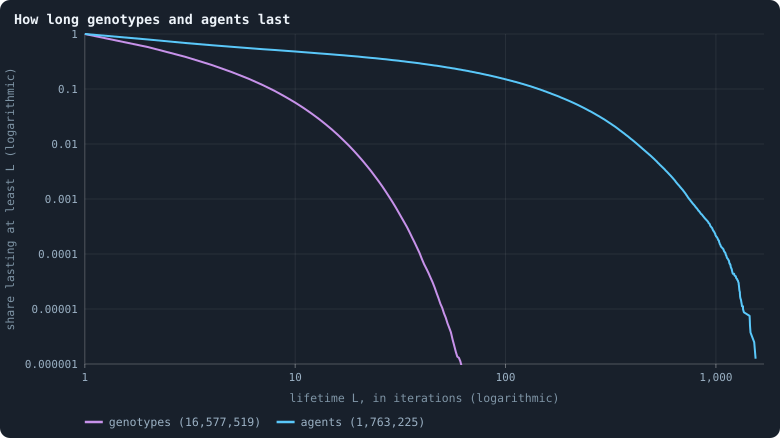
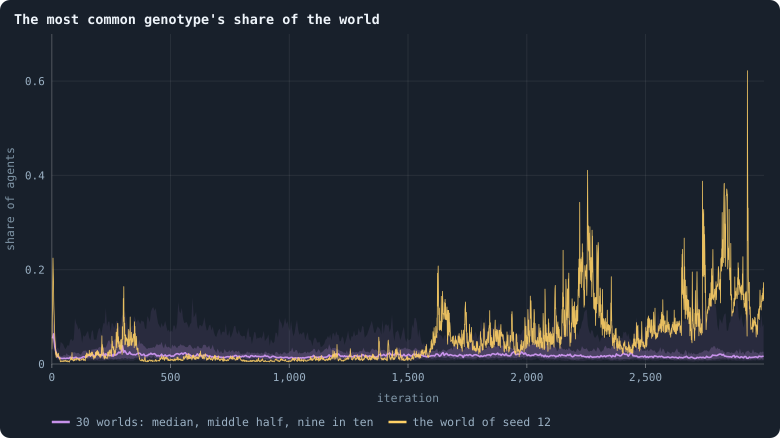
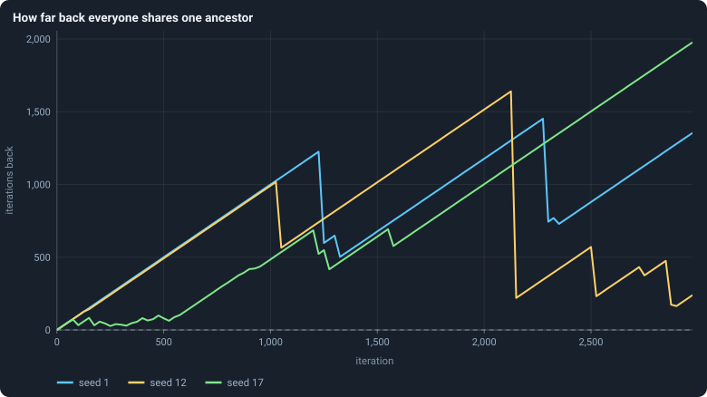
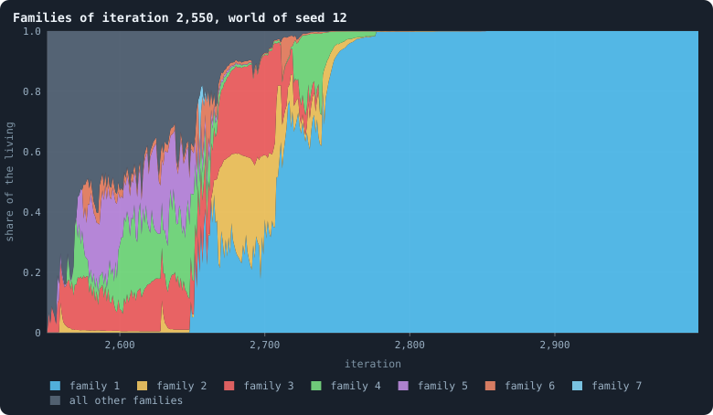
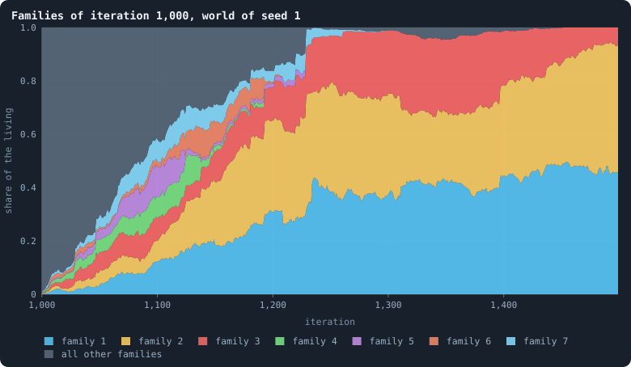
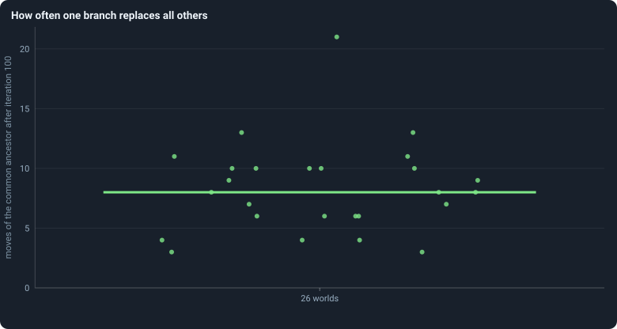

# Genotypes and lineages

Evolution needs something that lasts long enough to be selected. In Graph of
Life a brain is copied — into a child, or into a conquered node — and
changes with probability 0.2 at every birth and after every game. Every
change gives a new **genotype**, and every genotype remembers the one it came
from, so the genotypes of a world form one family tree
([Genotypes and the family tree](../notes/genotype.md)).

> [!question] Questions of this chapter
> - How long does a genotype last? How long does an agent?
> - Does any single genotype ever hold a large part of the world?
> - Does any *line of descent* take the world over — and how often?

<!-- runs E06 -->
> [!info] The runs behind this chapter
> These are the runs of Experiment 2; nothing new was run for this chapter.
>
> **30 runs.** Every condition below is run once for every seed (1 to 30), for 3,000 iterations — or until its world dies out. Every setting is that of the baseline **B1** (the algorithm exactly as a new run is offered it) unless the condition changes it.
>
> - **baseline** — changes nothing: B1 as it is; 10,000 tokens. Runs `B1-10000-s001` … `B1-10000-s030`.
>
> To make these runs again: `python3 gol_lab.py run E02`, or ▶ in the Book tab of a computer running `gol_server.py`. Each run writes its settings, seed and engine version beside its frames, in `GraphOfLifeRuns/<run>/meta.json` and `provenance.json`.

> [!info]- Every setting of these runs
> | setting | baseline | what it is |
> |---|---|---|
> | [`total_tokens`](../notes/settings.md#total_tokens) | 10,000 | The number of tokens in the world, *T*. It never changes during a run. |
> | [`n_nodes`](../notes/settings.md#n_nodes) | 0 | How many founders the world starts with. 0 means one founder per hundred tokens: *n* = ⌊*T* / 100⌋. |
> | [`k_neighbors`](../notes/settings.md#k_neighbors) | 0 | How many neighbours each founder starts with in the ring. 0 means *k* = max(⌊*n* / 100⌋, 5); an odd *k* is wired as *k* − 1. |
> | [`rewire_p`](../notes/settings.md#rewire_p) | 0.2 | In the starting ring, the probability that a connection is moved to a founder chosen at random (Watts–Strogatz). |
> | [`hidden_layers`](../notes/settings.md#hidden_layers) | 50, 45, 40, 35, 30 | The widths of the brain's hidden layers, in order from input to output. |
> | [`brain_kind`](../notes/settings.md#brain_kind) | float16 | How weights are stored: `float` (64-bit), `float16` (16-bit, computed in 64-bit) or `binary` (−1, 0, +1). |
> | [`brain_bits`](../notes/settings.md#brain_bits) | 16 | Only for binary brains: how many input rows encode one number. Unused by float and float16 brains. |
> | [`message_amount`](../notes/settings.md#message_amount) | 30 | How many numbers one message holds. Each agent sends one message to itself and one to each neighbour, every phase. |
> | [`random_input_amount`](../notes/settings.md#random_input_amount) | 5 | How many random numbers, drawn uniformly from −2 to 2, a brain reads per neighbour, every time it looks. |
> | [`exchange_messages`](../notes/settings.md#exchange_messages) | on | Whether agents send and read messages at all. |
> | [`message_prepass`](../notes/settings.md#message_prepass) | on | Whether every phase begins with an extra look in which agents only write messages, so the look that acts reads messages written this phase. |
> | [`allow_handover`](../notes/settings.md#allow_handover) | on | Whether a parent may move some of its own connections to its newborn child. |
> | [`allow_revolutions`](../notes/settings.md#allow_revolutions) | on | Whether a coalition of smaller stakers can take a node from its largest staker (see the note *How a coalition takes a node*). |
> | [`allow_gifting`](../notes/settings.md#allow_gifting) | off | Whether agents may give tokens to neighbours during reproduction. Off in every run of this book. |
> | [`random_decisions`](../notes/settings.md#random_decisions) | off | The control: every number a brain would produce is replaced by a random draw from the standard normal distribution. |
> | [`prune_after`](../notes/settings.md#prune_after) | blotto | After which phase connections that carried no tokens are cut: `blotto` (the game), `reproduction`, or `both`. |
> | [`inactive_window`](../notes/settings.md#inactive_window) | phase | How long a connection may go unused: `phase` means it must carry tokens in the phase being judged; `iteration` allows the two last phases. |
> | [`redistribution`](../notes/settings.md#redistribution) | uniform | How the tokens of removed agents are shared: `uniform` gives every survivor the same chance at each token; `by_tokens` weights by what a survivor holds. |
> | [`tokens_created_per_phase`](../notes/settings.md#tokens_created_per_phase) | 0 | Tokens added to the world at every cleanup. 0 keeps the supply fixed. |
> | [`mutation_probability`](../notes/settings.md#mutation_probability) | 0.2 | The probability that a brain changes when it is copied to a child, and again, for every brain, after every game. |
> | [`mutation_noise_std`](../notes/settings.md#mutation_noise_std) | 0.2 | How large a change to one weight is: a normal draw with standard deviation this times 1/√(fan-in) of its layer. |
> | [`mutation_sparsity`](../notes/settings.md#mutation_sparsity) | 0.1 | The share of a brain's numbers a change touches; also the probability, for each weight matrix and bias vector, of a rarer reset that redraws that share of it. |
> | [`extinction_threshold`](../notes/settings.md#extinction_threshold) | 20 | A run stops, as extinct, when an iteration ends (after its game) with this many agents or fewer. |
> | seeds | 1 to 30 | one run per seed |
> | iterations | 3,000 | how far each run goes, unless its world dies first |
>
> A value in **bold** differs from the baseline B1.
<!-- /runs -->

## Genotypes come and go

<!-- figure lineage/lives -->

**How long genotypes and agents last.** Of all genotypes that appeared, and all agents born, at iteration 500 or later in the 26 worlds that lived to the end, the share that lasted at least L iterations. A genotype lasts from the first game after which some agent carries it to the last; an agent from its birth to the last game it is alive after. Lives still going at the end are counted as far as they went (Kaplan–Meier).

> [!example]- How to make this figure
> **Runs.** The 26 surviving ones of the 30 baseline runs `B1-10000-s001` … `B1-10000-s030`: the baseline B1 at 10,000 tokens, seeds 1 to 30, 3,000 iterations each (every setting is listed in [Chapter 8](08-thirty-worlds.md)). They are made with `python3 gol_lab.py run E02`.
>
> **Data.** From each run's frames, `GraphOfLifeRuns/<run>/frames/`, read with `gol_store.read_frame(run, index)`; frame `2·t` is iteration *t* after reproduction and frame `2·t + 1` after the game.
>
> 1. Read every frame with `phase` = 2; for every genotype (brain id in `brain_ids`) and every agent (id in `ids`) note the first and last iteration it appears.
> 2. Keep those first seen at iteration 500 or later; one still present in the last frame is censored.
> 3. Kaplan–Meier as in [Chapter 11](11-births-deaths-and-ages.md).
>
> **To make it again:** `python3 book_figures.py lineage`.
<!-- /figure -->

The two curves are [survival curves](../notes/kaplan-meier.md) on
logarithmic axes: of everything that appeared from iteration 500 on in the 26
worlds that lived to the end, the share that lasted at least *L* iterations.

- **Genotypes** (violet) are short-lived: 58% last at least 2 iterations, 20%
  at least 5, 6% at least 10, and only one in a hundred thousand reaches 50.
  None reached 100.
- **Agents** (blue) last far longer: 48% at least 10 iterations, 15% at least
  100 ([Chapter 11](11-births-deaths-and-ages.md)).

Why the difference? An agent keeps its node, its id and its age when its
brain changes or is replaced by a conqueror's; a genotype ends when the last
agent carrying it either mutates, dies, or has its node won by another
genotype. With a change in one brain of five after every game, and half of
all nodes changing hands in every game ([Chapter 14](14-how-the-game-is-played.md)),
a genotype has little time.

At any moment, a settled world holds about one genotype for every 1.6
agents (`distinctBrains/nodes`, averaged over iterations 500 to 2,999: 0.63
in the median world, between 0.61 and 0.67 across the 26).

## But some genotypes get big

<!-- figure lineage/top-share -->

**The most common genotype's share of the world.** After every game, the share of the living that carry the most common genotype. The line is the median of the worlds at each iteration, the darker band holds the middle half of them (from the 25th to the 75th percentile) and the paler band nine in ten (5th to 95th). The yellow line is the single world with seed 12.

> [!example]- How to make this figure
> **Runs.** The 30 baseline runs `B1-10000-s001` … `B1-10000-s030`: the baseline B1 at 10,000 tokens, seeds 1 to 30, 3,000 iterations each (every setting is listed in [Chapter 8](08-thirty-worlds.md)). They are made with `python3 gol_lab.py run E02`.
>
> **Data.** From each run's frames, `GraphOfLifeRuns/<run>/frames/`, read with `gol_store.read_frame(run, index)`; frame `2·t` is iteration *t* after reproduction and frame `2·t + 1` after the game.
>
> 1. After every game, count the agents per genotype in `brain_ids`; the largest count divided by the number of agents.
> 2. Cut the iterations into stretches of 5 (600 stretches over 3,000 iterations) and take each world's mean in each stretch.
> 3. In each stretch, take the median, the 25th and 75th and the 5th and 95th percentiles of those means over the worlds that still have a value there (a world that died has none after its death).
>
> **To make it again:** `python3 book_figures.py lineage`.
<!-- /figure -->

Most of the time the most common genotype holds a small part of the world:
a median of 1.6% after iteration 100. But not always. After iteration 100, a
single genotype held more than a tenth of the world at some moment in 21 of
the 26 worlds, more than a fifth in 17, more than a third in 5, and more than
half in one — 62% of 1,585 agents, in the world with seed 12 (the yellow line).
Since no genotype lasts long, a long stretch of one large share is several
genotypes in turn, each changed from the one before: a **line** spreading.

## Lines take over

How far back do all the living share one ancestor
([The common ancestor](../notes/common-ancestor.md))?

<!-- figure lineage/ancestor -->

**How far back everyone shares one ancestor.** Every 25 iterations, for three worlds (seeds 1, 12 and 17, one colour each): how many iterations earlier the newest genotype lived from which every living agent descends ([The common ancestor](../notes/common-ancestor.md)). While a line rises by 25 every 25 iterations, that ancestor stays the same and simply grows older; each drop is a moment when it moves forward to a younger genotype, because all the other branches of the family tree have died out. Before the first drop the living descend from more than one founder, and the line is drawn at the age of the world.

> [!example]- How to make this figure
> **Runs.** `B1-10000-s001`, `-s012` and `-s017`.
>
> **Data.** From each run's frames, `GraphOfLifeRuns/<run>/frames/`, read with `gol_store.read_frame(run, index)`; frame `2·t` is iteration *t* after reproduction and frame `2·t + 1` after the game.
>
> 1. Read every frame in order; remember each genotype's parent and the iteration it first appeared.
> 2. Every 25 iterations, after the game, count the agents per living genotype and climb the family tree from them, newest genotype first, adding each genotype's count to its parent's ([The common ancestor](../notes/common-ancestor.md)).
> 3. The first genotype reached that carries all agents is their newest common ancestor; plot the iterations since it first appeared.
>
> **To make it again:** `python3 book_figures.py lineage`.
<!-- /figure -->

Each line is one world. It starts by rising with the age of the world: the
living still descend from more than one founder. The first drop is the
moment everyone alive descends from one founder — in the median of the 26
worlds, by iteration 125 ([Chapter 10](10-the-first-hundred-iterations.md)
counts it for all 29 worlds that lived past their youth: 175). After that
the line rises steadily, one iteration per iteration, while the common
ancestor stays the same and grows older, and drops whenever one branch of the
family tree has outlived all the others: the common ancestor moves forward.

From iteration 500 on, everyone alive shared one ancestor that had lived a
median of 730 iterations earlier; nine in ten of the living shared one from
590 iterations earlier, and half of them one from 300.

What does such a takeover look like? Take every genotype alive at one moment
as the founder of a **family**, and follow the shares of the families over
the following iterations ([Muller plots](../notes/muller-plot.md)):

<!-- figure lineage/families-12 -->

**Families of iteration 2,550, world of seed 12.** Every genotype alive after the game of iteration 2,550 founds a family: itself and every genotype descended from it. After every later game, the share of the living in each family, stacked; the seven families that ever held the largest share in colour, all others together in grey.

> [!example]- How to make this figure
> **Runs.** `B1-10000-s012`.
>
> **Data.** From each run's frames, `GraphOfLifeRuns/<run>/frames/`, read with `gol_store.read_frame(run, index)`; frame `2·t` is iteration *t* after reproduction and frame `2·t + 1` after the game.
>
> 1. Note the genotypes alive after the game of iteration 2,550.
> 2. After every later game, follow each living agent's genotype up its parents until one of those is reached; count the agents per family and divide by the number of agents.
> 3. Stack the shares, the families with the largest share ever at the bottom.
>
> **To make it again:** `python3 book_figures.py lineage`.
<!-- /figure -->

In the world with seed 12, from iteration 2,550: one family — the
descendants of a single genotype of iteration 2,550 — passes half of the
world at iteration 2,708 and holds all of it from iteration 2,820. Its
genotypes are dozens of different brains, each changed from the one before;
together they replaced every other line in about 270 iterations.

<!-- figure lineage/families-1 -->

**Families of iteration 1,000, world of seed 1.** Every genotype alive after the game of iteration 1,000 founds a family: itself and every genotype descended from it. After every later game, the share of the living in each family, stacked; the seven families that ever held the largest share in colour, all others together in grey.

> [!example]- How to make this figure
> **Runs.** `B1-10000-s001`.
>
> **Data.** From each run's frames, `GraphOfLifeRuns/<run>/frames/`, read with `gol_store.read_frame(run, index)`; frame `2·t` is iteration *t* after reproduction and frame `2·t + 1` after the game.
>
> 1. Note the genotypes alive after the game of iteration 1,000.
> 2. After every later game, follow each living agent's genotype up its parents until one of those is reached; count the agents per family and divide by the number of agents.
> 3. Stack the shares, the families with the largest share ever at the bottom.
>
> **To make it again:** `python3 book_figures.py lineage`.
<!-- /figure -->

In the world with seed 1, from iteration 1,000, nothing like it happens in
500 iterations: the largest family peaks at half the world (50%) and ends at
46%, with several others beside it.

<!-- figure lineage/moves -->

**How often one branch replaces all others.** One dot per surviving world: how many times, between iteration 100 and the end, the newest common ancestor of all the living moved forward to a younger genotype (one of the drops in the figure above). The bar is the median.

> [!example]- How to make this figure
> **Runs.** The 26 surviving ones of the 30 baseline runs `B1-10000-s001` … `B1-10000-s030`: the baseline B1 at 10,000 tokens, seeds 1 to 30, 3,000 iterations each (every setting is listed in [Chapter 8](08-thirty-worlds.md)). They are made with `python3 gol_lab.py run E02`.
>
> **Data.** From the lineage analysis of Experiment 6 (`python3 gol_lab.py analyse E06`), in `book/results/E06.json` (`ancestor.moves` of every run).
>
> 1. Take the common-ancestor depth every 25 iterations as above.
> 2. Count the checks after iteration 100 at which the depth is smaller than the previous depth plus 25.
>
> **To make it again:** `python3 book_figures.py lineage`.
<!-- /figure -->

How often does the common ancestor move forward? After iteration 100, a
median of 8 times per world, between 3 and 21 — about once every 350
iterations.

## What was expected

Before the runs, as Experiment 6:

<!-- thesis E06 -->
> [!quote] The thesis of Experiment 6, written down before any of its runs existed
> **The claim.** No brain wins for long. At any moment the population carries hundreds of different genotypes, the living descend from many different ancestors of eight iterations before, and the most common genotype holds only a small part of the world — none takes over.
>
> **Why it would be so.** Every brain has one chance in five of changing at the end of every game and again when it is copied to a child, and a conquered node takes on its conqueror's brain. A genotype is therefore renamed long before it could spread far: at this rate of change, earlier pilots found a typical genotype lasting a single iteration, and fewer than one in ten lasting more than five.
>
> **It holds if:** From iteration 100 on, the median number of distinct genotypes across the thirty runs is above a fifth of the population, the number of families stays above ten, and no single genotype ever holds more than a tenth of the agents in more than one run in ten.
>
> **It fails if:** One lineage takes over: the families fall to a handful, or a single genotype holds a large share of the world for hundreds of iterations. Then selection has something to work on even at this rate of change, which would change what Part II has to fix first.
<!-- /thesis -->

The thesis is **refuted**. Its first part holds: there are always hundreds
of genotypes, about one for every 1.6 agents, and each lasts a couple of
iterations; and the number of families of eight iterations stays in the
hundreds (a median of 315 from iteration 100 on), because a spreading line
branches into many genotypes within eight iterations; it fell to ten or
fewer in only two worlds, briefly, in the booms and crashes of their early
life. But single genotypes do hold large shares of the world for a while — more than a tenth in 21 of
the 26 worlds, against at most one in ten the thesis allowed — and, more
importantly, whole lines take the world over again and again.

## What this means

- **The unit of evolution here is the line, not the genotype.** A genotype
  lasts a couple of iterations, far too short for selection to act on it. A
  line that takes over the world lasts hundreds. The first rung of the ladder
  in [Chapter 1](01-what-this-book-is-about.md) — lineages lasting long
  enough for selection to act — can only be met by lines.
- **Is it selection, or chance?** In any population that reproduces, all
  lines but one die out sooner or later by chance alone (the
  [coalescent](06-the-ideas-this-builds-on.md)). Whether lines take over
  here *faster than chance would make them*, because some brains do better,
  needs a world in which no brain is better than another.
  [Chapter 30](30-do-the-brains-matter.md) builds one, and finds that how
  often chance alone sweeps a world depends on how often agents are born and
  die.

To make every figure of this chapter: `python3 book_figures.py lineage`.

<!-- turns -->
---

← [Chapter 15 · What shape does the network take?](15-what-shape-does-the-network-take.md) · [Contents](../README.md) · [Chapter 17 · Meta I · What the baseline world is](17-meta-1.md) →
<!-- /turns -->
