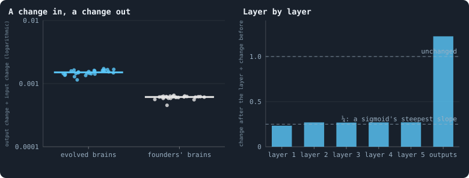
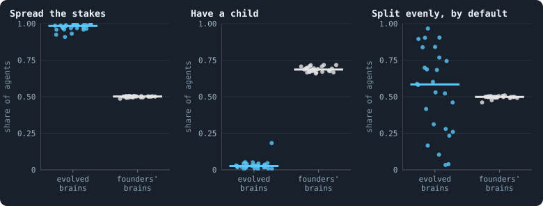
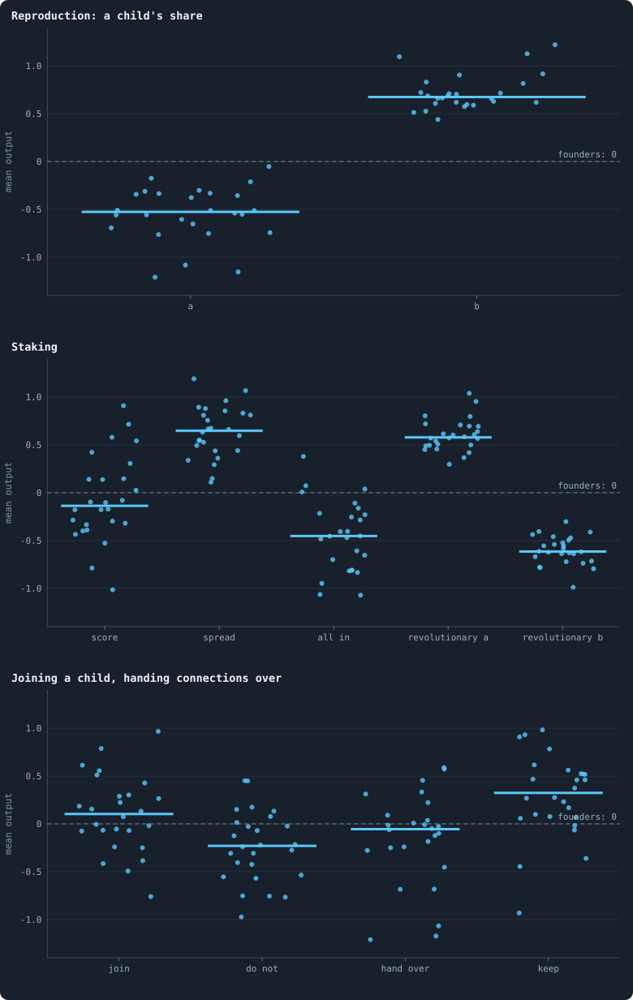
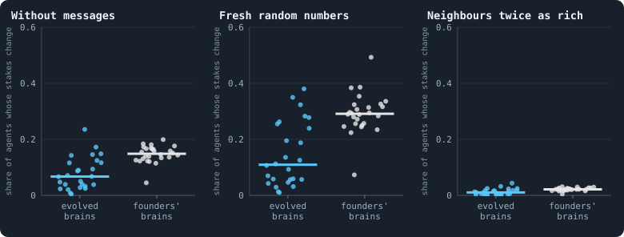
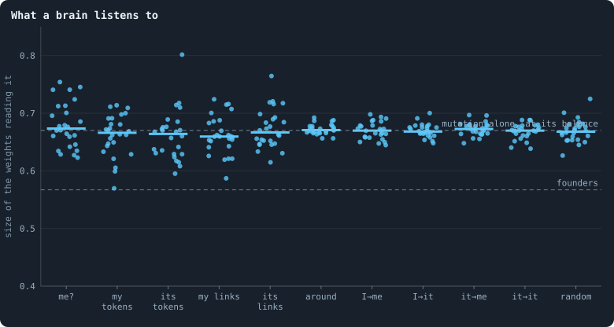
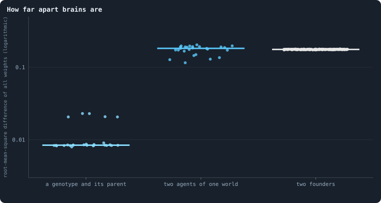

# What the brains are like

Every chapter so far has watched what the worlds do. This one opens the
agents' heads. Each agent decides with a brain of 15,795 numbers
([Chapter 4](04-the-brain.md)), and by the end of a run those numbers have
been copied, changed and selected for 3,000 iterations. What has that made
of them? Do the brains react to what they see? What did selection change,
and what did it leave alone?

> [!question] Questions of this chapter
> - Does what a brain sees reach what it does?
> - Which decisions did evolution change, and in which direction?
> - Which of its inputs does a brain listen to — its own wealth, its
>   neighbour's, the messages, or the noise?
> - How different are the brains of one world from each other?

<!-- runs E02 -->
> [!info] The runs behind this chapter
> **30 runs.** Every condition below is run once for every seed (1 to 30), for 3,000 iterations — or until its world dies out. Every setting is that of the baseline **B1** (the algorithm exactly as a new run is offered it) unless the condition changes it.
>
> - **baseline** — changes nothing: B1 as it is; 10,000 tokens. Runs `B1-10000-s001` … `B1-10000-s030`.
>
> To make these runs again: `python3 gol_lab.py run E02`, or ▶ in the Book tab of a computer running `gol_server.py`. Each run writes its settings, seed and engine version beside its frames, in `GraphOfLifeRuns/<run>/meta.json` and `provenance.json`.

> [!info]- Every setting of these runs
> | setting | baseline | what it is |
> |---|---|---|
> | [`total_tokens`](../notes/settings.md#total_tokens) | 10,000 | The number of tokens in the world, *T*. It never changes during a run. |
> | [`n_nodes`](../notes/settings.md#n_nodes) | 0 | How many founders the world starts with. 0 means one founder per hundred tokens: *n* = ⌊*T* / 100⌋. |
> | [`k_neighbors`](../notes/settings.md#k_neighbors) | 0 | How many neighbours each founder starts with in the ring. 0 means *k* = max(⌊*n* / 100⌋, 5); an odd *k* is wired as *k* − 1. |
> | [`rewire_p`](../notes/settings.md#rewire_p) | 0.2 | In the starting ring, the probability that a connection is moved to a founder chosen at random (Watts–Strogatz). |
> | [`hidden_layers`](../notes/settings.md#hidden_layers) | 50, 45, 40, 35, 30 | The widths of the brain's hidden layers, in order from input to output. |
> | [`brain_kind`](../notes/settings.md#brain_kind) | float16 | How weights are stored: `float` (64-bit), `float16` (16-bit, computed in 64-bit) or `binary` (−1, 0, +1). |
> | [`brain_bits`](../notes/settings.md#brain_bits) | 16 | Only for binary brains: how many input rows encode one number. Unused by float and float16 brains. |
> | [`message_amount`](../notes/settings.md#message_amount) | 30 | How many numbers one message holds. Each agent sends one message to itself and one to each neighbour, every phase. |
> | [`random_input_amount`](../notes/settings.md#random_input_amount) | 5 | How many random numbers, drawn uniformly from −2 to 2, a brain reads per neighbour, every time it looks. |
> | [`exchange_messages`](../notes/settings.md#exchange_messages) | on | Whether agents send and read messages at all. |
> | [`message_prepass`](../notes/settings.md#message_prepass) | on | Whether every phase begins with an extra look in which agents only write messages, so the look that acts reads messages written this phase. |
> | [`allow_handover`](../notes/settings.md#allow_handover) | on | Whether a parent may move some of its own connections to its newborn child. |
> | [`allow_revolutions`](../notes/settings.md#allow_revolutions) | on | Whether a coalition of smaller stakers can take a node from its largest staker (see the note *How a coalition takes a node*). |
> | [`allow_gifting`](../notes/settings.md#allow_gifting) | off | Whether agents may give tokens to neighbours during reproduction. Off in every run of this book. |
> | [`random_decisions`](../notes/settings.md#random_decisions) | off | The control: every number a brain would produce is replaced by a random draw from the standard normal distribution. |
> | [`prune_after`](../notes/settings.md#prune_after) | blotto | After which phase connections that carried no tokens are cut: `blotto` (the game), `reproduction`, or `both`. |
> | [`inactive_window`](../notes/settings.md#inactive_window) | phase | How long a connection may go unused: `phase` means it must carry tokens in the phase being judged; `iteration` allows the two last phases. |
> | [`redistribution`](../notes/settings.md#redistribution) | uniform | How the tokens of removed agents are shared: `uniform` gives every survivor the same chance at each token; `by_tokens` weights by what a survivor holds. |
> | [`tokens_created_per_phase`](../notes/settings.md#tokens_created_per_phase) | 0 | Tokens added to the world at every cleanup. 0 keeps the supply fixed. |
> | [`mutation_probability`](../notes/settings.md#mutation_probability) | 0.2 | The probability that a brain changes when it is copied to a child, and again, for every brain, after every game. |
> | [`mutation_noise_std`](../notes/settings.md#mutation_noise_std) | 0.2 | How large a change to one weight is: a normal draw with standard deviation this times 1/√(fan-in) of its layer. |
> | [`mutation_sparsity`](../notes/settings.md#mutation_sparsity) | 0.1 | The share of a brain's numbers a change touches; also the probability, for each weight matrix and bias vector, of a rarer reset that redraws that share of it. |
> | [`extinction_threshold`](../notes/settings.md#extinction_threshold) | 20 | A run stops, as extinct, when an iteration ends (after its game) with this many agents or fewer. |
> | seeds | 1 to 30 | one run per seed |
> | iterations | 3,000 | how far each run goes, unless its world dies first |
>
> A value in **bold** differs from the baseline B1.
<!-- /runs -->

## How a brain is examined

A brain cannot be read like a text. Its 15,795 numbers mean nothing one by
one. What it *does* can be tested, though, the way a physiologist tests a
nerve: give it an input and measure the response. For every one of the 26
worlds that lived to the end, this chapter takes the world exactly as its
last game left it, rebuilds every agent's view exactly as the engine does
(one column of 154 inputs per candidate, [What a brain sees](../notes/brain-inputs.md)),
and runs the agent's own brain on it. Then it changes the inputs, or the
brain, and runs it again.

The comparison that matters most is a **fresh founder's brain** given exactly
the same inputs: weights drawn as for the founders of a world, normal with
standard deviation 1/√*k*, biases 0. A founder's brain is what the
architecture does before any selection. Whatever the evolved brains do
differently, 3,000 iterations of copying, changing and conquering did.

## Does a brain see what it is shown?

Move every input a little and see how much the outputs move. The ratio of
the two — the root-mean-square change out over the root-mean-square change
in — is the brain's **gain**. A gain of 1 passes every change on at its own
size; a gain of 0 ignores the inputs entirely.

<!-- figure minds/gain -->

**How much of what a brain sees reaches what it does.** Left: for 300 agents of each world, every one of the 154 inputs of each of its columns moved by a small random amount (normal, standard deviation 0.1), and the root-mean-square change of the 45 outputs divided by that of the inputs — the brain's gain; one dot per world, the median of its agents, for the agents' own brains (blue) and for a fresh founder's brain — weights drawn as for the founders of a world, normal with standard deviation 1/√(fan-in), biases 0 — given exactly the same inputs (grey). Right: the same ratio layer by layer for the evolved brains, the median over worlds: each of the five hidden layers ends in a sigmoid, the last is linear.

> [!example]- How to make this figure
> **Runs.** The 26 baseline worlds that lived to the end.
>
> **Data.** From the final checkpoint of each run, `GraphOfLifeRuns/<run>/checkpoint.npz`, read with `gol_store.load_checkpoint(run, config)`: the world after its last iteration, every living agent's brain and every message in flight.
>
> 1. For every agent of the world with at least one token, its inputs exactly as the engine builds them for a look at its candidates (`World._precompute_features` and `World._inputs`), and its brain's outputs (`Brain.forward`); the decisions follow by the engine's own rules (`_apportion` for the stakes, `_share_of_first` for a child's share).
> 2. Draw ε, normal with standard deviation 0.1, the shape of the input matrix X; the gain is RMS(forward(X + ε) − forward(X)) / RMS(ε). The same after each layer for the layer-by-layer ratios (`book_chapters.inner.gain`).
>
> **To make it again:** `python3 book_figures.py minds`.
<!-- /figure -->

The gain of an evolved brain is **0.0015** (the 26 worlds: 0.0011 to
0.0017). A change of 1 in every input moves the outputs by a
seven-hundredth. A founder's brain does even less, 0.0006. The right panel
shows where the signal goes. Each of the five hidden layers passes a change
on at about a quarter of its size (0.23 to 0.27); only the last, linear,
layer passes it whole (1.22). Five quarters multiply to
(¼)⁵ ≈ 0.001.

This is not an accident of these worlds. It is built into the brain. Every
hidden layer ends in a sigmoid, whose slope is at most ¼, and the
founders' weights are scaled to keep sums the same size, not to make them
larger. A five-layer sigmoid network started that way is close to blind. Deep
learning met this problem when its networks first grew deep, as the
**vanishing gradient** ([How a signal fades through layers](../notes/vanishing-signal.md)).
Evolution has raised the gain by 2.5 times in 3,000 iterations, but a gain
of a thousandth raised 2.5 times is still a thousandth.

What a nearly blind brain computes is set by its biases and by the average
activity of its layers. It computes almost the same thing for every
candidate and every situation. The rest of the chapter shows what that
means for its decisions.

## What evolution changed

<!-- figure minds/decisions -->

**What evolution changed.** One dot per world: of its agents with a token or more at the end, the share whose brain would spread its stakes rather than go all in; the share that would have a child (a share of its tokens of at least one token); and the share whose every stake score is zero or below, so that the rules split its tokens evenly over all its candidates. Blue: the agents' own brains; grey: a fresh founder's brain — weights drawn as for the founders of a world, normal with standard deviation 1/√(fan-in), biases 0 — given exactly the same inputs.

> [!example]- How to make this figure
> **Runs.** The 26 baseline worlds that lived to the end.
>
> **Data.** From the final checkpoint of each run, `GraphOfLifeRuns/<run>/checkpoint.npz`, read with `gol_store.load_checkpoint(run, config)`: the world after its last iteration, every living agent's brain and every message in flight.
>
> 1. For every agent of the world with at least one token, its inputs exactly as the engine builds them for a look at its candidates (`World._precompute_features` and `World._inputs`), and its brain's outputs (`Brain.forward`); the decisions follow by the engine's own rules (`_apportion` for the stakes, `_share_of_first` for a child's share).
> 2. Spread: the mean of the two BLOTTO_MODE outputs over the columns, first larger than second. Child: ⌊f(ā, b̄) · tokens⌋ ≥ 1 with ā, b̄ the REPRO_FRACTION outputs averaged over the columns. Even by default: every BLOTTO score ≤ 0 (`book_chapters.inner.probe`).
>
> **To make it again:** `python3 book_figures.py minds`.
<!-- /figure -->

Given the same inputs, evolved brains and founders' brains decide very
differently:

- **Children.** A founder's brain would have a child in 69% of cases. An
  evolved brain would in **2.6%** (the worlds: 0.6% to 18%). That fits the
  3.1 births per hundred agents per reproduction phase of
  [Chapter 12](12-births-deaths-and-ages.md). Reproduction has been
  selected nearly away.
- **Spreading the stake.** A founder's brain spreads its tokens over its
  candidates half the time and goes all in on one the other half. An evolved
  brain spreads in **98%** of cases. That fits the 97% of
  [Chapter 15](15-how-the-game-is-played.md).
- **Splitting evenly.** In the median world, **58%** of agents give every
  candidate a score of zero or below. The rules then split their tokens
  exactly evenly ([Splitting tokens into whole numbers](../notes/largest-remainder.md)).
  The worlds differ enormously here, from 3% to 97%. In a world where it is
  97%, almost every stake is the even split, decided by the rules and not by
  the brain.

The outputs behind these decisions show where selection pushed:

<!-- figure minds/outputs -->

**Where selection pushed.** One dot per world: the mean, over its agents and their columns, of each of the brain's outputs that make decisions ([Chapter 4](04-the-brain.md)). A founder's brain averages 0 on every one of them (the dashed line). A child's share is f(a, b), the share of the positive part of a in the positive parts of a and b ([The share function](../notes/share-function.md)): a below 0 and b above it means no child. Likewise for the revolutionary part of a stake; spread or all in follows whichever of its two outputs is larger.

> [!example]- How to make this figure
> **Runs.** The 26 baseline worlds that lived to the end.
>
> **Data.** From the final checkpoint of each run, `GraphOfLifeRuns/<run>/checkpoint.npz`, read with `gol_store.load_checkpoint(run, config)`: the world after its last iteration, every living agent's brain and every message in flight.
>
> 1. For every agent of the world with at least one token, its inputs exactly as the engine builds them for a look at its candidates (`World._precompute_features` and `World._inputs`), and its brain's outputs (`Brain.forward`); the decisions follow by the engine's own rules (`_apportion` for the stakes, `_share_of_first` for a child's share).
> 2. For each agent, the mean over its columns of output rows 0–14 (`World.heads`: REPRO_FRACTION 0–1, LINK 2–3, LINK_MODE 4–5, BLOTTO 6, BLOTTO_MODE 7–8, REV_FRACTION 9–10, HANDOVER 11–12, HANDOVER_MODE 13–14); then the mean over agents.
>
> **To make it again:** `python3 book_figures.py minds`.
<!-- /figure -->

Each decision of a brain is read from a pair of outputs, or from one
([Chapter 4](04-the-brain.md)). A founder's brain averages 0 on every one
of them. In the evolved worlds:

- the two outputs of **a child's share**, *a* and *b*, sit at −0.53 and
  +0.67. The share function *f*(*a*, *b*) gives 0 whenever *a* is negative
  and *b* positive ([The share function](../notes/share-function.md)), so
  no child. Every one of the 26 worlds has *a* below 0 and *b* above it.
- **spread** beats **all in**, +0.65 against −0.45;
- the two outputs of the **revolutionary share** sit at +0.58 and −0.62,
  the first above 0 and the second below it in every world, so nearly every
  staked token is marked revolutionary (96%, [Chapter 15](15-how-the-game-is-played.md));
- the outputs for joining a child to a candidate and for handing it
  connections lean, in most worlds, towards joining and keeping, but many
  worlds lean the other way. They are used only when a child is born, which
  is now rare, so selection on them is weak.

The **stake score** itself, the one output that could say *this* candidate
rather than *that* one, sits near zero (−0.14, the worlds from −1.0 to
+0.9). With a gain of a thousandth, it is nearly the same for every
candidate. A brain with a positive score therefore also splits nearly evenly.

So selection acted, and acted the same way in every world. But it acted on
**constants**: never have children, spread the stake, make every token
revolutionary. None of these depends on the situation. They are a strategy,
not a behaviour.

## What changes a decision

If brains react so little, how often does anything they see change what
they do? Take the stakes, the decision every agent makes in every game, and
change one thing about the inputs:

<!-- figure minds/sensitivity -->

**What changes a decision.** One dot per world: the share of its agents whose stakes would differ at all if one thing about their inputs were different — every message they read set to 0; the five random numbers of every column drawn again; or every neighbour's tokens, as the agent sees them, doubled. Blue: the agents' own brains; grey: a fresh founder's brain — weights drawn as for the founders of a world, normal with standard deviation 1/√(fan-in), biases 0 — given exactly the same inputs.

> [!example]- How to make this figure
> **Runs.** The 26 baseline worlds that lived to the end.
>
> **Data.** From the final checkpoint of each run, `GraphOfLifeRuns/<run>/checkpoint.npz`, read with `gol_store.load_checkpoint(run, config)`: the world after its last iteration, every living agent's brain and every message in flight.
>
> 1. For every agent of the world with at least one token, its inputs exactly as the engine builds them for a look at its candidates (`World._precompute_features` and `World._inputs`), and its brain's outputs (`Brain.forward`); the decisions follow by the engine's own rules (`_apportion` for the stakes, `_share_of_first` for a child's share).
> 2. Change the inputs — rows 29–148 set to 0; rows 149–153 drawn again, uniform on (−2, 2); row 2 of every neighbour's column replaced by ln(1 + 2·(e^x − 1)) — and decide again; count the agents whose shares of stake differ in any candidate.
>
> **To make it again:** `python3 book_figures.py minds`.
<!-- /figure -->

- **Every message set to 0.** The stakes of 6.7% of agents change (the
  founders' brains: 15%).
- **The five random numbers of every column drawn again.** 11% change (29%).
- **Every neighbour twice as rich** as the agent sees it. **1.0%** change
  (2.2%).

Two things stand out. Evolved brains are *less* sensitive than founders'
brains, although their gain is larger. Their habits make them so. A
founder's brain goes all in half the time, on whichever candidate scores
highest, and with scores this close almost any change can make another
candidate the highest. An evolved brain spreads, and a spread changes only
when the rounding of a token tips. More than half of the evolved agents give
every candidate a score of zero or below, and their even split cannot change
at all unless a score is pushed above zero. And the random numbers
change more stakes than a doubling of the neighbours' wealth. Five numbers
drawn from −2 to 2 move the inputs further than one doubling (ln 2 ≈ 0.7 on
the logarithmic scale the brain reads), and a brain that weighs all its
inputs alike cannot tell information from noise.

## What a brain listens to

Does a brain weigh all its inputs alike? The first layer says. Each input
is read by a column of 50 weights, and the size of that column — its length,
the square root of the sum of the squared weights — says how loudly the
input speaks to the rest of the brain:

<!-- figure minds/listen -->

**What a brain listens to.** For each group of the brain's inputs ([What a brain sees](../notes/brain-inputs.md)) — whether the candidate is the agent itself; the agent's and the candidate's tokens and connections; the summaries of both neighbourhoods (around); the four messages, from writer to reader (I→me is what the agent wrote to itself, it→me what the candidate wrote to it, and so on); and the random numbers — the size of the first layer's weights that read it: for each input, the length of its column of 50 weights, averaged over the inputs of the group and the agents of the world; one dot per world. Lower dashed line: the same for founders' brains. Upper: what the changes of [How a brain changes](../notes/mutation.md) alone would bring every weight to, whatever it reads — its jitters adding variance, its resets drawing weights back — at the balance of the two.

> [!example]- How to make this figure
> **Runs.** The 26 baseline worlds that lived to the end.
>
> **Data.** From the final checkpoint of each run, `GraphOfLifeRuns/<run>/checkpoint.npz`, read with `gol_store.load_checkpoint(run, config)`: the world after its last iteration, every living agent's brain and every message in flight.
>
> 1. Read the first weight matrix W0 (agents × 50 × 154) from the checkpoint; for each input the norm of its column; average within each group of inputs and over agents.
> 2. Mutation alone: each change jitters a weight with probability 0.1 by a normal amount of variance 0.2²/k and redraws it with probability 0.1 · 0.1 from variance 1/k; the variance v at balance satisfies v = 0.99 (v + 0.004/k) + 0.01/k, so v = 1.396/k: √1.396 = 1.18 times a founder's.
>
> **To make it again:** `python3 book_figures.py minds`.
<!-- /figure -->

Every group of inputs is read by weights of the same size, **0.67**. That
holds for the agent's own tokens, for the candidate's connections, for the
messages, and for the five random numbers. Founders' brains read every input
with 0.57, since 50 weights of standard deviation 1/√154 have a length of
√(50/154) = 0.57.

The 0.67 is not a choice of selection either. Mutation alone sets it. Each
change adds a little variance to a weight (the jitter) and, rarely, draws a
weight afresh from the founders' distribution (the reset,
[How a brain changes](../notes/mutation.md)). The two balance where the
variance is 1.40 times the founders': the jitter adds 0.4% of it per
change, the resets take away 1% of the excess. √1.40 × 0.57 = 0.67, for
every input alike. The first layer of an evolved brain is what mutation
makes of any matrix, with nothing of selection visible in it.

## How far apart the brains are

<!-- figure minds/apart -->

**How far apart brains are.** The difference between two brains: the root mean square of the differences of all their 15,795 numbers (weights and biases). Left: a genotype and its parent genotype, where both are alive at the end of a world — one change apart; one dot per world, the median of its pairs. Middle: two agents drawn at random from one world; one dot per world, the median of 3,000 pairs. Right: two fresh founders' brains, one dot per pair (200 pairs).

> [!example]- How to make this figure
> **Runs.** The 26 baseline worlds that lived to the end.
>
> **Data.** From the final checkpoint of each run, `GraphOfLifeRuns/<run>/checkpoint.npz`, read with `gol_store.load_checkpoint(run, config)`: the world after its last iteration, every living agent's brain and every message in flight.
>
> 1. Concatenate every weight matrix and bias vector of a brain into one vector of 15,795 numbers; the difference of two brains is the root mean square of the difference of their vectors (`book_chapters.inner.weights`).
>
> **To make it again:** `python3 book_figures.py minds`.
<!-- /figure -->

Measure the difference between two brains as the root mean square of the
differences of all their 15,795 numbers. A genotype and its parent are
**0.0084** apart: one change. Two agents drawn at random from one world are
**0.18** apart. Two founders, drawn independently, are 0.18 apart as well
(0.176).

So the brains of one world are, in their numbers, almost as different from
each other as brains drawn independently. Yet they agree on every decision
that matters: no children, spread, revolutionary. The two facts fit
together once the gain is known. Nearly all of a brain's numbers barely
touch what it does, so selection cannot hold them, and they drift. Only the
numbers that set its constant tendencies — the biases, and the weights that
turn the layers' average activity into outputs — are held. In the language of molecular evolution, most
of a brain is **neutral** (Kimura 1968): it changes freely because nothing
depends on it.

## What this means

- **The brains are nearly blind.** A brain's outputs move by a thousandth
  of a change in its inputs. What an agent does is set by its brain's
  constant tendencies, almost regardless of its situation, its neighbours,
  or what they say to it.
- **Evolution has worked, on constants.** Every world was pushed the same
  way: reproduction nearly abolished, stakes spread, every token
  revolutionary. These are the strategies a world of nearly identical
  agents converges to. They are a point in a space of a few dimensions, and
  once found, there is nowhere further to go.
- **This is the first obstacle to open-ended evolution.** Novelty that keeps
  coming needs behaviour that depends on circumstances. A brain that reacts
  to who its neighbour is can find a new way to treat a new kind of
  neighbour, and that creates a new niche for someone else. A brain that
  cannot see has only its constants to vary. [Meta II](36-meta-2.md) lists
  the obstacles; this one comes first, because it limits all the others.
- **The remedy is in the architecture.** Fewer layers, a squashing with a
  steeper slope, or larger starting weights would each give the brains a
  gain near 1 ([How a signal fades through layers](../notes/vanishing-signal.md)).
  Chapter 43, *How big should a brain be?*, is planned for that and should
  come early. [Chapter 37](37-do-the-brains-matter.md), which replaced the
  brains by chance, reads differently in this light: its brains did matter,
  but as constants.

To make every figure of this chapter: `python3 book_figures.py minds`.

<!-- turns -->
---

← [Chapter 17 · Genotypes and lineages](17-genotypes-and-lineages.md) · [Contents](../README.md) · [Chapter 19 · What agents say to each other](19-what-agents-say-to-each-other.md) →
<!-- /turns -->
