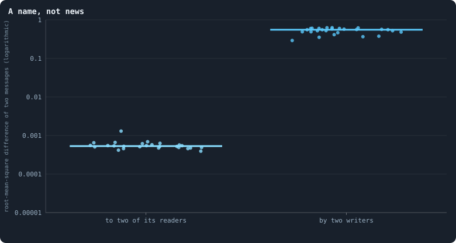
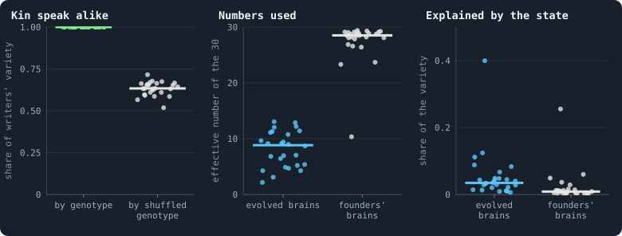
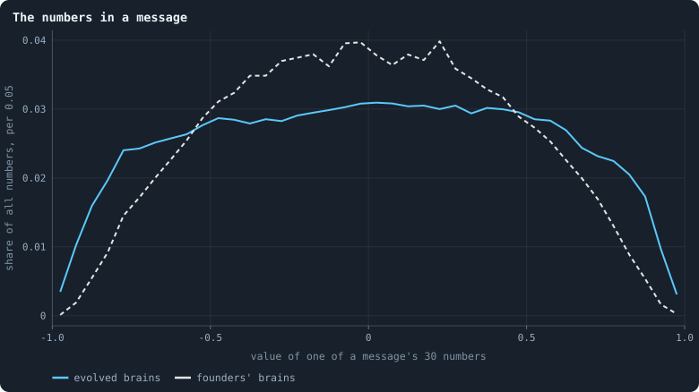

# What agents say to each other

Every agent writes a message of 30 numbers to itself and to each of its
neighbours, in every phase, and reads the messages written to it
([Messages](../notes/messages.md)). Nothing in the rules reads them except
the brains, and nothing gives the numbers a meaning. If a message says
anything, evolution made it say it. A free channel between neighbours is the
classic setting for the evolution of signals, from Lewis's signalling games
(Lewis 1969) to the evolution of meaning in populations of simple agents
(Skyrms 2010). What do the agents of Graph of Life say?

> [!question] Questions of this chapter
> - Does an agent say different things to different neighbours?
> - What does a message tell its reader: about the writer, about the
>   reader, about the world?
> - Do kin speak alike? Could an agent recognise its kin by what they say?
> - How many of the 30 numbers are used?

<!-- runs E02 -->
> [!info] The runs behind this chapter
> **30 runs.** Every condition below is run once for every seed (1 to 30), for 3,000 iterations — or until its world dies out. Every setting is that of the baseline **B1** (the algorithm exactly as a new run is offered it) unless the condition changes it.
>
> - **baseline** — changes nothing: B1 as it is; 10,000 tokens. Runs `B1-10000-s001` … `B1-10000-s030`.
>
> To make these runs again: `python3 gol_lab.py run E02`, or ▶ in the Book tab of a computer running `gol_server.py`. Each run writes its settings, seed and engine version beside its frames, in `GraphOfLifeRuns/<run>/meta.json` and `provenance.json`.

> [!info]- Every setting of these runs
> | setting | baseline | what it is |
> |---|---|---|
> | [`total_tokens`](../notes/settings.md#total_tokens) | 10,000 | The number of tokens in the world, *T*. It never changes during a run. |
> | [`n_nodes`](../notes/settings.md#n_nodes) | 0 | How many founders the world starts with. 0 means one founder per hundred tokens: *n* = ⌊*T* / 100⌋. |
> | [`k_neighbors`](../notes/settings.md#k_neighbors) | 0 | How many neighbours each founder starts with in the ring. 0 means *k* = max(⌊*n* / 100⌋, 5); an odd *k* is wired as *k* − 1. |
> | [`rewire_p`](../notes/settings.md#rewire_p) | 0.2 | In the starting ring, the probability that a connection is moved to a founder chosen at random (Watts–Strogatz). |
> | [`hidden_layers`](../notes/settings.md#hidden_layers) | 50, 45, 40, 35, 30 | The widths of the brain's hidden layers, in order from input to output. |
> | [`brain_kind`](../notes/settings.md#brain_kind) | float16 | How weights are stored: `float` (64-bit), `float16` (16-bit, computed in 64-bit) or `binary` (−1, 0, +1). |
> | [`brain_bits`](../notes/settings.md#brain_bits) | 16 | Only for binary brains: how many input rows encode one number. Unused by float and float16 brains. |
> | [`message_amount`](../notes/settings.md#message_amount) | 30 | How many numbers one message holds. Each agent sends one message to itself and one to each neighbour, every phase. |
> | [`random_input_amount`](../notes/settings.md#random_input_amount) | 5 | How many random numbers, drawn uniformly from −2 to 2, a brain reads per neighbour, every time it looks. |
> | [`exchange_messages`](../notes/settings.md#exchange_messages) | on | Whether agents send and read messages at all. |
> | [`message_prepass`](../notes/settings.md#message_prepass) | on | Whether every phase begins with an extra look in which agents only write messages, so the look that acts reads messages written this phase. |
> | [`allow_handover`](../notes/settings.md#allow_handover) | on | Whether a parent may move some of its own connections to its newborn child. |
> | [`allow_revolutions`](../notes/settings.md#allow_revolutions) | on | Whether a coalition of smaller stakers can take a node from its largest staker (see the note *How a coalition takes a node*). |
> | [`allow_gifting`](../notes/settings.md#allow_gifting) | off | Whether agents may give tokens to neighbours during reproduction. Off in every run of this book. |
> | [`random_decisions`](../notes/settings.md#random_decisions) | off | The control: every number a brain would produce is replaced by a random draw from the standard normal distribution. |
> | [`prune_after`](../notes/settings.md#prune_after) | blotto | After which phase connections that carried no tokens are cut: `blotto` (the game), `reproduction`, or `both`. |
> | [`inactive_window`](../notes/settings.md#inactive_window) | phase | How long a connection may go unused: `phase` means it must carry tokens in the phase being judged; `iteration` allows the two last phases. |
> | [`redistribution`](../notes/settings.md#redistribution) | uniform | How the tokens of removed agents are shared: `uniform` gives every survivor the same chance at each token; `by_tokens` weights by what a survivor holds. |
> | [`tokens_created_per_phase`](../notes/settings.md#tokens_created_per_phase) | 0 | Tokens added to the world at every cleanup. 0 keeps the supply fixed. |
> | [`mutation_probability`](../notes/settings.md#mutation_probability) | 0.2 | The probability that a brain changes when it is copied to a child, and again, for every brain, after every game. |
> | [`mutation_noise_std`](../notes/settings.md#mutation_noise_std) | 0.2 | How large a change to one weight is: a normal draw with standard deviation this times 1/√(fan-in) of its layer. |
> | [`mutation_sparsity`](../notes/settings.md#mutation_sparsity) | 0.1 | The share of a brain's numbers a change touches; also the probability, for each weight matrix and bias vector, of a rarer reset that redraws that share of it. |
> | [`extinction_threshold`](../notes/settings.md#extinction_threshold) | 20 | A run stops, as extinct, when an iteration ends (after its game) with this many agents or fewer. |
> | seeds | 1 to 30 | one run per seed |
> | iterations | 3,000 | how far each run goes, unless its world dies first |
>
> A value in **bold** differs from the baseline B1.
<!-- /runs -->

## How the messages are read

As in [Chapter 18](18-what-the-brains-are-like.md), every one of the 26
worlds that lived to the end is rebuilt exactly as its last game left it.
Every agent looks at its candidates, and its brain writes a message to each,
30 outputs squeezed by tanh into −1 to 1. That gives between 1,400 and
10,000 messages per world, one for every connection in each direction and
one from every agent to itself. As a control, a fresh founder's brain
writes from exactly the same inputs.

## A name, not news

<!-- figure talk/names -->

**A name, not news.** For every agent of a world at its end, the message its brain writes to each of its candidates (the 30 message outputs, squashed by tanh into −1 to 1). Left: how different the messages one agent writes to two of its readers are; right: how different the messages of two agents are. One dot per world, each the median over its agents.

> [!example]- How to make this figure
> **Runs.** The 26 baseline worlds that lived to the end.
>
> **Data.** From the final checkpoint of each run, `GraphOfLifeRuns/<run>/checkpoint.npz`, read with `gol_store.load_checkpoint(run, config)`: the world after its last iteration, every living agent's brain and every message in flight.
>
> 1. For every agent, its inputs as the engine builds them and tanh of output rows 15–44 of its brain: one message per candidate.
> 2. Left: the root-mean-square difference between its messages to its first two candidates; right: between its first message and the previous agent's (`book_chapters.inner.message_stats`).
>
> **To make it again:** `python3 book_figures.py talk`.
<!-- /figure -->

Two messages written by **one** agent to two of its readers differ, in the
root mean square of their 30 numbers, by **0.0005**. Two messages written by
**two** agents differ by **0.55**. An agent says the same thing to everyone:
to itself, to a rich neighbour and to a poor one, to kin and to strangers. So
a message tells its reader one thing, *who wrote it*. It is a name.

This follows from [Chapter 18](18-what-the-brains-are-like.md). A brain's
outputs move by a thousandth of a change in its inputs, so the message it
writes to one candidate is nearly the message it writes to the next. A
founder's brain is no different (0.0002 against 0.60). The architecture
makes messages names before any selection.

## What a name says

If a message is a name, whose name is it? The figure answers three
questions, one per panel:

<!-- figure talk/what -->

**What the messages carry.** One dot per world. Left: of how much the agents' messages differ from one agent to the next, the share that lies between genotypes — 1 if agents of one genotype write exactly alike — against the same share with the genotypes shuffled among the agents (the median of 50 shuffles). Middle: the effective number of independent numbers the messages use, of their 30 (the participation ratio of the eigenvalues of their covariance). Right: the share of the messages' variety that a straight-line fit on the writer's and reader's tokens and connections (their logarithms) and whether the message is to itself accounts for. Blue: the agents' own brains; grey: a fresh founder's brain — weights drawn as for the founders of a world, normal with standard deviation 1/√(fan-in), biases 0 — given exactly the same inputs.

> [!example]- How to make this figure
> **Runs.** The 26 baseline worlds that lived to the end.
>
> **Data.** From the final checkpoint of each run, `GraphOfLifeRuns/<run>/checkpoint.npz`, read with `gol_store.load_checkpoint(run, config)`: the world after its last iteration, every living agent's brain and every message in flight.
>
> 1. As in the figure above, every message an agent's brain writes to each candidate.
> 2. Kin: each writer's mean message; between-genotype sum of squares of those means over their total; the null shuffles the genotypes among writers.
> 3. Numbers used: (Σλ)² / Σλ² of the covariance eigenvalues λ of the 30 components.
> 4. Explained: least squares of all 30 components on [1, ln(1+τ_writer), ln(1+k_writer), ln(1+τ_reader), ln(1+k_reader), self]; 1 − residual sum of squares / total.
>
> **To make it again:** `python3 book_figures.py talk`.
<!-- /figure -->

**Kin speak alike.** Take the mean message of every writer, and ask how much
of the variety between writers lies between genotypes, and how much among
writers of one genotype. In every world, **all of it** (1.00) lies between
genotypes. Two agents of one genotype write exactly the same message. With
the genotypes shuffled among the writers the share is 0.63. That much would
lie "between genotypes" by chance, since most genotypes are carried by a
single agent ([Chapter 17](17-genotypes-and-lineages.md)). It is no wonder:
one genotype is one brain, and a brain that hardly sees writes the same
thing whoever it is in. A message is the name **of a genotype**.

**Few numbers are used.** Of the 30 numbers, a world's messages vary along
only **8.8** independent directions in the median world (2.2 to 13), counted
as a participation ratio ([How many directions a cloud of points uses](../notes/participation-ratio.md)).
Founders' brains, independent of each other, use 28.5, all of them. A
world's genotypes descend from a few lines ([Chapter 17](17-genotypes-and-lineages.md)),
and the messages of one line differ only where the line's changes moved
them. So a world speaks a few dialects, each spoken by a line.

**Nearly nothing about the world.** A straight-line fit of the messages on
what a message could be about — the writer's and the reader's tokens and
connections (as logarithms), and whether the message is to oneself —
accounts for **3.5%** of their variety (0.7% to 40%; founders' brains,
0.9%). One world reaches 40%, but in the others what an agent says has
almost nothing to do with its situation.

## The numbers themselves

<!-- figure talk/values -->

**The numbers in a message.** Every one of the 30 numbers of every message written at the end of the 26 worlds, in bins 0.05 wide: by the agents' own brains (blue) and by a fresh founder's brain — weights drawn as for the founders of a world, normal with standard deviation 1/√(fan-in), biases 0 — given exactly the same inputs (grey, dashed).

> [!example]- How to make this figure
> **Runs.** The 26 baseline worlds that lived to the end.
>
> **Data.** From the final checkpoint of each run, `GraphOfLifeRuns/<run>/checkpoint.npz`, read with `gol_store.load_checkpoint(run, config)`: the world after its last iteration, every living agent's brain and every message in flight.
>
> 1. As above; count the numbers in 40 bins from −1 to 1 and divide by all numbers.
>
> **To make it again:** `python3 book_figures.py talk`.
<!-- /figure -->

Founders' messages pile up around 0, in a bell. Evolved messages are spread
almost evenly from −0.7 to +0.7, with more numbers near the ends: 2.5% lie
beyond ±0.9, against 0.4% for founders. Larger weights would do this. Mutation
alone leaves the weights of an evolved brain larger than a founder's
([Chapter 18](18-what-the-brains-are-like.md)), so nothing here needs
selection to explain it. The evolved values are no more informative for
being spread wider. They are still the same for every reader.

## Could kin recognise each other?

[Chapter 34](34-do-agents-cooperate.md) found that kin live side by side —
a tenth of an agent's neighbours carry its own genotype — but are staked on
exactly like strangers. It noted that a brain cannot see genotypes and could
only tell kin through messages, if a lineage evolved a password, a
**green beard** (Hamilton 1964; Dawkins 1976).

This chapter shows that the password exists already, without any
evolution. When an agent *u* looks at a neighbour *v*, it reads, among other
things, the message it wrote to itself and the message *v* wrote to it
([Messages](../notes/messages.md)). If the two share a genotype, the two
messages are identical. If *v* is a close relative, they are nearly
identical. If *v* is a stranger, they differ by about 0.55 per number (as a root mean square).
Telling them apart needs one comparison.

What is missing is a brain that can make it. A difference of 0.55 in 30
inputs reaches the stakes at a thousandth of its size, and the stakes split
evenly anyway. Kin recognition is one comparison away, and blocked by the
same obstacle as everything else in the brain. The planned Chapter 47, *Kin
that know each other*, meant to add heritable tags. Messages already are
heritable tags. A brain that can see is what it needs.

## What this means

- **Messages are names.** An agent writes the same message to every reader,
  and all agents of one genotype write the same message. A message carries
  who wrote it, and almost nothing else.
- **No language has evolved.** A signal can mean something only if what is
  sent depends on something — the sender's state, the receiver, the
  situation — and what is done on receipt depends on what was sent. Neither
  holds here: messages ignore the situation, and decisions ignore the
  messages ([Chapter 18](18-what-the-brains-are-like.md): setting every
  message to 0 changes the stakes of only 6.7% of agents at all).
- **The raw material is there.** The names identify kin exactly. If brains
  could compare what they read, kin recognition, and with it Hamilton's kin
  selection ([Chapter 34](34-do-agents-cooperate.md)), would be one
  comparison away. That makes the gain of the brain, again, the first thing
  to change.

To make every figure of this chapter: `python3 book_figures.py talk`.

<!-- turns -->
---

← [Chapter 18 · What the brains are like](18-what-the-brains-are-like.md) · [Contents](../README.md) · [Chapter 20 · Do the rich stay rich?](20-do-the-rich-stay-rich.md) →
<!-- /turns -->
