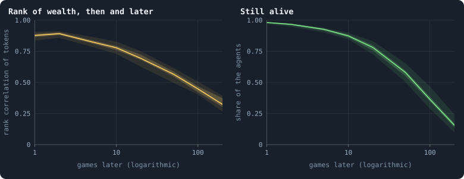
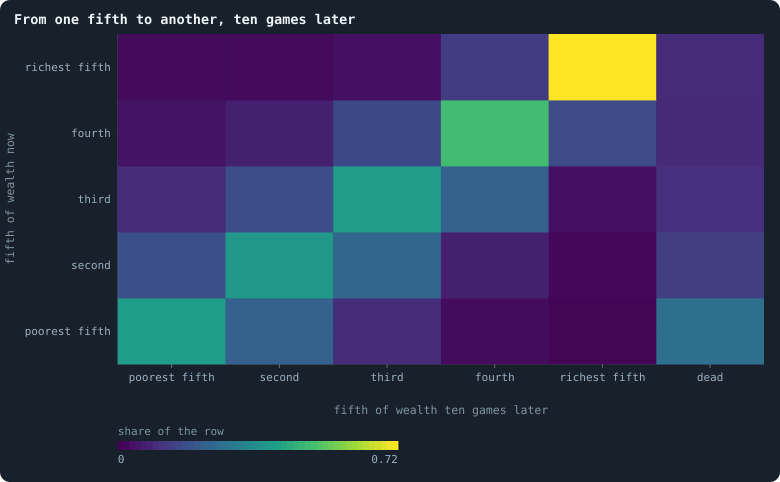
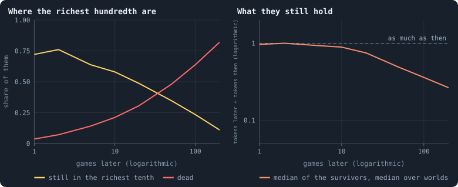
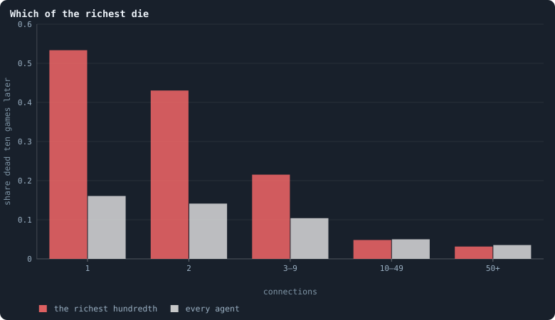

# Do the rich stay rich?

[Chapter 14](14-where-do-the-tokens-go.md) found the tokens of a world held
unequally, with a Gini coefficient that hardly moves over a world's settled
life. But an unchanging inequality can hide two very different worlds. In
one, the same agents are rich game after game. In the other, wealth is as
unequal at every moment, but who holds it keeps changing. This chapter
follows single agents through time to tell which world Graph of Life is.

> [!question] Questions of this chapter
> - If an agent is rich now, how likely is it to be rich ten, a hundred,
>   two hundred games later?
> - How far does an agent move up or down the order of wealth?
> - What becomes of the very richest?

<!-- runs E02 -->
> [!info] The runs behind this chapter
> **30 runs.** Every condition below is run once for every seed (1 to 30), for 3,000 iterations — or until its world dies out. Every setting is that of the baseline **B1** (the algorithm exactly as a new run is offered it) unless the condition changes it.
>
> - **baseline** — changes nothing: B1 as it is; 10,000 tokens. Runs `B1-10000-s001` … `B1-10000-s030`.
>
> To make these runs again: `python3 gol_lab.py run E02`, or ▶ in the Book tab of a computer running `gol_server.py`. Each run writes its settings, seed and engine version beside its frames, in `GraphOfLifeRuns/<run>/meta.json` and `provenance.json`.

> [!info]- Every setting of these runs
> | setting | baseline | what it is |
> |---|---|---|
> | [`total_tokens`](../notes/settings.md#total_tokens) | 10,000 | The number of tokens in the world, *T*. It never changes during a run. |
> | [`n_nodes`](../notes/settings.md#n_nodes) | 0 | How many founders the world starts with. 0 means one founder per hundred tokens: *n* = ⌊*T* / 100⌋. |
> | [`k_neighbors`](../notes/settings.md#k_neighbors) | 0 | How many neighbours each founder starts with in the ring. 0 means *k* = max(⌊*n* / 100⌋, 5); an odd *k* is wired as *k* − 1. |
> | [`rewire_p`](../notes/settings.md#rewire_p) | 0.2 | In the starting ring, the probability that a connection is moved to a founder chosen at random (Watts–Strogatz). |
> | [`hidden_layers`](../notes/settings.md#hidden_layers) | 50, 45, 40, 35, 30 | The widths of the brain's hidden layers, in order from input to output. |
> | [`brain_kind`](../notes/settings.md#brain_kind) | float16 | How weights are stored: `float` (64-bit), `float16` (16-bit, computed in 64-bit) or `binary` (−1, 0, +1). |
> | [`brain_bits`](../notes/settings.md#brain_bits) | 16 | Only for binary brains: how many input rows encode one number. Unused by float and float16 brains. |
> | [`message_amount`](../notes/settings.md#message_amount) | 30 | How many numbers one message holds. Each agent sends one message to itself and one to each neighbour, every phase. |
> | [`random_input_amount`](../notes/settings.md#random_input_amount) | 5 | How many random numbers, drawn uniformly from −2 to 2, a brain reads per neighbour, every time it looks. |
> | [`exchange_messages`](../notes/settings.md#exchange_messages) | on | Whether agents send and read messages at all. |
> | [`message_prepass`](../notes/settings.md#message_prepass) | on | Whether every phase begins with an extra look in which agents only write messages, so the look that acts reads messages written this phase. |
> | [`allow_handover`](../notes/settings.md#allow_handover) | on | Whether a parent may move some of its own connections to its newborn child. |
> | [`allow_revolutions`](../notes/settings.md#allow_revolutions) | on | Whether a coalition of smaller stakers can take a node from its largest staker (see the note *How a coalition takes a node*). |
> | [`allow_gifting`](../notes/settings.md#allow_gifting) | off | Whether agents may give tokens to neighbours during reproduction. Off in every run of this book. |
> | [`random_decisions`](../notes/settings.md#random_decisions) | off | The control: every number a brain would produce is replaced by a random draw from the standard normal distribution. |
> | [`prune_after`](../notes/settings.md#prune_after) | blotto | After which phase connections that carried no tokens are cut: `blotto` (the game), `reproduction`, or `both`. |
> | [`inactive_window`](../notes/settings.md#inactive_window) | phase | How long a connection may go unused: `phase` means it must carry tokens in the phase being judged; `iteration` allows the two last phases. |
> | [`redistribution`](../notes/settings.md#redistribution) | uniform | How the tokens of removed agents are shared: `uniform` gives every survivor the same chance at each token; `by_tokens` weights by what a survivor holds. |
> | [`tokens_created_per_phase`](../notes/settings.md#tokens_created_per_phase) | 0 | Tokens added to the world at every cleanup. 0 keeps the supply fixed. |
> | [`mutation_probability`](../notes/settings.md#mutation_probability) | 0.2 | The probability that a brain changes when it is copied to a child, and again, for every brain, after every game. |
> | [`mutation_noise_std`](../notes/settings.md#mutation_noise_std) | 0.2 | How large a change to one weight is: a normal draw with standard deviation this times 1/√(fan-in) of its layer. |
> | [`mutation_sparsity`](../notes/settings.md#mutation_sparsity) | 0.1 | The share of a brain's numbers a change touches; also the probability, for each weight matrix and bias vector, of a rarer reset that redraws that share of it. |
> | [`extinction_threshold`](../notes/settings.md#extinction_threshold) | 20 | A run stops, as extinct, when an iteration ends (after its game) with this many agents or fewer. |
> | seeds | 1 to 30 | one run per seed |
> | iterations | 3,000 | how far each run goes, unless its world dies first |
>
> A value in **bold** differs from the baseline B1.
<!-- /runs -->

## How the order of wealth is remembered

Line up the agents of a world by their tokens, the poorest first, and do it
again some games later, for the agents still alive. If the order is the
same, the rich stayed rich. Spearman's **rank correlation** ρ measures how
alike the two orders are, from 1 (exactly the same) through 0 (unrelated)
([Mobility](../notes/mobility.md)).

<!-- figure rich/memory -->

**How long wealth lasts.** Left: the agents alive after the game of an iteration t, and the same agents k games later, if they are still alive: Spearman's rank correlation of their tokens then and later ([Correlation](../notes/correlation.md)) — 1 if every agent kept its place in the order of wealth, 0 if the later order has nothing to do with the earlier. Right: the share of the agents still alive k games later. For each world, the mean over 23 moments t = 500, 600, …, 2,700 (leaving out, for the correlation, the few moments after which fewer than three of the agents were alive); the line is the median of the 26 worlds, the darker band the middle half of them and the paler band nine in ten.

> [!example]- How to make this figure
> **Runs.** The 26 baseline worlds that lived to the end (`B1-10000-s001` … `-s030`, [Chapter 9](09-thirty-worlds.md); `python3 gol_lab.py run E02`).
>
> **Data.** From each run's frames, `GraphOfLifeRuns/<run>/frames/`, read with `gol_store.read_frame(run, index)`; frame `2·t` is iteration *t* after reproduction and frame `2·t + 1` after the game.
>
> 1. For t = 500, 600, …, 2,700 and k = 1, 2, 5, 10, 20, 50, 100, 200: read frames 2·t + 1 and 2·(t + k) + 1; the agents (`ids`) in both, and their `tokens` in each.
> 2. Spearman's ρ: the correlation of the ranks of the two token counts (ties share their mean rank); alive: agents in both over agents in the first.
> 3. Mean over t for each world; median and quantiles over worlds.
>
> **To make it again:** `python3 book_figures.py rich`.
<!-- /figure -->

After one game, ρ = **0.88**. After 10 games, 0.78; after 50, 0.57; after
100, 0.45; after 200, 0.32. Meanwhile the agents themselves die: 87% are
still alive after 10 games, 58% after 50, 36% after 100, 16% after 200.

The order of wealth is forgotten slowly, and in a particular way. A process
that forgets a fixed fraction every game would have ρ falling like
0.88, 0.88², 0.88³, … — to 0.28 after 10 games and to nothing after 50. The
worlds lose instead about **a tenth of ρ every time the lag doubles**: 0.09
from 10 to 20 games, 0.12 from 50 to 100 and again from 100 to 200. That is
how memory fades when it is held by many things that last for very
different times. Here the likely holders are the connections. An agent's tokens follow its number of
connections plus one ([Chapter 30](30-how-properties-scale-together.md)),
and a hub's connections outlast many games, while a leaf's change all the
time.

## A two-game rhythm

The left panel has a small surprise at its start. After **two** games the
order is *closer* to the first than after one: ρ = 0.89 against 0.88. The
richest show it too (below): 76% of the richest hundredth are still in the
richest tenth two games later, but only 72% one game later.

[Chapter 27](27-where-the-tokens-flow.md) found that the brains move tokens
almost as an even split would: each agent stakes the same share on itself
and on each of its neighbours. Take a hub with *k* neighbours that have no
other connections. The hub keeps 1/(*k* + 1) of its tokens and gives each
leaf as much; each leaf keeps half of its tokens and gives the hub half.
After one game,

$$
\tau_h' = \frac{\tau_h}{k + 1} + \frac{k}{2}\,\tau_l, \qquad
\tau_l' = \frac{\tau_h}{k + 1} + \frac{1}{2}\,\tau_l .
$$

The total τ_h + *k* τ_l does not change. The world is at rest when the hub
holds (*k* + 1) shares and each leaf 2. Any departure from rest is
multiplied, game by game, by the second eigenvalue of this map,

$$
\lambda = \frac{1}{k + 1} - \frac{1}{2},
$$

which is **negative** for every hub with two neighbours or more: −0.17 for
*k* = 2, −0.4 for *k* = 9. A negative factor flips the sign of the
departure every game. A hub above its resting share falls below it in the
next game and comes back above it in the one after, each time by a little
less. Tokens slosh between hubs and leaves, and the order of wealth swings
with a period of two games. The even split is the step of a diffusion
([Chapter 7](07-physical-inspiration.md)), and this rhythm is its overshoot
on the star-shaped parts of the network.

## Moving up and down

<!-- figure rich/moves -->

**From one fifth to another, ten games later.** All agents alive after the game of t = 500, 600, …, 2,700 in the 26 worlds that lived to the end, sorted into fifths of the world by their tokens (ranks, ties shared), and where each one was ten games later: in which fifth, or dead. Each row adds up to 1; a cell's colour is the share of its row.

> [!example]- How to make this figure
> **Runs.** The 26 baseline worlds that lived to the end (`B1-10000-s001` … `-s030`, [Chapter 9](09-thirty-worlds.md); `python3 gol_lab.py run E02`).
>
> **Data.** From each run's frames, `GraphOfLifeRuns/<run>/frames/`, read with `gol_store.read_frame(run, index)`; frame `2·t` is iteration *t* after reproduction and frame `2·t + 1` after the game.
>
> 1. As in the figure above, with k = 10: each agent's fifth is ⌈rank / n · 5⌉ among the n agents of its frame.
> 2. Count the agents in every pair of fifths, and those not in the later frame as dead; divide each row by its total.
>
> **To make it again:** `python3 book_figures.py rich`.
<!-- /figure -->

Ten games on, where are the agents of each fifth of the order of wealth?

- Of the **richest fifth**, 72% are still in it, 13% have fallen one fifth,
  and 9% are dead.
- Of the **middle fifths**, 38% to 49% are where they were, and most of the
  others are one fifth up or down.
- Of the **poorest fifth**, 40% are still in it, 22% have risen one fifth,
  and **26% are dead**. Poverty is where agents die
  ([Chapter 12](12-births-deaths-and-ages.md)).

Among those still alive, the **Shorrocks index** of the moves — 0 for a
world in which nobody changes place, 1 for one that forgets the order
completely in ten games ([Mobility](../notes/mobility.md)) — is **0.57**.
The top is the stickiest part of the order: an agent at the top has the
most connections to hold it there.

## The fate of the richest

<!-- figure rich/richest -->

**The fate of the richest.** The agents in the richest hundredth of their world after the game of t = 500, 600, …, 2,700 (8,026 in all, pooled over the 26 worlds that lived to the end), followed k games on. Left: the share of them still in the richest tenth of their world, and the share dead. Right: for those alive, their tokens then divided by their tokens at t — the median in each world, and the median of the worlds.

> [!example]- How to make this figure
> **Runs.** The 26 baseline worlds that lived to the end (`B1-10000-s001` … `-s030`, [Chapter 9](09-thirty-worlds.md); `python3 gol_lab.py run E02`).
>
> **Data.** From each run's frames, `GraphOfLifeRuns/<run>/frames/`, read with `gol_store.read_frame(run, index)`; frame `2·t` is iteration *t* after reproduction and frame `2·t + 1` after the game.
>
> 1. As in the first figure: the richest hundredth are the agents with tokens at or above the 99th percentile of their frame; the richest tenth later, at or above the 90th.
>
> **To make it again:** `python3 book_figures.py rich`.
<!-- /figure -->

Follow the richest hundredth of a world — 8,026 agents over all the moments
and worlds. One game later, 72% are still in the richest tenth and 3.6% are
dead. Ten games later, 58% and 21%; a hundred games later, 23% and 64%. The
survivors keep almost all they had for ten games (89% in the median), then
lose it steadily: a hundred games later they hold a third of what they held.

So the very richest **die faster** at first than agents in general: 21%
within ten games, against 13% of all agents. That is odd. Nearly half of
the richest are hubs with ten connections or more, and a hub is safe. Which
of them die?

<!-- figure rich/fragile -->

**Which of the richest die.** The agents alive after the game of t = 500, 600, …, 2,700 in the 26 worlds that lived to the end, in classes of their connections at t: the share no longer alive ten games later, for the richest hundredth of their world (red) and for every agent (grey). Pooled over moments and worlds: 1,436 of the richest and 285,223 in all with 1, 725 of the richest and 179,652 in all with 2, 2,099 of the richest and 257,041 in all with 3–9, 2,716 of the richest and 30,737 in all with 10–49, 1,050 of the richest and 1,222 in all with 50+ connections.

> [!example]- How to make this figure
> **Runs.** The 26 baseline worlds that lived to the end (`B1-10000-s001` … `-s030`, [Chapter 9](09-thirty-worlds.md); `python3 gol_lab.py run E02`).
>
> **Data.** From each run's frames, `GraphOfLifeRuns/<run>/frames/`, read with `gol_store.read_frame(run, index)`; frame `2·t` is iteration *t* after reproduction and frame `2·t + 1` after the game.
>
> 1. For t = 500, 600, …, 2,700: read frames 2·t + 1 and 2·(t + 10) + 1; each agent's connections at t from `edges`; the richest hundredth as above.
> 2. Per class of connections, the agents of the first frame missing from the second, over all agents of the class (`book_chapters.dynamics.fragile`).
>
> **To make it again:** `python3 book_figures.py rich`.
<!-- /figure -->

Not the hubs. Among the richest with ten connections or more, 3% to 5% die
within ten games, as many as among other agents with that many connections.
The excess is all among the **rich with few connections**. Of the richest
agents with a single connection, **53%** are dead ten games later, against
16% of all agents with a single connection. With two connections it is 43%
against 14%.

Wealth on a dead end does not last. An agent with one connection hangs on
it: if that connection is cut, or the piece it leads to is cut off from the
rest of the world, the agent dies, and dies holding its tokens. The rules
then deal those tokens out among all survivors
([Births and the four ways to die](../notes/births-and-deaths.md)). A rich
leaf is a large pile of tokens on a single thread. When the thread breaks,
its wealth returns to everyone at once. Concentrated wealth that is not also
connectedness is taxed away in this manner, a little at a time.

## What this means

- **The rich stay rich for a while, and then they don't.** The order of
  wealth is half forgotten in about 50 games and mostly forgotten in 200.
  It is remembered as long as the connections that carry it, because tokens
  follow connections.
- **Wealth without connections is fragile.** The richest agents on dead ends
  die three times as often as other agents on dead ends. Wealth is safe only
  where the network is thick.
- **Tokens move like a diffusion, overshoot included.** The two-game rhythm
  is what an even split does on a network of hubs and leaves. It is one more
  sign that the game, as the brains play it, is close to a random walk of
  tokens ([Chapter 27](27-where-the-tokens-flow.md)). The rich are those
  that the walk's resting state favours, not those that played well.
- **For open-ended evolution**, this world rewards position, not strategy.
  A lineage cannot bank an advantage as tokens for long. Wealth drains back
  towards the resting share of its connections within tens of games.
  Selection can only act on what persists: connections, and the brains that
  sit on them.

To make every figure of this chapter: `python3 book_figures.py rich`.

<!-- turns -->
---

← [Chapter 19 · What agents say to each other](19-what-agents-say-to-each-other.md) · [Contents](../README.md) · [Chapter 21 · How the network grows](21-how-the-network-grows.md) →
<!-- /turns -->
