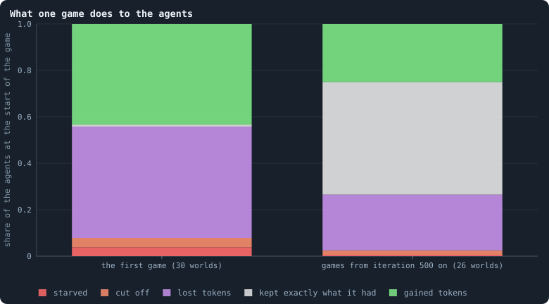
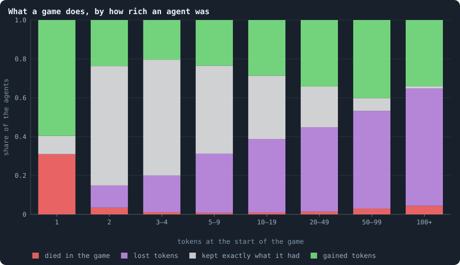
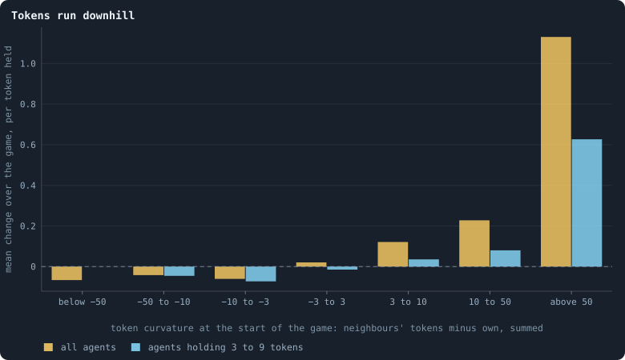
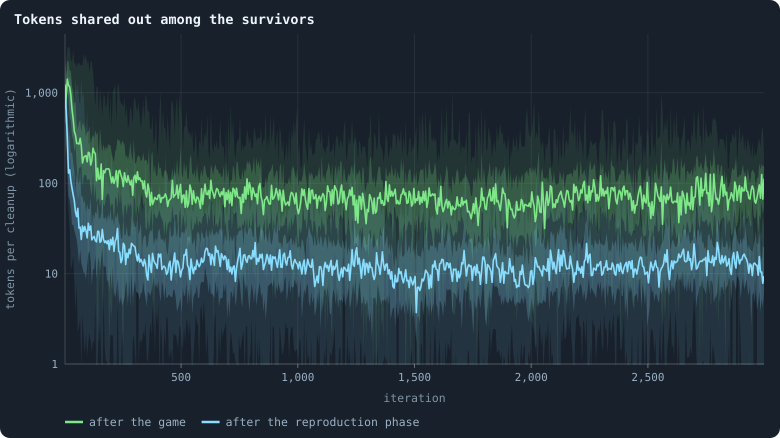

# Gains and losses

In every game every agent stakes **all** of its tokens, on its own node and on
its neighbours' ([Chapter 3](03-one-iteration.md)), and every node ends the
game holding exactly the tokens staked on it. So a game reshuffles every token
of the world, every iteration. This chapter asks what that does to the agents
one by one: who gains, who loses, who dies — and whether there is a law to it.

> [!question] Questions of this chapter
> - What does one game do to the agents: how many die, lose, keep exactly what
>   they had, or gain?
> - Does that depend on how rich an agent is?
> - Do tokens run "downhill", from agents richer than their neighbours to
>   agents poorer than them?
> - How large is the lottery in which the tokens of the dead are dealt out?

<!-- runs E02 -->
> [!info] The runs behind this chapter
> **30 runs.** Every condition below is run once for every seed (1 to 30), for 3,000 iterations — or until its world dies out. Every setting is that of the baseline **B1** (the algorithm exactly as a new run is offered it) unless the condition changes it.
>
> - **baseline** — changes nothing: B1 as it is; 10,000 tokens. Runs `B1-10000-s001` … `B1-10000-s030`.
>
> To make these runs again: `python3 gol_lab.py run E02`, or ▶ in the Book tab of a computer running `gol_server.py`. Each run writes its settings, seed and engine version beside its frames, in `GraphOfLifeRuns/<run>/meta.json` and `provenance.json`.

> [!info]- Every setting of these runs
> | setting | baseline | what it is |
> |---|---|---|
> | [`total_tokens`](../notes/settings.md#total_tokens) | 10,000 | The number of tokens in the world, *T*. It never changes during a run. |
> | [`n_nodes`](../notes/settings.md#n_nodes) | 0 | How many founders the world starts with. 0 means one founder per hundred tokens: *n* = ⌊*T* / 100⌋. |
> | [`k_neighbors`](../notes/settings.md#k_neighbors) | 0 | How many neighbours each founder starts with in the ring. 0 means *k* = max(⌊*n* / 100⌋, 5); an odd *k* is wired as *k* − 1. |
> | [`rewire_p`](../notes/settings.md#rewire_p) | 0.2 | In the starting ring, the probability that a connection is moved to a founder chosen at random (Watts–Strogatz). |
> | [`hidden_layers`](../notes/settings.md#hidden_layers) | 50, 45, 40, 35, 30 | The widths of the brain's hidden layers, in order from input to output. |
> | [`brain_kind`](../notes/settings.md#brain_kind) | float16 | How weights are stored: `float` (64-bit), `float16` (16-bit, computed in 64-bit) or `binary` (−1, 0, +1). |
> | [`brain_bits`](../notes/settings.md#brain_bits) | 16 | Only for binary brains: how many input rows encode one number. Unused by float and float16 brains. |
> | [`message_amount`](../notes/settings.md#message_amount) | 30 | How many numbers one message holds. Each agent sends one message to itself and one to each neighbour, every phase. |
> | [`random_input_amount`](../notes/settings.md#random_input_amount) | 5 | How many random numbers, drawn uniformly from −2 to 2, a brain reads per neighbour, every time it looks. |
> | [`exchange_messages`](../notes/settings.md#exchange_messages) | on | Whether agents send and read messages at all. |
> | [`message_prepass`](../notes/settings.md#message_prepass) | on | Whether every phase begins with an extra look in which agents only write messages, so the look that acts reads messages written this phase. |
> | [`allow_handover`](../notes/settings.md#allow_handover) | on | Whether a parent may move some of its own connections to its newborn child. |
> | [`allow_revolutions`](../notes/settings.md#allow_revolutions) | on | Whether a coalition of smaller stakers can take a node from its largest staker (see the note *How a coalition takes a node*). |
> | [`allow_gifting`](../notes/settings.md#allow_gifting) | off | Whether agents may give tokens to neighbours during reproduction. Off in every run of this book. |
> | [`random_decisions`](../notes/settings.md#random_decisions) | off | The control: every number a brain would produce is replaced by a random draw from the standard normal distribution. |
> | [`prune_after`](../notes/settings.md#prune_after) | blotto | After which phase connections that carried no tokens are cut: `blotto` (the game), `reproduction`, or `both`. |
> | [`inactive_window`](../notes/settings.md#inactive_window) | phase | How long a connection may go unused: `phase` means it must carry tokens in the phase being judged; `iteration` allows the two last phases. |
> | [`redistribution`](../notes/settings.md#redistribution) | uniform | How the tokens of removed agents are shared: `uniform` gives every survivor the same chance at each token; `by_tokens` weights by what a survivor holds. |
> | [`tokens_created_per_phase`](../notes/settings.md#tokens_created_per_phase) | 0 | Tokens added to the world at every cleanup. 0 keeps the supply fixed. |
> | [`mutation_probability`](../notes/settings.md#mutation_probability) | 0.2 | The probability that a brain changes when it is copied to a child, and again, for every brain, after every game. |
> | [`mutation_noise_std`](../notes/settings.md#mutation_noise_std) | 0.2 | How large a change to one weight is: a normal draw with standard deviation this times 1/√(fan-in) of its layer. |
> | [`mutation_sparsity`](../notes/settings.md#mutation_sparsity) | 0.1 | The share of a brain's numbers a change touches; also the probability, for each weight matrix and bias vector, of a rarer reset that redraws that share of it. |
> | [`extinction_threshold`](../notes/settings.md#extinction_threshold) | 20 | A run stops, as extinct, when an iteration ends (after its game) with this many agents or fewer. |
> | seeds | 1 to 30 | one run per seed |
> | iterations | 3,000 | how far each run goes, unless its world dies first |
>
> A value in **bold** differs from the baseline B1.
<!-- /runs -->

## The bookkeeping of a game

Write *a*(*u* → *v*) for the tokens agent *u* stakes on node *v* (where *v*
is *u* itself or one of its neighbours). Every agent stakes everything, so
Σᵥ *a*(*u* → *v*) = τᵤ, its tokens at the start. After the game node *u* holds
the stakes on it, so its change is

$$
\Delta_u \;=\; \underbrace{\sum_{v \ne u} a(v \to u)}_{\text{staked on } u \text{ by others}} \;-\; \underbrace{\sum_{v \ne u} a(u \to v)}_{\text{staked by } u \text{ on others}} .
$$

What an agent puts on its own node it keeps; what it puts elsewhere it loses;
what others put on it it gains. **An example.** A holds 6 tokens and B 2, and
they are neighbours. A stakes 3 at home and 3 on B; B stakes 1 at home and 1
on A. After the game A's node holds 3 + 1 = 4 (Δ = −2) and B's 1 + 3 = 4
(Δ = +2). Had A put 5 at home and only 1 on B, the two stakes across the
connection would have matched, and neither balance would have changed (A:
5 + 1 = 6, B: 1 + 1 = 2). Exactly-zero changes come from exactly that: what
goes out comes back.

Who *wins* a node — whose brain it takes — is a separate matter
([How a coalition takes a node](../notes/revolution.md)): the tokens are the
node's whoever wins it. This chapter is about the tokens; the identity of an
agent here is its node, as in the frames.

## What one game does

<!-- figure gains/outcome -->

**What one game does to the agents.** Every agent alive at the start of a game ends it in one of five ways: it starved (no one staked on its node), it was cut off from the largest piece of the network, or it survived holding fewer tokens, exactly as many, or more than before. Left: the game of iteration 0 in all 30 worlds. Right: every game from iteration 500 on in the 26 worlds that lived to the end, pooled.

> [!example]- How to make this figure
> **Runs.** The 30 baseline runs `B1-10000-s001` … `B1-10000-s030`: the baseline B1 at 10,000 tokens, seeds 1 to 30, 3,000 iterations each (every setting is listed in [Chapter 9](09-thirty-worlds.md)). They are made with `python3 gol_lab.py run E02`.
>
> **Data.** From each run's `GraphOfLifeRuns/<run>/stats.jsonl`, which holds one row per recorded phase: `phase` 1 is the world just after reproduction, `phase` 2 just after the game, and every statistic is a field of the row (see [What a run records](../notes/frames-and-stats.md)).
>
> 1. Take the rows with `phase` = 2 (iteration 0, or 500 to 2,999).
> 2. Sum over them: `nodes_before` (agents at the start), `starved`, `orphaned`, `gainers`, `losers`, and `nodes` − `gainers` − `losers` (survivors whose tokens did not change).
> 3. Divide each sum by the sum of `nodes_before` and stack the shares.
>
> **To make it again:** `python3 book_figures.py gains`.
<!-- /figure -->

The first game is violent. Of the agents alive at its start, 3.8% starve —
nobody, not even they themselves, staked on their node — and 4.0% are cut off
from the network; 48% lose tokens and 43% gain; fewer than one in a hundred
come out with exactly what they had.

Settled games are calm. 0.6% starve and 1.9% are cut off; 24% lose and 25%
gain; and **48% of the agents end the game with exactly the tokens they began
with**. Nearly half the world is, in tokens, untouched by a game in which every
token was staked. That is not because they stake nothing on their neighbours —
70% of staked tokens go to neighbours ([Chapter 14](14-where-do-the-tokens-go.md)) —
but because what they send out comes back in equal measure
([Chapter 21](21-where-the-tokens-flow.md) counts how much of the flow is
returned).

In numbers per game in a settled world of about 1,300: some 330 agents gain,
320 lose; the largest single gain is about 640 tokens and the largest loss
about 620 — a hub's worth, changing hands in one game.

## Rich and poor

<!-- figure gains/by-tokens -->

**What a game does, by how rich an agent was.** Agents alive at the start of a game, sorted by the tokens they held then; for each class, the share that died in the game (starved or cut off), and of the rest the shares that lost tokens, kept exactly as many, or gained. From the games of every 100th iteration from 500 on, in the 26 worlds that lived to the end (848,232 agents in all).

> [!example]- How to make this figure
> **Runs.** The 26 surviving ones of the 30 baseline runs `B1-10000-s001` … `B1-10000-s030`: the baseline B1 at 10,000 tokens, seeds 1 to 30, 3,000 iterations each (every setting is listed in [Chapter 9](09-thirty-worlds.md)). They are made with `python3 gol_lab.py run E02`.
>
> **Data.** From each run's frames, read every 25 iterations by `book_figures.sample_pass` (frame `2·t` after the reproduction phase of iteration *t*, frame `2·t + 1` after its game; `gol_store.read_frame(run, index)`).
>
> 1. For every 100th iteration t from 500 on, take each agent in frame `2·t` (the start of the game) with its `tokens`.
> 2. Find it in frame `2·t + 1`: if it is not there, it died in the game; if it is, its `delta` there is its change over the game.
> 3. Sort the agents by their tokens at the start into the classes shown, and count the four outcomes in each class.
>
> **To make it again:** `python3 book_figures.py gains`.
<!-- /figure -->

The picture changes completely with wealth.

- **One token.** An agent with a single token can stake it at home or on one
  neighbour. It cannot lose without dying: if it sends its token away and
  nobody stakes on it, its node holds nothing. 31% of 1-token agents die in a
  game; 60% gain; only 9% stay at 1. The survivors gain a lot: their tokens
  grow by 416% on average — a node with one token on it and a neighbour's
  stake besides holds several times what it had.
- **The middle.** Agents with 2 to 9 tokens mostly keep exactly what they had
  (45% to 61%) and die rarely (0.8% to 3.4%).
- **The rich.** Agents with 100 tokens or more lose in 60% of games, gain in
  34%, almost never keep exactly what they had (1.2%) — and on average their
  tokens shrink by 44% in one game. Those with 50 to 99 shrink by 13%.

The risk of dying is U-shaped: high for the poorest, lowest in the middle,
higher again for the rich — 4.4% per game for agents with 100 tokens or more.
Which rich agents die? Almost only those with few connections: of the rich
agents in the sample with one or two connections, 9.9% died in the game; with
three to nine, 2.2%; with ten or more, 0.8%. A rich agent with one connection
dies in one of two ways, both visible in the rules: it puts all its tokens on
its neighbour and nobody stakes on it (it starves — its tokens are not lost,
they moved to the neighbour's node), or its connection carries nothing and is
cut, and it is cut off with its tokens.

If the rich lose 44% per game, why is there always a rich tenth holding 44%
of the tokens ([Chapter 14](14-where-do-the-tokens-go.md))? Because the rich
are replaced as fast as they shrink: tokens pile up again wherever there are
many connections. Who is rich is mostly a matter of **where** an agent is.
[Chapter 21](21-where-the-tokens-flow.md) shows the law behind it.

## Tokens run downhill

How does an agent's wealth compare with its neighbours'? The **token
curvature** ([Token curvature](../notes/token-curvature.md)) adds up, over its
neighbours, how many more tokens each holds than it does:

$$
\kappa(u) = \sum_{v \in N(u)} (\tau_v - \tau_u) .
$$

It is negative for an agent on a hill (richer than its neighbourhood),
positive for one in a valley.

<!-- figure gains/downhill -->

**Tokens run downhill.** The token curvature of an agent is the sum, over its neighbours, of how many more tokens the neighbour holds than it does ([Token curvature](../notes/token-curvature.md)): negative for an agent richer than its neighbourhood, positive for one poorer. For each class of curvature, the mean change of an agent's tokens over the game divided by the tokens it held at the start, over the agents that survived the game. Yellow: all agents; cyan: only agents that held 3 to 9 tokens, so that wealth itself cannot explain the pattern. A class with fewer than 1,000 agents is left out (drawn at 0).

> [!example]- How to make this figure
> **Runs.** The 26 surviving ones of the 30 baseline runs `B1-10000-s001` … `B1-10000-s030`: the baseline B1 at 10,000 tokens, seeds 1 to 30, 3,000 iterations each (every setting is listed in [Chapter 9](09-thirty-worlds.md)). They are made with `python3 gol_lab.py run E02`.
>
> **Data.** From each run's frames, read every 25 iterations by `book_figures.sample_pass` (frame `2·t` after the reproduction phase of iteration *t*, frame `2·t + 1` after its game; `gol_store.read_frame(run, index)`).
>
> 1. For every 100th iteration t from 500 on, read frame `2·t`: for every agent u, κ(u) = Σ over its neighbours v of (τ(v) − τ(u)).
> 2. Find each agent in frame `2·t + 1` and take its `delta` (agents not there died and are left out).
> 3. Sort by κ into the classes shown and average `delta` / τ(u) in each.
>
> **To make it again:** `python3 book_figures.py gains`.
<!-- /figure -->

The tokens run downhill. Agents in deep valleys (κ > 50) gain 113% on
average in a game; agents on hills (κ < −50) lose 6.6%. Is that only because
valleys are poor and hills rich, and we saw above that the poor gain? The cyan
line answers: among agents that all hold 3 to 9 tokens, those in valleys still
gain (+63% above κ = 50) and those on hills still lose (−7% between −10 and
−3).

There is a reason to expect exactly this. Suppose every agent split its
tokens evenly over its own node and its *d* neighbours, and every agent had
the same number *d*. Node *u* would receive τᵤ/(*d*+1) from itself and
τᵥ/(*d*+1) from each neighbour, so

$$
\Delta_u = \frac{\tau_u + \sum_{v \in N(u)} \tau_v}{d+1} - \tau_u = \frac{\kappa(u)}{d+1} .
$$

The change would be **proportional to the curvature**: the discrete heat
equation, in which heat flows from warm to cold in proportion to the
difference. Real agents do not split exactly evenly, and degrees differ —
which is why the relation is a tendency and not a law — but
[Chapter 21](21-where-the-tokens-flow.md) shows how close to an even split the
brains in fact play.

## The lottery

When the cleanup removes the agents cut off from the network, their tokens
are pooled and dealt out, token by token, to survivors chosen at random
([Gains and losses](../notes/gains-and-losses.md)).

<!-- figure gains/lottery -->

**Tokens shared out among the survivors.** How many tokens the cleanup dealt out at random among the survivors — the tokens of the agents that were cut off — after each game (green) and after each reproduction phase (cyan), on a logarithmic axis. For each, the line is the median of the worlds at each iteration, the darker band holds the middle half of them (from the 25th to the 75th percentile) and the paler band nine in ten (5th to 95th).

> [!example]- How to make this figure
> **Runs.** The 30 baseline runs `B1-10000-s001` … `B1-10000-s030`: the baseline B1 at 10,000 tokens, seeds 1 to 30, 3,000 iterations each (every setting is listed in [Chapter 9](09-thirty-worlds.md)). They are made with `python3 gol_lab.py run E02`.
>
> **Data.** From each run's `GraphOfLifeRuns/<run>/stats.jsonl`, which holds one row per recorded phase: `phase` 1 is the world just after reproduction, `phase` 2 just after the game, and every statistic is a field of the row (see [What a run records](../notes/frames-and-stats.md)).
>
> 1. Take `redistributed` of the rows with `phase` = 2 and of those with `phase` = 1.
> 2. Cut the iterations into stretches of 5 (600 stretches over 3,000 iterations) and take each world's mean in each stretch.
> 3. In each stretch, take the median, the 25th and 75th and the 5th and 95th percentiles of those means over the worlds that still have a value there (a world that died has none after its death).
>
> **To make it again:** `python3 book_figures.py gains`.
<!-- /figure -->

In a settled world, about 110 tokens are dealt out after each game and about
20 after each reproduction phase. Per agent and game that is 0.11 tokens (the
26 worlds: 0.07 to 0.22) — on average one token every nine games. Small: but
half of all agents hold 4 tokens or fewer, and for an agent with 1 token, one
lottery token doubles its wealth. The share-out is a small basic income that
matters only to the poor.

## What this means

- **A game is mostly diffusion.** Tokens flow from agents richer than their
  neighbourhood to agents poorer than it, nearly half the agents end a game
  with exactly what they had, and the rich lose ground every game. A world
  works, in tokens, much like heat spreading through a network.
- **Wealth is a place, not a memory.** If an agent's tokens drain back to its
  neighbourhood within a few games, its wealth cannot record that its brain
  did well in the past. For evolution, that matters: selection needs
  differences in success that last long enough to be inherited
  ([Meta II](30-meta-2.md)).
- **The poor live on a knife's edge.** A third of 1-token agents die in every
  game; the survivors multiply their tokens. Being poor in this world is not a
  slow decline, it is a coin toss.

To make every figure of this chapter: `python3 book_figures.py gains`.

<!-- turns -->
---

← [Chapter 19 · How even is a world?](19-how-even-is-a-world.md) · [Contents](../README.md) · [Chapter 21 · Where the tokens flow](21-where-the-tokens-flow.md) →
<!-- /turns -->
