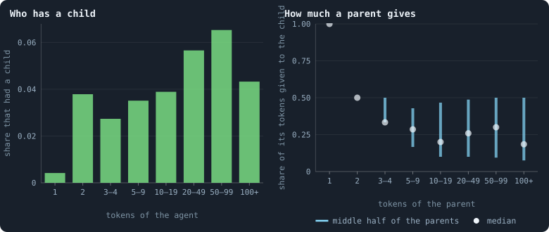
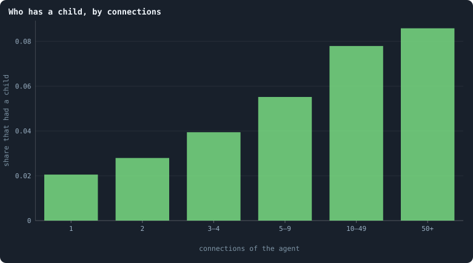
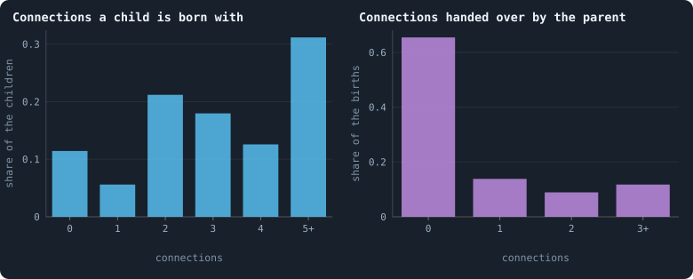
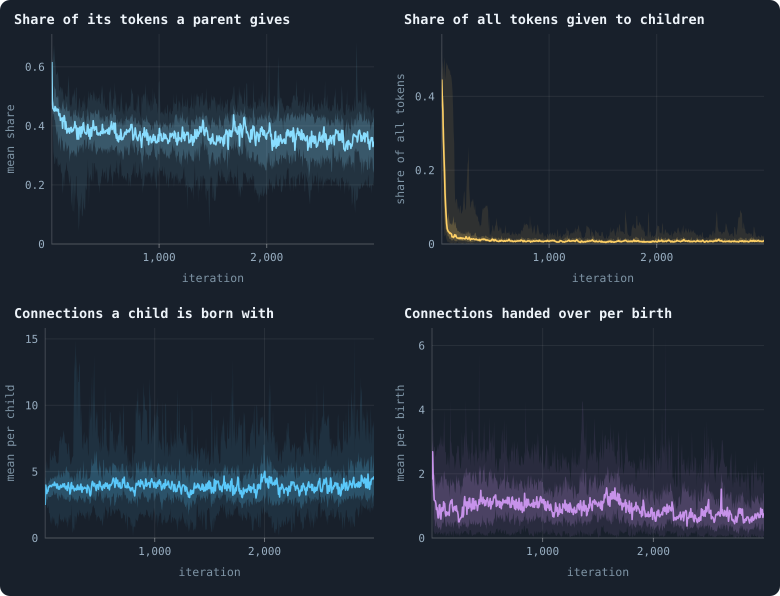

# How agents have children

Every iteration begins with a reproduction phase, in which any agent may have
one child ([Chapter 3](03-one-iteration.md)). [Chapter 11](11-births-deaths-and-ages.md)
counted the births. This chapter looks at the decisions behind them: who has
a child, how much it gives, how the child is joined to the world — and what
births do for the world besides adding agents.

> [!question] Questions of this chapter
> - Which agents have children: the rich, the well connected, anyone?
> - How much of its tokens does a parent give, and why do some shares come up
>   again and again?
> - How is a child joined to the world, and how often is it born cut off?
> - What would the world look like without births?

<!-- runs E02 -->
> [!info] The runs behind this chapter
> **30 runs.** Every condition below is run once for every seed (1 to 30), for 3,000 iterations — or until its world dies out. Every setting is that of the baseline **B1** (the algorithm exactly as a new run is offered it) unless the condition changes it.
>
> - **baseline** — changes nothing: B1 as it is; 10,000 tokens. Runs `B1-10000-s001` … `B1-10000-s030`.
>
> To make these runs again: `python3 gol_lab.py run E02`, or ▶ in the Book tab of a computer running `gol_server.py`. Each run writes its settings, seed and engine version beside its frames, in `GraphOfLifeRuns/<run>/meta.json` and `provenance.json`.

> [!info]- Every setting of these runs
> | setting | baseline | what it is |
> |---|---|---|
> | [`total_tokens`](../notes/settings.md#total_tokens) | 10,000 | The number of tokens in the world, *T*. It never changes during a run. |
> | [`n_nodes`](../notes/settings.md#n_nodes) | 0 | How many founders the world starts with. 0 means one founder per hundred tokens: *n* = ⌊*T* / 100⌋. |
> | [`k_neighbors`](../notes/settings.md#k_neighbors) | 0 | How many neighbours each founder starts with in the ring. 0 means *k* = max(⌊*n* / 100⌋, 5); an odd *k* is wired as *k* − 1. |
> | [`rewire_p`](../notes/settings.md#rewire_p) | 0.2 | In the starting ring, the probability that a connection is moved to a founder chosen at random (Watts–Strogatz). |
> | [`hidden_layers`](../notes/settings.md#hidden_layers) | 50, 45, 40, 35, 30 | The widths of the brain's hidden layers, in order from input to output. |
> | [`brain_kind`](../notes/settings.md#brain_kind) | float16 | How weights are stored: `float` (64-bit), `float16` (16-bit, computed in 64-bit) or `binary` (−1, 0, +1). |
> | [`brain_bits`](../notes/settings.md#brain_bits) | 16 | Only for binary brains: how many input rows encode one number. Unused by float and float16 brains. |
> | [`message_amount`](../notes/settings.md#message_amount) | 30 | How many numbers one message holds. Each agent sends one message to itself and one to each neighbour, every phase. |
> | [`random_input_amount`](../notes/settings.md#random_input_amount) | 5 | How many random numbers, drawn uniformly from −2 to 2, a brain reads per neighbour, every time it looks. |
> | [`exchange_messages`](../notes/settings.md#exchange_messages) | on | Whether agents send and read messages at all. |
> | [`message_prepass`](../notes/settings.md#message_prepass) | on | Whether every phase begins with an extra look in which agents only write messages, so the look that acts reads messages written this phase. |
> | [`allow_handover`](../notes/settings.md#allow_handover) | on | Whether a parent may move some of its own connections to its newborn child. |
> | [`allow_revolutions`](../notes/settings.md#allow_revolutions) | on | Whether a coalition of smaller stakers can take a node from its largest staker (see the note *How a coalition takes a node*). |
> | [`allow_gifting`](../notes/settings.md#allow_gifting) | off | Whether agents may give tokens to neighbours during reproduction. Off in every run of this book. |
> | [`random_decisions`](../notes/settings.md#random_decisions) | off | The control: every number a brain would produce is replaced by a random draw from the standard normal distribution. |
> | [`prune_after`](../notes/settings.md#prune_after) | blotto | After which phase connections that carried no tokens are cut: `blotto` (the game), `reproduction`, or `both`. |
> | [`inactive_window`](../notes/settings.md#inactive_window) | phase | How long a connection may go unused: `phase` means it must carry tokens in the phase being judged; `iteration` allows the two last phases. |
> | [`redistribution`](../notes/settings.md#redistribution) | uniform | How the tokens of removed agents are shared: `uniform` gives every survivor the same chance at each token; `by_tokens` weights by what a survivor holds. |
> | [`tokens_created_per_phase`](../notes/settings.md#tokens_created_per_phase) | 0 | Tokens added to the world at every cleanup. 0 keeps the supply fixed. |
> | [`mutation_probability`](../notes/settings.md#mutation_probability) | 0.2 | The probability that a brain changes when it is copied to a child, and again, for every brain, after every game. |
> | [`mutation_noise_std`](../notes/settings.md#mutation_noise_std) | 0.2 | How large a change to one weight is: a normal draw with standard deviation this times 1/√(fan-in) of its layer. |
> | [`mutation_sparsity`](../notes/settings.md#mutation_sparsity) | 0.1 | The share of a brain's numbers a change touches; also the probability, for each weight matrix and bias vector, of a rarer reset that redraws that share of it. |
> | [`extinction_threshold`](../notes/settings.md#extinction_threshold) | 20 | A run stops, as extinct, when an iteration ends (after its game) with this many agents or fewer. |
> | seeds | 1 to 30 | one run per seed |
> | iterations | 3,000 | how far each run goes, unless its world dies first |
>
> A value in **bold** differs from the baseline B1.
<!-- /runs -->

## A birth, decision by decision

Recall how agent *u*, holding τ tokens, has a child. Its brain gives one
column of outputs for each of its candidates (itself and its neighbours).

1. **How much.** Two of the outputs, averaged over all the columns, give
   (*ā*, *b̄*), and the child gets *c* = ⌊*f*(*ā*, *b̄*) · τ⌋ tokens, where *f*
   is the share function: the positive part of *ā* as a share of the positive
   parts of both, or ½ if neither is positive
   ([The share function](../notes/share-function.md)). If *c* = 0 there is no
   child.
2. **Whom it joins.** For every candidate, the parent included, a yes-or-no
   decision: join the child to it or not.
3. **What it is handed.** For every neighbour of the parent, a yes-or-no
   decision: move the parent's connection to that neighbour over to the child.

Two consequences follow from the arithmetic alone, before any data:

- **A poor agent can only give a lot.** With 1 token, *c* ≥ 1 needs *f* = 1:
  the parent gives its only token and starves. With 2 tokens, *c* ≥ 1 needs
  *f* ≥ ½: it gives half or everything. Only a richer agent can give a small
  share.
- **"All", "half" and "nothing" are easy to say.** *f* is exactly 1 when *ā*
  is positive and *b̄* is not, exactly ½ when neither is positive. A brain
  does not need to compute a ratio to give half; it only needs two negative
  numbers.

## Who has a child

<!-- figure children/by-tokens -->

**Children, by the wealth of the parent.** Agents alive at the start of the reproduction phases of every 100th iteration from 500 on, in the 26 worlds that lived to the end, sorted by the tokens they held. Left: the share of them that had a child. Right: for those that did, the share of their tokens they gave it — the white dot is the median, the cyan bar runs from the 25th to the 75th percentile.

> [!example]- How to make this figure
> **Runs.** The 26 surviving ones of the 30 baseline runs `B1-10000-s001` … `B1-10000-s030`: the baseline B1 at 10,000 tokens, seeds 1 to 30, 3,000 iterations each (every setting is listed in [Chapter 8](08-thirty-worlds.md)). They are made with `python3 gol_lab.py run E02`.
>
> **Data.** From each run's frames, read every 25 iterations by `book_figures.sample_pass` (frame `2·t` after the reproduction phase of iteration *t*, frame `2·t + 1` after its game; `gol_store.read_frame(run, index)`).
>
> 1. For every 100th iteration t from 500 on, take the agents of frame `2·t − 1` (after the game before) with their `tokens`.
> 2. In frame `2·t`, `decisions.births` lists every parent (`agent`) with `tokens_before` and `invested`, the tokens its child got.
> 3. Per class of tokens: the share of agents that are parents, and the quantiles of `invested` / `tokens_before` over the parents.
>
> **To make it again:** `python3 book_figures.py children`.
<!-- /figure -->

In the first reproduction phase, three founders in four (74.7%) had a child.
In a settled world, only a few agents in a hundred do in any one phase:

| tokens | 1 | 2 | 3–4 | 5–9 | 10–19 | 20–49 | 50–99 | 100+ |
|---|---|---|---|---|---|---|---|---|
| had a child | 0.4% | 3.8% | 2.7% | 3.5% | 3.9% | 5.7% | 6.5% | 4.3% |
| median share given | 1 | ½ | ⅓ | 0.29 | 0.2 | 0.26 | 0.3 | 0.18 |

The 1-token parents all give their only token — and starve for it. The
2-token parents mostly give half. From 3 tokens on, the median share falls to
a third, then to a fifth to a quarter for the richer; but the spread is wide
(the bars run up to ½ in every class from 20 tokens on). The mean over all
parents is 37% of what they hold.

Wealth helps a little: an agent with 50 to 99 tokens is more than twice as
likely to have a child as one with 3 or 4. Connections help more:

<!-- figure children/by-degree -->

**Who has a child, by connections.** As the left panel of the figure above, with the agents sorted by their number of connections at the start of the reproduction phase instead of their tokens.

> [!example]- How to make this figure
> **Runs.** The 26 surviving ones of the 30 baseline runs `B1-10000-s001` … `B1-10000-s030`: the baseline B1 at 10,000 tokens, seeds 1 to 30, 3,000 iterations each (every setting is listed in [Chapter 8](08-thirty-worlds.md)). They are made with `python3 gol_lab.py run E02`.
>
> **Data.** From each run's frames, read every 25 iterations by `book_figures.sample_pass` (frame `2·t` after the reproduction phase of iteration *t*, frame `2·t + 1` after its game; `gol_store.read_frame(run, index)`).
>
> 1. As for the figure above, counting each agent's connections in frame `2·t − 1`.
>
> **To make it again:** `python3 book_figures.py children`.
<!-- /figure -->

From 2.1% of agents with one connection to 8.6% of agents with fifty or more,
a fourfold rise. Part of this is wealth — well-connected agents are richer
([Chapter 20](20-where-the-tokens-flow.md)) — and part is an effect of the
rules themselves: the child-share outputs are **averaged** over all of an
agent's candidates, so the decision of an agent with many neighbours is an
average of many columns, and an average behaves differently from a single
value. [Chapter 28](28-questioning-the-mechanics.md) comes back to it.

## How a child is joined

<!-- figure children/links -->

**How a child is joined to the world.** Every birth in the reproduction phases of every 100th iteration from 500 on, in the 26 worlds that lived to the end. Left: how many of its parent's candidates — the parent itself and its neighbours — the child was joined to at birth. Right: how many of its own connections the parent handed to the child. A child with no connection at all is cut off at once.

> [!example]- How to make this figure
> **Runs.** The 26 surviving ones of the 30 baseline runs `B1-10000-s001` … `B1-10000-s030`: the baseline B1 at 10,000 tokens, seeds 1 to 30, 3,000 iterations each (every setting is listed in [Chapter 8](08-thirty-worlds.md)). They are made with `python3 gol_lab.py run E02`.
>
> **Data.** From each run's frames, read every 25 iterations by `book_figures.sample_pass` (frame `2·t` after the reproduction phase of iteration *t*, frame `2·t + 1` after its game; `gol_store.read_frame(run, index)`).
>
> 1. In frame `2·t` of every 100th iteration t from 500 on, read `decisions.births`: the length of `links` and of `handed_over` for every birth.
> 2. Count the births by these lengths and divide by all births.
>
> **To make it again:** `python3 book_figures.py children`.
<!-- /figure -->

**11.4% of children are joined to no one.** They are not part of the
network, and the cleanup at the end of the phase removes them at once, with
the tokens they were given (which are shared out among the survivors). The
others are most often joined to two, three or four candidates, and 31% of all
children to five or more: 4.6 on average, pooled over the worlds, counting
the children joined to no one.

Most parents hand over nothing (65.5%); 14% hand over one connection, 9% two
and 12% three or more — about one per birth on average.

## Reproduction over a world's life

<!-- figure children/over-time -->

**Reproduction over a world's life.** After every reproduction phase of the 30 baseline worlds ([Reproduction statistics](../notes/reproduction-statistics.md)): the mean share of its tokens a parent gave its child (`meanInvestedShare`); the tokens given to all children as a share of all tokens (`reproTokenShare`); the mean number of connections a child was born with (`meanChildLinks`); and the connections handed over per birth (`handovers` / `births`). The line is the median of the worlds at each iteration, the darker band holds the middle half of them (from the 25th to the 75th percentile) and the paler band nine in ten (5th to 95th).

> [!example]- How to make this figure
> **Runs.** The 30 baseline runs `B1-10000-s001` … `B1-10000-s030`: the baseline B1 at 10,000 tokens, seeds 1 to 30, 3,000 iterations each (every setting is listed in [Chapter 8](08-thirty-worlds.md)). They are made with `python3 gol_lab.py run E02`.
>
> **Data.** From each run's `GraphOfLifeRuns/<run>/stats.jsonl`, which holds one row per recorded phase: `phase` 1 is the world just after reproduction, `phase` 2 just after the game, and every statistic is a field of the row (see [What a run records](../notes/frames-and-stats.md)).
>
> 1. Take the rows with `phase` = 1: `meanInvestedShare`, `reproTokenShare`, `meanChildLinks`, and `handovers` divided by `births`.
> 2. Cut the iterations into stretches of 5 (600 stretches over 3,000 iterations) and take each world's mean in each stretch.
> 3. In each stretch, take the median, the 25th and 75th and the 5th and 95th percentiles of those means over the worlds that still have a value there (a world that died has none after its death).
>
> **To make it again:** `python3 book_figures.py children`.
<!-- /figure -->

Over the settled life, the median world's parents give 37% of what they hold;
all the tokens given to children in one phase are 1.1% of the world's tokens;
and its children are born with 4.2 connections on average. Births move little
wealth.

## Births build the network

One fact about the rules makes births more important than their numbers
suggest. Look at where connections come from: the game only **removes** them
(a connection that carries nothing is cut); a handover only **moves** one —
or removes it, if the child is already joined to that neighbour. The only rule
that **adds** connections is a birth. Apart from the starting
ring, **every connection in a world was made at a birth.**

So the network is grown by births and pruned by games. In a settled world,
about 39 children are born per iteration with about 4.2 connections each —
some 165 new connections — while each game cuts about 117 unused ones, and the
dead take theirs with them. The two balance, and the number of connections
wanders but does not drift ([Chapter 9](09-a-worlds-life.md)). A world
without births could only lose connections, never gain one.

## What this means

- **Reproduction is rare, and cheap for the world.** Three or four agents in
  a hundred have a child in a phase, and children take about 1% of the tokens.
  Founders, with random brains and 100 tokens each, reproduced some twenty
  times as often: something over the world's youth made brains that
  reproduce less.
- **Births are how the network grows.** Every connection beyond the starting
  ring was made at a birth; births are the world's only source of structure.
- **Births are not the main road of inheritance.** About 39 children are born
  per iteration, but about 720 nodes take a neighbour's brain in every game
  ([Chapter 28](28-questioning-the-mechanics.md)). A brain spreads by
  conquest twenty times more than by birth. In most models of evolution,
  reproduction is where heredity and variation happen; here, it is a side
  road. [Meta II](29-meta-2.md) asks what that means for open-ended
  evolution.

To make every figure of this chapter: `python3 book_figures.py children`.

<!-- turns -->
---

← [Chapter 20 · Where the tokens flow](20-where-the-tokens-flow.md) · [Contents](../README.md) · [Chapter 22 · Power laws, real and apparent](22-power-laws-real-and-apparent.md) →
<!-- /turns -->
