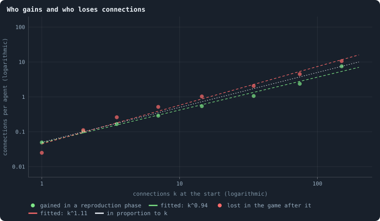
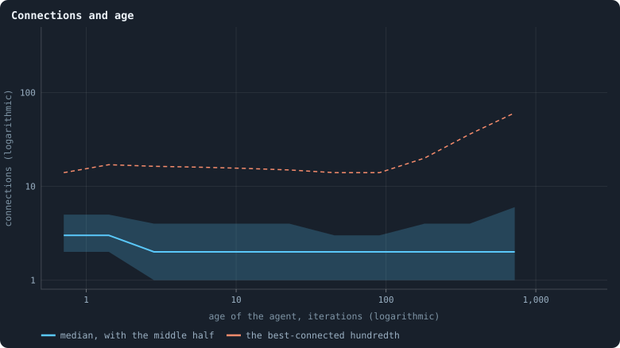

# How the network grows

The network of a world is not given. It is made and unmade by the rules,
connection by connection. Connections are **made** in only one place: in
the reproduction phase, when a newborn child is joined to some of its
parent's candidates and the parent may hand it some of its own connections.
They are **lost** in two: after the game, when a connection that carried no
tokens is cut, and whenever an agent dies, taking its connections with it
([Chapter 3](03-one-iteration.md)). [Chapter 16](16-what-shape-does-the-network-take.md)
described the shape that results. This chapter watches the making and the
unmaking, and asks the question that decides the shape: who gains
connections, and who loses them?

> [!question] Questions of this chapter
> - Do the well connected gain more connections than the poorly connected?
>   In proportion to what they have?
> - Do they lose them in proportion too?
> - Do agents gather connections as they grow old, so that the oldest are
>   the hubs?

<!-- runs E02 -->
> [!info] The runs behind this chapter
> **30 runs.** Every condition below is run once for every seed (1 to 30), for 3,000 iterations — or until its world dies out. Every setting is that of the baseline **B1** (the algorithm exactly as a new run is offered it) unless the condition changes it.
>
> - **baseline** — changes nothing: B1 as it is; 10,000 tokens. Runs `B1-10000-s001` … `B1-10000-s030`.
>
> To make these runs again: `python3 gol_lab.py run E02`, or ▶ in the Book tab of a computer running `gol_server.py`. Each run writes its settings, seed and engine version beside its frames, in `GraphOfLifeRuns/<run>/meta.json` and `provenance.json`.

> [!info]- Every setting of these runs
> | setting | baseline | what it is |
> |---|---|---|
> | [`total_tokens`](../notes/settings.md#total_tokens) | 10,000 | The number of tokens in the world, *T*. It never changes during a run. |
> | [`n_nodes`](../notes/settings.md#n_nodes) | 0 | How many founders the world starts with. 0 means one founder per hundred tokens: *n* = ⌊*T* / 100⌋. |
> | [`k_neighbors`](../notes/settings.md#k_neighbors) | 0 | How many neighbours each founder starts with in the ring. 0 means *k* = max(⌊*n* / 100⌋, 5); an odd *k* is wired as *k* − 1. |
> | [`rewire_p`](../notes/settings.md#rewire_p) | 0.2 | In the starting ring, the probability that a connection is moved to a founder chosen at random (Watts–Strogatz). |
> | [`hidden_layers`](../notes/settings.md#hidden_layers) | 50, 45, 40, 35, 30 | The widths of the brain's hidden layers, in order from input to output. |
> | [`brain_kind`](../notes/settings.md#brain_kind) | float16 | How weights are stored: `float` (64-bit), `float16` (16-bit, computed in 64-bit) or `binary` (−1, 0, +1). |
> | [`brain_bits`](../notes/settings.md#brain_bits) | 16 | Only for binary brains: how many input rows encode one number. Unused by float and float16 brains. |
> | [`message_amount`](../notes/settings.md#message_amount) | 30 | How many numbers one message holds. Each agent sends one message to itself and one to each neighbour, every phase. |
> | [`random_input_amount`](../notes/settings.md#random_input_amount) | 5 | How many random numbers, drawn uniformly from −2 to 2, a brain reads per neighbour, every time it looks. |
> | [`exchange_messages`](../notes/settings.md#exchange_messages) | on | Whether agents send and read messages at all. |
> | [`message_prepass`](../notes/settings.md#message_prepass) | on | Whether every phase begins with an extra look in which agents only write messages, so the look that acts reads messages written this phase. |
> | [`allow_handover`](../notes/settings.md#allow_handover) | on | Whether a parent may move some of its own connections to its newborn child. |
> | [`allow_revolutions`](../notes/settings.md#allow_revolutions) | on | Whether a coalition of smaller stakers can take a node from its largest staker (see the note *How a coalition takes a node*). |
> | [`allow_gifting`](../notes/settings.md#allow_gifting) | off | Whether agents may give tokens to neighbours during reproduction. Off in every run of this book. |
> | [`random_decisions`](../notes/settings.md#random_decisions) | off | The control: every number a brain would produce is replaced by a random draw from the standard normal distribution. |
> | [`prune_after`](../notes/settings.md#prune_after) | blotto | After which phase connections that carried no tokens are cut: `blotto` (the game), `reproduction`, or `both`. |
> | [`inactive_window`](../notes/settings.md#inactive_window) | phase | How long a connection may go unused: `phase` means it must carry tokens in the phase being judged; `iteration` allows the two last phases. |
> | [`redistribution`](../notes/settings.md#redistribution) | uniform | How the tokens of removed agents are shared: `uniform` gives every survivor the same chance at each token; `by_tokens` weights by what a survivor holds. |
> | [`tokens_created_per_phase`](../notes/settings.md#tokens_created_per_phase) | 0 | Tokens added to the world at every cleanup. 0 keeps the supply fixed. |
> | [`mutation_probability`](../notes/settings.md#mutation_probability) | 0.2 | The probability that a brain changes when it is copied to a child, and again, for every brain, after every game. |
> | [`mutation_noise_std`](../notes/settings.md#mutation_noise_std) | 0.2 | How large a change to one weight is: a normal draw with standard deviation this times 1/√(fan-in) of its layer. |
> | [`mutation_sparsity`](../notes/settings.md#mutation_sparsity) | 0.1 | The share of a brain's numbers a change touches; also the probability, for each weight matrix and bias vector, of a rarer reset that redraws that share of it. |
> | [`extinction_threshold`](../notes/settings.md#extinction_threshold) | 20 | A run stops, as extinct, when an iteration ends (after its game) with this many agents or fewer. |
> | seeds | 1 to 30 | one run per seed |
> | iterations | 3,000 | how far each run goes, unless its world dies first |
>
> A value in **bold** differs from the baseline B1.
<!-- /runs -->

## How a newborn is wired

Of 103,597 births in the reproduction phases of every 25th iteration from
500 on, **78%** of the children were joined to their own parent. 12% were
joined to no one, and are cut off at once
([Chapter 28](28-how-agents-have-children.md)). The rest were joined to two
to six of their parent's candidates, often more. A child is born into its
parent's neighbourhood and nowhere else.

That has a consequence worth stating exactly. Every connection the rules
make runs from a newborn to its parent or to one of its parent's
neighbours, and a handover only moves a parent's connection to its child.
So **no connection ever brings two agents that already lived closer
together**: two neighbours of a parent were at most two steps apart,
through the parent, before the child arrived, and the child adds only
another path of two steps. Distances in a world can grow, but new connections never shorten
them. This is why a world keeps a shape in space at all
([Chapter 23](23-how-many-dimensions-does-a-world-have.md)).

## Who gains and who loses

Sort the agents by their connections *k* at the start of a reproduction
phase, and count the connections each class gains in it. Then count the
connections each class loses in the game that follows. Divided by the
agents in the class, these are the **gain kernel** and the **loss kernel**
of the network ([Preferential attachment and its kernel](../notes/preferential-attachment.md)).

<!-- figure grows/kernel -->

**Who gains and who loses connections.** Agents sorted by their number of connections k at the start of a phase, in classes of growing width (dots at the middle of each class). Green: the new connections an agent alive before and after a reproduction phase gained in it, per agent — to its own newborn child, to a neighbour's child, or handed over. Red: the connections an agent had after the reproduction phase and no longer had after the game that followed — cut for carrying nothing, or gone with it if it died — per agent. Pooled over the reproduction phases and games of every 25th iteration from 500 on, in the 26 worlds that lived to the end. Dashed: straight lines fitted on these logarithmic axes; dotted: a line of slope 1, in proportion to k.

> [!example]- How to make this figure
> **Runs.** The 26 baseline worlds that lived to the end (`B1-10000-s001` … `-s030`, [Chapter 9](09-thirty-worlds.md); `python3 gol_lab.py run E02`).
>
> **Data.** From each run's frames, `GraphOfLifeRuns/<run>/frames/`, read with `gol_store.read_frame(run, index)`; frame `2·t` is iteration *t* after reproduction and frame `2·t + 1` after the game.
>
> 1. For t = 500, 525, …, 2,975 read frames 2·t − 1 (before the reproduction phase of t), 2·t (after it) and 2·t + 1 (after the game).
> 2. Gained: the edges in 2·t not in 2·t − 1, counted at both ends, for agents in both frames, by their degree in 2·t − 1. Lost: the edges in 2·t not in 2·t + 1, counted for agents of 2·t by their degree there (all of them if the agent is gone).
> 3. Sum over t and worlds per class, divide by the agents; least squares of ln(rate) on ln(class middle).
>
> **To make it again:** `python3 book_figures.py grows`.
<!-- /figure -->

Both are straight lines on logarithmic axes, over two decades of *k*:

- **Gains grow as k^0.94.** An agent with one connection gains 0.05 new ones
  per reproduction phase; with ten, about 0.5; with a hundred or more, 7.5.
  That is very nearly **linear preferential attachment**, the mechanism
  Barabási and Albert (1999) proposed for heavy-tailed networks.
  [Chapter 29](29-power-laws-real-and-apparent.md) suggested it would be
  found here, reached by copying. A child joins some of its parent's
  candidates, so an agent gains a connection whenever one of its neighbours
  has a child, and an agent with twice the neighbours has twice the chances.
  Now it is measured.
- **Losses grow as k^1.11**, a little faster than in proportion. From two
  connections on, every class loses at least as much in a game as it gained
  in the reproduction phase before. Hubs of a hundred connections or more
  gain 7.5 and lose 10.6. Only agents with a single connection gain more
  than they lose: 0.05 against 0.025.

So no agent can run away with the network. Linear preferential attachment
on its own makes a few nodes grow without limit, as in a growing web. Here
every gain is offset by losses that grow slightly faster, so the well
connected drift back down, and only agents with a single connection drift
up. The connections of an
agent go up and down by a random factor game after game, in a world whose
total is held in place by its tokens. Growth by random factors, kept off
zero from below, makes heavy tails (Gabaix 1999), and losses that grow
faster than gains bend the tail down at the top. That fits what
[Chapter 29](29-power-laws-real-and-apparent.md) found: a power-law tail of
exponent about 3 in the top twentieth of the connections, and nothing
scale-free below it.

## Connections and age

In the Barabási–Albert model the oldest nodes are the hubs. They had the
longest time to gather connections, and preferential attachment rewards the
early. Is that so here?

<!-- figure grows/age -->

**Connections and age.** The agents alive after the last game of the 26 worlds that lived to the end, sorted by age — the iterations since their node was born — in classes doubling in width: the median number of connections of each class, with the band from its 25th to its 75th percentile, and the 99th percentile (dashed).

> [!example]- How to make this figure
> **Runs.** The 26 baseline worlds that lived to the end (`B1-10000-s001` … `-s030`, [Chapter 9](09-thirty-worlds.md); `python3 gol_lab.py run E02`).
>
> **Data.** From each run's frames, `GraphOfLifeRuns/<run>/frames/`, read with `gol_store.read_frame(run, index)`; frame `2·t` is iteration *t* after reproduction and frame `2·t + 1` after the game.
>
> 1. Read frame 5,999 of each run: `ages`, and each agent's connections in `edges`.
> 2. Classes of age [0, 1), [1, 2), [2, 4), …, [1,024, 3,000); in each class with at least 30 agents, the median, quartiles and 99th percentile of the connections.
>
> **To make it again:** `python3 book_figures.py grows`.
<!-- /figure -->

For the typical agent, **no**. The median agent has 3 connections when it
is born and **2** at every age after that, from a few iterations to over
700. Across all agents, the correlation of age and connections (both as
logarithms) is −0.04, none at all.

For the very best connected, a little. The best-connected hundredth of
agents of any age up to a hundred iterations have 14 to 17 connections. The
best-connected hundredth of agents aged 362 have 36, and of agents aged 724,
61. The greatest hubs are old. But this is mostly survival, not
accumulation: a hub is far less likely to die than a leaf
([Chapter 20](20-do-the-rich-stay-rich.md)), so among the old the hubs are
overrepresented. Age gives an agent no connections; connections give it
age.

## What this means

- **The network grows by preferential attachment and shrinks by
  preferential loss.** Both are close to proportional to an agent's
  connections. What a node has, it gains more of, and loses more of.
- **There is no first-mover advantage.** Old agents are no better connected
  than young ones, except that the best connected live longest.
- **Growth is local.** A connection is only ever made inside a parent's
  neighbourhood, and never brings two agents closer together. That is what
  lets a world keep a geometry ([Chapter 23](23-how-many-dimensions-does-a-world-have.md)).
  A network that added connections between random agents would collapse
  into a small world in which everything is a few steps from everything.
- **For open-ended evolution**, the network is a churn of proportional
  gains and losses. Connections, which [Chapter 20](20-do-the-rich-stay-rich.md)
  found to be the only lasting form of wealth, are themselves turned over at
  every scale. No structure is built up that lasts longer than the agents in
  it.

To make every figure of this chapter: `python3 book_figures.py grows`.

<!-- turns -->
---

← [Chapter 20 · Do the rich stay rich?](20-do-the-rich-stay-rich.md) · [Contents](../README.md) · [Chapter 22 · Like next to like](22-like-next-to-like.md) →
<!-- /turns -->
