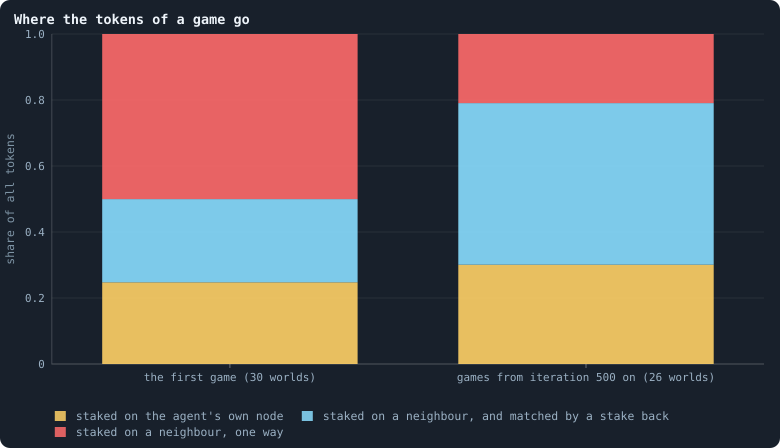
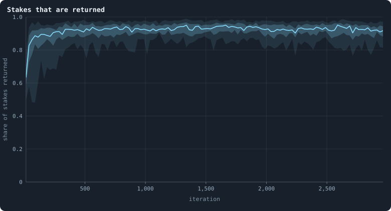
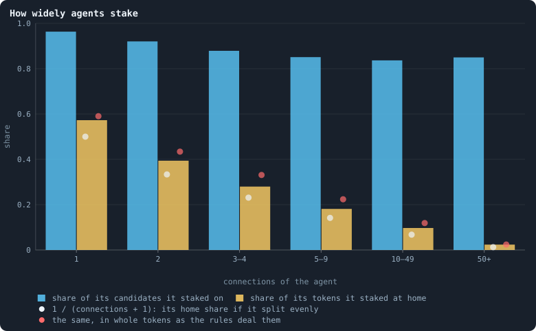
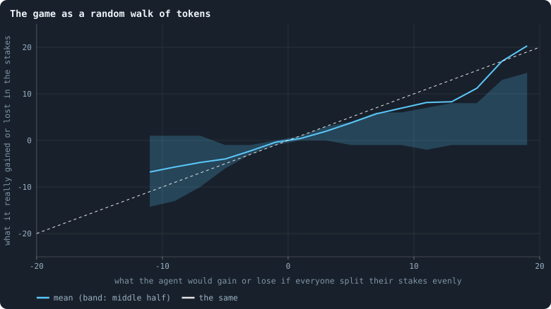
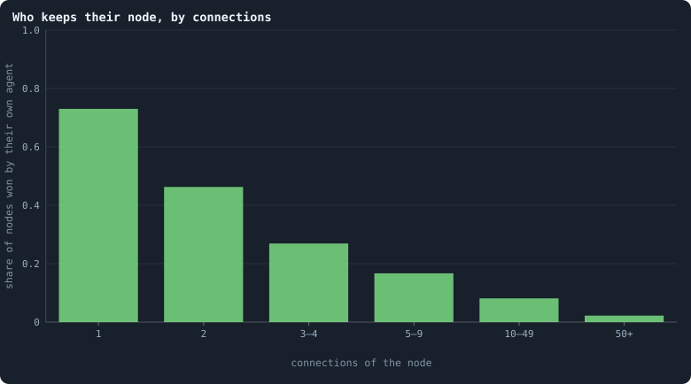
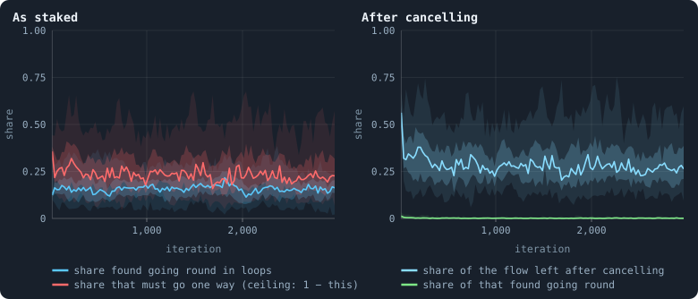

# Where the tokens flow

[Chapter 20](20-gains-and-losses.md) followed the agents through a game:
who gains, who loses. This chapter follows the **tokens**: where each staked
token goes, how much of it comes back, and whether the whole movement obeys
a simple law. It does — nearly — and the law explains several findings of
earlier chapters at once.

> [!question] Questions of this chapter
> - Of all the tokens staked in a game, how many stay at home, how many cross
>   a connection and are matched by a stake coming back, and how many go one
>   way only?
> - How widely do agents spread their stakes, and how close is that to
>   splitting them evenly?
> - Can a game be described as a random walk of tokens? What would that
>   predict about who is rich?
> - Who keeps their node?
> - Do tokens go round in loops?

<!-- runs E02 -->
> [!info] The runs behind this chapter
> **30 runs.** Every condition below is run once for every seed (1 to 30), for 3,000 iterations — or until its world dies out. Every setting is that of the baseline **B1** (the algorithm exactly as a new run is offered it) unless the condition changes it.
>
> - **baseline** — changes nothing: B1 as it is; 10,000 tokens. Runs `B1-10000-s001` … `B1-10000-s030`.
>
> To make these runs again: `python3 gol_lab.py run E02`, or ▶ in the Book tab of a computer running `gol_server.py`. Each run writes its settings, seed and engine version beside its frames, in `GraphOfLifeRuns/<run>/meta.json` and `provenance.json`.

> [!info]- Every setting of these runs
> | setting | baseline | what it is |
> |---|---|---|
> | [`total_tokens`](../notes/settings.md#total_tokens) | 10,000 | The number of tokens in the world, *T*. It never changes during a run. |
> | [`n_nodes`](../notes/settings.md#n_nodes) | 0 | How many founders the world starts with. 0 means one founder per hundred tokens: *n* = ⌊*T* / 100⌋. |
> | [`k_neighbors`](../notes/settings.md#k_neighbors) | 0 | How many neighbours each founder starts with in the ring. 0 means *k* = max(⌊*n* / 100⌋, 5); an odd *k* is wired as *k* − 1. |
> | [`rewire_p`](../notes/settings.md#rewire_p) | 0.2 | In the starting ring, the probability that a connection is moved to a founder chosen at random (Watts–Strogatz). |
> | [`hidden_layers`](../notes/settings.md#hidden_layers) | 50, 45, 40, 35, 30 | The widths of the brain's hidden layers, in order from input to output. |
> | [`brain_kind`](../notes/settings.md#brain_kind) | float16 | How weights are stored: `float` (64-bit), `float16` (16-bit, computed in 64-bit) or `binary` (−1, 0, +1). |
> | [`brain_bits`](../notes/settings.md#brain_bits) | 16 | Only for binary brains: how many input rows encode one number. Unused by float and float16 brains. |
> | [`message_amount`](../notes/settings.md#message_amount) | 30 | How many numbers one message holds. Each agent sends one message to itself and one to each neighbour, every phase. |
> | [`random_input_amount`](../notes/settings.md#random_input_amount) | 5 | How many random numbers, drawn uniformly from −2 to 2, a brain reads per neighbour, every time it looks. |
> | [`exchange_messages`](../notes/settings.md#exchange_messages) | on | Whether agents send and read messages at all. |
> | [`message_prepass`](../notes/settings.md#message_prepass) | on | Whether every phase begins with an extra look in which agents only write messages, so the look that acts reads messages written this phase. |
> | [`allow_handover`](../notes/settings.md#allow_handover) | on | Whether a parent may move some of its own connections to its newborn child. |
> | [`allow_revolutions`](../notes/settings.md#allow_revolutions) | on | Whether a coalition of smaller stakers can take a node from its largest staker (see the note *How a coalition takes a node*). |
> | [`allow_gifting`](../notes/settings.md#allow_gifting) | off | Whether agents may give tokens to neighbours during reproduction. Off in every run of this book. |
> | [`random_decisions`](../notes/settings.md#random_decisions) | off | The control: every number a brain would produce is replaced by a random draw from the standard normal distribution. |
> | [`prune_after`](../notes/settings.md#prune_after) | blotto | After which phase connections that carried no tokens are cut: `blotto` (the game), `reproduction`, or `both`. |
> | [`inactive_window`](../notes/settings.md#inactive_window) | phase | How long a connection may go unused: `phase` means it must carry tokens in the phase being judged; `iteration` allows the two last phases. |
> | [`redistribution`](../notes/settings.md#redistribution) | uniform | How the tokens of removed agents are shared: `uniform` gives every survivor the same chance at each token; `by_tokens` weights by what a survivor holds. |
> | [`tokens_created_per_phase`](../notes/settings.md#tokens_created_per_phase) | 0 | Tokens added to the world at every cleanup. 0 keeps the supply fixed. |
> | [`mutation_probability`](../notes/settings.md#mutation_probability) | 0.2 | The probability that a brain changes when it is copied to a child, and again, for every brain, after every game. |
> | [`mutation_noise_std`](../notes/settings.md#mutation_noise_std) | 0.2 | How large a change to one weight is: a normal draw with standard deviation this times 1/√(fan-in) of its layer. |
> | [`mutation_sparsity`](../notes/settings.md#mutation_sparsity) | 0.1 | The share of a brain's numbers a change touches; also the probability, for each weight matrix and bias vector, of a rarer reset that redraws that share of it. |
> | [`extinction_threshold`](../notes/settings.md#extinction_threshold) | 20 | A run stops, as extinct, when an iteration ends (after its game) with this many agents or fewer. |
> | seeds | 1 to 30 | one run per seed |
> | iterations | 3,000 | how far each run goes, unless its world dies first |
>
> A value in **bold** differs from the baseline B1.
<!-- /runs -->

## The budget of a game

Exactly 10,000 tokens are staked in every game of a baseline world — every
token, by whoever holds it. Each staked token lands in one of three places
([Token flow](../notes/token-flow.md)):

1. on the staker's **own node**;
2. on a neighbour's node, **matched** by a stake coming back: if A puts 5 on
   B's node and B puts 3 on A's, 3 tokens go each way and cancel — neither
   balance changes because of them;
3. on a neighbour's node, **one way**: the 2 left over in the example. Only
   these move tokens between agents.

<!-- figure flow/budget -->

**Where the tokens of a game go.** Every token is staked in every game. Yellow: the share staked by agents on their own node. Cyan: staked on a neighbour's node, but cancelled by what that neighbour staked back — if A puts 5 on B's node and B puts 3 on A's, 3 tokens each way cancel. Red: what is left after cancelling, flow with a direction ([Token flow](../notes/token-flow.md)). Left: the game of iteration 0, pooled over the 30 worlds; right: every game from iteration 500 on of the 26 worlds that lived to the end, pooled. Exactly 10,000 tokens are staked in each game.

> [!example]- How to make this figure
> **Runs.** The 30 baseline runs `B1-10000-s001` … `B1-10000-s030`: the baseline B1 at 10,000 tokens, seeds 1 to 30, 3,000 iterations each (every setting is listed in [Chapter 9](09-thirty-worlds.md)). They are made with `python3 gol_lab.py run E02`.
>
> **Data.** From each run's `GraphOfLifeRuns/<run>/stats.jsonl`, which holds one row per recorded phase: `phase` 1 is the world just after reproduction, `phase` 2 just after the game, and every statistic is a field of the row (see [What a run records](../notes/frames-and-stats.md)).
>
> 1. Take the rows with `phase` = 2: `tokens` (all staked), `totalFlow` (staked on others) and `netFlowShare` (the share of that flow left after cancelling).
> 2. Sum over the rows: at home = Σ `tokens` − Σ `totalFlow`; cancelled = Σ `totalFlow` × (1 − `netFlowShare`); one way = Σ `totalFlow` × `netFlowShare`.
> 3. Divide each by Σ `tokens`.
>
> **To make it again:** `python3 book_figures.py flow`.
<!-- /figure -->

In the first game, a quarter stays home, a quarter is matched and half goes
one way. In settled games, 30% stays home, **49% is matched** and only 21%
goes one way. Most of what agents send to their neighbours is an exchange of
equal amounts, which is why half of all agents end a game with exactly what
they had ([Chapter 20](20-gains-and-losses.md)).

## Stakes that are returned

<!-- figure flow/reciprocity -->

**Stakes that are returned.** Of all pairs (A, B) in a game where agent A staked at least one token on neighbour B's node, the share in which B also staked at least one token on A's — every 25 iterations, in the 30 baseline worlds. The line is the median of the worlds at each iteration, the darker band holds the middle half of them (from the 25th to the 75th percentile) and the paler band nine in ten (5th to 95th).

> [!example]- How to make this figure
> **Runs.** The 30 baseline runs `B1-10000-s001` … `B1-10000-s030`: the baseline B1 at 10,000 tokens, seeds 1 to 30, 3,000 iterations each (every setting is listed in [Chapter 9](09-thirty-worlds.md)). They are made with `python3 gol_lab.py run E02`.
>
> **Data.** From each run's frames, read every 25 iterations by `book_figures.sample_pass` (frame `2·t` after the reproduction phase of iteration *t*, frame `2·t + 1` after its game; `gol_store.read_frame(run, index)`).
>
> 1. In the frame after the game of every 25th iteration, read `decisions.allocations`: for every agent A and every target B ≠ A with a stake > 0, note the pair (A, B).
> 2. Count the pairs whose reverse (B, A) is also there, divided by all pairs.
> 3. In each stretch, take the median, the 25th and 75th and the 5th and 95th percentiles of those means over the worlds that still have a value there (a world that died has none after its death).
>
> **To make it again:** `python3 book_figures.py flow`.
<!-- /figure -->

When A stakes on B, B stakes back on A in 92% of cases (the 26 worlds: 88% to
95%). Is that reciprocity — agents answering a stake with a stake? Not
necessarily. Look at how widely agents stake (the next figure): they stake on
84% to 96% of everyone they can. If every agent picked its targets
independently of who staked on it, B would still stake on A with about that
probability. A reciprocity of 92% is what breadth alone would give. To find
real reciprocity one would have to show that B stakes *more* on A *because* A
staked on B — a question for [Chapter 28](28-do-agents-cooperate.md).

## How widely agents stake

An agent with *d* connections has *d* + 1 **candidates**: its own node and its
neighbours' nodes. If it split its tokens evenly, it would put 1/(*d* + 1) of
them on each, home included.

<!-- figure flow/breadth -->

**How widely agents stake.** Agents at the start of a game, sorted by their number of connections. Blue: the share of their candidates (themselves and their neighbours) on which they staked at least one token. Yellow: the share of their tokens they staked on their own node. White dots: the home share an agent would have if it split its tokens evenly over all its candidates, 1/(d + 1), averaged over the class. From the games of every 100th iteration from 500 on, in the 26 worlds that lived to the end.

> [!example]- How to make this figure
> **Runs.** The 26 surviving ones of the 30 baseline runs `B1-10000-s001` … `B1-10000-s030`: the baseline B1 at 10,000 tokens, seeds 1 to 30, 3,000 iterations each (every setting is listed in [Chapter 9](09-thirty-worlds.md)). They are made with `python3 gol_lab.py run E02`.
>
> **Data.** From each run's frames, read every 25 iterations by `book_figures.sample_pass` (frame `2·t` after the reproduction phase of iteration *t*, frame `2·t + 1` after its game; `gol_store.read_frame(run, index)`).
>
> 1. For every 100th iteration t from 500 on, take each agent's degree d in frame `2·t`.
> 2. In frame `2·t + 1`, read its entry of `decisions.allocations`: the number of `targets` (its candidates), how many of them got `alloc` > 0, and `alloc[0]` / `tokens` (its home share; its first target is itself).
> 3. Average by class of d; the white dots are the mean of 1/(d + 1) in each class.
>
> **To make it again:** `python3 book_figures.py flow`.
<!-- /figure -->

Agents stake on almost all their candidates: 96% for agents with one
connection, falling to 84–85% for agents with ten or more. And their **home
share** follows the even split closely — a little above it:

| connections | 1 | 2 | 3–4 | 5–9 | 10–49 | 50+ |
|---|---|---|---|---|---|---|
| staked at home | 57% | 39% | 28% | 18% | 10% | 2.4% |
| even split, 1/(*d*+1) | 50% | 33% | 23% | 14% | 7% | 1.2% |

The evolved brains, whatever they compute from their inputs, end up doing
something close to the simplest thing possible: spreading their tokens evenly
over everyone they can reach, with a little extra at home.

## The game as a random walk

Suppose, then, that every agent split its tokens **exactly** evenly. Think of
a single token at node *u*: it moves to each of the *d*ᵤ + 1 candidates with
the same share. Repeated game after game, that is a **random walk** of tokens:
at every step a token stays where it is or moves to a neighbour, each with
probability 1/(*d*ᵤ + 1) — a "lazy" walk, because staying is one of the
choices.

How good is that description? For every agent at the start of a game, work
out the balance the even split would give it — stakes it would receive minus
tokens it holds — and set it against the balance it really ended with.

<!-- figure flow/random-walk -->

**The game as a random walk of tokens.** For every agent at the start of a game: x is the balance it would end the stakes with — the tokens staked on its node minus the tokens it held — if every agent split its tokens evenly over itself and its neighbours; y is the balance it really ended them with. Agents are binned by x in steps of 2; the line is the mean of y in each bin and the band its middle half. The dashed line is y = x. Over all 335,453 agents (the games of every 250th iteration from 500 on, 26 worlds), the straight line fitted to the points has slope 0.94, and the even split accounts for 46% of the variance (R², [Fitting a straight line](../notes/least-squares.md)).

> [!example]- How to make this figure
> **Runs.** The 26 surviving ones of the 30 baseline runs `B1-10000-s001` … `B1-10000-s030`: the baseline B1 at 10,000 tokens, seeds 1 to 30, 3,000 iterations each (every setting is listed in [Chapter 9](09-thirty-worlds.md)). They are made with `python3 gol_lab.py run E02`.
>
> **Data.** From each run's frames, read (frame `2·t` after the reproduction phase of iteration *t*, frame `2·t + 1` after its game; `gol_store.read_frame(run, index)`).
>
> 1. For every 250th iteration t from 500 on, read frame `2·t` (the start of the game): each agent's tokens τ and neighbours.
> 2. Even split: every agent u gives τ(u)/(d(u) + 1) to itself and to each neighbour; x(u) is what u receives minus τ(u).
> 3. Real: in frame `2·t + 1`, add up every `alloc` whose target is u; y(u) is that minus τ(u).
> 4. Bin by x and average y; fit y = a·x + b by least squares over all agents.
>
> **To make it again:** `python3 book_figures.py flow`.
<!-- /figure -->

Over 335,453 agents, the real balances follow the even split's with a slope
of 0.94: the brains move tokens almost exactly as much as the random walk
would, in the same direction. The even split accounts for 46% of the variance;
the rest is what the brains do differently, agent by agent.

A random walk on a network has a well-known resting state, and it can be
found in two lines. Write π(*u*) for the share of tokens at *u*. The walk is
at rest when, across every connection, as many tokens go one way as the
other:

$$
\pi(u) \cdot \frac{1}{d_u + 1} = \pi(v) \cdot \frac{1}{d_v + 1}
\quad\text{for every connection } \{u, v\} .
$$

That holds if π(*u*) is proportional to *d*ᵤ + 1. So:

> [!summary] The resting state of the even split
> On a fixed network, tokens moved by the even split settle to
> τᵤ = *T* · (*d*ᵤ + 1) / Σᵥ (*d*ᵥ + 1): **every agent holds tokens in
> proportion to its number of connections plus one.**

This is the law behind several earlier findings: that agents with more
connections hold more tokens ([Chapter 14](14-where-do-the-tokens-go.md)),
that tokens run downhill from agents richer than their neighbourhood
([Chapter 20](20-gains-and-losses.md)), and that a rich agent with few
connections drains away within a few games. A world is never quite at rest,
because the network keeps changing under the tokens;
[Chapter 24](24-how-properties-scale-together.md) measures how close it
comes, and [Chapter 25](25-the-geometry-of-a-world.md) how fast a random walk
on such a network can settle at all.

## Who keeps their node

The winner of a node — whose brain the node takes — is its largest staker,
unless a coalition of smaller stakers outweighs it
([How a coalition takes a node](../notes/revolution.md)). Under the even
split, the agent living on a node of degree *d* is one of *d* + 1 stakers of
roughly equal size there.

<!-- figure flow/kept -->

**Who keeps their node, by connections.** Every node on which anyone staked in a game, sorted by its number of connections at the start of the game; the share that was won by the agent living on it — whether as the largest staker or through a coalition. From the games of every 25th iteration from 500 on, in the 26 worlds that lived to the end.

> [!example]- How to make this figure
> **Runs.** The 26 surviving ones of the 30 baseline runs `B1-10000-s001` … `B1-10000-s030`: the baseline B1 at 10,000 tokens, seeds 1 to 30, 3,000 iterations each (every setting is listed in [Chapter 9](09-thirty-worlds.md)). They are made with `python3 gol_lab.py run E02`.
>
> **Data.** From each run's frames, read every 25 iterations by `book_figures.sample_pass` (frame `2·t` after the reproduction phase of iteration *t*, frame `2·t + 1` after its game; `gol_store.read_frame(run, index)`).
>
> 1. For every 25th iteration t from 500 on, count each node's connections in frame `2·t`.
> 2. In frame `2·t + 1`, read `decisions.winners`: for each node, whether `winner` = `node`.
> 3. Pool over runs and frames, and divide kept by all, per class.
>
> **To make it again:** `python3 book_figures.py flow`.
<!-- /figure -->

Agents with one connection keep their node in 73% of games; with two, 46%;
three or four, 27%; five to nine, 17%; ten to forty-nine, 8%; fifty or more,
**2.2%**. The pattern is 1/(*d* + 1) again, somewhat raised by the home bias:
the agent on a node is one of *d* + 1 contenders and wins about as often as one
of them would.

So a hub does not have an owner. The agent sitting on a node with a hundred
connections is replaced by a neighbour's brain in 98 games out of 100. **Hubs
are places, not individuals**: they hold many tokens because of where they
are, and the brains on them pass through. A brain cannot "become a hub"; it
can only be, for a game or two, the brain sitting on one.

## Do tokens go round?

Could the flow carry tokens around loops — from A to B to C and back to A —
like money circulating in an economy? [Lightning](../notes/lightning.md)
explains how this is measured, and why only bounds can be given: a greedy
search finds loops (a lower bound), and conservation sets a ceiling, since a
token that comes back to where it started changes no balance, and every agent
that ends with more or less than it sent cannot have had all its flow in
loops.

<!-- figure flow/circulation -->

**Do tokens go round?** Left, on the flow as staked: the share of all tokens staked on neighbours that a greedy search could place in closed loops (blue; [Lightning](../notes/lightning.md)), and the share that conservation forbids from ever going round, because some agents receive more than they send (red) — so at most 1 − red can circulate. Right, after cancelling every stake against the one coming back: the share of the flow left (cyan), and of that, the share found in loops (green). Every 25 iterations, 30 worlds; the line is the median of the worlds at each iteration, the darker band holds the middle half of them (from the 25th to the 75th percentile) and the paler band nine in ten (5th to 95th).

> [!example]- How to make this figure
> **Runs.** The 30 baseline runs `B1-10000-s001` … `B1-10000-s030`: the baseline B1 at 10,000 tokens, seeds 1 to 30, 3,000 iterations each (every setting is listed in [Chapter 9](09-thirty-worlds.md)). They are made with `python3 gol_lab.py run E02`.
>
> **Data.** From each run's `GraphOfLifeRuns/<run>/stats.jsonl`, which holds one row per recorded phase: `phase` 1 is the world just after reproduction, `phase` 2 just after the game, and every statistic is a field of the row (see [What a run records](../notes/frames-and-stats.md)).
>
> 1. Take `cyclingShare`, `flowImbalance`, `netFlowShare` and `netCyclingShare` of the rows with `phase` = 2 (measured every 25 iterations).
> 2. In each stretch, take the median, the 25th and 75th and the 5th and 95th percentiles of those means over the worlds that still have a value there (a world that died has none after its death).
>
> **To make it again:** `python3 book_figures.py flow`.
<!-- /figure -->

On the flow as staked, the greedy search places 16% of the tokens staked on
neighbours in loops, and conservation forbids at least 25% from ever going
round. But most of those loops are trivial: two neighbours staking on each
other is a loop of length 2. After cancelling every stake against the one
coming back (right panel), 29% of the flow is left — and of that, the search
finds only **0.2%** in loops. The ceiling is not much higher: the imbalance
does not change when stakes cancel, so at least 25/29 = 87% of what is left
must flow one way. Between 0.2% and 13% of the net flow can go round; the
search finds almost nothing.

There is a theorem that says what that means. Any flow on a network can be
split into two parts: one that runs **downhill**, from high to low along some
"potential" that every agent has, and one that **circulates** (the
Helmholtz–Hodge decomposition; for networks, Jiang, Lim, Yao and Ye 2011). A
downhill flow can never go round — round a loop, you would come back to the
height you started from. The net flow of a game is almost entirely of the
downhill kind: tokens move from hills to valleys, as heat does, and do not
circulate.

## What this means

- **The game is close to a random walk of tokens.** The evolved brains spread
  their tokens nearly evenly over everyone they can reach. The world's
  economy, in tokens, is an exchange of equal stakes plus a diffusion
  downhill. There is no circulation to speak of.
- **Wealth follows connections.** At rest, an agent holds tokens in proportion
  to its connections plus one. Being rich is a matter of being well connected
  — of being in a place.
- **Hubs are places.** The brains on hubs change almost every game. The
  network's most important positions are not held by anyone.
- **For open-ended evolution this is a warning.** A behaviour this close to
  "split evenly" leaves little for brains to differ in, and a world whose
  wealth and positions are set by the network rather than by the brains gives
  selection little to grip. [Chapter 29](29-questioning-the-mechanics.md)
  asks which rules make it so, and [Meta II](30-meta-2.md) what could be
  changed.

To make every figure of this chapter: `python3 book_figures.py flow`.

<!-- turns -->
---

← [Chapter 20 · Gains and losses](20-gains-and-losses.md) · [Contents](../README.md) · [Chapter 22 · How agents have children](22-how-agents-have-children.md) →
<!-- /turns -->
