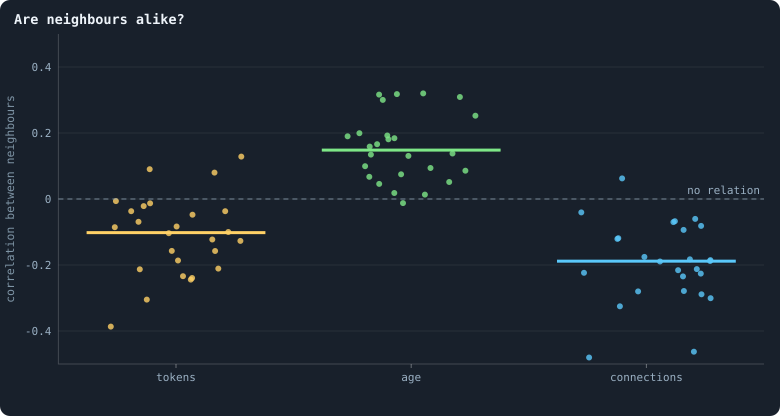
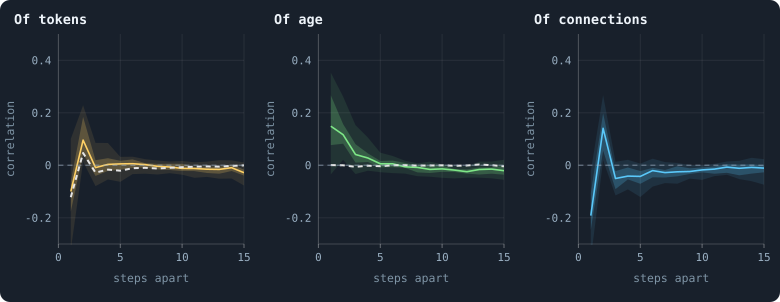
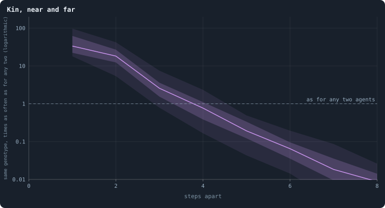

# Like next to like

Is a world the same everywhere, or does it have regions — a rich quarter
and a poor one, an old town and new suburbs, the territory of one family
and of another? In physics the question is answered by asking how far the
state of one place reaches: whether two places some distance apart are more
alike than two places drawn at random, and up to what distance. This
chapter asks it of the worlds of Graph of Life, with distance counted in
steps along connections.

> [!question] Questions of this chapter
> - Are neighbours alike in their tokens, their age, their connections?
> - How far does likeness reach — two steps, ten, across the world?
> - How much of it comes from an agent's place in the network, and how much
>   from closeness itself?
> - Do kin live together, and in territories?

<!-- runs E02 -->
> [!info] The runs behind this chapter
> **30 runs.** Every condition below is run once for every seed (1 to 30), for 3,000 iterations — or until its world dies out. Every setting is that of the baseline **B1** (the algorithm exactly as a new run is offered it) unless the condition changes it.
>
> - **baseline** — changes nothing: B1 as it is; 10,000 tokens. Runs `B1-10000-s001` … `B1-10000-s030`.
>
> To make these runs again: `python3 gol_lab.py run E02`, or ▶ in the Book tab of a computer running `gol_server.py`. Each run writes its settings, seed and engine version beside its frames, in `GraphOfLifeRuns/<run>/meta.json` and `provenance.json`.

> [!info]- Every setting of these runs
> | setting | baseline | what it is |
> |---|---|---|
> | [`total_tokens`](../notes/settings.md#total_tokens) | 10,000 | The number of tokens in the world, *T*. It never changes during a run. |
> | [`n_nodes`](../notes/settings.md#n_nodes) | 0 | How many founders the world starts with. 0 means one founder per hundred tokens: *n* = ⌊*T* / 100⌋. |
> | [`k_neighbors`](../notes/settings.md#k_neighbors) | 0 | How many neighbours each founder starts with in the ring. 0 means *k* = max(⌊*n* / 100⌋, 5); an odd *k* is wired as *k* − 1. |
> | [`rewire_p`](../notes/settings.md#rewire_p) | 0.2 | In the starting ring, the probability that a connection is moved to a founder chosen at random (Watts–Strogatz). |
> | [`hidden_layers`](../notes/settings.md#hidden_layers) | 50, 45, 40, 35, 30 | The widths of the brain's hidden layers, in order from input to output. |
> | [`brain_kind`](../notes/settings.md#brain_kind) | float16 | How weights are stored: `float` (64-bit), `float16` (16-bit, computed in 64-bit) or `binary` (−1, 0, +1). |
> | [`brain_bits`](../notes/settings.md#brain_bits) | 16 | Only for binary brains: how many input rows encode one number. Unused by float and float16 brains. |
> | [`message_amount`](../notes/settings.md#message_amount) | 30 | How many numbers one message holds. Each agent sends one message to itself and one to each neighbour, every phase. |
> | [`random_input_amount`](../notes/settings.md#random_input_amount) | 5 | How many random numbers, drawn uniformly from −2 to 2, a brain reads per neighbour, every time it looks. |
> | [`exchange_messages`](../notes/settings.md#exchange_messages) | on | Whether agents send and read messages at all. |
> | [`message_prepass`](../notes/settings.md#message_prepass) | on | Whether every phase begins with an extra look in which agents only write messages, so the look that acts reads messages written this phase. |
> | [`allow_handover`](../notes/settings.md#allow_handover) | on | Whether a parent may move some of its own connections to its newborn child. |
> | [`allow_revolutions`](../notes/settings.md#allow_revolutions) | on | Whether a coalition of smaller stakers can take a node from its largest staker (see the note *How a coalition takes a node*). |
> | [`allow_gifting`](../notes/settings.md#allow_gifting) | off | Whether agents may give tokens to neighbours during reproduction. Off in every run of this book. |
> | [`random_decisions`](../notes/settings.md#random_decisions) | off | The control: every number a brain would produce is replaced by a random draw from the standard normal distribution. |
> | [`prune_after`](../notes/settings.md#prune_after) | blotto | After which phase connections that carried no tokens are cut: `blotto` (the game), `reproduction`, or `both`. |
> | [`inactive_window`](../notes/settings.md#inactive_window) | phase | How long a connection may go unused: `phase` means it must carry tokens in the phase being judged; `iteration` allows the two last phases. |
> | [`redistribution`](../notes/settings.md#redistribution) | uniform | How the tokens of removed agents are shared: `uniform` gives every survivor the same chance at each token; `by_tokens` weights by what a survivor holds. |
> | [`tokens_created_per_phase`](../notes/settings.md#tokens_created_per_phase) | 0 | Tokens added to the world at every cleanup. 0 keeps the supply fixed. |
> | [`mutation_probability`](../notes/settings.md#mutation_probability) | 0.2 | The probability that a brain changes when it is copied to a child, and again, for every brain, after every game. |
> | [`mutation_noise_std`](../notes/settings.md#mutation_noise_std) | 0.2 | How large a change to one weight is: a normal draw with standard deviation this times 1/√(fan-in) of its layer. |
> | [`mutation_sparsity`](../notes/settings.md#mutation_sparsity) | 0.1 | The share of a brain's numbers a change touches; also the probability, for each weight matrix and bias vector, of a rarer reset that redraws that share of it. |
> | [`extinction_threshold`](../notes/settings.md#extinction_threshold) | 20 | A run stops, as extinct, when an iteration ends (after its game) with this many agents or fewer. |
> | seeds | 1 to 30 | one run per seed |
> | iterations | 3,000 | how far each run goes, unless its world dies first |
>
> A value in **bold** differs from the baseline B1.
<!-- /runs -->

## Neighbours

Take every connection of a world and the two agents at its ends, and ask
whether their values go together: the correlation, over all connections, of
the value at one end with the value at the other. A positive correlation
means like beside like, a negative one unlike beside unlike.

<!-- figure alike/neighbours -->

**Are neighbours alike?** For every connection of a world, the two agents at its ends: the correlation of their tokens, of their ages and of their numbers of connections (tokens and age as ln(1 + x), connections as ln k), counting every connection both ways round. One dot per world that lived to the end, the mean over five moments (after the games of iterations 1,000, 1,500, 2,000, 2,500 and 2,999); the bar is the median. The same values shuffled among a world's agents give correlations within 0.01 of zero; the last column is the assortativity of [Chapter 30](30-how-properties-scale-together.md), taken of ln k instead of k.

> [!example]- How to make this figure
> **Runs.** The 26 baseline worlds that lived to the end (`B1-10000-s001` … `-s030`, [Chapter 9](09-thirty-worlds.md); `python3 gol_lab.py run E02`).
>
> **Data.** From each run's frames, `GraphOfLifeRuns/<run>/frames/`, read with `gol_store.read_frame(run, index)`; frame `2·t` is iteration *t* after reproduction and frame `2·t + 1` after the game.
>
> 1. Read frames 2·t + 1 for t = 1,000, 1,500, 2,000, 2,500, 2,999: `ids`, `tokens`, `ages`, `brain_ids` and `edges`.
> 2. Pearson's correlation of the value at one end of a connection with the value at the other, over every connection in both directions; the null shuffles the values among agents first (`book_chapters.space.likeness`).
>
> **To make it again:** `python3 book_figures.py alike`.
<!-- /figure -->

- **Tokens: unlike.** Neighbours' tokens are correlated at **−0.10** in the
  median world. The rich sit among the poor.
- **Age: like.** **+0.15**. The old sit among the old, the young among the
  young.
- **Connections: unlike.** **−0.19**: hubs sit among agents with few
  connections, the assortativity of [Chapter 30](30-how-properties-scale-together.md).

All three are small. Neighbours are alike or unlike only a little, and the
worlds differ: the age correlation ranges from 0 to 0.32 between them.

## Place, or closeness?

A correlation between neighbours need not mean that neighbours influence
each other. Tokens follow connections ([Chapter 30](30-how-properties-scale-together.md)),
and hubs sit among leaves. Then a rich hub will have poor leaves around it,
and neighbours' tokens will be unlike without any agent doing anything to
another. How much of the likeness is just **place**?

Shuffle each agent's tokens among the agents with about as many
connections as it has, and measure again
([How alike at a distance](../notes/correlation-function.md)). The shuffle
keeps how tokens follow connections and destroys everything else.

- For **tokens**, the shuffled worlds give −0.13, as much as the real ones.
  Rich beside poor is entirely place: hubs are rich, leaves are poor, and
  hubs sit among leaves.
- For **age**, the shuffled worlds give −0.01. Old beside old is not place.
  It is something about the agents themselves.

Why would the old sit beside the old? A likely reason: agents die
together, when a piece of the world is cut off
([Chapter 32](32-how-a-world-breaks.md)), and they are born into their
parents' neighbourhoods ([Chapter 21](21-how-the-network-grows.md)), so
the young arrive where the old are gone, side by side. Agents that arrived
together live together, as cohorts.

## How far likeness reaches

Now measure the same correlations between agents 2, 3, … 15 steps apart, the
**correlation function** *C*(*r*) of the worlds:

<!-- figure alike/distance -->

**How alike, how far apart.** For pairs of agents r steps apart, the correlation of their tokens, ages and connections (as in the figure above), for r = 1 to 15. For each world, pairs from breadth-first searches out of 150 agents drawn at random at each of the five moments; the coloured line is the median of the 26 worlds, the darker band the middle half of them and the paler band nine in ten. Grey dashes: the median when each agent's tokens (or age) are first shuffled among the agents with about as many connections (1, 2, 3–4, 5–9, 10–49, 50 and more) — what an agent's place in the network explains without any closeness of its own.

> [!example]- How to make this figure
> **Runs.** The 26 baseline worlds that lived to the end (`B1-10000-s001` … `-s030`, [Chapter 9](09-thirty-worlds.md); `python3 gol_lab.py run E02`).
>
> **Data.** From each run's frames, `GraphOfLifeRuns/<run>/frames/`, read with `gol_store.read_frame(run, index)`; frame `2·t` is iteration *t* after reproduction and frame `2·t + 1` after the game.
>
> 1. At each moment, a breadth-first search out of 150 agents drawn at random (generator seeded with 22), to 15 steps; every agent reached at r steps gives the pair (source, agent).
> 2. Standardise each value within its moment (subtract the mean, divide by the standard deviation); per r, pooled over sources and moments, Pearson's correlation of the two values.
> 3. The grey null: the same pairs, with tokens and ages permuted at random within each class of connections (`book_chapters.space.likeness`).
>
> **To make it again:** `python3 book_figures.py alike`.
<!-- /figure -->

Every curve is close to zero from **three steps** on.

- **Tokens:** −0.10 at one step, **+0.10** at two, and nothing from three
  on. Two agents two steps apart are often two leaves of one hub, poor alike.
  The shuffle explains half of that (+0.05).
- **Age:** +0.15 at one step, +0.12 at two, +0.04 at three, nothing from
  five on. Cohorts span two or three steps.
- **Connections:** −0.19 at one step, +0.14 at two (two leaves of one hub
  again), and close to zero beyond.

In the language of physics, the **correlation length** of a world is one to
two steps. Within that, a world has structure: hubs and their leaves,
cohorts of the same age. Beyond it, every part of a world looks like every
other.

## Kin, near and far

The last question is about families. Do agents of one genotype live
together?

<!-- figure alike/kin -->

**Kin, near and far.** For pairs of agents r steps apart (as in the figure above), the share that carry the same genotype, divided by the share among all pairs of agents of the world, on a logarithmic axis: a straight falling line would be a relatedness that halves over a fixed number of steps. The line is the median of the 26 worlds, the darker band the middle half of them and the paler band nine in ten. From 9 steps on, most worlds have no such pair at all, and none has a twentieth of what chance would give.

> [!example]- How to make this figure
> **Runs.** The 26 baseline worlds that lived to the end (`B1-10000-s001` … `-s030`, [Chapter 9](09-thirty-worlds.md); `python3 gol_lab.py run E02`).
>
> **Data.** From each run's frames, `GraphOfLifeRuns/<run>/frames/`, read with `gol_store.read_frame(run, index)`; frame `2·t` is iteration *t* after reproduction and frame `2·t + 1` after the game.
>
> 1. As above; for every pair, whether the two `brain_ids` are equal.
> 2. Any two agents: Σ c(c − 1) / (n(n − 1)) over the genotypes' counts c among the n agents.
>
> **To make it again:** `python3 book_figures.py alike`.
<!-- /figure -->

Among agents one step apart, **9.9%** carry the same genotype, 33 times as
many as among any two agents of the world (0.30%). That is the finding of
[Chapter 34](34-do-agents-cooperate.md), counted here from agents drawn at
random rather than from connections. Two steps apart it is 5.0% (18 times
chance), three steps 0.6% (2.6 times), and from **four steps on, fewer than
chance would give**: 0.8 times at four steps, 0.2 at five. Beyond eight
steps, almost no pair shares a genotype.

So kin live together, but only as small clusters: a parent, its children,
the nodes it has just conquered, within two steps. There are no
territories. A family is a few agents, not a region.

Two reasons keep it so. A genotype lasts about two iterations before a
change renames it ([Chapter 17](17-genotypes-and-lineages.md)), so a
cluster of one genotype has little time to grow. And more than half of all
nodes change hands in every game ([Chapter 15](15-how-the-game-is-played.md)),
so any territory is broken up as soon as it forms. Lines, which last much
longer than genotypes, might well hold larger domains; that is the next
thing to measure, by asking the same question of agents that share an
ancestor some tens of iterations back.

## What this means

- **A world has structure only within one or two steps.** Its correlation
  length is one to two connections. Beyond three steps, a world is
  statistically the same everywhere: no rich regions, no old towns, no
  territories.
- **Most of the local structure is place, not influence.** Rich beside poor
  is just hubs among leaves. Only age is alike beside alike beyond what place
  explains, as cohorts born and dying together.
- **A world is far from critical.** At a critical point the correlation
  length grows without bound and likeness falls off with distance only as a
  power. Here it is gone within three steps. That fits
  [Chapter 29](29-power-laws-real-and-apparent.md), which found no
  avalanches of every size and no 1/*f* noise. Whatever has no scale in
  these worlds — and [Chapter 23](23-how-many-dimensions-does-a-world-have.md)
  finds something — it is not what the agents hold, which is alike only
  within three steps.
- **For open-ended evolution, there is no room for a second kind of world
  to form inside the first.** Matter in a vacuum, a cell in its medium, a
  species in its habitat: each is a region that differs from its
  surroundings and keeps differing. A world whose correlations die within
  three steps has no such regions. Part VI looks for rules that would let
  them form.

To make every figure of this chapter: `python3 book_figures.py alike`.

<!-- turns -->
---

← [Chapter 21 · How the network grows](21-how-the-network-grows.md) · [Contents](../README.md) · [Chapter 23 · How many dimensions does a world have?](23-how-many-dimensions-does-a-world-have.md) →
<!-- /turns -->
