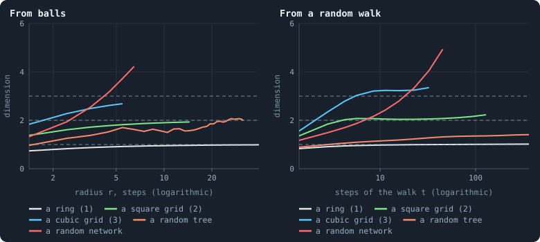
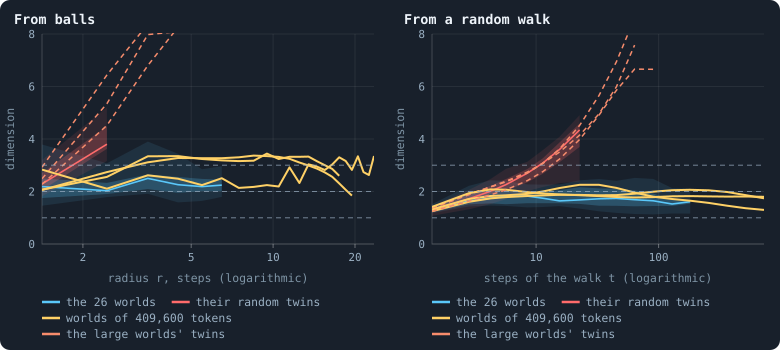
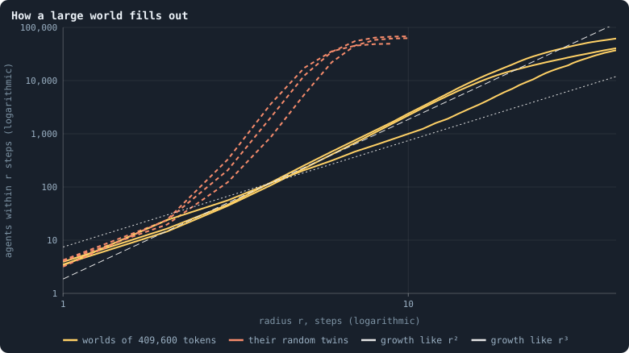
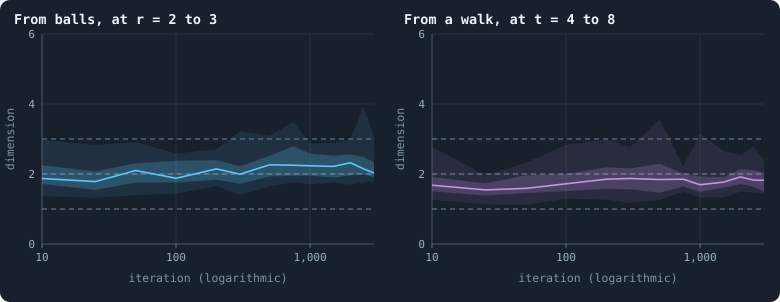

# How many dimensions does a world have?

A network has no space around it. Its agents have no coordinates, only
connections. And yet a network can be shaped like a line, a sheet or a
solid, or like nothing of the kind: a tangle in which everything is a few
steps from everything. [Chapter 7](07-physical-inspiration.md) set the hope
that a world of Graph of Life might grow into something like the space we
live in, with a dimension of its own, three if possible, and with no
geometry put in by hand. This chapter measures what the worlds have grown
into.

> [!question] Questions of this chapter
> - What does it mean for a network to have a dimension, and how is it
>   measured?
> - How many dimensions do the worlds have? Is the answer the same at every
>   scale, and by every ruler?
> - Is the dimension made by how the worlds are wired, or would any network
>   with the same numbers of connections have it?
> - Does it change as a world grows from its first iterations?

<!-- runs E02 -->
> [!info] The runs behind this chapter
> **30 runs.** Every condition below is run once for every seed (1 to 30), for 3,000 iterations — or until its world dies out. Every setting is that of the baseline **B1** (the algorithm exactly as a new run is offered it) unless the condition changes it.
>
> - **baseline** — changes nothing: B1 as it is; 10,000 tokens. Runs `B1-10000-s001` … `B1-10000-s030`.
>
> To make these runs again: `python3 gol_lab.py run E02`, or ▶ in the Book tab of a computer running `gol_server.py`. Each run writes its settings, seed and engine version beside its frames, in `GraphOfLifeRuns/<run>/meta.json` and `provenance.json`.

> [!info]- Every setting of these runs
> | setting | baseline | what it is |
> |---|---|---|
> | [`total_tokens`](../notes/settings.md#total_tokens) | 10,000 | The number of tokens in the world, *T*. It never changes during a run. |
> | [`n_nodes`](../notes/settings.md#n_nodes) | 0 | How many founders the world starts with. 0 means one founder per hundred tokens: *n* = ⌊*T* / 100⌋. |
> | [`k_neighbors`](../notes/settings.md#k_neighbors) | 0 | How many neighbours each founder starts with in the ring. 0 means *k* = max(⌊*n* / 100⌋, 5); an odd *k* is wired as *k* − 1. |
> | [`rewire_p`](../notes/settings.md#rewire_p) | 0.2 | In the starting ring, the probability that a connection is moved to a founder chosen at random (Watts–Strogatz). |
> | [`hidden_layers`](../notes/settings.md#hidden_layers) | 50, 45, 40, 35, 30 | The widths of the brain's hidden layers, in order from input to output. |
> | [`brain_kind`](../notes/settings.md#brain_kind) | float16 | How weights are stored: `float` (64-bit), `float16` (16-bit, computed in 64-bit) or `binary` (−1, 0, +1). |
> | [`brain_bits`](../notes/settings.md#brain_bits) | 16 | Only for binary brains: how many input rows encode one number. Unused by float and float16 brains. |
> | [`message_amount`](../notes/settings.md#message_amount) | 30 | How many numbers one message holds. Each agent sends one message to itself and one to each neighbour, every phase. |
> | [`random_input_amount`](../notes/settings.md#random_input_amount) | 5 | How many random numbers, drawn uniformly from −2 to 2, a brain reads per neighbour, every time it looks. |
> | [`exchange_messages`](../notes/settings.md#exchange_messages) | on | Whether agents send and read messages at all. |
> | [`message_prepass`](../notes/settings.md#message_prepass) | on | Whether every phase begins with an extra look in which agents only write messages, so the look that acts reads messages written this phase. |
> | [`allow_handover`](../notes/settings.md#allow_handover) | on | Whether a parent may move some of its own connections to its newborn child. |
> | [`allow_revolutions`](../notes/settings.md#allow_revolutions) | on | Whether a coalition of smaller stakers can take a node from its largest staker (see the note *How a coalition takes a node*). |
> | [`allow_gifting`](../notes/settings.md#allow_gifting) | off | Whether agents may give tokens to neighbours during reproduction. Off in every run of this book. |
> | [`random_decisions`](../notes/settings.md#random_decisions) | off | The control: every number a brain would produce is replaced by a random draw from the standard normal distribution. |
> | [`prune_after`](../notes/settings.md#prune_after) | blotto | After which phase connections that carried no tokens are cut: `blotto` (the game), `reproduction`, or `both`. |
> | [`inactive_window`](../notes/settings.md#inactive_window) | phase | How long a connection may go unused: `phase` means it must carry tokens in the phase being judged; `iteration` allows the two last phases. |
> | [`redistribution`](../notes/settings.md#redistribution) | uniform | How the tokens of removed agents are shared: `uniform` gives every survivor the same chance at each token; `by_tokens` weights by what a survivor holds. |
> | [`tokens_created_per_phase`](../notes/settings.md#tokens_created_per_phase) | 0 | Tokens added to the world at every cleanup. 0 keeps the supply fixed. |
> | [`mutation_probability`](../notes/settings.md#mutation_probability) | 0.2 | The probability that a brain changes when it is copied to a child, and again, for every brain, after every game. |
> | [`mutation_noise_std`](../notes/settings.md#mutation_noise_std) | 0.2 | How large a change to one weight is: a normal draw with standard deviation this times 1/√(fan-in) of its layer. |
> | [`mutation_sparsity`](../notes/settings.md#mutation_sparsity) | 0.1 | The share of a brain's numbers a change touches; also the probability, for each weight matrix and bias vector, of a rarer reset that redraws that share of it. |
> | [`extinction_threshold`](../notes/settings.md#extinction_threshold) | 20 | A run stops, as extinct, when an iteration ends (after its game) with this many agents or fewer. |
> | seeds | 1 to 30 | one run per seed |
> | iterations | 3,000 | how far each run goes, unless its world dies first |
>
> A value in **bold** differs from the baseline B1.
<!-- /runs -->

Besides the baseline worlds of 10,000 tokens, the chapter measures the three
worlds of 409,600 tokens of [Chapter 38](38-how-does-a-worlds-size-follow-its-tokens.md),
about 60,000 agents each after 600 iterations (`B1-409600-s001` … `-s003`,
`python3 gol_lab.py run E08`).

## Two rulers

In a space of *d* dimensions, the number of points within a distance *r* of
a point grows like *r*^*d*: like 2*r* on a line, like π*r*² in a plane, like
(4/3)π*r*³ in a solid. On a network, distance is the number of steps, and
the same count can be made: how many agents lie within *r* steps of an
agent. If that number *N*(*r*) grows like *r*^*d*, the network has dimension
*d* at those scales. Read between two neighbouring radii,

$$
d(r) = \frac{\ln N(r+1) - \ln N(r)}{\ln (r+1) - \ln r}
$$

is the **local dimension** at radius *r*
([Dimension and curvature](../notes/ball-dimension-and-curvature.md)). This
is the first ruler.

The second ruler asks a walker. A walker that steps at random through a
space of *d* dimensions has, after *t* steps, spread over a region of about
*t*^(*d*/2) points, so the chance that it is back where it started falls
like *t*^(−*d*/2). The exponent read off that chance is the **spectral
dimension** ([The spectral dimension](../notes/spectral-dimension.md)). It
measures how easily things spread through a space, where the first ruler
measures how much room there is.

On a regular grid the two rulers agree. On irregular spaces they need not,
and how they differ says what kind of space it is.

## The rulers, tried on known spaces

Before measuring anything unknown, a ruler is tried on things whose size is
known. Here: five networks of about 2,000 points, the size of a world of
10,000 tokens.

<!-- figure dimensions/rulers -->

**Two rulers, tried on spaces whose dimension is known.** Five networks of about 2,000 points each: a ring, a square grid and a cubic grid, each wrapped round so that it has no edge (dimension 1, 2 and 3); a tree drawn at random among all trees on 2,000 points; and a random network in which every point has three neighbours. Left: the local dimension from how balls grow, d(r) = ln(N(r+1)/N(r)) / ln((r+1)/r), where N(r) is the typical number of points within r steps (the geometric mean over 40 points drawn at random), until a ball holds a quarter of the network. Right: the spectral dimension from a random walk, d(t) = −2 · ln(P(2t)/P(t)) / ln 2, where P(t) is how much more often than at rest a walk is back at its start after t steps (averaged over 24 starts), until P(2t) falls below 5/n.

> [!example]- How to make this figure
> **Runs.** No runs: the five networks are built by `book_chapters.space` (`ring`, `torus`, `tree` and `regular`, the last two with networkx, seed 23).
>
> **Data.** From the networks themselves.
>
> 1. Balls: a breadth-first search out of each of 40 points drawn at random (seed 23); N(r) the geometric mean, over the 40, of the number within r steps.
> 2. Walk: a lazy random walk — stay with probability ½, else step to a neighbour drawn at random — started at each of 24 points, its distribution propagated exactly step by step; P(t) is the probability of being at the start minus the probability of being there at rest (the start's connections over twice all connections).
> 3. Read d(r) and d(t) as in the caption; t runs over a grid of ratio √2.
>
> **To make it again:** `python3 book_figures.py dimensions`.
<!-- /figure -->

- The **ring** reads 1 by both rulers. The **square grid** reads 1.9 by
  balls and 2.1 by walks: 2.
- The **cubic grid** reads 2.6 by balls and 3.2 by walks. At 2,000 points a
  cube is only 13 points along each edge, and both rulers feel it. Balls
  fill a quarter of it by radius 7, before *N*(*r*) has reached its *r*³
  growth, and walkers come round the edges. The rulers are least reliable
  where they are most wanted, at three dimensions in a small world. The
  large worlds below are needed for that.
- A **tree** drawn at random reads 1.7 by balls and 1.2 by walks. Theory
  says 2 and 4/3 (Aldous 1991; Durhuus, Jonsson and Wheater 2007): a tree
  has room, but a walker keeps running into its dead ends.
- A **random network**, in which every point has three neighbours, has no
  finite dimension. Its readings never settle: by balls they climb past 4
  within six steps, by walks past 4 within forty.

The lesson to carry on: **a finite dimension shows as a plateau**, a
reading that holds steady over a range of scales. A reading that keeps
rising is the mark of a network that is not a space at all.

## The rulers, on the worlds

<!-- figure dimensions/worlds -->

**The same rulers, on the worlds.** The two rulers of the figure above, on the largest piece of each world after its last game. Blue: the 26 baseline worlds of 10,000 tokens that lived to the end (about 1,300 agents each) — the line is the median of the worlds, the darker band the middle half and the paler band nine in ten. Red: for each, its random twin, a network with exactly as many connections at every agent but wired at random. Yellow: the three worlds of 409,600 tokens of [Chapter 38](38-how-does-a-worlds-size-follow-its-tokens.md) (about 60,000 agents each), measured from 100 balls and 48 walks of up to 1,024 steps; dashed orange, their random twins.

> [!example]- How to make this figure
> **Runs.** The 26 baseline worlds that lived to the end (`B1-10000-s001` … `-s030`, [Chapter 9](09-thirty-worlds.md); `python3 gol_lab.py run E02`). The three worlds of 409,600 tokens of Experiment 8 (`B1-409600-s001` … `-s003`, [Chapter 38](38-how-does-a-worlds-size-follow-its-tokens.md); `python3 gol_lab.py run E08`), after their last game.
>
> **Data.** From each run's frames, `GraphOfLifeRuns/<run>/frames/`, read with `gol_store.read_frame(run, index)`; frame `2·t` is iteration *t* after reproduction and frame `2·t + 1` after the game.
>
> 1. Read each run's last frame; build its network from `edges` and keep its largest piece.
> 2. The rulers as in the figure above (`book_chapters.space.measure`); the twin by `book_chapters.structure.degree_preserving` (seed 23).
>
> **To make it again:** `python3 book_figures.py dimensions`.
<!-- /figure -->

**The worlds of 10,000 tokens** (blue) read **2.3** by balls, between radii
2 and 6 in the median world, and **1.8** by walks, flat from 4 to 64 steps.
A world of 1,500 agents gives the balls little room. In the median world a
quarter of it lies within about seven steps, and the reading stops there.

**Their random twins** (red) are the decisive comparison. A twin has exactly
the connections of its world at every agent, wired at random instead. If
the dimension came from the numbers of connections, the twins would read
the same. They do not. By balls they read 4.2 and are still climbing when a
quarter of the twin is reached, after only three steps. By walks they climb
past 4 and keep going. The twins are small worlds without a dimension; the
worlds are not.

**The worlds of 409,600 tokens** (yellow) are 40 times larger, and here the
rulers have room. By balls, two of the three read **3.3**, flat from radius 3
to radius 14; the third wanders between 2.1 and 3.3. By walks, all three
stay between 1.5 and 2.3 from 4 steps to 400, with medians of **1.8 to
1.9**. In one world the reading is 1.8 at every scale from 6 steps to 724,
two decades. Their twins read 8 by balls within four steps and climb past 6
by walks.

<!-- figure dimensions/growth -->

**How a large world fills out.** The typical number of agents within r steps (the geometric mean over 100 agents drawn at random) in the three worlds of 409,600 tokens after their last game (yellow), and in their random twins (dashed orange), on logarithmic axes, until the ball holds the whole world. In a space of dimension d, the number grows like r^d, a straight line of slope d: in grey, r² (dotted, the shallower) and r³ (dashed, the steeper), drawn through the worlds' typical ball of radius 4.

> [!example]- How to make this figure
> **Runs.** The three worlds of 409,600 tokens of Experiment 8 (`B1-409600-s001` … `-s003`, [Chapter 38](38-how-does-a-worlds-size-follow-its-tokens.md); `python3 gol_lab.py run E08`), after their last game.
>
> **Data.** From each run's frames, `GraphOfLifeRuns/<run>/frames/`, read with `gol_store.read_frame(run, index)`; frame `2·t` is iteration *t* after reproduction and frame `2·t + 1` after the game.
>
> 1. Read each run's last frame; build its network from `edges` and keep its largest piece; make its random twin as above.
> 2. From each of 100 agents drawn at random (seed 23), a breadth-first search; N(r) the geometric mean of the number within r steps.
>
> **To make it again:** `python3 book_figures.py dimensions`.
<!-- /figure -->

Drawn directly, the count of agents within *r* steps of the large worlds
runs along a straight line of slope about 3.3 on logarithmic axes. From
radius 3 to about 15 it is steeper than *r*³ and far steeper than *r*², and
then it bends as the balls reach the edges of the world, around 60,000
agents. The twins' counts shoot up and hold the whole world within seven
steps.

A word on the viewer's own dimension, which [Chapter 31](31-the-geometry-of-a-world.md)
found to be about 3 in the small worlds. It is fitted to the **mean** ball
over radii 1 to 5, and the mean is pulled up by the few agents next to a
hub. The rulers here use the **typical** ball, the geometric mean over 40 to
100 agents, which grows more slowly at small radii. The two answer slightly
different questions: how much lies around the average agent, and how much
around a typical one.

## Two dimensions that disagree

So the worlds have a dimension, and it depends on the ruler: about **3** by
the room they hold, about **2** by how a walker spreads through them. On a
grid the two would agree. Where they disagree, the space is irregular in a
particular way: it has room, but the room is hard to get around in. Dead
ends trap a walker, and narrow passages slow it. The ratio says how much. A
walker's typical distance after *t* steps grows like *t* to the power
*d*ₛ / 2*d*_ball ≈ 1.9 / 6.6 ≈ 0.29, instead of the 0.5 of a grid. Physicists
call such slowed spreading **anomalous diffusion**. It is what is found on
fractals, such as the clusters of percolation, whose ball dimension in three
dimensions is about 2.5 and whose spectral dimension is close to 4/3
(Alexander and Orbach 1982).

Where are the dead ends? Prune every agent with a single connection, again
and again until none is left, and what remains is the **core** of a world
([Core, trees and leaves](../notes/core-trees-leaves.md)), between a half
and two thirds of the large worlds. The core reads lower, 2.7 by balls and
1.5 by walks. So the trees that hang off the core add room, and the core
itself seems threadlike at large scales: its loops close at short range,
but over long distances it branches more than it meshes.

This matters beyond geometry. In the game, tokens move almost as a random
walk would ([Chapter 27](27-where-the-tokens-flow.md)). On these worlds that
walk is slow. A difference in tokens spreads through a world more slowly than
it would through a grid of the same size, and much more slowly than through
a random network.

## Over a world's life

<!-- figure dimensions/life -->

**Dimension over a world's life.** The two rulers, each read at one scale, after the games of iterations 10, 25, 50, 100, 200, 300, 500, 750, 1,000, 1,500, 2,000, 2,500 and 2,999 of the 26 baseline worlds that lived to the end, on a logarithmic axis of time. Left: the local dimension from balls between radius 2 and 3; right: the spectral dimension from walks of 4 to 8 steps. The line is the median of the worlds, the darker band the middle half of them and the paler band nine in ten. The viewer's own dimensions, every 25 iterations, are drawn in [Chapter 31](31-the-geometry-of-a-world.md).

> [!example]- How to make this figure
> **Runs.** The 26 baseline worlds that lived to the end (`B1-10000-s001` … `-s030`, [Chapter 9](09-thirty-worlds.md); `python3 gol_lab.py run E02`).
>
> **Data.** From each run's frames, `GraphOfLifeRuns/<run>/frames/`, read with `gol_store.read_frame(run, index)`; frame `2·t` is iteration *t* after reproduction and frame `2·t + 1` after the game.
>
> 1. Read frame 2·t + 1 for each t; take the largest piece of its network.
> 2. The rulers as in the first figure, the walk run for 128 steps (`book_chapters.space.life_dimensions`); read the ball ruler at r = √6 and the walk at t = √32.
>
> **To make it again:** `python3 book_figures.py dimensions`.
<!-- /figure -->

Read at one small scale each — balls between radius 2 and 3, walks of 4 to
8 steps — the dimension of the baseline worlds is the same from iteration 10
to iteration 2,999: about 2 by balls (1.8 to 2.3 in the median world) and
1.6 to 1.9 by walks. A world takes its shape in its first few iterations of
growth, and keeps it through 3,000 iterations of births, deaths and
conquests.

## What this means

- **The worlds are spaces.** They have a finite dimension, which shows as a
  plateau over a decade of radii and two decades of walking times. Their
  random twins, with the same connections per agent, have none. The
  dimension is made by how the worlds are wired. The reason is in
  [Chapter 21](21-how-the-network-grows.md): every new connection is made
  inside a neighbourhood and none ever brings two agents closer together, so
  a world can only grow like a body grows, outwards, never by shortcuts.
- **About three dimensions of room.** At 60,000 agents the worlds hold as
  much within *r* steps as a three-dimensional body does, somewhat more:
  3.3, steady from 3 to 14 steps. Together with the diameters of
  [Chapter 38](38-how-does-a-worlds-size-follow-its-tokens.md), which grow as
  agents^0.30, this is the first sign that something like three-dimensional
  space can emerge from these rules with no geometry put in.
- **But not our kind of space.** A walker reads only two dimensions. The
  worlds are full of dead ends and narrow passages, a fractal more than a
  solid. In our space, both rulers read 3 at every scale we can measure. The
  question for Part VI is what rule would make the rulers agree: rules that
  close loops at long range, or that let dead ends wither, or that give
  every place the same number of neighbours. Chapter 52 (planned, see
  [the contents](../README.md)) is to measure the worlds of 100,000 tokens
  of [Chapter 51](51-worlds-of-100000-tokens.md) the same way, and ask
  whether the dimension depends on the scale, as it does in the causal
  dynamical triangulations of quantum gravity (Ambjørn, Jurkiewicz and Loll
  2005).
- **Room for open-ended evolution.** In a space, distant places are far
  apart: the diameter of a world grows with its size, unlike a small world's.
  So a large world has room for regions that evolve apart — if anything held
  them apart. [Chapter 22](22-like-next-to-like.md) found that so far nothing
  does: likeness dies within three steps.

To make every figure of this chapter: `python3 book_figures.py dimensions`.

<!-- turns -->
---

← [Chapter 22 · Like next to like](22-like-next-to-like.md) · [Contents](../README.md) · [Chapter 24 · Meta I · What the baseline world is](24-meta-1.md) →
<!-- /turns -->
