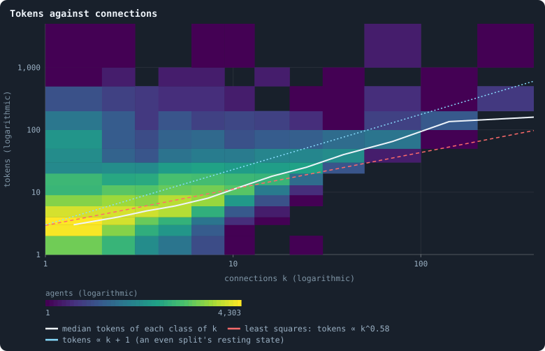
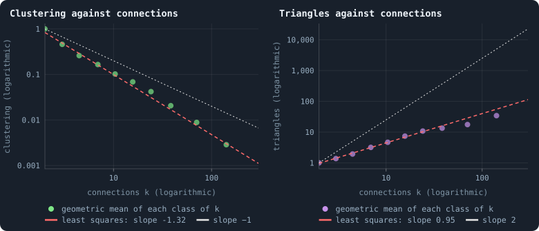
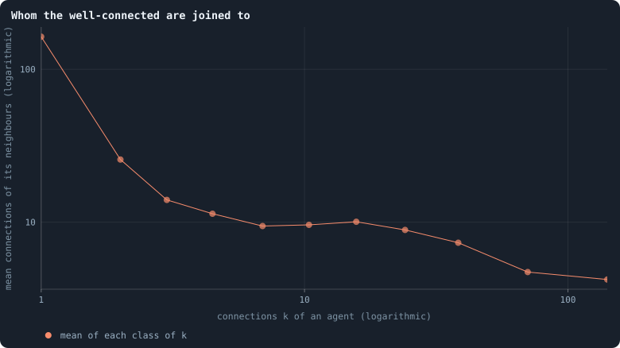
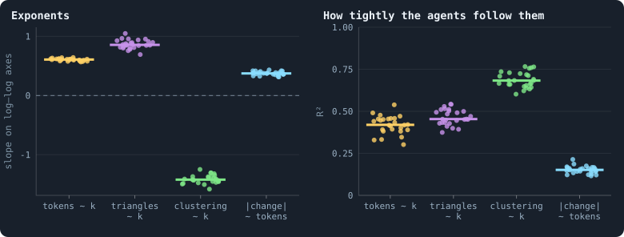

# How properties scale together

An agent has several measurable properties: its tokens, its connections, the
triangles it is a corner of, how closely knit its neighbourhood is, how much
its tokens change in a game. How does one grow with another? Every 25
iterations, the viewer fits four **scaling relations** of the form *y* ≈ *a xᵇ*
by least squares on the logarithms of all agents
([Scaling relations](../notes/scaling-relations.md)). This chapter shows the
agents behind the four fits — and finds that one of the exponents means
something quite different from what it seems to say.

> [!question] Questions of this chapter
> - How do an agent's tokens grow with its connections? Is that the resting
>   state of the even split ([Chapter 20](20-where-the-tokens-flow.md))?
> - How closely knit is the neighbourhood of a well-connected agent?
> - To whom are the well-connected joined?
> - Does the size of an agent's gains and losses grow with its wealth?

<!-- runs E02 -->
> [!info] The runs behind this chapter
> **30 runs.** Every condition below is run once for every seed (1 to 30), for 3,000 iterations — or until its world dies out. Every setting is that of the baseline **B1** (the algorithm exactly as a new run is offered it) unless the condition changes it.
>
> - **baseline** — changes nothing: B1 as it is; 10,000 tokens. Runs `B1-10000-s001` … `B1-10000-s030`.
>
> To make these runs again: `python3 gol_lab.py run E02`, or ▶ in the Book tab of a computer running `gol_server.py`. Each run writes its settings, seed and engine version beside its frames, in `GraphOfLifeRuns/<run>/meta.json` and `provenance.json`.

> [!info]- Every setting of these runs
> | setting | baseline | what it is |
> |---|---|---|
> | [`total_tokens`](../notes/settings.md#total_tokens) | 10,000 | The number of tokens in the world, *T*. It never changes during a run. |
> | [`n_nodes`](../notes/settings.md#n_nodes) | 0 | How many founders the world starts with. 0 means one founder per hundred tokens: *n* = ⌊*T* / 100⌋. |
> | [`k_neighbors`](../notes/settings.md#k_neighbors) | 0 | How many neighbours each founder starts with in the ring. 0 means *k* = max(⌊*n* / 100⌋, 5); an odd *k* is wired as *k* − 1. |
> | [`rewire_p`](../notes/settings.md#rewire_p) | 0.2 | In the starting ring, the probability that a connection is moved to a founder chosen at random (Watts–Strogatz). |
> | [`hidden_layers`](../notes/settings.md#hidden_layers) | 50, 45, 40, 35, 30 | The widths of the brain's hidden layers, in order from input to output. |
> | [`brain_kind`](../notes/settings.md#brain_kind) | float16 | How weights are stored: `float` (64-bit), `float16` (16-bit, computed in 64-bit) or `binary` (−1, 0, +1). |
> | [`brain_bits`](../notes/settings.md#brain_bits) | 16 | Only for binary brains: how many input rows encode one number. Unused by float and float16 brains. |
> | [`message_amount`](../notes/settings.md#message_amount) | 30 | How many numbers one message holds. Each agent sends one message to itself and one to each neighbour, every phase. |
> | [`random_input_amount`](../notes/settings.md#random_input_amount) | 5 | How many random numbers, drawn uniformly from −2 to 2, a brain reads per neighbour, every time it looks. |
> | [`exchange_messages`](../notes/settings.md#exchange_messages) | on | Whether agents send and read messages at all. |
> | [`message_prepass`](../notes/settings.md#message_prepass) | on | Whether every phase begins with an extra look in which agents only write messages, so the look that acts reads messages written this phase. |
> | [`allow_handover`](../notes/settings.md#allow_handover) | on | Whether a parent may move some of its own connections to its newborn child. |
> | [`allow_revolutions`](../notes/settings.md#allow_revolutions) | on | Whether a coalition of smaller stakers can take a node from its largest staker (see the note *How a coalition takes a node*). |
> | [`allow_gifting`](../notes/settings.md#allow_gifting) | off | Whether agents may give tokens to neighbours during reproduction. Off in every run of this book. |
> | [`random_decisions`](../notes/settings.md#random_decisions) | off | The control: every number a brain would produce is replaced by a random draw from the standard normal distribution. |
> | [`prune_after`](../notes/settings.md#prune_after) | blotto | After which phase connections that carried no tokens are cut: `blotto` (the game), `reproduction`, or `both`. |
> | [`inactive_window`](../notes/settings.md#inactive_window) | phase | How long a connection may go unused: `phase` means it must carry tokens in the phase being judged; `iteration` allows the two last phases. |
> | [`redistribution`](../notes/settings.md#redistribution) | uniform | How the tokens of removed agents are shared: `uniform` gives every survivor the same chance at each token; `by_tokens` weights by what a survivor holds. |
> | [`tokens_created_per_phase`](../notes/settings.md#tokens_created_per_phase) | 0 | Tokens added to the world at every cleanup. 0 keeps the supply fixed. |
> | [`mutation_probability`](../notes/settings.md#mutation_probability) | 0.2 | The probability that a brain changes when it is copied to a child, and again, for every brain, after every game. |
> | [`mutation_noise_std`](../notes/settings.md#mutation_noise_std) | 0.2 | How large a change to one weight is: a normal draw with standard deviation this times 1/√(fan-in) of its layer. |
> | [`mutation_sparsity`](../notes/settings.md#mutation_sparsity) | 0.1 | The share of a brain's numbers a change touches; also the probability, for each weight matrix and bias vector, of a rarer reset that redraws that share of it. |
> | [`extinction_threshold`](../notes/settings.md#extinction_threshold) | 20 | A run stops, as extinct, when an iteration ends (after its game) with this many agents or fewer. |
> | seeds | 1 to 30 | one run per seed |
> | iterations | 3,000 | how far each run goes, unless its world dies first |
>
> A value in **bold** differs from the baseline B1.
<!-- /runs -->

## Tokens and connections

<!-- figure scaling/tokens-degree -->

**Tokens against connections.** Every agent alive after the last game of the 26 worlds that lived to the end (35,554 agents), counted in cells of connections k and tokens, both in classes of growing width; a cell's colour is how many agents it holds, on a logarithmic scale. White: the median tokens in each class of k. Red: the straight line least squares fits through ln(tokens) against ln(k) over all agents ([Scaling relations](../notes/scaling-relations.md)). Cyan: tokens proportional to k + 1, through the median at k = 1 — where an even split of every stake would leave the tokens on a network that held still ([Chapter 20](20-where-the-tokens-flow.md)).

> [!example]- How to make this figure
> **Runs.** The 26 surviving ones of the 30 baseline runs `B1-10000-s001` … `B1-10000-s030`: the baseline B1 at 10,000 tokens, seeds 1 to 30, 3,000 iterations each (every setting is listed in [Chapter 8](08-thirty-worlds.md)). They are made with `python3 gol_lab.py run E02`.
>
> **Data.** From each run's frames, `GraphOfLifeRuns/<run>/frames/`, read with `gol_store.read_frame(run, index)`; frame `2·t` is iteration *t* after reproduction and frame `2·t + 1` after the game.
>
> 1. Read frame `5999` of every run: each agent's tokens and its connections in `edges`.
> 2. Count the agents in each cell of the classes shown; colour by the count.
> 3. Fit ln(tokens) = a + b·ln(k) by least squares over all agents (the viewer's `tokensVsDegree` does this for one frame).
>
> **To make it again:** `python3 book_figures.py scaling`.
<!-- /figure -->

The cells show the 35,554 agents alive after the last game of the 26 worlds.
Tokens rise with connections, with a wide scatter: in every class of
connections, the agents' tokens span two decades. Least squares through all
of them gives **tokens ∝ k^0.58**, and in single worlds, measured every 25
iterations over the settled life, 0.61 (0.57 to 0.64) with R² = 0.42. Ten
times the connections, about four times the tokens?

Now compare the white line, the median of each class, with the cyan line,
tokens ∝ *k* + 1 — the resting state of the even split, where every agent
holds the same number of tokens for each of its candidates. From about five
connections on, the two run parallel. Count tokens per candidate, τ/(*k* + 1),
in each class:

| connections | 1 | 2 | 3–4 | 5–9 | 10–49 | 50+ |
|---|---|---|---|---|---|---|
| median tokens per candidate | 1.5 | 1.33 | 1.2 | 1.0 | 1.0 | 1.02 |
| mean tokens per candidate | 2.35 | 1.82 | 1.55 | 1.50 | 1.50 | 2.36 |

At rest, every agent would hold *T* / Σ(*k* + 1) = 1.72 tokens per candidate.
The means lie around that value in every class, from one connection to
hundreds: **the typical agent holds about the resting state's share.**

Then why does the fit say 0.58 and not 1? Because *k* + 1 is not a power of
*k*, and most agents have one or two connections. Between *k* = 1 and
*k* = 2, *k* + 1 grows from 2 to 3 — by a factor of 1.5 where *k* doubles,
a local exponent of ln 1.5 / ln 2 = 0.58. Least squares counts every agent
once, and 21,000 of the 35,554 have one or two connections. Even if every
agent held **exactly** its resting share, least squares over these agents
would report an exponent of **0.73**. The remaining gap, to 0.58, is the
poorly connected holding a little more than their share (1.5 tokens per
candidate at one connection, against 1.0 from five on).

This is the most useful lesson of the chapter: **an exponent fitted to a
relation that is not a power law reports where most of the points are**, not
a law. Here the law is simple — tokens proportional to connections plus one —
and the exponent 0.6 is what it looks like through a log–log fit.

## How closely knit a neighbourhood is

The **clustering coefficient** of an agent with *k* ≥ 2 neighbours is the
share of the *k*(*k* − 1)/2 pairs of its neighbours that are joined to each
other ([Clustering](../notes/clustering.md)); its **triangles** are those
joined pairs.

<!-- figure scaling/clustering-triangles -->

**How an agent's neighbourhood closes, by its connections.** Agents alive after the last game of the 26 worlds that lived to the end, in classes of their connections k. Left: the geometric mean (the mean of the logarithms, turned back) of the clustering coefficient — the share of pairs of an agent's neighbours that are joined to each other — of the agents with k ≥ 2 and clustering above 0. Right: the geometric mean of the number of triangles an agent is a corner of, over the agents in at least one. Red: least squares on the logarithms of all those agents (not of the class means); grey: the slopes −1 and 2 for comparison.

> [!example]- How to make this figure
> **Runs.** The 26 surviving ones of the 30 baseline runs `B1-10000-s001` … `B1-10000-s030`: the baseline B1 at 10,000 tokens, seeds 1 to 30, 3,000 iterations each (every setting is listed in [Chapter 8](08-thirty-worlds.md)). They are made with `python3 gol_lab.py run E02`.
>
> **Data.** From each run's frames, `GraphOfLifeRuns/<run>/frames/`, read with `gol_store.read_frame(run, index)`; frame `2·t` is iteration *t* after reproduction and frame `2·t + 1` after the game.
>
> 1. Read frame `5999` of every run; for every agent count its triangles: pairs of its neighbours that are joined.
> 2. Clustering of an agent with k ≥ 2 neighbours = triangles / (k(k − 1)/2).
> 3. Average ln(y) by class of k and turn it back for the dots; fit ln(y) on ln(k) over the agents with y > 0 for the red lines (`clusteringVsDegree`, `trianglesVsDegree` in the viewer).
>
> **To make it again:** `python3 book_figures.py scaling`.
<!-- /figure -->

Triangles grow about **in proportion** to connections (slope 0.95 pooled;
0.86 in single worlds) — far below the slope 2 of a neighbourhood wired at
random, where the pairs of neighbours, and so the expected triangles, grow as
*k*². So clustering falls steeply: slope −1.32 pooled, −1.42 in single worlds
(R² = 0.68). For agents with more than a hundred connections, the typical
share of joined neighbour pairs is a few in a thousand.

A falling *C*(*k*) ∝ 1/*k* is the signature Ravasz and Barabási (2003) gave
for **hierarchical** networks: small, tight groups inside larger, looser ones.
The rules suggest how it comes about here. A hub gains connections through
the children of its neighbours ([Chapter 22](22-power-laws-real-and-apparent.md)):
a child born to a neighbour *v* of the hub *h* and joined to both *v* and *h*
closes the triangle (child, *v*, *h*). So each connection a hub gains this way
comes with about one triangle — triangles in proportion to connections, and
clustering falling as 1/*k*.

## Whom the well-connected are joined to

<!-- figure scaling/neighbours -->

**Whom the well-connected are joined to.** For the agents alive after the last game of the 26 worlds that lived to the end, in classes of their connections k: the mean, over the class, of the average number of connections of an agent's neighbours. A falling line means the well-connected are joined mostly to the poorly connected ([Assortativity](../notes/assortativity.md)).

> [!example]- How to make this figure
> **Runs.** The 26 surviving ones of the 30 baseline runs `B1-10000-s001` … `B1-10000-s030`: the baseline B1 at 10,000 tokens, seeds 1 to 30, 3,000 iterations each (every setting is listed in [Chapter 8](08-thirty-worlds.md)). They are made with `python3 gol_lab.py run E02`.
>
> **Data.** From each run's frames, `GraphOfLifeRuns/<run>/frames/`, read with `gol_store.read_frame(run, index)`; frame `2·t` is iteration *t* after reproduction and frame `2·t + 1` after the game.
>
> 1. Read frame `5999` of every run; for every agent, the mean degree of its neighbours.
> 2. Average by class of the agent's own degree.
>
> **To make it again:** `python3 book_figures.py scaling`.
<!-- /figure -->

An agent with one connection is, on average, joined to an agent with about
**163** connections. With two connections, its neighbours have 26 on average;
from three to fifty, about 7 to 14; and the neighbours of hubs with a hundred
connections or more have about 4. **Leaves hang on hubs, and hubs are
surrounded by leaves**: the world is built of stars.

The single number for this, the **assortativity** *r* — the correlation of
the connections at the two ends of a connection ([Assortativity](../notes/assortativity.md)) —
is −0.11 in the median world (−0.24 to 0.00). Mildly negative; and as the note
explains, a world with a few large hubs comes out negative anyway, because
there are not enough hubs for hubs to be joined to. The curve says far more
than the number.

## Gains, losses and wealth

The fourth relation asks whether the size of an agent's change in a game,
|Δ|, grows with the tokens τ it holds. If every agent risked the same
fraction of its wealth, |Δ| ∝ τ — Gibrat's law of proportionate growth
(Gibrat 1931).

<!-- figure scaling/exponents -->

**Four scaling relations in the 26 worlds.** One dot per world that lived to the end: its mean, over the measurements every 25 iterations from 500 on, of four slopes fitted by least squares on the logarithms of the agents of a frame, and of their R². Tokens and triangles against connections, clustering against connections, and the size of an agent's change in tokens over the game against the tokens it holds ([Scaling relations](../notes/scaling-relations.md)).

> [!example]- How to make this figure
> **Runs.** The 26 surviving ones of the 30 baseline runs `B1-10000-s001` … `B1-10000-s030`: the baseline B1 at 10,000 tokens, seeds 1 to 30, 3,000 iterations each (every setting is listed in [Chapter 8](08-thirty-worlds.md)). They are made with `python3 gol_lab.py run E02`.
>
> **Data.** From each run's `GraphOfLifeRuns/<run>/stats.jsonl`, which holds one row per recorded phase: `phase` 1 is the world just after reproduction, `phase` 2 just after the game, and every statistic is a field of the row (see [What a run records](../notes/frames-and-stats.md)).
>
> 1. Average `tokensVsDegree`, `trianglesVsDegree`, `clusteringVsDegree` and `changeVsTokens`, and the same with `R2` appended, over the rows with `phase` = 2 and 500 ≤ `iteration` ≤ 2,999.
> 2. One dot per run, a bar at the median.
>
> **To make it again:** `python3 book_figures.py scaling`.
<!-- /figure -->

In the worlds, |Δ| ∝ τ^0.37 with R² = 0.15. Read the R² first: wealth explains
only 15% of the variance in how much an agent's tokens change; most of it is
something else — where the agent is, what its neighbours stake. The exponent,
like the tokens' above, is set by the crowd of poor agents: a change is a
whole number of at least one token, so among agents holding 1 to 5 tokens,
|Δ| cannot shrink with τ, and the line is flattened.

The other three relations of the figure are those above, world by world. The
dots lie close together: tokens 0.57 to 0.64, triangles 0.69 to 1.05,
clustering −1.58 to −1.25. These relations are not chance outcomes of a
world's history.

## What this means

- **The even split's resting state describes wealth.** Across three decades of
  connections, the typical agent holds about 1.7 tokens for each of its
  candidates. The famous-looking exponent 0.6 is that law seen through a
  log–log fit.
- **The network is a hierarchy of stars.** Triangles grow with connections,
  clustering falls as 1/*k*, leaves hang on hubs. Copying neighbourhoods at
  birth explains all three.
- **These relations belong to the rules.** They are nearly the same in every
  world, and they follow from two mechanisms — splitting stakes evenly and
  joining children to their parents' neighbours — that say nothing about what
  a brain computes. Structure that the rules alone fix is not where to look
  for evolution; [Meta II](29-meta-2.md) asks where to look instead.

To make every figure of this chapter: `python3 book_figures.py scaling`.

<!-- turns -->
---

← [Chapter 22 · Power laws, real and apparent](22-power-laws-real-and-apparent.md) · [Contents](../README.md) · [Chapter 24 · The geometry of a world](24-the-geometry-of-a-world.md) →
<!-- /turns -->
