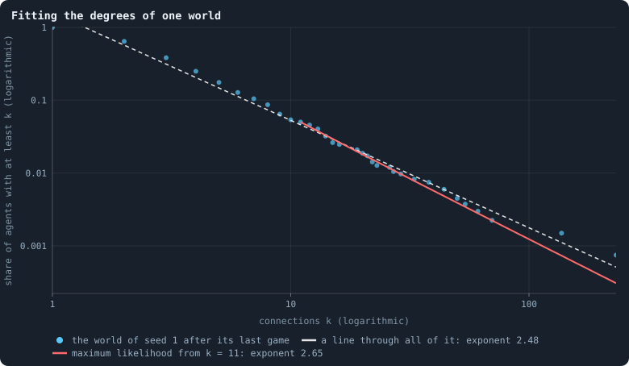
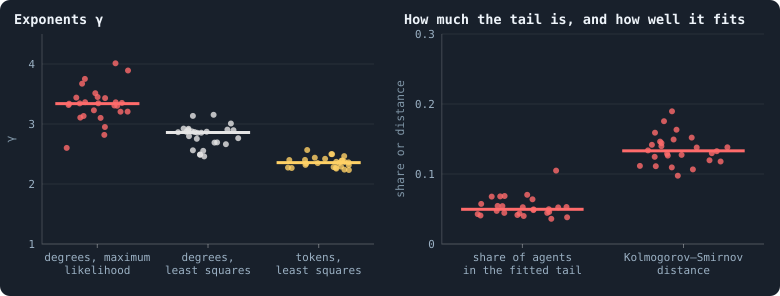
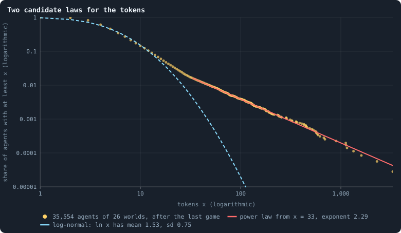
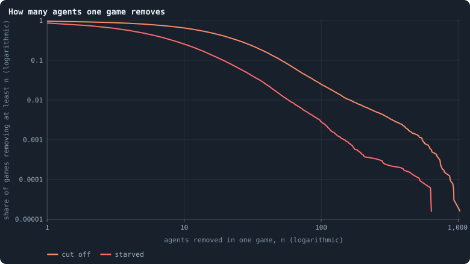
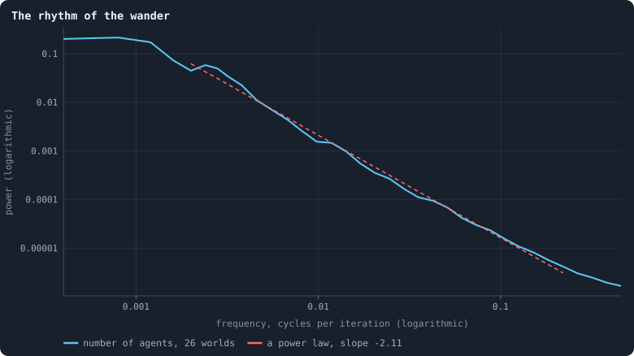

# Power laws, real and apparent

Power laws have a special place in the study of complex systems. Networks
whose numbers of connections follow one are called **scale-free** (Barabási
and Albert 1999); Pareto (1896) found one in incomes; sandpiles, earthquakes
and — in a famous model — extinctions come in avalanches of every size with no
typical one (Bak, Tang and Wiesenfeld 1987; Bak and Sneppen 1993); and noise
whose power falls as 1/*f* is found in music, rivers and heartbeats. A power
law is often read as a sign of something deep: a system poised at a critical
point, or growing by "the rich get richer".

Most claimed power laws do not survive a careful test (Clauset, Shalizi and
Newman 2009), and scale-free networks turn out to be rare (Broido and Clauset
2019). This chapter fits power laws to four things in the baseline worlds —
connections, tokens, the deaths of one game, and the rhythm of a world's
wander — and teaches, on the way, how a real one is told from an apparent one.

> [!question] Questions of this chapter
> - Are the numbers of connections distributed as a power law? Does it matter
>   how the exponent is fitted?
> - Are the tokens?
> - How many agents does one game remove — is there a typical number, or do
>   removals come in avalanches of every size?
> - What rhythm does a world's wander have?

<!-- runs E02 -->
> [!info] The runs behind this chapter
> **30 runs.** Every condition below is run once for every seed (1 to 30), for 3,000 iterations — or until its world dies out. Every setting is that of the baseline **B1** (the algorithm exactly as a new run is offered it) unless the condition changes it.
>
> - **baseline** — changes nothing: B1 as it is; 10,000 tokens. Runs `B1-10000-s001` … `B1-10000-s030`.
>
> To make these runs again: `python3 gol_lab.py run E02`, or ▶ in the Book tab of a computer running `gol_server.py`. Each run writes its settings, seed and engine version beside its frames, in `GraphOfLifeRuns/<run>/meta.json` and `provenance.json`.

> [!info]- Every setting of these runs
> | setting | baseline | what it is |
> |---|---|---|
> | [`total_tokens`](../notes/settings.md#total_tokens) | 10,000 | The number of tokens in the world, *T*. It never changes during a run. |
> | [`n_nodes`](../notes/settings.md#n_nodes) | 0 | How many founders the world starts with. 0 means one founder per hundred tokens: *n* = ⌊*T* / 100⌋. |
> | [`k_neighbors`](../notes/settings.md#k_neighbors) | 0 | How many neighbours each founder starts with in the ring. 0 means *k* = max(⌊*n* / 100⌋, 5); an odd *k* is wired as *k* − 1. |
> | [`rewire_p`](../notes/settings.md#rewire_p) | 0.2 | In the starting ring, the probability that a connection is moved to a founder chosen at random (Watts–Strogatz). |
> | [`hidden_layers`](../notes/settings.md#hidden_layers) | 50, 45, 40, 35, 30 | The widths of the brain's hidden layers, in order from input to output. |
> | [`brain_kind`](../notes/settings.md#brain_kind) | float16 | How weights are stored: `float` (64-bit), `float16` (16-bit, computed in 64-bit) or `binary` (−1, 0, +1). |
> | [`brain_bits`](../notes/settings.md#brain_bits) | 16 | Only for binary brains: how many input rows encode one number. Unused by float and float16 brains. |
> | [`message_amount`](../notes/settings.md#message_amount) | 30 | How many numbers one message holds. Each agent sends one message to itself and one to each neighbour, every phase. |
> | [`random_input_amount`](../notes/settings.md#random_input_amount) | 5 | How many random numbers, drawn uniformly from −2 to 2, a brain reads per neighbour, every time it looks. |
> | [`exchange_messages`](../notes/settings.md#exchange_messages) | on | Whether agents send and read messages at all. |
> | [`message_prepass`](../notes/settings.md#message_prepass) | on | Whether every phase begins with an extra look in which agents only write messages, so the look that acts reads messages written this phase. |
> | [`allow_handover`](../notes/settings.md#allow_handover) | on | Whether a parent may move some of its own connections to its newborn child. |
> | [`allow_revolutions`](../notes/settings.md#allow_revolutions) | on | Whether a coalition of smaller stakers can take a node from its largest staker (see the note *How a coalition takes a node*). |
> | [`allow_gifting`](../notes/settings.md#allow_gifting) | off | Whether agents may give tokens to neighbours during reproduction. Off in every run of this book. |
> | [`random_decisions`](../notes/settings.md#random_decisions) | off | The control: every number a brain would produce is replaced by a random draw from the standard normal distribution. |
> | [`prune_after`](../notes/settings.md#prune_after) | blotto | After which phase connections that carried no tokens are cut: `blotto` (the game), `reproduction`, or `both`. |
> | [`inactive_window`](../notes/settings.md#inactive_window) | phase | How long a connection may go unused: `phase` means it must carry tokens in the phase being judged; `iteration` allows the two last phases. |
> | [`redistribution`](../notes/settings.md#redistribution) | uniform | How the tokens of removed agents are shared: `uniform` gives every survivor the same chance at each token; `by_tokens` weights by what a survivor holds. |
> | [`tokens_created_per_phase`](../notes/settings.md#tokens_created_per_phase) | 0 | Tokens added to the world at every cleanup. 0 keeps the supply fixed. |
> | [`mutation_probability`](../notes/settings.md#mutation_probability) | 0.2 | The probability that a brain changes when it is copied to a child, and again, for every brain, after every game. |
> | [`mutation_noise_std`](../notes/settings.md#mutation_noise_std) | 0.2 | How large a change to one weight is: a normal draw with standard deviation this times 1/√(fan-in) of its layer. |
> | [`mutation_sparsity`](../notes/settings.md#mutation_sparsity) | 0.1 | The share of a brain's numbers a change touches; also the probability, for each weight matrix and bias vector, of a rarer reset that redraws that share of it. |
> | [`extinction_threshold`](../notes/settings.md#extinction_threshold) | 20 | A run stops, as extinct, when an iteration ends (after its game) with this many agents or fewer. |
> | seeds | 1 to 30 | one run per seed |
> | iterations | 3,000 | how far each run goes, unless its world dies first |
>
> A value in **bold** differs from the baseline B1.
<!-- /runs -->

## What a power law is, and why it is hard to see

A quantity *k* follows a power law if the share of values equal to *k* falls
as *k*^−γ. It has **no typical scale**: doubling *k* always divides the share
by the same factor, 2^γ, whether *k* is 2 or 2,000. The share of values **at
least** *k* — the complementary cumulative distribution — then falls as
*k*^−(γ−1), a straight line of slope 1 − γ on log–log axes
([Logarithmic axes](../notes/logarithmic-axes.md)).

The viewer offers two ways of finding γ ([Fitting a power law](../notes/power-law-fit.md)):

- **Least squares** through the whole cumulative distribution on log–log
  axes (`degreeExponent`, `tokenExponent`): the obvious method, and a biased
  one.
- **Maximum likelihood** on the tail, from the *k*_min whose fitted law sits
  closest to the data (`degreeGamma`, `degreeKMin`): the method the literature
  recommends.

And neither says whether there *is* a power law. For that, this chapter adds
the test of Clauset, Shalizi and Newman: draw many samples from the fitted
law, fit each the same way, and ask how often a sample fits its own law
**worse** than the data fit theirs. If that happens rarely — in 10% of samples
or fewer — the data are too far from a power law to be one. If it happens
often, a power law is a plausible description (though another curve might be
too).

## The connections of one world

<!-- figure powerlaws/degree-fit -->

**Fitting the degrees of one world.** Dots: for every number of connections k that occurs among the 1,336 agents of the world with seed 1 after its last game, the share of agents with at least k — the complementary cumulative distribution, on logarithmic axes. Dashed: the straight line least squares fits through all the dots, whose slope is 1 − γ for a power law of exponent γ (the viewer's `degreeExponent`). Red: the power law fitted by maximum likelihood to the tail from the k that fits best, k = 11 (`degreeGamma`, `degreeKMin`), which holds 5.0% of the agents ([Fitting a power law](../notes/power-law-fit.md)).

> [!example]- How to make this figure
> **Runs.** `B1-10000-s001`.
>
> **Data.** From each run's frames, `GraphOfLifeRuns/<run>/frames/`, read with `gol_store.read_frame(run, index)`; frame `2·t` is iteration *t* after reproduction and frame `2·t + 1` after the game.
>
> 1. Read the last frame after a game (`5999`) and count every agent's connections in `edges`.
> 2. Dots: for each distinct count k, the share of agents with at least k.
> 3. Dashed: least squares of ln(share) on ln(k) over the dots.
> 4. Red: `gol_series._scale_free(degrees)` — for each candidate k_min, γ = 1 + n / Σ ln(k / (k_min − ½)) over the n agents with k ≥ k_min, and the Kolmogorov–Smirnov distance; the k_min with the smallest distance wins.
>
> **To make it again:** `python3 book_figures.py powerlaws`.
<!-- /figure -->

The world of seed 1 has 1,336 agents after its last game. The dashed line,
least squares through every point, has the exponent 2.48 — but it is drawn
through points that are not on a line: below about ten connections the
distribution bends. The maximum-likelihood fit chooses the tail from
*k*_min = 11, which holds 67 agents (5.0%), and gives γ = 2.65. With 67
values, the exponent is known to about ±(γ − 1)/√67 = ±0.20.

Is the tail a power law? The largest gap between the data and the fitted law
is 0.108. Samples drawn from the fitted law show a gap at least as large in
19.5% of cases (200 samples): a power law is **not ruled out** for the top 5%
of this world. What it does not say is anything about the other 95%.

## Twenty-six worlds

<!-- figure powerlaws/exponents -->

**Power-law exponents of the 26 worlds.** One dot per world that lived to the end, at its mean over the measurements (every 25 iterations) from iteration 500 on; the bar is the median. Left: the exponent γ of the degree distribution by maximum likelihood on the tail (`degreeGamma`) and by least squares on the whole distribution (`degreeExponent`), and of the token distribution by least squares (`tokenExponent`). Right: the share of agents in the tail the maximum-likelihood fit chose (`degreeTailShare`) and the largest gap between that tail and the fitted law (`degreeGammaKS`).

> [!example]- How to make this figure
> **Runs.** The 26 surviving ones of the 30 baseline runs `B1-10000-s001` … `B1-10000-s030`: the baseline B1 at 10,000 tokens, seeds 1 to 30, 3,000 iterations each (every setting is listed in [Chapter 9](09-thirty-worlds.md)). They are made with `python3 gol_lab.py run E02`.
>
> **Data.** From each run's `GraphOfLifeRuns/<run>/stats.jsonl`, which holds one row per recorded phase: `phase` 1 is the world just after reproduction, `phase` 2 just after the game, and every statistic is a field of the row (see [What a run records](../notes/frames-and-stats.md)).
>
> 1. Average `degreeGamma`, `degreeExponent`, `tokenExponent`, `degreeTailShare` and `degreeGammaKS` over the rows with `phase` = 2 and 500 ≤ `iteration` ≤ 2,999.
> 2. One dot per run, a bar at the median.
>
> **To make it again:** `python3 book_figures.py powerlaws`.
<!-- /figure -->

Across the worlds, over their settled life:

- maximum likelihood finds the tail from about 10 connections, holding 5.0% of
  the agents (3.6% to 10.5%), with γ = 3.34 (2.60 to 4.01);
- least squares through everything gives 2.86 (2.46 to 3.15) — consistently
  **lower**, because a line through the whole distribution is tilted by the
  bend of the body;
- the test, on each world's last frame, rules a power law out in 4 of the 26
  worlds and leaves it plausible in 22.

So: the top twentieth of the connections looks like a power law with an
exponent near 3, the bulk does not, and the exponent one reports depends on
the method by about half a unit. "The network is scale-free" would claim far
more than this.

Where would a tail like this come from? The rules contain a known mechanism.
A child is joined to some of its parent's candidates — in effect it **copies**
part of its parent's neighbourhood ([Chapter 22](22-how-agents-have-children.md)).
An agent gains a connection whenever one of its neighbours has a child that is
joined to it; an agent with twice the neighbours has about twice the chances.
The well connected gain connections in proportion to their connections:
preferential attachment (Barabási and Albert 1999), reached by copying, as in
the "duplication" models of protein networks (Vázquez, Flammini, Maritan and
Vespignani 2003; Chung, Lu, Dewey and Galas 2003). Preferential attachment on
its own gives γ = 3. Whether that is what happens here is a hypothesis: an
experiment that joined children to random agents instead would test it.

## The tokens: a power law in the tail

<!-- figure powerlaws/tokens-fit -->

**Two candidate laws for the tokens.** Dots: for every token count x that occurs among the agents alive after the last game of the 26 worlds that lived to the end, the share holding at least x. Red: a power law fitted by maximum likelihood to the tail, from the x that fits it best. Cyan: a log-normal distribution with the mean and standard deviation of ln x over all agents — a distribution whose logarithm is normal. Both on logarithmic axes.

> [!example]- How to make this figure
> **Runs.** The 26 surviving ones of the 30 baseline runs `B1-10000-s001` … `B1-10000-s030`: the baseline B1 at 10,000 tokens, seeds 1 to 30, 3,000 iterations each (every setting is listed in [Chapter 9](09-thirty-worlds.md)). They are made with `python3 gol_lab.py run E02`.
>
> **Data.** From each run's frames, `GraphOfLifeRuns/<run>/frames/`, read with `gol_store.read_frame(run, index)`; frame `2·t` is iteration *t* after reproduction and frame `2·t + 1` after the game.
>
> 1. Pool the `tokens` of the last frame of every run.
> 2. Dots: for each distinct x, the share of agents with at least x.
> 3. Red: `gol_series._scale_free(tokens)`, as for the degrees.
> 4. Cyan: μ and σ = the mean and standard deviation of ln x; the curve is 1 − Φ((ln x − μ)/σ), Φ the standard normal distribution.
>
> **To make it again:** `python3 book_figures.py powerlaws`.
<!-- /figure -->

The tokens of 35,554 agents, pooled over the 26 worlds after their last game,
tell a clearer story. The **log-normal** distribution with the mean and spread
of ln *x* (μ = 1.53, σ = 0.75: a median of *e*^1.53 ≈ 4.6 tokens) fits the
body up to about 20 tokens — and then falls far below the data. From 33 tokens
on, the data follow a straight line for two decades, to over 3,000 tokens:
a power law with γ = 2.29, fitted to 579 agents (1.6%), with a largest gap of
only 0.025. Samples from the fitted law fit it worse than the data in **92%**
of cases. Of the four candidates in this chapter, this is the most convincing
power law: the share of agents with at least *x* tokens falls as *x*^−1.29 —
a heavier tail than Pareto's incomes, which fell about as *x*^−1.5.

Are the richest rich because they are hubs? If tokens were a fixed function of
connections, the two tails would be tied together, and a token tail heavier
than the connection tail would need the hubs to hold *more* tokens per
connection than everyone else. They do not: among the 579 agents in the token
tail, 44% have ten connections or more — but **34% have only one or two**.
A third of the richest agents are rich far beyond their place, and
[Chapter 20](20-gains-and-losses.md) showed what happens to them: they drain,
losing 44% of their tokens per game on average.

That suggests a different mechanism, also a classic. An agent's tokens are
multiplied, game after game, by a random factor — sometimes a big gain, more
often a loss — while a floor holds up the poorest (a node with nothing dies,
and the share-out tops up the poor). Random multiplication with a floor
produces a power-law tail (Champernowne 1953; Kesten 1973; Levy and Solomon
1996; Gabaix 1999 for the sizes of cities). Again a hypothesis, which the
simplest test would be to look for.

## How many agents one game removes

<!-- figure powerlaws/avalanches -->

**How many agents one game removes.** Of all games from iteration 500 on in the 26 worlds that lived to the end (65,000 games), the share that cut off at least n agents (orange) and the share in which at least n agents starved (red), for every n, on logarithmic axes. Games in which no one was removed count in the denominator, which is why the curves start below 1.

> [!example]- How to make this figure
> **Runs.** The 26 surviving ones of the 30 baseline runs `B1-10000-s001` … `B1-10000-s030`: the baseline B1 at 10,000 tokens, seeds 1 to 30, 3,000 iterations each (every setting is listed in [Chapter 9](09-thirty-worlds.md)). They are made with `python3 gol_lab.py run E02`.
>
> **Data.** From each run's `GraphOfLifeRuns/<run>/stats.jsonl`, which holds one row per recorded phase: `phase` 1 is the world just after reproduction, `phase` 2 just after the game, and every statistic is a field of the row (see [What a run records](../notes/frames-and-stats.md)).
>
> 1. Take `orphaned` and `starved` of every row with `phase` = 2 and 500 ≤ `iteration` ≤ 2,999.
> 2. For each n that occurs, the share of rows with at least n.
>
> **To make it again:** `python3 book_figures.py powerlaws`.
<!-- /figure -->

In 95.7% of settled games at least one agent is cut off; in 65%, ten or more;
in 2.5%, a hundred or more; the most ever cut off in one game was 1,037. On
log–log axes the curve bends downwards all the way: there is no straight
stretch, and so no power law. The removals have a typical size, and big ones
are rare.

But big ones matter. Of all agents ever cut off, 94% died in games that cut
off ten or more, and 20% in the 2.5% of games that cut off a hundred or more.
Death by cutting comes in **lumps**: whole branches of the network fall off
at once. Starvation comes in smaller lumps (at most 637 in one game).
[Chapter 26](26-how-a-world-breaks.md) asks where the lumps come from and
whether they can be foreseen.

## The rhythm of the wander

How does a world's number of agents move over time? The **power spectrum**
splits the movement into rhythms and says how much of it happens at each
([The power spectrum](../notes/power-spectrum.md)).

<!-- figure powerlaws/spectrum -->

**The rhythm of the wander.** The power spectrum of the number of agents ([The power spectrum](../notes/power-spectrum.md)): for each frequency, how much of a world's up-and-down motion happens at that rhythm — slow wanders on the left, iteration-to-iteration jitter on the right. Each world's series from iteration 500 to 2,999, with its straight-line trend removed and a Hann window applied, normalised to total power 1 and averaged over the 26 worlds; then averaged in 39 bands of equal width on the logarithmic axis. Red: the straight line least squares fits between periods of 500 and 4 iterations.

> [!example]- How to make this figure
> **Runs.** The 26 surviving ones of the 30 baseline runs `B1-10000-s001` … `B1-10000-s030`: the baseline B1 at 10,000 tokens, seeds 1 to 30, 3,000 iterations each (every setting is listed in [Chapter 9](09-thirty-worlds.md)). They are made with `python3 gol_lab.py run E02`.
>
> **Data.** From each run's `GraphOfLifeRuns/<run>/stats.jsonl`, which holds one row per recorded phase: `phase` 1 is the world just after reproduction, `phase` 2 just after the game, and every statistic is a field of the row (see [What a run records](../notes/frames-and-stats.md)).
>
> 1. For each run, take `nodes` of the rows with `phase` = 2 and 500 ≤ `iteration` ≤ 2,999 (2,500 values); subtract the least-squares straight line.
> 2. Multiply by a Hann window and take |FFT|², the power at frequencies k/2,500, k = 1 … 1,250; divide by the total.
> 3. Average over runs; average within bands of equal width in log frequency; fit a line on log–log axes between frequencies 1/500 and 1/4.
>
> **To make it again:** `python3 book_figures.py powerlaws`.
<!-- /figure -->

Between periods of 4 and 500 iterations, the power falls as *f*^−2.11 — the
signature of a **random walk**, in which every step is added to the last. For
periods longer than about 800 iterations the spectrum flattens: the world does
not keep walking away, something pulls it back. A random walk with a pull
back to a level is the Ornstein–Uhlenbeck process, whose spectrum is flat
below a corner and falls as *f*^−2 above it; the corner here corresponds to a
pull that takes a few hundred iterations to act — which fits the
[autocorrelation](../notes/autocorrelation.md) of 0.68 after 100 iterations
found in [Chapter 13](13-how-much-does-the-seed-decide.md). 70% of the
movement happens at periods of 500 iterations or more, and only 0.4% at
periods shorter than 10: the wander is slow.

It is not 1/*f* noise (a slope of −1), which would mean memory on every time
scale. The world forgets.

## What this means

- **One real power law, one plausible, two apparent.** The token tail is a
  power law over two decades. The tail of the connections is plausibly one,
  for the top 5%. The degree distribution as a whole is not, and neither are
  the lumps of death.
- **The rules contain two textbook mechanisms for heavy tails** — copying
  neighbourhoods at birth, and multiplying tokens by chance with a floor below.
  Neither is shown here to be the cause; both could be switched off in an
  experiment.
- **No sign of a critical state.** No avalanches of every size, no 1/*f*
  noise: disturbances die out within a few hundred iterations, and the world
  is pulled back to its level. Some theories tie open-ended evolution to
  criticality — to systems on the edge between order and chaos, where small
  causes can have effects of every size. Whatever the truth of that, this
  world is not on such an edge; it is a world that wanders and returns
  ([Meta II](30-meta-2.md)).

To make every figure of this chapter: `python3 book_figures.py powerlaws`.

<!-- turns -->
---

← [Chapter 22 · How agents have children](22-how-agents-have-children.md) · [Contents](../README.md) · [Chapter 24 · How properties scale together](24-how-properties-scale-together.md) →
<!-- /turns -->
