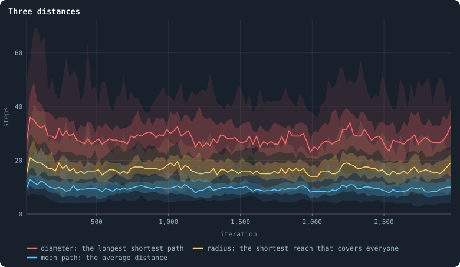
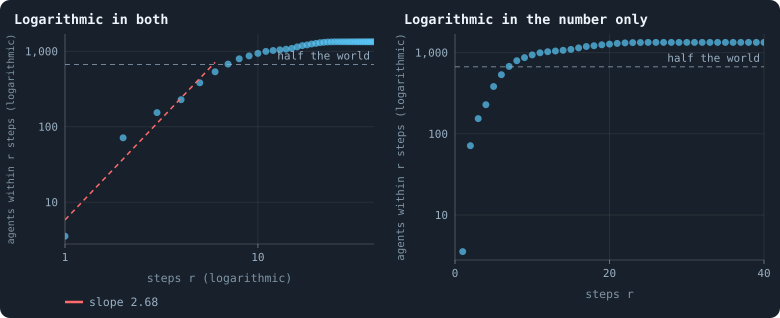
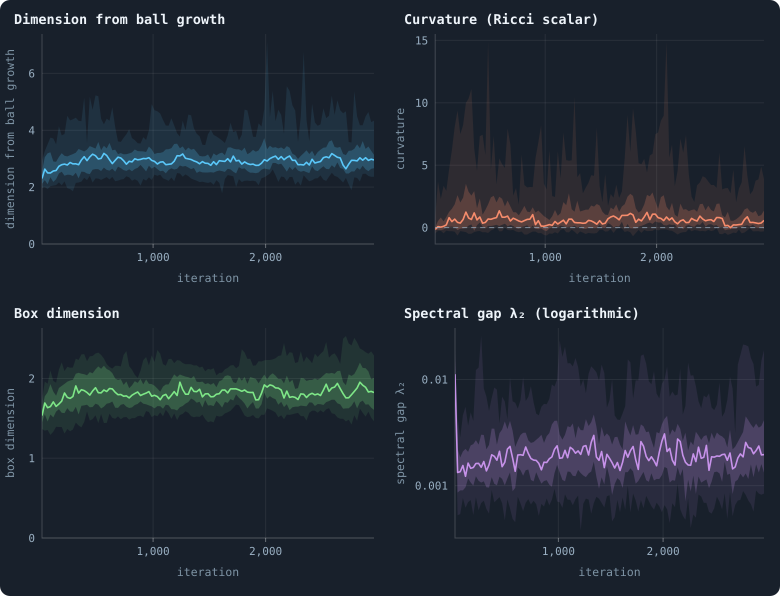
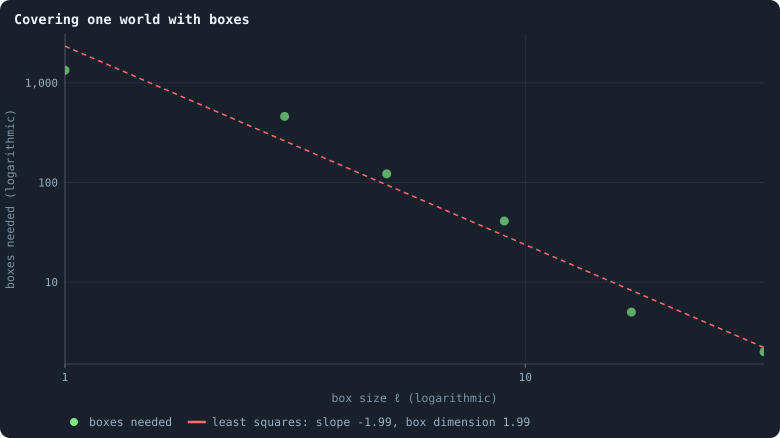
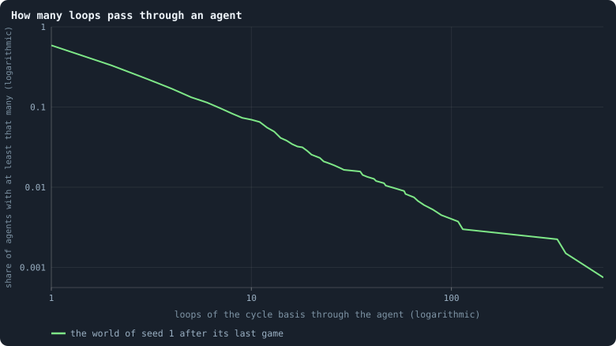

# The geometry of a world

A network has no space around it: agents are not anywhere, they are only
joined. Still, a network has a **geometry** — distances between its agents, a
way of growing outward from any one of them, places where it is thin and could
be cut. The viewer measures it in nine ways. This chapter reads them on the
baseline worlds, and holds the most telling ones against a **null**: a random
network with exactly the same number of connections at every agent. What the
world has and the random network lacks is what the rules built.

> [!question] Questions of this chapter
> - How far apart are the agents of a world, and is that far or near for a
>   network of its kind?
> - What kind of space is it: a line, a sheet, a tree?
> - How easily could it be cut in two? How long would a random walk — or a
>   token — need to cross it?
> - How many loops does it have, and where do they run?

<!-- runs E02 -->
> [!info] The runs behind this chapter
> **30 runs.** Every condition below is run once for every seed (1 to 30), for 3,000 iterations — or until its world dies out. Every setting is that of the baseline **B1** (the algorithm exactly as a new run is offered it) unless the condition changes it.
>
> - **baseline** — changes nothing: B1 as it is; 10,000 tokens. Runs `B1-10000-s001` … `B1-10000-s030`.
>
> To make these runs again: `python3 gol_lab.py run E02`, or ▶ in the Book tab of a computer running `gol_server.py`. Each run writes its settings, seed and engine version beside its frames, in `GraphOfLifeRuns/<run>/meta.json` and `provenance.json`.

> [!info]- Every setting of these runs
> | setting | baseline | what it is |
> |---|---|---|
> | [`total_tokens`](../notes/settings.md#total_tokens) | 10,000 | The number of tokens in the world, *T*. It never changes during a run. |
> | [`n_nodes`](../notes/settings.md#n_nodes) | 0 | How many founders the world starts with. 0 means one founder per hundred tokens: *n* = ⌊*T* / 100⌋. |
> | [`k_neighbors`](../notes/settings.md#k_neighbors) | 0 | How many neighbours each founder starts with in the ring. 0 means *k* = max(⌊*n* / 100⌋, 5); an odd *k* is wired as *k* − 1. |
> | [`rewire_p`](../notes/settings.md#rewire_p) | 0.2 | In the starting ring, the probability that a connection is moved to a founder chosen at random (Watts–Strogatz). |
> | [`hidden_layers`](../notes/settings.md#hidden_layers) | 50, 45, 40, 35, 30 | The widths of the brain's hidden layers, in order from input to output. |
> | [`brain_kind`](../notes/settings.md#brain_kind) | float16 | How weights are stored: `float` (64-bit), `float16` (16-bit, computed in 64-bit) or `binary` (−1, 0, +1). |
> | [`brain_bits`](../notes/settings.md#brain_bits) | 16 | Only for binary brains: how many input rows encode one number. Unused by float and float16 brains. |
> | [`message_amount`](../notes/settings.md#message_amount) | 30 | How many numbers one message holds. Each agent sends one message to itself and one to each neighbour, every phase. |
> | [`random_input_amount`](../notes/settings.md#random_input_amount) | 5 | How many random numbers, drawn uniformly from −2 to 2, a brain reads per neighbour, every time it looks. |
> | [`exchange_messages`](../notes/settings.md#exchange_messages) | on | Whether agents send and read messages at all. |
> | [`message_prepass`](../notes/settings.md#message_prepass) | on | Whether every phase begins with an extra look in which agents only write messages, so the look that acts reads messages written this phase. |
> | [`allow_handover`](../notes/settings.md#allow_handover) | on | Whether a parent may move some of its own connections to its newborn child. |
> | [`allow_revolutions`](../notes/settings.md#allow_revolutions) | on | Whether a coalition of smaller stakers can take a node from its largest staker (see the note *How a coalition takes a node*). |
> | [`allow_gifting`](../notes/settings.md#allow_gifting) | off | Whether agents may give tokens to neighbours during reproduction. Off in every run of this book. |
> | [`random_decisions`](../notes/settings.md#random_decisions) | off | The control: every number a brain would produce is replaced by a random draw from the standard normal distribution. |
> | [`prune_after`](../notes/settings.md#prune_after) | blotto | After which phase connections that carried no tokens are cut: `blotto` (the game), `reproduction`, or `both`. |
> | [`inactive_window`](../notes/settings.md#inactive_window) | phase | How long a connection may go unused: `phase` means it must carry tokens in the phase being judged; `iteration` allows the two last phases. |
> | [`redistribution`](../notes/settings.md#redistribution) | uniform | How the tokens of removed agents are shared: `uniform` gives every survivor the same chance at each token; `by_tokens` weights by what a survivor holds. |
> | [`tokens_created_per_phase`](../notes/settings.md#tokens_created_per_phase) | 0 | Tokens added to the world at every cleanup. 0 keeps the supply fixed. |
> | [`mutation_probability`](../notes/settings.md#mutation_probability) | 0.2 | The probability that a brain changes when it is copied to a child, and again, for every brain, after every game. |
> | [`mutation_noise_std`](../notes/settings.md#mutation_noise_std) | 0.2 | How large a change to one weight is: a normal draw with standard deviation this times 1/√(fan-in) of its layer. |
> | [`mutation_sparsity`](../notes/settings.md#mutation_sparsity) | 0.1 | The share of a brain's numbers a change touches; also the probability, for each weight matrix and bias vector, of a rarer reset that redraws that share of it. |
> | [`extinction_threshold`](../notes/settings.md#extinction_threshold) | 20 | A run stops, as extinct, when an iteration ends (after its game) with this many agents or fewer. |
> | seeds | 1 to 30 | one run per seed |
> | iterations | 3,000 | how far each run goes, unless its world dies first |
>
> A value in **bold** differs from the baseline B1.
<!-- /runs -->

## Distances

The **distance** between two agents is the fewest connections on a path
between them ([Path length](../notes/path-length.md)). Three numbers summarise
a world's distances ([Radius and diameter](../notes/radius-and-diameter.md)):
the **mean path length**; the **diameter**, the distance between the two
agents furthest apart; and the **radius**, how far the most central agent has
to reach to touch everyone.

<!-- figure geometry/distances -->

**Three distances.** Every 25 iterations, in the 30 baseline worlds: the diameter, the radius and the mean path length, all estimated from breadth-first searches out of 8 to 16 spread agents ([Radius and diameter](../notes/radius-and-diameter.md)). For each, the line is the median of the worlds at each iteration, the darker band holds the middle half of them (from the 25th to the 75th percentile) and the paler band nine in ten (5th to 95th).

> [!example]- How to make this figure
> **Runs.** The 30 baseline runs `B1-10000-s001` … `B1-10000-s030`: the baseline B1 at 10,000 tokens, seeds 1 to 30, 3,000 iterations each (every setting is listed in [Chapter 8](08-thirty-worlds.md)). They are made with `python3 gol_lab.py run E02`.
>
> **Data.** From each run's `GraphOfLifeRuns/<run>/stats.jsonl`, which holds one row per recorded phase: `phase` 1 is the world just after reproduction, `phase` 2 just after the game, and every statistic is a field of the row (see [What a run records](../notes/frames-and-stats.md)).
>
> 1. Take `diameter`, `radius` and `meanPathLength` of the rows with `phase` = 2.
> 2. In each stretch, take the median, the 25th and 75th and the 5th and 95th percentiles of those means over the worlds that still have a value there (a world that died has none after its death).
>
> **To make it again:** `python3 book_figures.py geometry`.
<!-- /figure -->

Over the settled life the median world has a mean path length of 9.8 steps,
a radius of 17 and a diameter of 29. Are those long? Take the world of seed 1
after its last game, 1,336 agents, and compute every distance exactly: a mean
path of 8.8, a radius of 15, a diameter of 29. Now keep every agent's number
of connections and wire them at random (five times, a "configuration model"):
the mean path falls to **4.2**, the radius to 5.8, the diameter to 11.

The world is **twice as long** as its connections require. Random networks are
"small worlds" because every connection is as likely to be a long jump as a
short one. In this world there are no long jumps: a child is joined to its
parent's neighbourhood ([Chapter 21](21-how-agents-have-children.md)), so the
network only ever grows locally, branch by branch.

## How the world grows around an agent

Stand on an agent and count the agents within *r* steps.

<!-- figure geometry/ball -->

**How many agents are within r steps.** The world with seed 1 after its last game (1,336 agents). From 24 agents spread evenly through the list of ids, a breadth-first search counts how many agents lie within r steps; the dots are the means over the 24. Left, both axes logarithmic: a power law r^d — growth like a d-dimensional space — is a straight line of slope d; red is the line least squares fits up to the radius where half the world is reached. Right, only the vertical axis logarithmic: exponential growth, as in a tree or a random network, would be a straight line there ([Dimension and curvature](../notes/ball-dimension-and-curvature.md)).

> [!example]- How to make this figure
> **Runs.** `B1-10000-s001`.
>
> **Data.** From each run's frames, `GraphOfLifeRuns/<run>/frames/`, read with `gol_store.read_frame(run, index)`; frame `2·t` is iteration *t* after reproduction and frame `2·t + 1` after the game.
>
> 1. Read frame `5999`; build the network from `edges`.
> 2. From every ⌊n/24⌋-th agent of the id-sorted list, breadth-first search; count the agents at distance ≤ r for r = 1 … 40; average over the 24 sources.
> 3. Fit ln V(r) = a + d·ln r by least squares for r with V(r) ≤ n/2.
>
> **To make it again:** `python3 book_figures.py geometry`.
<!-- /figure -->

Within one step there are, on average, 3.5 agents (the agent and its
neighbours). Within two, already **70**: from most agents, two steps reach a
hub and everything around it — the stars of [Chapter 23](23-how-properties-scale-together.md).
Then the count grows more slowly, as *r*^2.68, until half the world is
reached at seven steps, and flattens as the balls run into the edges of the
world. The growth is neither a clean power law (the left panel would show a
straight line) nor a clean exponential (the right one would): a world of a
thousand agents is too small for either to have room.

## Four measures of a world's shape

From ball growth and from coverings come four numbers that the viewer
records every 25 iterations ([Dimension and curvature](../notes/ball-dimension-and-curvature.md),
[Box dimension](../notes/box-dimension.md), [The spectral gap](../notes/spectral-gap.md)):

<!-- figure geometry/measures -->

**Four measures of a world's geometry.** Every 25 iterations, in the 30 baseline worlds: the dimension and the curvature read off how balls grow ([Dimension and curvature](../notes/ball-dimension-and-curvature.md)), the box dimension ([Box dimension](../notes/box-dimension.md)), and the spectral gap, on a logarithmic axis ([The spectral gap](../notes/spectral-gap.md)). In each, the line is the median of the worlds at each iteration, the darker band holds the middle half of them (from the 25th to the 75th percentile) and the paler band nine in ten (5th to 95th).

> [!example]- How to make this figure
> **Runs.** The 30 baseline runs `B1-10000-s001` … `B1-10000-s030`: the baseline B1 at 10,000 tokens, seeds 1 to 30, 3,000 iterations each (every setting is listed in [Chapter 8](08-thirty-worlds.md)). They are made with `python3 gol_lab.py run E02`.
>
> **Data.** From each run's `GraphOfLifeRuns/<run>/stats.jsonl`, which holds one row per recorded phase: `phase` 1 is the world just after reproduction, `phase` 2 just after the game, and every statistic is a field of the row (see [What a run records](../notes/frames-and-stats.md)).
>
> 1. Take `dimension`, `ricciCurvature`, `boxDimension` and `spectralGap` of the rows with `phase` = 2 (measured every 25 iterations).
> 2. In each stretch, take the median, the 25th and 75th and the 5th and 95th percentiles of those means over the worlds that still have a value there (a world that died has none after its death).
>
> **To make it again:** `python3 book_figures.py geometry`.
<!-- /figure -->

- **Dimension from ball growth**: 3.0 in the median world (the worlds: 2.6 to
  5.4), up from 2.3 in the starting ring. Balls grow, over their first few
  steps, about as fast as in three-dimensional space.
- **Curvature**: +1.0 (0.2 to 3.4), from −0.15 at the start. Positive
  curvature means balls grow more slowly at larger *r* than at smaller — as on
  a sphere. Here that is mostly the world's **finite size**: the balls begin to
  run out of world before they reach half of it. Read it as "the growth
  slows", not as a sphere.
- **Box dimension**: 1.85 (1.68 to 2.16), up from 1.53, with R² = 0.96.
- **Spectral gap**: 0.0026 (0.0016 to 0.015), down from 0.011.

Two dimensions, 3.0 and 1.85, for the same world. They do not contradict each
other; they look at different scales. Ball growth is fitted at radii 1 to 5,
where the bushy neighbourhoods of hubs make the world look high-dimensional;
box covering runs from size 1 to 33, and at large sizes it counts the long,
thin branches, which make the world look low-dimensional. Neither number is
"the" dimension of a network that has no single one; both are indices for
comparing worlds.

## Covering a world with boxes

<!-- figure geometry/boxes -->

**Covering one world with boxes.** The world with seed 1 after its last game, covered by boxes: a box of size ℓ is every agent within (ℓ − 1)/2 steps of a centre, and centres are taken greedily, best-connected first, among the agents no box holds yet. Dots: how many boxes it takes for ℓ = 1, 3, 5, 9, 17 and 33; red: the least-squares line on logarithmic axes, whose slope is minus the box dimension ([Box dimension](../notes/box-dimension.md)).

> [!example]- How to make this figure
> **Runs.** `B1-10000-s001`.
>
> **Data.** From each run's frames, `GraphOfLifeRuns/<run>/frames/`, read with `gol_store.read_frame(run, index)`; frame `2·t` is iteration *t* after reproduction and frame `2·t + 1` after the game.
>
> 1. Read frame `5999`; order the agents by degree, highest first.
> 2. For each ℓ: go down the order; every agent not yet in a box starts a new box, which takes every agent within (ℓ − 1)/2 steps of it; count the boxes.
> 3. Fit ln(boxes) on ln ℓ by least squares.
>
> **To make it again:** `python3 book_figures.py geometry`.
<!-- /figure -->

The world of seed 1 needs 1,336 boxes of size 1 (every agent alone), 460 of
size 3, 122 of size 5, 41 of size 9, 5 of size 17 and 2 of size 33. On
logarithmic axes these lie close to a line of slope −1.99: a box dimension of
about 2, like a sheet.

## How easily a world could be cut

The **spectral gap** λ₂ measures, in one number, how hard a network is to cut
into two large parts, and how quickly a random walk on it forgets where it
started — after about 1/λ₂ steps ([The spectral gap](../notes/spectral-gap.md)).

The world of seed 1 has λ₂ = 0.0019. Its random twin, with the same
connections per agent, has 0.062: **thirty-two times larger**. By Cheeger's
inequality, a small λ₂ guarantees a bottleneck — a large part of the world
joined to the rest by few connections. [Chapter 25](25-how-a-world-breaks.md)
finds those bottlenecks: whole branches hanging on single connections.

The gap also says something about the tokens. [Chapter 20](20-where-the-tokens-flow.md)
showed that a game moves tokens almost like a random walk. On this network, a
random walk needs some 400 to 500 steps to forget its start — so tokens could
spread evenly across a whole world only over hundreds of games. Meanwhile the
network changes every game: about 165 connections are made and 117 cut per
iteration, and the hubs change brains every game. **Locally**, tokens settle
in a few games, which is why every agent's tokens follow its connections
([Chapter 23](23-how-properties-scale-together.md)). **Globally**, the world is
never at rest: far-apart regions are only loosely coupled.

## Loops

A tree has no loops; every connection beyond the *n* − 1 of a spanning tree
closes one, and those loops are independent: the **cycle rank** |*E*| − |*V*|
+ 1 ([Loops](../notes/loops.md)).

<!-- figure geometry/loops -->

**How many loops pass through an agent.** A breadth-first spanning tree of the world with seed 1 after its last game leaves 1,112 connections over, each closing one loop of a cycle basis ([Loops](../notes/loops.md)). For every count x, the share of agents that at least x of those loops pass through. 41% of the agents lie on none of them.

> [!example]- How to make this figure
> **Runs.** `B1-10000-s001`.
>
> **Data.** From each run's frames, `GraphOfLifeRuns/<run>/frames/`, read with `gol_store.read_frame(run, index)`; frame `2·t` is iteration *t* after reproduction and frame `2·t + 1` after the game.
>
> 1. Read frame `5999`; build a breadth-first spanning tree.
> 2. For every connection not in the tree, walk both ends up the tree to where they meet; every agent on the way, and the meeting point, lies on that loop.
> 3. Count the loops per agent; draw the share with at least x.
>
> **To make it again:** `python3 book_figures.py geometry`.
<!-- /figure -->

Over the settled life, the median world has 816 independent loops, a
**loop density** — independent loops per connection — of 0.38: 38% of the
connections are "spare", beyond what holding the world together needs. In the
world of seed 1, 1,112 connections close loops of a breadth-first spanning
tree; 41% of the agents lie on none of those loops — they hang on tree-like
branches — and one agent lies on 575 of them: half of all the loops of the
world run through a single hub. The number of loops through an agent is
heavy-tailed: most agents are on a few, a handful on hundreds.

## What this means

- **The world is a stretched network of stars.** Twice the distances and a
  thirty-second of the spectral gap of a random network with the same
  connections. Growth by birth is local — a child joins its parent's
  neighbourhood — and nothing ever makes a long jump.
- **The world mixes slowly.** Tokens settle within neighbourhoods and not
  across the world; regions of a world are only loosely coupled.
- **For evolution, that cuts both ways.** A network that mixes slowly lets
  regions differ for a long time, which is how spatial structure protects
  variety and how cooperation can grow among neighbours (Nowak and May 1992;
  [Chapter 27](27-do-agents-cooperate.md)). But a network with bottlenecks
  also breaks easily, and whole branches can be lost at once
  ([Chapter 25](25-how-a-world-breaks.md)).

To make every figure of this chapter: `python3 book_figures.py geometry`.

<!-- turns -->
---

← [Chapter 23 · How properties scale together](23-how-properties-scale-together.md) · [Contents](../README.md) · [Chapter 25 · How a world breaks](25-how-a-world-breaks.md) →
<!-- /turns -->
