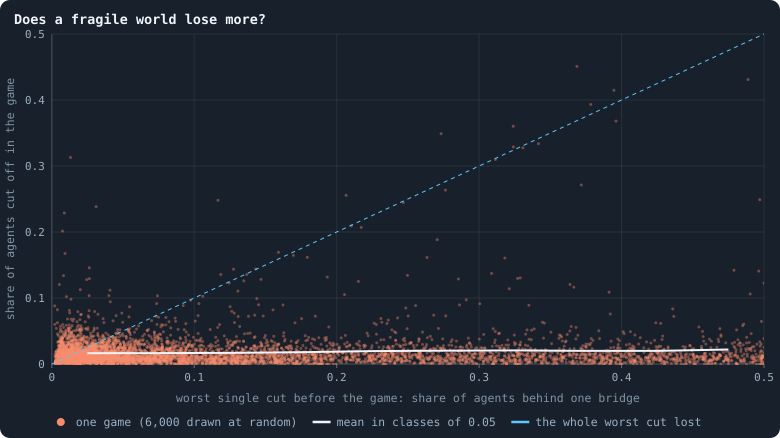
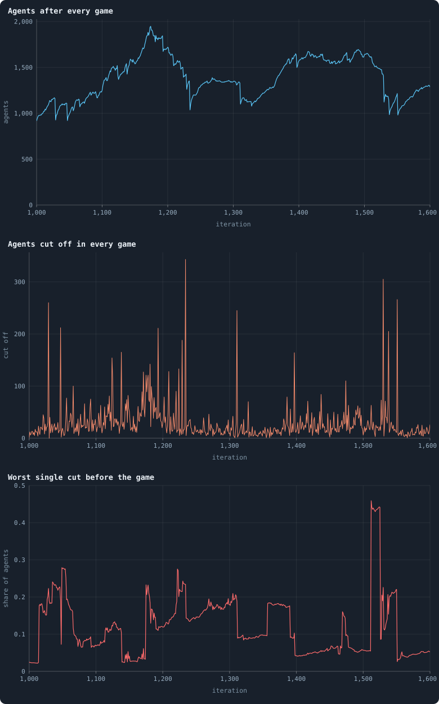
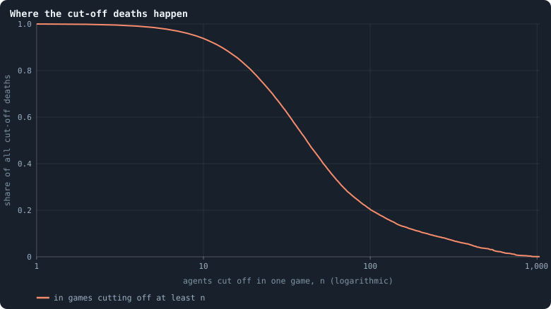

# How a world breaks

At the end of every phase the cleanup keeps only the **largest connected
piece** of the network; every agent outside it dies, however many tokens it
holds, and its tokens are dealt out among the survivors
([Chapter 3](03-one-iteration.md)). Three deaths in four are of this kind
([Chapter 11](11-births-deaths-and-ages.md)), and [Chapter 22](22-power-laws-real-and-apparent.md)
found that they come in lumps: half of them in games that cut off dozens of
agents at once. This chapter asks how fragile a world is, whether its breaks
can be foreseen, and what actually severs a region from the rest.

> [!question] Questions of this chapter
> - How much of a world hangs on single connections?
> - Does a world in which a large part hangs on one connection lose more
>   agents?
> - When a game cuts off a hundred agents, what severed them — and why there?

<!-- runs E02 -->
> [!info] The runs behind this chapter
> **30 runs.** Every condition below is run once for every seed (1 to 30), for 3,000 iterations — or until its world dies out. Every setting is that of the baseline **B1** (the algorithm exactly as a new run is offered it) unless the condition changes it.
>
> - **baseline** — changes nothing: B1 as it is; 10,000 tokens. Runs `B1-10000-s001` … `B1-10000-s030`.
>
> To make these runs again: `python3 gol_lab.py run E02`, or ▶ in the Book tab of a computer running `gol_server.py`. Each run writes its settings, seed and engine version beside its frames, in `GraphOfLifeRuns/<run>/meta.json` and `provenance.json`.

> [!info]- Every setting of these runs
> | setting | baseline | what it is |
> |---|---|---|
> | [`total_tokens`](../notes/settings.md#total_tokens) | 10,000 | The number of tokens in the world, *T*. It never changes during a run. |
> | [`n_nodes`](../notes/settings.md#n_nodes) | 0 | How many founders the world starts with. 0 means one founder per hundred tokens: *n* = ⌊*T* / 100⌋. |
> | [`k_neighbors`](../notes/settings.md#k_neighbors) | 0 | How many neighbours each founder starts with in the ring. 0 means *k* = max(⌊*n* / 100⌋, 5); an odd *k* is wired as *k* − 1. |
> | [`rewire_p`](../notes/settings.md#rewire_p) | 0.2 | In the starting ring, the probability that a connection is moved to a founder chosen at random (Watts–Strogatz). |
> | [`hidden_layers`](../notes/settings.md#hidden_layers) | 50, 45, 40, 35, 30 | The widths of the brain's hidden layers, in order from input to output. |
> | [`brain_kind`](../notes/settings.md#brain_kind) | float16 | How weights are stored: `float` (64-bit), `float16` (16-bit, computed in 64-bit) or `binary` (−1, 0, +1). |
> | [`brain_bits`](../notes/settings.md#brain_bits) | 16 | Only for binary brains: how many input rows encode one number. Unused by float and float16 brains. |
> | [`message_amount`](../notes/settings.md#message_amount) | 30 | How many numbers one message holds. Each agent sends one message to itself and one to each neighbour, every phase. |
> | [`random_input_amount`](../notes/settings.md#random_input_amount) | 5 | How many random numbers, drawn uniformly from −2 to 2, a brain reads per neighbour, every time it looks. |
> | [`exchange_messages`](../notes/settings.md#exchange_messages) | on | Whether agents send and read messages at all. |
> | [`message_prepass`](../notes/settings.md#message_prepass) | on | Whether every phase begins with an extra look in which agents only write messages, so the look that acts reads messages written this phase. |
> | [`allow_handover`](../notes/settings.md#allow_handover) | on | Whether a parent may move some of its own connections to its newborn child. |
> | [`allow_revolutions`](../notes/settings.md#allow_revolutions) | on | Whether a coalition of smaller stakers can take a node from its largest staker (see the note *How a coalition takes a node*). |
> | [`allow_gifting`](../notes/settings.md#allow_gifting) | off | Whether agents may give tokens to neighbours during reproduction. Off in every run of this book. |
> | [`random_decisions`](../notes/settings.md#random_decisions) | off | The control: every number a brain would produce is replaced by a random draw from the standard normal distribution. |
> | [`prune_after`](../notes/settings.md#prune_after) | blotto | After which phase connections that carried no tokens are cut: `blotto` (the game), `reproduction`, or `both`. |
> | [`inactive_window`](../notes/settings.md#inactive_window) | phase | How long a connection may go unused: `phase` means it must carry tokens in the phase being judged; `iteration` allows the two last phases. |
> | [`redistribution`](../notes/settings.md#redistribution) | uniform | How the tokens of removed agents are shared: `uniform` gives every survivor the same chance at each token; `by_tokens` weights by what a survivor holds. |
> | [`tokens_created_per_phase`](../notes/settings.md#tokens_created_per_phase) | 0 | Tokens added to the world at every cleanup. 0 keeps the supply fixed. |
> | [`mutation_probability`](../notes/settings.md#mutation_probability) | 0.2 | The probability that a brain changes when it is copied to a child, and again, for every brain, after every game. |
> | [`mutation_noise_std`](../notes/settings.md#mutation_noise_std) | 0.2 | How large a change to one weight is: a normal draw with standard deviation this times 1/√(fan-in) of its layer. |
> | [`mutation_sparsity`](../notes/settings.md#mutation_sparsity) | 0.1 | The share of a brain's numbers a change touches; also the probability, for each weight matrix and bias vector, of a rarer reset that redraws that share of it. |
> | [`extinction_threshold`](../notes/settings.md#extinction_threshold) | 20 | A run stops, as extinct, when an iteration ends (after its game) with this many agents or fewer. |
> | seeds | 1 to 30 | one run per seed |
> | iterations | 3,000 | how far each run goes, unless its world dies first |
>
> A value in **bold** differs from the baseline B1.
<!-- /runs -->

## Bridges and the worst cut

A **bridge** is a connection on no loop: cut it, and the network falls in two
([Bridges](../notes/bridges.md)). A settled world has about 625 of them — 31%
of its connections ([Chapter 15](15-what-shape-does-the-network-take.md)). Most
hold a single leaf. The **cut risk** asks about the worst one: the largest
share of the world that one bridge holds to the rest ([Cut risk](../notes/cut-risk.md)).
In the median world it is **12%**: somewhere, a single connection is all that
joins an eighth of the world to the other seven eighths.

## Does a fragile world lose more?

If the worst bridge failed, the game would cut off that eighth. Does it?

<!-- figure breaking/risk -->

**Does a fragile world lose more?** Every game from iteration 500 on of the 26 worlds that lived to the end. x: before the game, the largest share of the world that one bridge held to the rest — if that one connection were cut, that many would be cut off ([Cut risk](../notes/cut-risk.md)). y: the share of agents the game really cut off. White: the mean of y in classes of x 0.05 wide; dashed: y = x.

> [!example]- How to make this figure
> **Runs.** The 26 surviving ones of the 30 baseline runs `B1-10000-s001` … `B1-10000-s030`: the baseline B1 at 10,000 tokens, seeds 1 to 30, 3,000 iterations each (every setting is listed in [Chapter 8](08-thirty-worlds.md)). They are made with `python3 gol_lab.py run E02`.
>
> **Data.** From each run's `GraphOfLifeRuns/<run>/stats.jsonl`, which holds one row per recorded phase: `phase` 1 is the world just after reproduction, `phase` 2 just after the game, and every statistic is a field of the row (see [What a run records](../notes/frames-and-stats.md)).
>
> 1. Take the rows with `phase` = 2 and 500 ≤ `iteration` ≤ 2,999: `cutRiskBefore`, and `orphaned` / `nodes_before`.
> 2. Plot one against the other; average y in classes of x.
>
> **To make it again:** `python3 book_figures.py breaking`.
<!-- /figure -->

Over 65,000 settled games, the cut risk before a game and the share of agents
the game cut off have a correlation of **0.06**: nothing. The mean risk is 13%;
the mean share cut off is 1.75%. In 41% of games more than a tenth of the world
hung on one connection; in only 1.25% of games was more than a tenth cut off.
The worst bridge almost never fails.

The rules say why. A connection is cut only if **no** token crosses it, in
either direction, during the game ([`prune_after`](../notes/settings.md#prune_after)).
A bridge with a hundred agents behind it is, for the same reason that makes it
important, a busy connection: whatever flows between the branch and the rest
flows across it.

## One world, six hundred iterations

<!-- figure breaking/one-world -->

**Six hundred iterations of one world.** The world with seed 1, iterations 1,000 to 1,600. Top: its number of agents after every game. Middle: how many agents each game cut off. Bottom: before each game, the largest share of the world held to the rest by a single bridge, measured on the network as it stood before the cleanup.

> [!example]- How to make this figure
> **Runs.** `B1-10000-s001`.
>
> **Data.** From each run's `GraphOfLifeRuns/<run>/stats.jsonl`, which holds one row per recorded phase: `phase` 1 is the world just after reproduction, `phase` 2 just after the game, and every statistic is a field of the row (see [What a run records](../notes/frames-and-stats.md)).
>
> 1. Take `nodes`, `orphaned` and `cutRiskBefore` of the rows with `phase` = 2 and 1,000 ≤ `iteration` ≤ 1,600.
>
> **To make it again:** `python3 book_figures.py breaking`.
<!-- /figure -->

The world of seed 1 between iterations 1,000 and 1,600. It grows from about
950 agents to 1,950 in 170 iterations, then loses almost half in the next
sixty, through a handful of games that cut off 100 to 340 agents each. The
worst single cut (bottom) lives in **plateaus**: the same bridge holds 10% to
25% of the world for tens of iterations, until the plateau ends abruptly —
because a new connection closed a loop around the bridge, or because the
branch was lost. Around iteration 1,510, 45% of the world hung on one
connection for about twenty iterations, and was not lost through it.

## Where the cut-off deaths happen

<!-- figure breaking/deaths-by-size -->

**Where the cut-off deaths happen.** Of all agents cut off in games from iteration 500 on of the 26 worlds that lived to the end, the share that died in games which cut off at least n agents, for every n. Where the line is at 0.5, half of all such deaths happened in games at least that large.

> [!example]- How to make this figure
> **Runs.** The 26 surviving ones of the 30 baseline runs `B1-10000-s001` … `B1-10000-s030`: the baseline B1 at 10,000 tokens, seeds 1 to 30, 3,000 iterations each (every setting is listed in [Chapter 8](08-thirty-worlds.md)). They are made with `python3 gol_lab.py run E02`.
>
> **Data.** From each run's `GraphOfLifeRuns/<run>/stats.jsonl`, which holds one row per recorded phase: `phase` 1 is the world just after reproduction, `phase` 2 just after the game, and every statistic is a field of the row (see [What a run records](../notes/frames-and-stats.md)).
>
> 1. Take `orphaned` of the rows with `phase` = 2 and 500 ≤ `iteration` ≤ 2,999.
> 2. For every n, add up `orphaned` over the rows with `orphaned` ≥ n and divide by the total.
>
> **To make it again:** `python3 book_figures.py breaking`.
<!-- /figure -->

Half of all agents cut off died in games that cut off at least 42; the largest
single loss was 1,037 agents. One game in forty cuts off a hundred or more
agents, and these games account for a fifth of all deaths by cutting.

## What severs a region

Which rule cuts a region off? There is a clean way to tell. Take a game, the
agents it cut off, and the survivors. A cut-off agent that had a neighbour
among the survivors before the game must have **lost that connection to
pruning** — otherwise it would still be joined to them, and would have
survived. So the connections between the lost and the kept, as they stood
before the game, are exactly the connections pruned across the cut: the
region's **border**. Counting them tells what kind of break it was.

Of the 1,614 games that cut off a hundred agents or more (26 worlds, settled
life):

| connections pruned across the cut | 1–2 | 3–9 | 10 or more |
|---|---|---|---|
| games | 32 | 161 | 1,421 |
| agents cut off in them | 8,527 | 42,631 | 268,904 |

Only one big cut in fifty is a bridge failing. **Nine in ten are a whole
border going quiet**: ten or more connections between a region and the rest
of the world, all carrying nothing in the same game.

The six largest cuts in the world of seed 1 show both kinds. At iteration 999,
503 agents were lost through a single connection; at 1,984, 394 through two.
But at 722, 644 agents were lost across 20 connections, and at 541, 319 across
529 — and there, 60% of the lost agents carried a single genotype, and the
typical one staked **all** its tokens on its own node. A line of brains that
keeps everything at home cut its whole region off, and died with it.

## Poverty disconnects

Why would ten connections go quiet at once? Look at the agents on the two
sides of the quiet borders (the games with ten or more border connections):

| | median tokens | median connections | hold fewer tokens than connections |
|---|---|---|---|
| lost side of the border | 1 | 2 | 64% |
| kept side of the border | 3 | 5 | 78% |
| every agent, same games | 3 | 2 | 20% |

The agents on both sides of a quiet border are **poor for their connections**.
Here is the arithmetic that makes that fatal. A connection survives a game only
if at least one token crosses it. An agent with τ tokens can send a token
across at most τ of its connections — fewer, if it keeps any at home. An agent
with one token and two connections can keep at most one of them alive by
itself; the other depends on the neighbour's stake. Every connection costs at
least one token of flow per game, and a poor region cannot pay for its
connections. When the richer agents beyond the border spend their stakes
elsewhere, the border goes quiet — and the region dies, all of it, with its
tokens handed out by lottery to the survivors.

## What this means

- **A world breaks along its poor regions, not at its weakest bridge.** The
  most fragile-looking connection almost never fails; the big losses are
  borders of agents too poor to keep their connections in use.
- **Connections have a price.** One token of flow per game, per connection,
  paid by one side or the other. That caps how many connections a world of
  *T* tokens can hold, which may be part of why a world's size follows its
  tokens ([Chapter 31](31-how-does-a-worlds-size-follow-its-tokens.md)).
- **The cull is global, and blind.** A region that is cut off dies whatever its
  brains did, even if it was doing well inside. Selection here acts on regions
  through their borders, not on agents through what they do — and a world can
  never split into two populations that go their own ways, which in nature is
  how new species begin. [Chapter 28](28-questioning-the-mechanics.md)
  questions this rule, and [Meta II](29-meta-2.md) what changing it might do.

To make every figure of this chapter: `python3 book_figures.py breaking`.

<!-- turns -->
---

← [Chapter 24 · The geometry of a world](24-the-geometry-of-a-world.md) · [Contents](../README.md) · [Chapter 26 · One world, many colours](26-one-world-many-colours.md) →
<!-- /turns -->
