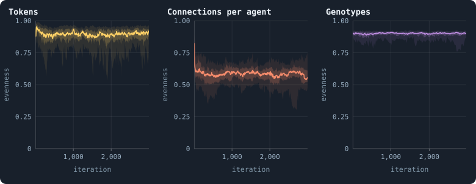
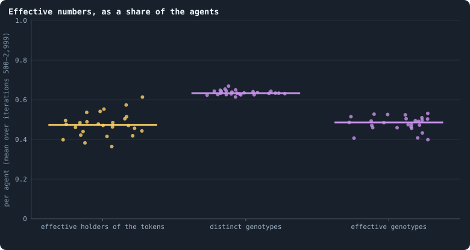
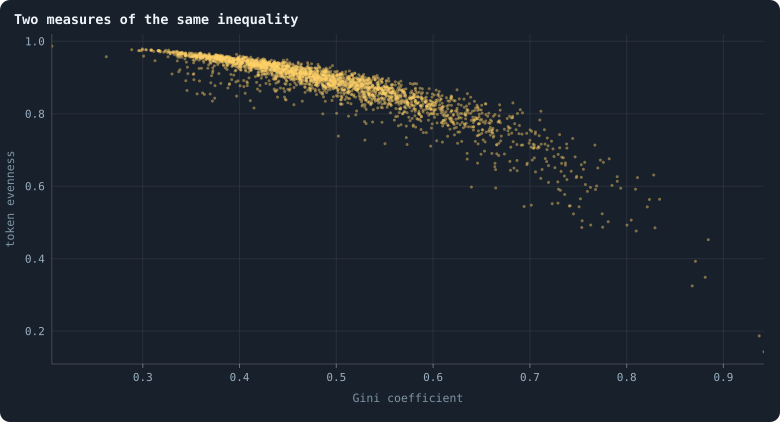

# How even is a world?

[Chapter 14](14-where-do-the-tokens-go.md) measured how unequally tokens are
held with the Gini coefficient. This chapter measures the same thing with a
second tool, **entropy** — and then uses that tool on two things a Gini cannot
measure at all, because they are not amounts: how the agents are spread over
the numbers of connections, and over the genotypes. Part III begins here: a
chapter for every statistic the viewer shows, read on the thirty baseline
worlds of [Chapter 9](09-thirty-worlds.md).

> [!question] Questions of this chapter
> - How evenly are tokens, connections and genotypes spread over the agents?
> - How many agents would hold the tokens, if each held an equal share and the
>   tokens were as even as they are? How many genotypes are there, in effect?
> - Do entropy and the Gini coefficient say the same thing?

<!-- runs E02 -->
> [!info] The runs behind this chapter
> **30 runs.** Every condition below is run once for every seed (1 to 30), for 3,000 iterations — or until its world dies out. Every setting is that of the baseline **B1** (the algorithm exactly as a new run is offered it) unless the condition changes it.
>
> - **baseline** — changes nothing: B1 as it is; 10,000 tokens. Runs `B1-10000-s001` … `B1-10000-s030`.
>
> To make these runs again: `python3 gol_lab.py run E02`, or ▶ in the Book tab of a computer running `gol_server.py`. Each run writes its settings, seed and engine version beside its frames, in `GraphOfLifeRuns/<run>/meta.json` and `provenance.json`.

> [!info]- Every setting of these runs
> | setting | baseline | what it is |
> |---|---|---|
> | [`total_tokens`](../notes/settings.md#total_tokens) | 10,000 | The number of tokens in the world, *T*. It never changes during a run. |
> | [`n_nodes`](../notes/settings.md#n_nodes) | 0 | How many founders the world starts with. 0 means one founder per hundred tokens: *n* = ⌊*T* / 100⌋. |
> | [`k_neighbors`](../notes/settings.md#k_neighbors) | 0 | How many neighbours each founder starts with in the ring. 0 means *k* = max(⌊*n* / 100⌋, 5); an odd *k* is wired as *k* − 1. |
> | [`rewire_p`](../notes/settings.md#rewire_p) | 0.2 | In the starting ring, the probability that a connection is moved to a founder chosen at random (Watts–Strogatz). |
> | [`hidden_layers`](../notes/settings.md#hidden_layers) | 50, 45, 40, 35, 30 | The widths of the brain's hidden layers, in order from input to output. |
> | [`brain_kind`](../notes/settings.md#brain_kind) | float16 | How weights are stored: `float` (64-bit), `float16` (16-bit, computed in 64-bit) or `binary` (−1, 0, +1). |
> | [`brain_bits`](../notes/settings.md#brain_bits) | 16 | Only for binary brains: how many input rows encode one number. Unused by float and float16 brains. |
> | [`message_amount`](../notes/settings.md#message_amount) | 30 | How many numbers one message holds. Each agent sends one message to itself and one to each neighbour, every phase. |
> | [`random_input_amount`](../notes/settings.md#random_input_amount) | 5 | How many random numbers, drawn uniformly from −2 to 2, a brain reads per neighbour, every time it looks. |
> | [`exchange_messages`](../notes/settings.md#exchange_messages) | on | Whether agents send and read messages at all. |
> | [`message_prepass`](../notes/settings.md#message_prepass) | on | Whether every phase begins with an extra look in which agents only write messages, so the look that acts reads messages written this phase. |
> | [`allow_handover`](../notes/settings.md#allow_handover) | on | Whether a parent may move some of its own connections to its newborn child. |
> | [`allow_revolutions`](../notes/settings.md#allow_revolutions) | on | Whether a coalition of smaller stakers can take a node from its largest staker (see the note *How a coalition takes a node*). |
> | [`allow_gifting`](../notes/settings.md#allow_gifting) | off | Whether agents may give tokens to neighbours during reproduction. Off in every run of this book. |
> | [`random_decisions`](../notes/settings.md#random_decisions) | off | The control: every number a brain would produce is replaced by a random draw from the standard normal distribution. |
> | [`prune_after`](../notes/settings.md#prune_after) | blotto | After which phase connections that carried no tokens are cut: `blotto` (the game), `reproduction`, or `both`. |
> | [`inactive_window`](../notes/settings.md#inactive_window) | phase | How long a connection may go unused: `phase` means it must carry tokens in the phase being judged; `iteration` allows the two last phases. |
> | [`redistribution`](../notes/settings.md#redistribution) | uniform | How the tokens of removed agents are shared: `uniform` gives every survivor the same chance at each token; `by_tokens` weights by what a survivor holds. |
> | [`tokens_created_per_phase`](../notes/settings.md#tokens_created_per_phase) | 0 | Tokens added to the world at every cleanup. 0 keeps the supply fixed. |
> | [`mutation_probability`](../notes/settings.md#mutation_probability) | 0.2 | The probability that a brain changes when it is copied to a child, and again, for every brain, after every game. |
> | [`mutation_noise_std`](../notes/settings.md#mutation_noise_std) | 0.2 | How large a change to one weight is: a normal draw with standard deviation this times 1/√(fan-in) of its layer. |
> | [`mutation_sparsity`](../notes/settings.md#mutation_sparsity) | 0.1 | The share of a brain's numbers a change touches; also the probability, for each weight matrix and bias vector, of a rarer reset that redraws that share of it. |
> | [`extinction_threshold`](../notes/settings.md#extinction_threshold) | 20 | A run stops, as extinct, when an iteration ends (after its game) with this many agents or fewer. |
> | seeds | 1 to 30 | one run per seed |
> | iterations | 3,000 | how far each run goes, unless its world dies first |
>
> A value in **bold** differs from the baseline B1.
<!-- /runs -->

## Entropy in one example

Take a world of four agents, A, B, C and D, holding 4, 2, 1 and 1 of its 8
tokens. Pick one token at random. Whose is it? You may ask yes-or-no
questions, and you ask them well: *Is it A's?* — yes half the time, after one
question. *Is it B's?* — yes a quarter of the time, after two. *Is it C's?* —
yes or no, it settles C and D after three. On average you need

$$
\tfrac12 \cdot 1 + \tfrac14 \cdot 2 + \tfrac18 \cdot 3 + \tfrac18 \cdot 3 = 1.75
$$

questions. That number is the **entropy** of the shares (½, ¼, ⅛, ⅛):

$$
H = -\sum_i p_i \log_2 p_i = 1.75 \text{ bits.}
$$

With four equal shares you would need two questions every time — log₂ 4 = 2,
the most four agents allow. With everything in one hand you would need none.
Two readings of *H* follow ([Entropy and evenness](../notes/entropy-and-evenness.md)):

- the **evenness** *J* = *H* / log₂ *n* puts it on a scale from 0 (one holds
  everything) to 1 (all hold the same): here 1.75/2 = 0.875;
- the **effective number** 2^*H* is how many agents, holding equal shares,
  would leave you exactly as uncertain: here 2^1.75 ≈ 3.4 agents.

The same arithmetic works for anything that falls into categories. For the
connections, the categories are the numbers of connections an agent can have
— 1, 2, 3, … — and *pᵢ* is the share of agents with exactly *i*. For the
genotypes, the categories are the genotypes, and *pᵢ* is the share of agents
carrying genotype *i*. The question becomes: *pick an agent at random — how
many connections does it have? which genotype does it carry?*

## Three things spread over the agents

<!-- figure entropy/evenness -->

**How even a world is, in three respects.** Evenness after every game of the 30 baseline worlds, from 0 (everything in one hand) to 1 (as even as it can be; [Entropy and evenness](../notes/entropy-and-evenness.md)). Left: of the tokens over the agents (`tokenEvenness`). Middle: of the agents over the numbers of connections that occur (`degreeEvenness`). Right: of the agents over the genotypes they carry — the entropy of the genotypes' shares divided by log₂ of the number of agents, measured every 25 iterations. In each, the line is the median of the worlds at each iteration, the darker band holds the middle half of them (from the 25th to the 75th percentile) and the paler band nine in ten (5th to 95th).

> [!example]- How to make this figure
> **Runs.** The 30 baseline runs `B1-10000-s001` … `B1-10000-s030`: the baseline B1 at 10,000 tokens, seeds 1 to 30, 3,000 iterations each (every setting is listed in [Chapter 9](09-thirty-worlds.md)). They are made with `python3 gol_lab.py run E02`.
>
> **Data.** From each run's `GraphOfLifeRuns/<run>/stats.jsonl`, which holds one row per recorded phase: `phase` 1 is the world just after reproduction, `phase` 2 just after the game, and every statistic is a field of the row (see [What a run records](../notes/frames-and-stats.md)); for genotypes, each run's frames, read every 25 iterations by `book_figures.sample_pass` (frame `2·t` after the reproduction phase of iteration *t*, frame `2·t + 1` after its game; `gol_store.read_frame(run, index)`).
>
> 1. Take `tokenEvenness` and `degreeEvenness` of the rows with `phase` = 2.
> 2. For genotypes: in the frame after the game of every 25th iteration, count the agents per genotype (`brain_ids`), turn the counts into shares pᵢ, and compute H = −Σ pᵢ log₂ pᵢ; divide by log₂ of the number of agents.
> 3. Cut the iterations into stretches of 5 (600 stretches over 3,000 iterations) and take each world's mean in each stretch.
> 4. In each stretch, take the median, the 25th and 75th and the 5th and 95th percentiles of those means over the worlds that still have a value there (a world that died has none after its death).
>
> **To make it again:** `python3 book_figures.py entropy`.
<!-- /figure -->

The founders hold equal shares: a token evenness of exactly 1. The first
reproduction phase ends that, and after the first game the median world is at
0.91. Then it settles a little lower: over the settled life the median world's
**token evenness** is 0.88, and the 26 worlds that lived to the end lie
between 0.82 and 0.93. In bits, the median world has a token entropy of 9.0
bits — some 9 questions to find a token's owner among about 1,300 agents,
where perfect equality would need 10.3.

The **degree evenness** is far lower, 0.59 (0.50 to 0.63): agents are piled
onto a few numbers of connections — 37% have exactly one, 23% exactly two
([Chapter 16](16-what-shape-does-the-network-take.md)) — while the hubs make
the list of numbers that occur long. Read this one with care: its ceiling is
log₂ of the number of *distinct* degrees in the world, so a single new hub of
an unusual size raises the ceiling and lowers the evenness, without anything
else changing.

The **genotype evenness** is high, about 0.9, and steady: the agents are
spread over many genotypes, none of which holds much of the world for long.

## Effective numbers

<!-- figure entropy/effective -->

**Effective numbers, as a share of the agents.** One dot per world that lived to the end; the bar is the median. Left: 2^H of the tokens — the number of agents that, holding equal shares, would make the tokens as even as they are — divided by the number of agents. Middle: the number of different genotypes among the living, per agent. Right: 2^H of the genotypes — how many equally common genotypes would be as diverse as the ones there are — per agent. The dots are spread sideways only so that they do not hide each other.

> [!example]- How to make this figure
> **Runs.** The 26 surviving ones of the 30 baseline runs `B1-10000-s001` … `B1-10000-s030`: the baseline B1 at 10,000 tokens, seeds 1 to 30, 3,000 iterations each (every setting is listed in [Chapter 9](09-thirty-worlds.md)). They are made with `python3 gol_lab.py run E02`.
>
> **Data.** From each run's `GraphOfLifeRuns/<run>/stats.jsonl`, which holds one row per recorded phase: `phase` 1 is the world just after reproduction, `phase` 2 just after the game, and every statistic is a field of the row (see [What a run records](../notes/frames-and-stats.md)); for genotypes, each run's frames, read every 25 iterations by `book_figures.sample_pass` (frame `2·t` after the reproduction phase of iteration *t*, frame `2·t + 1` after its game; `gol_store.read_frame(run, index)`).
>
> 1. Tokens: for each row with `phase` = 2 and 500 ≤ `iteration` ≤ 2,999, compute 2^`tokenEntropy` / `nodes`, and average over the rows.
> 2. Genotypes: in the frames after the game of every 25th iteration from 500 on, the number of distinct `brain_ids` per agent, and 2^H per agent with H the entropy of the genotypes' shares; average over the frames.
> 3. One dot per run, a bar at the median.
>
> **To make it again:** `python3 book_figures.py entropy`.
<!-- /figure -->

Effective numbers are the easiest way to read an entropy, because they are in
the units of the things counted. Per agent, over the settled life:

- **Token holders.** The tokens are as even as if 47% of the agents held them
  in equal shares (the worlds: 36% to 61%). In a world of 1,300 agents, some
  600 equal holders.
- **Distinct genotypes.** There are 0.63 genotypes per agent — and this is
  the tightest number in the whole book so far: the 26 worlds lie between 0.61
  and 0.67, a standard deviation of 0.011. Whatever their seed and their
  history, the worlds keep almost exactly two genotypes for every three agents.
- **Effective genotypes.** Weighted by how many agents carry them, the
  genotypes are worth 0.49 per agent (0.40 to 0.53): fewer than the distinct
  count, because some genotypes are carried by many agents and most by one.

The gap between the second and the third is the difference ecologists draw
between **richness** — how many kinds there are — and **diversity** — how many
equally common kinds would be as varied (Hill 1973; Jost 2006). A world could
have many genotypes and still be dominated by one; this one is not.

Why is the distinct count so tight? Something in the rules must set it. Every
brain may change after every game (with probability 0.2,
[How a brain changes](../notes/mutation.md)), which makes a new genotype; and
every game, about half the nodes take a copy of a winner's brain
([Chapter 15](15-how-the-game-is-played.md)), which makes genotypes common
again. A balance between a fixed rate of making and a fixed rate of copying
gives a fixed ratio, whatever the brains do.
[Chapter 35](35-questioning-the-mechanics.md) comes back to where the new
genotypes are made.

## Two measures of the same inequality

<!-- figure entropy/gini-evenness -->

**Two measures of the same inequality.** One dot per world and look: every 25th iteration from 500 on of the 26 worlds that lived to the end (2,600 dots). Across the dots the two measures move against each other — the correlation is -0.90 — but not along one curve: the same Gini comes with different evenness, because the two weigh the poor and the rich differently.

> [!example]- How to make this figure
> **Runs.** The 26 surviving ones of the 30 baseline runs `B1-10000-s001` … `B1-10000-s030`: the baseline B1 at 10,000 tokens, seeds 1 to 30, 3,000 iterations each (every setting is listed in [Chapter 9](09-thirty-worlds.md)). They are made with `python3 gol_lab.py run E02`.
>
> **Data.** From each run's `GraphOfLifeRuns/<run>/stats.jsonl`, which holds one row per recorded phase: `phase` 1 is the world just after reproduction, `phase` 2 just after the game, and every statistic is a field of the row (see [What a run records](../notes/frames-and-stats.md)).
>
> 1. Take the rows with `phase` = 2 and `iteration` a multiple of 25 from 500 on.
> 2. Plot `tokenEvenness` against `gini`, one dot per row.
>
> **To make it again:** `python3 book_figures.py entropy`.
<!-- /figure -->

Across 2,600 looks at the 26 worlds, the Gini coefficient and the token
evenness move against each other with a correlation of −0.90 — as they should,
since both measure inequality. But they do not lie on one curve: the same
Gini comes with token evenness that differs by several hundredths. They weigh
inequality differently, and the difference can be stated exactly. Move a small
amount of tokens from a richer agent *j* to a poorer agent *i*:

- the **Gini** falls in proportion to how far apart *i* and *j* are **in rank**
  — how many agents lie between them when all are sorted;
- the **entropy** rises in proportion to log₂(τⱼ / τᵢ), how many **times**
  richer *j* is than *i*.

So a token passed from an agent with 2 to one with 1 counts for a lot in
entropy (a doubling) and for little in the Gini (thousands of agents hold 1 or
2, so the two are close in rank). Entropy listens more to the poor; the Gini
to the spread of the whole ladder. A world in which a few agents dominate and
the rest are equally poor and a world in which wealth falls off smoothly can
have the same Gini and different evenness.

## What this means

- **A world is moderately even, and stays so.** Tokens behave as if shared
  equally among half the agents; genotypes as if each were carried by two.
  Neither drifts over the settled life.
- **High diversity is not the same as novelty.** A genotype evenness of 0.9
  sounds like a world full of variety. But [Chapter 17](17-genotypes-and-lineages.md)
  found that a genotype lasts about two iterations: the variety is churn — new
  numbers made by small changes, lost as fast as they are made. Entropy counts
  how many kinds there are *now*; it cannot say whether any of them is new in a
  way that matters. Measures of open-ended evolution have to look across time
  ([Meta II](36-meta-2.md)).
- **One number is set by the rules.** Two genotypes for every three agents, in
  every world: a balance of making and copying. If a change of the rules moves
  it, that will be a sign the change reached the brains.

To make every figure of this chapter: `python3 book_figures.py entropy`.

<!-- turns -->
---

← [Chapter 24 · Meta I · What the baseline world is](24-meta-1.md) · [Contents](../README.md) · [Chapter 26 · Gains and losses](26-gains-and-losses.md) →
<!-- /turns -->
