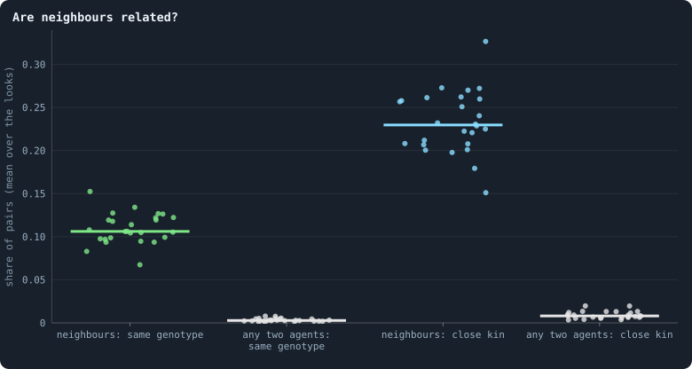
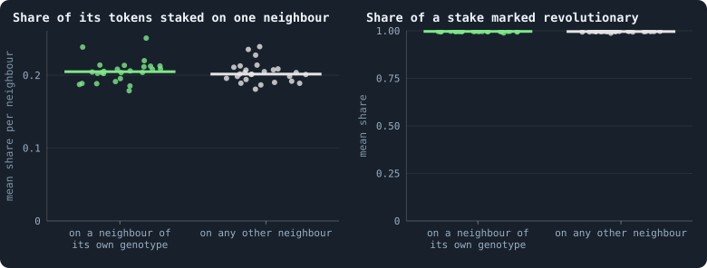
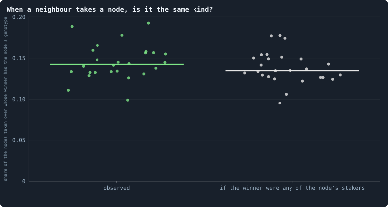
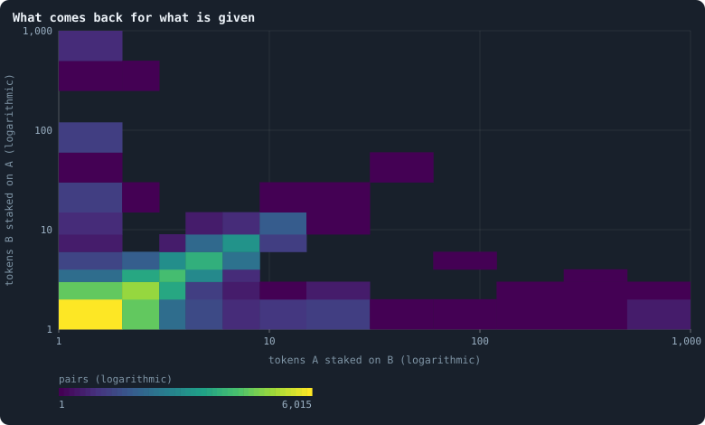
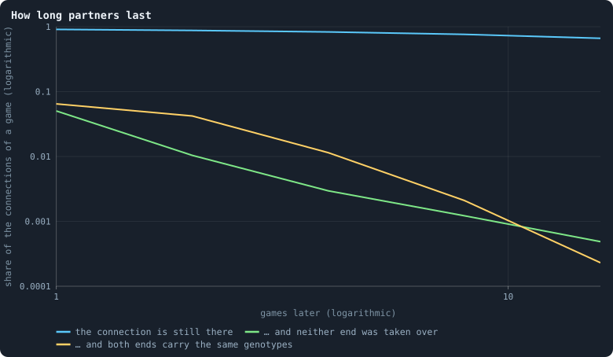

# Do agents cooperate?

**Cooperation** — paying a cost so that someone else gains — is one of the
central puzzles of evolution. Selection favours whatever spreads; why would it
favour helping another to spread? And yet the great steps in the history of
life were steps of cooperation: genes joining into genomes, cells into
organisms, organisms into colonies and societies — the "major transitions"
(Maynard Smith and Szathmáry 1995), in which units that once competed came to
reproduce as one. A world in which evolution keeps producing new kinds of
things will, very likely, have to produce new kinds of **togetherness**. So for
the aim of this book, open-ended evolution, cooperation is not a side topic.

This chapter does three things: it says what cooperation would mean in Graph of
Life, measures what is there, and sets out how cooperation could be found and
counted as the book goes on.

> [!question] Questions of this chapter
> - What does an agent give in this world, at what cost, and to whom?
> - Are neighbours related? Do agents treat their relatives differently?
> - When a node changes hands, does it stay in the family?
> - Do agents answer a stake with a stake?
> - How long do the same two agents face each other — long enough for
>   anything like trust?

<!-- runs E02 -->
> [!info] The runs behind this chapter
> **30 runs.** Every condition below is run once for every seed (1 to 30), for 3,000 iterations — or until its world dies out. Every setting is that of the baseline **B1** (the algorithm exactly as a new run is offered it) unless the condition changes it.
>
> - **baseline** — changes nothing: B1 as it is; 10,000 tokens. Runs `B1-10000-s001` … `B1-10000-s030`.
>
> To make these runs again: `python3 gol_lab.py run E02`, or ▶ in the Book tab of a computer running `gol_server.py`. Each run writes its settings, seed and engine version beside its frames, in `GraphOfLifeRuns/<run>/meta.json` and `provenance.json`.

> [!info]- Every setting of these runs
> | setting | baseline | what it is |
> |---|---|---|
> | [`total_tokens`](../notes/settings.md#total_tokens) | 10,000 | The number of tokens in the world, *T*. It never changes during a run. |
> | [`n_nodes`](../notes/settings.md#n_nodes) | 0 | How many founders the world starts with. 0 means one founder per hundred tokens: *n* = ⌊*T* / 100⌋. |
> | [`k_neighbors`](../notes/settings.md#k_neighbors) | 0 | How many neighbours each founder starts with in the ring. 0 means *k* = max(⌊*n* / 100⌋, 5); an odd *k* is wired as *k* − 1. |
> | [`rewire_p`](../notes/settings.md#rewire_p) | 0.2 | In the starting ring, the probability that a connection is moved to a founder chosen at random (Watts–Strogatz). |
> | [`hidden_layers`](../notes/settings.md#hidden_layers) | 50, 45, 40, 35, 30 | The widths of the brain's hidden layers, in order from input to output. |
> | [`brain_kind`](../notes/settings.md#brain_kind) | float16 | How weights are stored: `float` (64-bit), `float16` (16-bit, computed in 64-bit) or `binary` (−1, 0, +1). |
> | [`brain_bits`](../notes/settings.md#brain_bits) | 16 | Only for binary brains: how many input rows encode one number. Unused by float and float16 brains. |
> | [`message_amount`](../notes/settings.md#message_amount) | 30 | How many numbers one message holds. Each agent sends one message to itself and one to each neighbour, every phase. |
> | [`random_input_amount`](../notes/settings.md#random_input_amount) | 5 | How many random numbers, drawn uniformly from −2 to 2, a brain reads per neighbour, every time it looks. |
> | [`exchange_messages`](../notes/settings.md#exchange_messages) | on | Whether agents send and read messages at all. |
> | [`message_prepass`](../notes/settings.md#message_prepass) | on | Whether every phase begins with an extra look in which agents only write messages, so the look that acts reads messages written this phase. |
> | [`allow_handover`](../notes/settings.md#allow_handover) | on | Whether a parent may move some of its own connections to its newborn child. |
> | [`allow_revolutions`](../notes/settings.md#allow_revolutions) | on | Whether a coalition of smaller stakers can take a node from its largest staker (see the note *How a coalition takes a node*). |
> | [`allow_gifting`](../notes/settings.md#allow_gifting) | off | Whether agents may give tokens to neighbours during reproduction. Off in every run of this book. |
> | [`random_decisions`](../notes/settings.md#random_decisions) | off | The control: every number a brain would produce is replaced by a random draw from the standard normal distribution. |
> | [`prune_after`](../notes/settings.md#prune_after) | blotto | After which phase connections that carried no tokens are cut: `blotto` (the game), `reproduction`, or `both`. |
> | [`inactive_window`](../notes/settings.md#inactive_window) | phase | How long a connection may go unused: `phase` means it must carry tokens in the phase being judged; `iteration` allows the two last phases. |
> | [`redistribution`](../notes/settings.md#redistribution) | uniform | How the tokens of removed agents are shared: `uniform` gives every survivor the same chance at each token; `by_tokens` weights by what a survivor holds. |
> | [`tokens_created_per_phase`](../notes/settings.md#tokens_created_per_phase) | 0 | Tokens added to the world at every cleanup. 0 keeps the supply fixed. |
> | [`mutation_probability`](../notes/settings.md#mutation_probability) | 0.2 | The probability that a brain changes when it is copied to a child, and again, for every brain, after every game. |
> | [`mutation_noise_std`](../notes/settings.md#mutation_noise_std) | 0.2 | How large a change to one weight is: a normal draw with standard deviation this times 1/√(fan-in) of its layer. |
> | [`mutation_sparsity`](../notes/settings.md#mutation_sparsity) | 0.1 | The share of a brain's numbers a change touches; also the probability, for each weight matrix and bias vector, of a rarer reset that redraws that share of it. |
> | [`extinction_threshold`](../notes/settings.md#extinction_threshold) | 20 | A run stops, as extinct, when an iteration ends (after its game) with this many agents or fewer. |
> | seeds | 1 to 30 | one run per seed |
> | iterations | 3,000 | how far each run goes, unless its world dies first |
>
> A value in **bold** differs from the baseline B1.
<!-- /runs -->

## Five ways cooperation can evolve

Nowak (2006) sorted the known mechanisms into five. Each comes with a
condition that compares the **benefit** *B* a helping act gives the receiver
with its **cost** *C* to the helper.

1. **Kin selection** (Hamilton 1964). Help relatives, who carry copies of your
   genes. Helping spreads if *r B* > *C*, where *r* is the **relatedness**:
   how much more likely the receiver is than a random member of the population
   to carry the helper's genes. A gene for helping can spread by helping copies
   of itself.
2. **Direct reciprocity** (Trivers 1971; Axelrod and Hamilton 1981). Help those
   who help you. It works only if the same two meet again: if *w* is the
   probability of another round with the same partner, cooperation can be
   stable when *w* > *C*/*B*. Without a future, there is nothing to
   reciprocate.
3. **Indirect reciprocity** (Nowak and Sigmund 1998). Help those with a good
   reputation; it needs others to know what you did.
4. **Network reciprocity** (Nowak and May 1992; Ohtsuki, Hauert, Lieberman and
   Nowak 2006). On a network, cooperators can form clusters that help each
   other and resist exploiters. On a network where each has *k* neighbours,
   cooperation can win when *B*/*C* > *k*.
5. **Group selection** (Traulsen and Nowak 2006). Groups of cooperators grow
   and split more than groups of defectors.

## What helping means here

What can an agent of Graph of Life give, and at what cost?

- **A stake on a neighbour's node.** Every token staked on a neighbour ends the
  game on the neighbour's node ([Chapter 20](20-gains-and-losses.md)): a pure
  gift of tokens, cost *C* to the staker, benefit *B* = *C* to the node. But a
  stake is also a **bid** for that node: if it wins, the node takes the
  staker's brain. For the brain, every gift is also an attack. This
  double meaning is built into the game.
- **A child's endowment.** The tokens and connections a parent gives its child
  ([Chapter 22](22-how-agents-have-children.md)).
- **Keeping a connection alive.** A connection survives only if a token crosses
  it ([Chapter 26](26-how-a-world-breaks.md)). Paying that token keeps open a
  channel both sides need.
- **Joining a coalition.** A stake marked revolutionary can join others to take
  a node from its largest staker ([How a coalition takes a node](../notes/revolution.md)).
- **Messages**, which cost nothing, and could carry signals
  ([Messages](../notes/messages.md)).

## Are neighbours related?

Kin selection needs relatives to meet. Do they?

<!-- figure cooperation/related -->

**Are neighbours related?** One dot per world that lived to the end. For the pairs of agents joined by a connection ("neighbours"), and for pairs of agents drawn at random from the whole world (2,000 per look), the share that carry the same genotype, and the share that are close kin: the same genotype, or one's genotype the parent of the other's, or both with the same parent genotype. At the start of the games of every 100th iteration from 500 on.

> [!example]- How to make this figure
> **Runs.** The 26 surviving ones of the 30 baseline runs `B1-10000-s001` … `B1-10000-s030`: the baseline B1 at 10,000 tokens, seeds 1 to 30, 3,000 iterations each (every setting is listed in [Chapter 9](09-thirty-worlds.md)). They are made with `python3 gol_lab.py run E02`.
>
> **Data.** From each run's frames, `GraphOfLifeRuns/<run>/frames/`, read with `gol_store.read_frame(run, index)`; frame `2·t` is iteration *t* after reproduction and frame `2·t + 1` after the game.
>
> 1. For every 100th iteration t from 500 on, read frame `2·t`: each agent's genotype (`brain_ids`) and its parent genotype (`parent_brain_ids`).
> 2. For every connection of `edges`, test the two relations; also for 2,000 pairs of agents drawn at random (generator seeded with 11).
> 3. Divide the counts by the pairs, per run.
>
> **To make it again:** `python3 book_figures.py cooperation`.
<!-- /figure -->

Yes, strongly. In the median world, **10.6%** of neighbours carry the same
genotype, against **0.28%** of two agents drawn at random — 38 times as often.
Counting close kin too (one's genotype the parent of the other's, or both
sharing a parent genotype): 23% of neighbours against 0.8% of random pairs.
This is the picture of [Chapter 27](27-one-world-many-colours.md) in numbers:
families live together. A brain's copies sit next to it — because a brain
spreads by taking neighbouring nodes ([Chapter 21](21-where-the-tokens-flow.md))
and children are joined to their parents.

So the precondition of kin selection is met: *r* between neighbours is high.

## Do agents treat their own kind differently?

<!-- figure cooperation/kin-stakes -->

**Does an agent treat its own kind differently?** Only agents that had at least one neighbour of their own genotype and at least one of another, in the games of every 100th iteration from 500 on; one dot per world that lived to the end. Left: the share of its tokens an agent staked on each neighbour, averaged over the neighbours of its own genotype (green) and over the others (grey), then over the agents. Right: of what it staked on a neighbour, the share it marked revolutionary.

> [!example]- How to make this figure
> **Runs.** The 26 surviving ones of the 30 baseline runs `B1-10000-s001` … `B1-10000-s030`: the baseline B1 at 10,000 tokens, seeds 1 to 30, 3,000 iterations each (every setting is listed in [Chapter 9](09-thirty-worlds.md)). They are made with `python3 gol_lab.py run E02`.
>
> **Data.** From each run's frames, `GraphOfLifeRuns/<run>/frames/`, read with `gol_store.read_frame(run, index)`; frame `2·t` is iteration *t* after reproduction and frame `2·t + 1` after the game.
>
> 1. For every 100th iteration t from 500 on, take the genotypes from frame `2·t` and the stakes from `decisions.allocations` of frame `2·t + 1`.
> 2. For each agent with neighbours of both kinds: the mean of `alloc` / `tokens` over each kind, and the mean of `revolt` / `alloc` over the neighbours it staked on.
> 3. Average over the agents of a run; one dot per run.
>
> **To make it again:** `python3 book_figures.py cooperation`.
<!-- /figure -->

No. Among agents that had neighbours of both kinds, the share of tokens staked
on a neighbour of the same genotype is 0.205 per neighbour, on any other
neighbour 0.202; only 31% of these agents staked more on kin than on others.
And they mark 99.6% of what they stake on either kind as revolutionary.

That is not surprising once one looks at what a brain can see
([What a brain sees](../notes/brain-inputs.md)): tokens and connections — its
own, the candidate's, and their neighbourhoods' — messages, and random numbers.
**Not genotypes.** A brain cannot tell kin from stranger, except through
messages: a lineage could, in principle, evolve a "password" — send a
particular pattern and treat those who send it back differently, a
**green-beard** (Hamilton 1964; Dawkins 1976). Nothing in the stakes says that
this has happened.

## When a node changes hands, does it stay in the family?

<!-- figure cooperation/succession -->

**When a neighbour takes a node, is it the same kind?** Nodes won by a neighbour in the games of every 100th iteration from 500 on; one dot per world that lived to the end. Left: the share in which the winner carried the same genotype as the agent whose node it took — a takeover that changes nothing in the brain. Right: the same share if the winner had been drawn at random from the neighbours that staked on the node.

> [!example]- How to make this figure
> **Runs.** The 26 surviving ones of the 30 baseline runs `B1-10000-s001` … `B1-10000-s030`: the baseline B1 at 10,000 tokens, seeds 1 to 30, 3,000 iterations each (every setting is listed in [Chapter 9](09-thirty-worlds.md)). They are made with `python3 gol_lab.py run E02`.
>
> **Data.** From each run's frames, `GraphOfLifeRuns/<run>/frames/`, read with `gol_store.read_frame(run, index)`; frame `2·t` is iteration *t* after reproduction and frame `2·t + 1` after the game.
>
> 1. For every 100th iteration t from 500 on, read the genotypes in frame `2·t` and `decisions.winners` and `decisions.allocations` in frame `2·t + 1`.
> 2. For each node whose `winner` is not the node: is the winner's genotype the node's? And: of the agents other than the node that staked on it, the share with the node's genotype.
> 3. Per run: the first count, and the sum of the second, over the nodes taken.
>
> **To make it again:** `python3 book_figures.py cooperation`.
<!-- /figure -->

Of the 456,477 nodes taken by a neighbour in the sampled games, the winner
carried the node's own genotype in 14.2% of cases in the median world — and
13.5% would be expected if the winner had been any of the neighbours that
staked on the node. Takeovers do not spare kin, nor seek them out.

## Do agents answer a stake with a stake?

<!-- figure cooperation/returned -->

**What comes back for what is given.** Pairs of neighbours that both staked on each other in a game: how many tokens each staked on the other (10,400 pairs, up to 400 drawn at random per world that lived to the end, from the games of every 100th iteration from 500 on). A cell's colour is how many pairs fall in it; the diagonal is an even exchange. In the median world 79% of the pairs staked exactly the same on each other.

> [!example]- How to make this figure
> **Runs.** The 26 surviving ones of the 30 baseline runs `B1-10000-s001` … `B1-10000-s030`: the baseline B1 at 10,000 tokens, seeds 1 to 30, 3,000 iterations each (every setting is listed in [Chapter 9](09-thirty-worlds.md)). They are made with `python3 gol_lab.py run E02`.
>
> **Data.** From each run's frames, `GraphOfLifeRuns/<run>/frames/`, read with `gol_store.read_frame(run, index)`; frame `2·t` is iteration *t* after reproduction and frame `2·t + 1` after the game.
>
> 1. From `decisions.allocations` of frame `2·t + 1`, for every 100th iteration t from 500 on, collect every pair (A, B) with a stake of A on B and of B on A.
> 2. Draw up to 400 pairs per run (generator seeded with 11) and count them in cells.
>
> **To make it again:** `python3 book_figures.py cooperation`.
<!-- /figure -->

Of pairs of neighbours that staked on each other in a game, 79% (median world)
staked **exactly the same** amount on each other, and **58%** of all such pairs
exchanged exactly one token each way. The correlation of the logarithms of the
two stakes is 0.63.

Is that reciprocity? Two observations say: not in the sense of the theory.
An equal exchange cancels: it changes neither balance
([Chapter 21](21-where-the-tokens-flow.md)). What it does is keep the
connection alive at its minimum price, paid by both. And it is what the even
split gives: two poor agents splitting a few tokens evenly over a few
candidates put one token on each other. It is a **handshake**, not a favour
returned.

## How long partners last

Direct reciprocity needs the same two to meet again — the "shadow of the
future" *w*. How long do the same two brains face each other across a
connection?

<!-- figure cooperation/partners -->

**How long partners last.** Of the connections at the start of a game, the share still there k games later (blue); still there with neither of its two nodes won by a neighbour in any of the k games in between, so that the same two brains face each other, changed at most by the small changes offered after every game (green); and still there with exactly the same two genotypes (yellow). Pooled over the 746,284 connections at the start of the games of every 200th iteration from 500 on, in the 26 worlds that lived to the end. Both axes are logarithmic.

> [!example]- How to make this figure
> **Runs.** The 26 surviving ones of the 30 baseline runs `B1-10000-s001` … `B1-10000-s030`: the baseline B1 at 10,000 tokens, seeds 1 to 30, 3,000 iterations each (every setting is listed in [Chapter 9](09-thirty-worlds.md)). They are made with `python3 gol_lab.py run E02`.
>
> **Data.** From each run's frames, `GraphOfLifeRuns/<run>/frames/`, read with `gol_store.read_frame(run, index)`; frame `2·t` is iteration *t* after reproduction and frame `2·t + 1` after the game.
>
> 1. For every 200th iteration t from 500 on, take the connections of frame `2·t` and the genotypes of their ends.
> 2. For k = 1, 2, 4, 8, 16: read frame `2·(t + k)` — is the connection still in `edges`, and are the ends' genotypes the same? — and the `decisions.winners` of every game frame `2·(t + j) + 1`, j < k: was either end won by a neighbour?
> 3. Pool the counts over the runs and divide by the connections.
>
> **To make it again:** `python3 book_figures.py cooperation`.
<!-- /figure -->

The connections last: 91% of the connections at the start of a game are still
there a game later, 66% sixteen games later. But the **brains** at their ends
do not. In only **5%** of connections do the same two brains face each other
one game later (neither end won by a neighbour in between); after two games,
1%; after four, 0.3%. The stage stays; the actors change almost every game —
because about half of all nodes, and nearly every hub, are taken over in every
game ([Chapter 21](21-where-the-tokens-flow.md)).

With *w* ≈ 0.05, direct reciprocity would need a benefit twenty times its
cost. In this world, nobody meets anybody twice.

## How cooperation could be found and counted

Nothing measured here shows cooperation beyond what the even split and kinship
by proximity produce. But "not found" depends on where one looks. These are
the measures the book will use from here on, each computable from the frames
every run already writes:

1. **Kin discrimination.** The ratio of stakes on kin to stakes on others,
   per neighbour (here 1.01). A value well above 1 would mean brains
   recognise kin — through messages, since they cannot see genotypes.
2. **Hamilton's accounting.** For every stake, its cost *C* to the staker, its
   benefit *B* to the receiving node, and the relatedness *r* of the pair;
   summed over a world, Σ(*rB* − *C*) says whether helping as practised pays
   the helping genes. (This is the regression form of Price's equation; Queller
   1992.)
3. **Reciprocity beyond the split.** The correlation between *a*(*u* → *v*)
   and *a*(*v* → *u*) after subtracting what an even split would give each —
   real reciprocity is what remains.
4. **Partnerships.** The distribution of how long the same two brains keep
   exchanging stakes, against the null of independent takeovers. Lasting
   partnerships would be the first sign of something above the individual.
5. **Coalitions that repeat.** Whether the same agents join forces to take
   nodes again and again.
6. **Groups that win.** Whether regions held by one family grow, survive or
   split more than mixed regions — selection between groups, read from the
   families of [Chapter 27](27-one-world-many-colours.md) and the breaks of
   [Chapter 26](26-how-a-world-breaks.md).

## What this means

- **The precondition is there; the behaviour is not.** Kin live together, so
  kin selection could work — but brains cannot see kinship, and they spread
  their stakes as evenly over kin as over strangers.
- **There is no future to reciprocate in.** Connections persist, but the
  brains at their ends are replaced almost every game. Of the five roads to
  cooperation, the rules close direct reciprocity almost completely.
- **The equal exchanges are handshakes.** They keep connections alive, at the
  price the rules set, and need no cooperation to explain.
- **For open-ended evolution** this chapter points at rules, not brains: an
  agent that keeps its identity when its node is taken, a way to recognise
  kin, a way to commit to a partner. [Chapter 29](29-questioning-the-mechanics.md)
  examines the rules responsible, and [Meta II](30-meta-2.md) proposes
  changes.

To make every figure of this chapter: `python3 book_figures.py cooperation`.

<!-- turns -->
---

← [Chapter 27 · One world, many colours](27-one-world-many-colours.md) · [Contents](../README.md) · [Chapter 29 · Questioning the mechanics](29-questioning-the-mechanics.md) →
<!-- /turns -->
