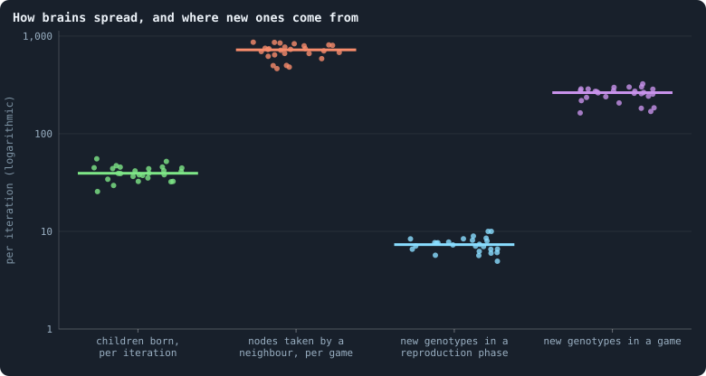
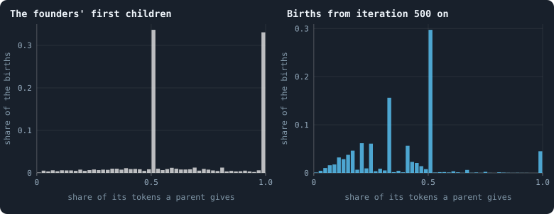

# Questioning the mechanics

Every chapter so far has taken the rules as given and measured what they
produce. This one turns around and examines the rules themselves. A rule can
be questioned in three ways: **what does it do** (the measurements of Part III
say), **is that what was meant**, and **what would happen without it**. The
last question is for experiments; this chapter prepares them. For each rule
it states the rule, what the data say about it, why it matters for the aim of
the book — open-ended evolution — and what could be done instead.

Nothing here is a verdict. Several of these rules may be exactly right. But a
rule that quietly decides most of what happens in a world deserves to be
looked at in the open.

> [!question] Questions of this chapter
> - How do brains spread, and where do new ones come from?
> - Which rules decide most of what a world does?
> - Which of them stand in the way of open-ended evolution, and what could
>   replace them?

<!-- runs E02 -->
> [!info] The runs behind this chapter
> **30 runs.** Every condition below is run once for every seed (1 to 30), for 3,000 iterations — or until its world dies out. Every setting is that of the baseline **B1** (the algorithm exactly as a new run is offered it) unless the condition changes it.
>
> - **baseline** — changes nothing: B1 as it is; 10,000 tokens. Runs `B1-10000-s001` … `B1-10000-s030`.
>
> To make these runs again: `python3 gol_lab.py run E02`, or ▶ in the Book tab of a computer running `gol_server.py`. Each run writes its settings, seed and engine version beside its frames, in `GraphOfLifeRuns/<run>/meta.json` and `provenance.json`.

> [!info]- Every setting of these runs
> | setting | baseline | what it is |
> |---|---|---|
> | [`total_tokens`](../notes/settings.md#total_tokens) | 10,000 | The number of tokens in the world, *T*. It never changes during a run. |
> | [`n_nodes`](../notes/settings.md#n_nodes) | 0 | How many founders the world starts with. 0 means one founder per hundred tokens: *n* = ⌊*T* / 100⌋. |
> | [`k_neighbors`](../notes/settings.md#k_neighbors) | 0 | How many neighbours each founder starts with in the ring. 0 means *k* = max(⌊*n* / 100⌋, 5); an odd *k* is wired as *k* − 1. |
> | [`rewire_p`](../notes/settings.md#rewire_p) | 0.2 | In the starting ring, the probability that a connection is moved to a founder chosen at random (Watts–Strogatz). |
> | [`hidden_layers`](../notes/settings.md#hidden_layers) | 50, 45, 40, 35, 30 | The widths of the brain's hidden layers, in order from input to output. |
> | [`brain_kind`](../notes/settings.md#brain_kind) | float16 | How weights are stored: `float` (64-bit), `float16` (16-bit, computed in 64-bit) or `binary` (−1, 0, +1). |
> | [`brain_bits`](../notes/settings.md#brain_bits) | 16 | Only for binary brains: how many input rows encode one number. Unused by float and float16 brains. |
> | [`message_amount`](../notes/settings.md#message_amount) | 30 | How many numbers one message holds. Each agent sends one message to itself and one to each neighbour, every phase. |
> | [`random_input_amount`](../notes/settings.md#random_input_amount) | 5 | How many random numbers, drawn uniformly from −2 to 2, a brain reads per neighbour, every time it looks. |
> | [`exchange_messages`](../notes/settings.md#exchange_messages) | on | Whether agents send and read messages at all. |
> | [`message_prepass`](../notes/settings.md#message_prepass) | on | Whether every phase begins with an extra look in which agents only write messages, so the look that acts reads messages written this phase. |
> | [`allow_handover`](../notes/settings.md#allow_handover) | on | Whether a parent may move some of its own connections to its newborn child. |
> | [`allow_revolutions`](../notes/settings.md#allow_revolutions) | on | Whether a coalition of smaller stakers can take a node from its largest staker (see the note *How a coalition takes a node*). |
> | [`allow_gifting`](../notes/settings.md#allow_gifting) | off | Whether agents may give tokens to neighbours during reproduction. Off in every run of this book. |
> | [`random_decisions`](../notes/settings.md#random_decisions) | off | The control: every number a brain would produce is replaced by a random draw from the standard normal distribution. |
> | [`prune_after`](../notes/settings.md#prune_after) | blotto | After which phase connections that carried no tokens are cut: `blotto` (the game), `reproduction`, or `both`. |
> | [`inactive_window`](../notes/settings.md#inactive_window) | phase | How long a connection may go unused: `phase` means it must carry tokens in the phase being judged; `iteration` allows the two last phases. |
> | [`redistribution`](../notes/settings.md#redistribution) | uniform | How the tokens of removed agents are shared: `uniform` gives every survivor the same chance at each token; `by_tokens` weights by what a survivor holds. |
> | [`tokens_created_per_phase`](../notes/settings.md#tokens_created_per_phase) | 0 | Tokens added to the world at every cleanup. 0 keeps the supply fixed. |
> | [`mutation_probability`](../notes/settings.md#mutation_probability) | 0.2 | The probability that a brain changes when it is copied to a child, and again, for every brain, after every game. |
> | [`mutation_noise_std`](../notes/settings.md#mutation_noise_std) | 0.2 | How large a change to one weight is: a normal draw with standard deviation this times 1/√(fan-in) of its layer. |
> | [`mutation_sparsity`](../notes/settings.md#mutation_sparsity) | 0.1 | The share of a brain's numbers a change touches; also the probability, for each weight matrix and bias vector, of a rarer reset that redraws that share of it. |
> | [`extinction_threshold`](../notes/settings.md#extinction_threshold) | 20 | A run stops, as extinct, when an iteration ends (after its game) with this many agents or fewer. |
> | seeds | 1 to 30 | one run per seed |
> | iterations | 3,000 | how far each run goes, unless its world dies first |
>
> A value in **bold** differs from the baseline B1.
<!-- /runs -->

## Two roads of inheritance

**The rule.** A brain is copied in two ways: into a child at birth, and into a
neighbour's node when it wins that node in the game — the node's own brain is
then erased ([Chapter 3](03-one-iteration.md)).

<!-- figure mechanics/where-brains-go -->

**How brains spread, and where new ones come from.** One dot per world that lived to the end: means over the iterations sampled every 25 from 500 on. From the left: children born in a reproduction phase; nodes won in a game by a neighbour, each of which takes on a copy of the winner's brain; genotypes that appear for the first time in the frame after a reproduction phase (a newborn's brain that changed); and genotypes that appear for the first time after a game (every brain is offered a change at its end). On a logarithmic axis.

> [!example]- How to make this figure
> **Runs.** The 26 surviving ones of the 30 baseline runs `B1-10000-s001` … `B1-10000-s030`: the baseline B1 at 10,000 tokens, seeds 1 to 30, 3,000 iterations each (every setting is listed in [Chapter 8](08-thirty-worlds.md)). They are made with `python3 gol_lab.py run E02`.
>
> **Data.** From each run's frames, read every 25 iterations by `book_figures.sample_pass` (frame `2·t` after the reproduction phase of iteration *t*, frame `2·t + 1` after its game; `gol_store.read_frame(run, index)`).
>
> 1. For every 25th iteration t from 500 on: births = the length of `decisions.births` in frame `2·t`; takeovers = the entries of `decisions.winners` in frame `2·t + 1` with `winner` ≠ `node`.
> 2. New genotypes: the `brain_ids` of frame `2·t` not in frame `2·t − 1`, and those of frame `2·t + 1` not in frame `2·t`.
> 3. Average per run.
>
> **To make it again:** `python3 book_figures.py mechanics`.
<!-- /figure -->

**What the data say.** In a settled world, about **39** children are born per
iteration, and about **720** nodes are taken by a neighbour per game. A brain
spreads by conquest eighteen times more than by birth.

**Why it matters.** In this world the thing that evolves — the brain — is not
the thing that lives and dies — the node. Nodes are bodies; brains move from
body to body like an infection. A brain's success is how many bodies it takes
and how long it holds them. That is a legitimate kind of evolution (it is how
viruses, memes and many cultural traits spread), but it is not the one the
words "agent" and "child" suggest, and it makes the individual hard to define:
the agent that "keeps its node" is the brain, the agent that "is old" is the
body.

**Alternatives.** (a) A won node keeps its brain and only its tokens move —
heredity only through birth. (b) The winner's brain and the loser's are
**recombined** into the node, so conquest mixes rather than replaces — the
nearest thing here to sex. (c) A node is only taken if the winner outbids its
own agent's stake by a margin, so that holding a place is possible.

## Variation in the living

**The rule.** Every brain is offered a change after every game, with
probability 0.2, as well as at birth ([How a brain changes](../notes/mutation.md)).

**What the data say.** In the figure above: about **7** new genotypes appear in
a reproduction phase, about **263** in a game — 97.3% of all new genotypes
arise in living brains, after a game, not at birth. And a brain that is not
copied for five games is unchanged with probability 0.8⁵ = 33% only.

**Why it matters.** In biology, almost all heritable variation arises when
genomes are copied; a body does not keep rewriting its own genes. Here,
variation is mostly **somatic**: a brain that does well does not stay itself.
Selection works on a target that moves under it, and a good brain is eroded in
place, whether or not it is copied. This may be why genotypes last two
iterations ([Chapter 16](16-genotypes-and-lineages.md)) and why the
distinct-genotype count is set by the rules ([Chapter 18](18-how-even-is-a-world.md)).

**Alternatives.** Change brains **only when they are copied** — at birth and at
conquest — and never in place. Part V begins with exactly this experiment
(Chapter 37 in [the contents](../README.md)).

## Hubs are places

**The rule.** A node goes to its largest staker or to a coalition of smaller
ones; the agent living on it has no special claim.

**What the data say.** The agent on a node with fifty or more connections keeps
it in 2.2% of games; on a node with one connection, in 73%
([Chapter 20](20-where-the-tokens-flow.md)). A pair of brains facing each
other across a connection survives one more game in 5% of cases
([Chapter 27](27-do-agents-cooperate.md)).

**Why it matters.** The most important positions of the world have no lasting
occupant, so no brain can be selected for holding one, and no partnership
lasts long enough for reciprocity. A world without lasting individuals
struggles to build anything that lasts on top of them.

**Alternatives.** An advantage for the incumbent — for instance, the agent's
own stake on its node counting double, or a takeover needing the coalition's
revolutionary part to exceed the hegemon's stake *and* the home stake. Then
measure how long brains hold hubs, and whether partnerships appear.

## Decisions averaged over neighbours

**The rule.** A brain computes one column of outputs per candidate. Decisions
that concern the agent as a whole — how much to give a child, whether to
spread or go all in — use the **average** of those outputs over all its
columns ([Chapter 3](03-one-iteration.md)).

**What the data say.** The share of agents with a child rises from 2.1% at
one connection to 8.6% at fifty or more ([Chapter 21](21-how-agents-have-children.md)),
only partly because the well connected are richer.

**Why it matters.** The same brain behaves differently depending on how many
neighbours it has, in a way it does not choose: an average of many columns is
less extreme than one column. Part of what looks like behaviour is arithmetic.

**Alternatives.** Give whole-agent decisions their own output column, computed
once from the agent's own inputs and a summary of its neighbourhood, rather
than an average over neighbours.

## The share function jumps

**The rule.** Two outputs (*a*, *b*) become a share by
*f*(*a*, *b*) = *a*⁺ / (*a*⁺ + *b*⁺), or ½ when neither is positive
([The share function](../notes/share-function.md)).

<!-- figure mechanics/child-shares -->

**Where the share function jumps.** The share of its tokens a parent gave its child, in 50 classes of width 0.02. Left: the 2,241 founders that had a child in the first reproduction phase of the 30 worlds, each holding 100 tokens, so the share is exact to a hundredth. Right: the births in the reproduction phases of every 100th iteration from 500 on, in the 26 worlds that lived to the end — parents with few tokens, whose shares can only be simple fractions.

> [!example]- How to make this figure
> **Runs.** The 30 baseline runs (left) and the 26 that lived to the end (right).
>
> **Data.** From each run's frames, read every 25 iterations by `book_figures.sample_pass` (frame `2·t` after the reproduction phase of iteration *t*, frame `2·t + 1` after its game; `gol_store.read_frame(run, index)`).
>
> 1. Read `decisions.births` of frame 0 (left) and of frame `2·t` for every 100th iteration t from 500 on (right): `invested` / `tokens_before` for every birth.
> 2. Count in classes of 0.02 and divide by the births.
>
> **To make it again:** `python3 book_figures.py mechanics`.
<!-- /figure -->

**What the data say.** Of the founders' first children, 33.2% got exactly half
of the parent's tokens and 32.7% exactly all of them (their parents starved).
Later, 29.7% get exactly half and 4.5% everything; other shares are mostly the
simple fractions that small token counts allow.

**Why it matters.** *f* is not continuous: as *a* passes through 0 with *b*
negative, the share jumps from ½ to 1 — from giving half to giving everything
and dying. Evolution by small steps works badly on a landscape with cliffs. A
brain one small change away from "give everything" is one change away from
death.

**Alternatives.** A smooth share, such as the logistic
*f* = 1 / (1 + *e*^(*b* − *a*)), where a small change of the outputs always
makes a small change of the share.

## Every token at stake, every game

**The rule.** An agent stakes **all** its tokens, as whole tokens, every game;
a node on which nobody stakes is left with nothing, and its agent dies.

**What the data say.** 31% of agents holding one token die in a game
([Chapter 19](19-gains-and-losses.md)); quiet borders of agents too poor to
stake across their connections cost whole regions ([Chapter 25](25-how-a-world-breaks.md)).

**Why it matters.** There is no way to save, to wait, or to hold back. The
poor live on a coin toss, and that toss kills a large share of the world's
agents for reasons that have little to do with their brains — noise that
selection has to work through.

**Alternatives.** Let agents keep part of their tokens out of the game
("savings", which neither defend nor attack); or let a node with no stakes on
it keep its agent alive at zero, for one game.

## Connections have a price

**The rule.** A connection across which no token was staked in a game is cut
([`prune_after`](../notes/settings.md#prune_after),
[`inactive_window`](../notes/settings.md#inactive_window)).

**What the data say.** 88% of the connections of the world of seed 1 carried
only one or two tokens in its last game ([Chapter 26](26-one-world-many-colours.md));
58% of mutual stakes are one token each way ([Chapter 27](27-do-agents-cooperate.md));
regions of poor agents lose their connections and die ([Chapter 25](25-how-a-world-breaks.md)).

**Why it matters.** Much of what agents stake on their neighbours is the rent
of their connections. The rule ties the network to the tokens — every
connection costs a token a game — which may be what sets a world's size
([Chapter 31](31-how-does-a-worlds-size-follow-its-tokens.md)), and it makes
the poor lose their place in the network first.

**Alternatives.** The setting `inactive_window = iteration` already lets a
connection survive one quiet phase. Others: a connection that decays with a
probability instead of at once, or connections that cost a small fixed fee
instead of a stake.

## One rule reaches across the world

**The rule.** After every phase, only the **largest connected piece** of the
network survives ([Chapter 3](03-one-iteration.md)).

**What the data say.** Three deaths in four are cut-offs
([Chapter 11](11-births-deaths-and-ages.md)); a fifth of them happen in the one
game in forty that cuts off a hundred agents or more ([Chapter 25](25-how-a-world-breaks.md)).
And the losses grow with the world: in worlds from 3,200 to 409,600 tokens, a
single game has cut off a third to a half of all agents, at every size, so
that a big world changes from game to game as much, relatively, as a small one
([Chapter 31](31-how-does-a-worlds-size-follow-its-tokens.md)).

**Why it matters.** Every other rule is local: an agent stakes on its
neighbours, has its children beside itself, dies when its own node is empty.
This one is not: whether a region lives depends on its connection to the rest
of the world, however well it is doing inside. The thesis of
[Chapter 31](31-how-does-a-worlds-size-follow-its-tokens.md) reasoned that
"nothing in the rules reaches across the world" except the share-out; this
rule does too. And it forbids a world from ever splitting into populations
that go their own ways — the isolation that, in nature, is how most new species
begin (Mayr 1942).

**Alternatives.** Let every piece live, as a separate world with the tokens it
holds. On its own that would make the split permanent, since births only join
a child to its parent's neighbourhood; so pair it with an occasional
long-range connection — a child joined, rarely, to an agent anywhere — which
would let separated populations meet again, and would also shorten the world's
distances ([Chapter 24](24-the-geometry-of-a-world.md)).

## The share-out lottery

**The rule.** The tokens of the cut-off are dealt out to survivors chosen
uniformly at random.

**What the data say.** About 110 tokens after a game, 0.11 per agent
([Chapter 19](19-gains-and-losses.md)).

**Why it matters.** It is a transfer from the dead to everyone, unrelated to
what anyone did — small, but it is the only income the poorest have besides
stakes, and it is noise.

**Alternatives.** The setting `redistribution = by_tokens` exists. Others: give
the tokens to the agents across the border that went quiet, or remove them
from the world.

## Numbers that mislead

Two pieces of bookkeeping deserve care, though they change nothing in a world:

- **A genotype is an event, not a difference.** A brain drawn to change gets a
  new number even if its weights did not change (with sparsity 0, as in
  [Chapter 30](30-do-the-brains-matter.md)), and two brains a single tiny
  change apart have different numbers. What lasts and spreads is a **line**,
  not a number.
- **Age belongs to the node.** An agent's age counts from the birth of its
  node, not of the brain on it, which may have arrived last game. "Old agents"
  are old places. A brain's age — since it arrived at the node, or since its
  line appeared — would be the age of what evolves.

## What this means

- **The rules, more than the brains, decide the measured world.** The even
  split's resting state, the stars of copying, the price of connections, the
  global cull, the coin toss of the poor: most of Part III follows from rules
  that do not depend on what brains compute.
- **Four rules stand most in the way of open-ended evolution**, in the reading
  of this chapter: variation in the living, conquest that erases rather than
  mixes, positions that cannot be held, and the cull that forbids separate
  populations.
- **Each can be tested one at a time**, against the baseline, with the methods
  of Part IV. [Meta II](29-meta-2.md) sets out the order.

To make every figure of this chapter: `python3 book_figures.py mechanics`.

<!-- turns -->
---

← [Chapter 27 · Do agents cooperate?](27-do-agents-cooperate.md) · [Contents](../README.md) · [Chapter 29 · Meta II · What the measurements say about open-ended evolution](29-meta-2.md) →
<!-- /turns -->
