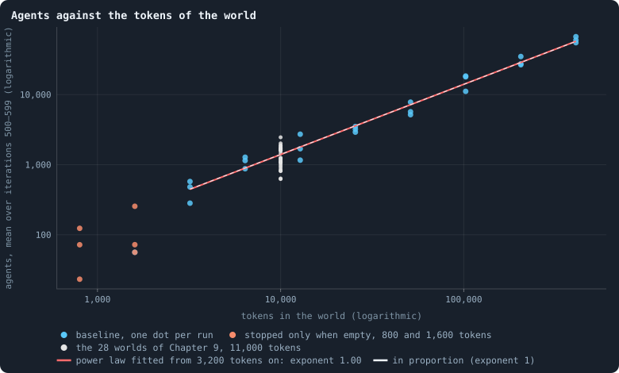
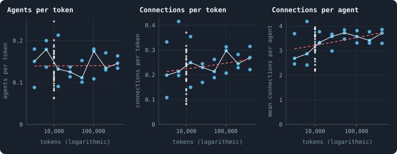
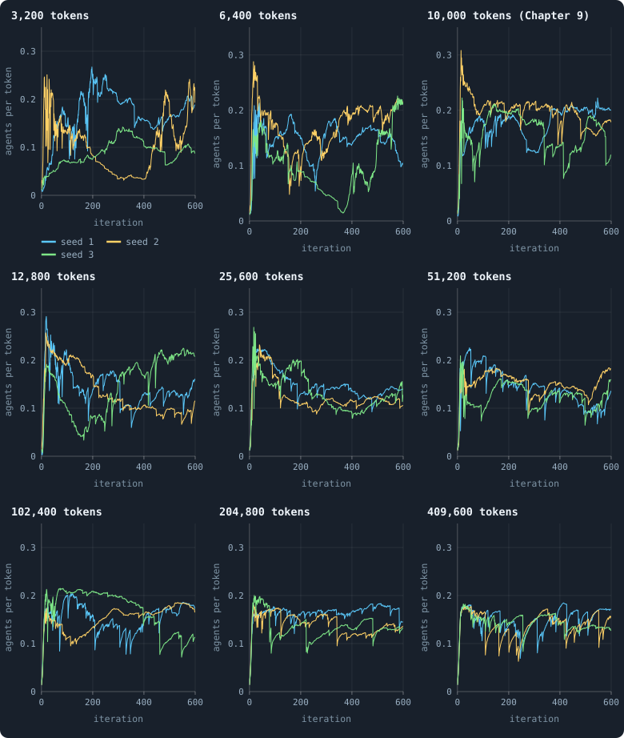
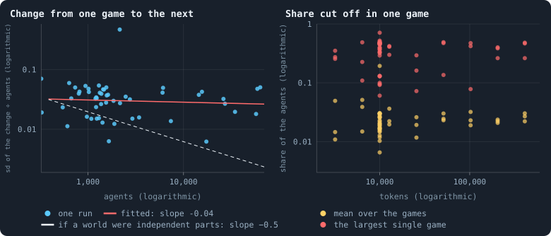
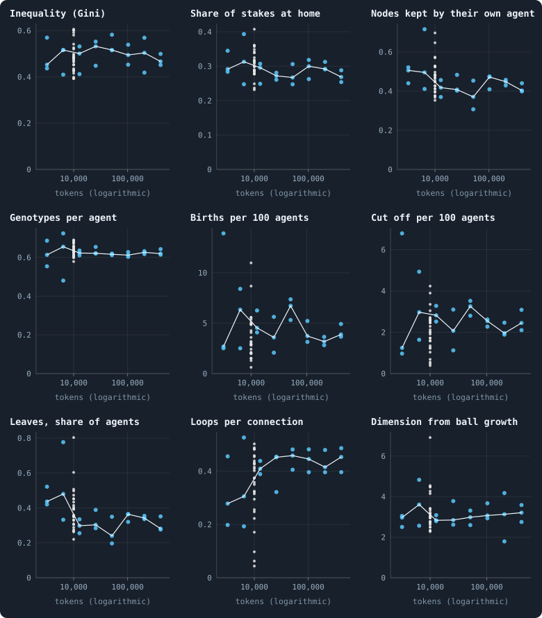
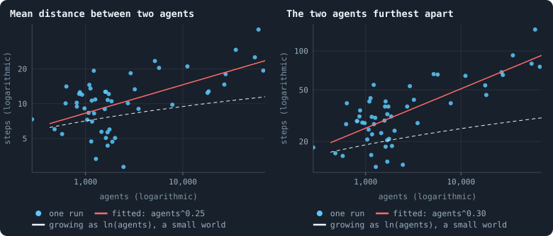
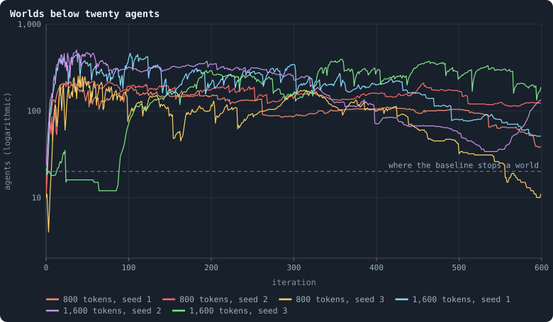

# How does a world's size follow its tokens?

Every chapter so far looked at worlds of 10,000 tokens. This one runs the
baseline at ten sizes, from 800 tokens to 409,600 — each double the one
before — and asks what changes with size and what does not.

> [!question] Questions of this chapter
> - Does a world of twice the tokens hold twice the agents and twice the
>   connections?
> - Is a big world the same kind of world as a small one — as unequal, as
>   diverse, as well connected per agent?
> - Do big worlds settle down, or do they wander as much as small ones?
> - How do distances grow as a world grows?
> - How small can a world be and still live?

<!-- runs E08 -->
> [!info] The runs behind this chapter
> **42 runs.** Every condition below is run once for every seed (1 to 3) and every number of tokens it lists, for 600 iterations — or until its world dies out. Every setting is that of the baseline **B1** (the algorithm exactly as a new run is offered it) unless the condition changes it.
>
> - **baseline** — changes nothing: B1 as it is; 800, 1,600, 3,200, 6,400, 12,800, 25,600, 51,200, 102,400, 204,800, 409,600 tokens. Runs `B1-800-s001` … `B1-409600-s003`.
> - **stopped only when empty** — changes `extinction_threshold` = 0; 800, 1,600, 3,200, 6,400 tokens. Runs `B1-800-57b358-s001` … `B1-6400-57b358-s003`.
>
> To make these runs again: `python3 gol_lab.py run E08`, or ▶ in the Book tab of a computer running `gol_server.py`. Each run writes its settings, seed and engine version beside its frames, in `GraphOfLifeRuns/<run>/meta.json` and `provenance.json`.

> [!info]- Every setting of these runs
> | setting | baseline | stopped only when empty | what it is |
> |---|---|---|---|
> | [`total_tokens`](../notes/settings.md#total_tokens) | 800, 1,600, 3,200, 6,400, 12,800, 25,600, 51,200, 102,400, 204,800, 409,600 | 800, 1,600, 3,200, 6,400 | The number of tokens in the world, *T*. It never changes during a run. |
> | [`n_nodes`](../notes/settings.md#n_nodes) | 0 | 0 | How many founders the world starts with. 0 means one founder per hundred tokens: *n* = ⌊*T* / 100⌋. |
> | [`k_neighbors`](../notes/settings.md#k_neighbors) | 0 | 0 | How many neighbours each founder starts with in the ring. 0 means *k* = max(⌊*n* / 100⌋, 5); an odd *k* is wired as *k* − 1. |
> | [`rewire_p`](../notes/settings.md#rewire_p) | 0.2 | 0.2 | In the starting ring, the probability that a connection is moved to a founder chosen at random (Watts–Strogatz). |
> | [`hidden_layers`](../notes/settings.md#hidden_layers) | 50, 45, 40, 35, 30 | 50, 45, 40, 35, 30 | The widths of the brain's hidden layers, in order from input to output. |
> | [`brain_kind`](../notes/settings.md#brain_kind) | float16 | float16 | How weights are stored: `float` (64-bit), `float16` (16-bit, computed in 64-bit) or `binary` (−1, 0, +1). |
> | [`brain_bits`](../notes/settings.md#brain_bits) | 16 | 16 | Only for binary brains: how many input rows encode one number. Unused by float and float16 brains. |
> | [`message_amount`](../notes/settings.md#message_amount) | 30 | 30 | How many numbers one message holds. Each agent sends one message to itself and one to each neighbour, every phase. |
> | [`random_input_amount`](../notes/settings.md#random_input_amount) | 5 | 5 | How many random numbers, drawn uniformly from −2 to 2, a brain reads per neighbour, every time it looks. |
> | [`exchange_messages`](../notes/settings.md#exchange_messages) | on | on | Whether agents send and read messages at all. |
> | [`message_prepass`](../notes/settings.md#message_prepass) | on | on | Whether every phase begins with an extra look in which agents only write messages, so the look that acts reads messages written this phase. |
> | [`allow_handover`](../notes/settings.md#allow_handover) | on | on | Whether a parent may move some of its own connections to its newborn child. |
> | [`allow_revolutions`](../notes/settings.md#allow_revolutions) | on | on | Whether a coalition of smaller stakers can take a node from its largest staker (see the note *How a coalition takes a node*). |
> | [`allow_gifting`](../notes/settings.md#allow_gifting) | off | off | Whether agents may give tokens to neighbours during reproduction. Off in every run of this book. |
> | [`random_decisions`](../notes/settings.md#random_decisions) | off | off | The control: every number a brain would produce is replaced by a random draw from the standard normal distribution. |
> | [`prune_after`](../notes/settings.md#prune_after) | blotto | blotto | After which phase connections that carried no tokens are cut: `blotto` (the game), `reproduction`, or `both`. |
> | [`inactive_window`](../notes/settings.md#inactive_window) | phase | phase | How long a connection may go unused: `phase` means it must carry tokens in the phase being judged; `iteration` allows the two last phases. |
> | [`redistribution`](../notes/settings.md#redistribution) | uniform | uniform | How the tokens of removed agents are shared: `uniform` gives every survivor the same chance at each token; `by_tokens` weights by what a survivor holds. |
> | [`tokens_created_per_phase`](../notes/settings.md#tokens_created_per_phase) | 0 | 0 | Tokens added to the world at every cleanup. 0 keeps the supply fixed. |
> | [`mutation_probability`](../notes/settings.md#mutation_probability) | 0.2 | 0.2 | The probability that a brain changes when it is copied to a child, and again, for every brain, after every game. |
> | [`mutation_noise_std`](../notes/settings.md#mutation_noise_std) | 0.2 | 0.2 | How large a change to one weight is: a normal draw with standard deviation this times 1/√(fan-in) of its layer. |
> | [`mutation_sparsity`](../notes/settings.md#mutation_sparsity) | 0.1 | 0.1 | The share of a brain's numbers a change touches; also the probability, for each weight matrix and bias vector, of a rarer reset that redraws that share of it. |
> | [`extinction_threshold`](../notes/settings.md#extinction_threshold) | 20 | **0** | A run stops, as extinct, when an iteration ends (after its game) with this many agents or fewer. |
> | seeds | 1 to 3 | 1 to 3 | one run per seed |
> | iterations | 600 | 600 | how far each run goes, unless its world dies first |
>
> A value in **bold** differs from the baseline B1.
<!-- /runs -->

## Why ask

Whether what the book has found holds at other sizes rests first on this
question. If agents and connections grow in proportion to the tokens, a
bigger world is more of the same, and the size of a world can be chosen for
what an experiment can afford. If they do not, size changes what a world is,
and every result belongs to the size it was found at.

## How it was measured

Worlds of the baseline B1 at ten sizes, three seeds each, 600 iterations
each. A world starts with one founder for every hundred tokens, so the
founders go from 8 to 4,096.

**What is measured.** For every run, the mean number of agents alive after
the game, and of connections, over iterations 500 to 599 — well past the
youth of [Chapter 10](10-the-first-hundred-iterations.md). The same means
over iterations 400 to 499 say whether a world had settled.

**How it is read.** On logarithmic axes, on both sides, a power law —
agents = *a* × tokens^*b*, some number *a* times the tokens to the power
*b* — is a straight line, and its slope is the exponent *b*
([Logarithmic axes and power laws](../notes/logarithmic-axes.md)). An
exponent of 1 means in proportion; below 1, bigger worlds hold fewer agents
per token; above 1, more. The line is fitted by least squares to the baseline
worlds of 3,200 tokens and more, every run a point
([Fitting a straight line](../notes/least-squares.md)). Its interval comes
from resampling the runs within each size 10,000 times
([The bootstrap](../notes/bootstrap.md)), and a second fit, with a squared
term, says whether the points bend away from a straight line.

**The small end.** Two rules of the baseline limit it. The founders' starting
ring needs at least six founders ([The starting ring](../notes/starting-ring.md)),
so no world can have fewer than 600 tokens. And a run stops, as extinct, once
a game leaves 20 agents or fewer ([When a world ends](../notes/extinction.md)):
worlds of 800 and 1,600 tokens start with 8 and 16 founders, below that line.
So the small worlds were also run a second way — *stopped only when empty*,
`extinction_threshold` 0 — from 800 to 6,400 tokens. A world that never falls
to twenty agents is then exactly the baseline's world of the same seed.

**A check from elsewhere.** The 28 worlds of [Chapter 8](08-thirty-worlds.md)
that reached iteration 600, at 10,000 tokens, are drawn beside the new runs
wherever they can be: a size the experiment did not run, measured the same
way.

## Agents and connections follow the tokens

<!-- figure size/agents -->

**Agents against the tokens of the world.** Every run that lived to iteration 600 is a dot: the tokens of its world, and the number of agents alive after each game, averaged over iterations 500 to 599 — both on logarithmic axes, on which a power law, agents = a · tokens^b, is a straight line of slope b ([Logarithmic axes](../notes/logarithmic-axes.md)). Blue: the baseline, three seeds per size (at 1,600 tokens only one of three lived through its first iteration, and its dot lies under the orange one of the same world; at 800 none did). Orange: the same worlds of 800 and 1,600 tokens with the stopping rule switched off. Grey: the baseline worlds of [Chapter 8](08-thirty-worlds.md), a check from another experiment. Red: the straight line fitted to the blue dots from 3,200 tokens on, exponent 1.00 (95% interval 0.95 to 1.06). Dashed: exponent exactly 1.

> [!example]- How to make this figure
> **Runs.** The 42 runs of Experiment 8 — B1 at 800 to 409,600 tokens, each size double the one before, seeds 1 to 3, 600 iterations — in two conditions: the baseline, `B1-800-s001` … `B1-409600-s003`; and *stopped only when empty* (`extinction_threshold` 0) at 800 to 6,400 tokens, `B1-800-57b358-s001` … `B1-6400-57b358-s003`. They are made with `python3 gol_lab.py run E08`; every setting is listed in the box at the top of the chapter. As a check at 10,000 tokens, the 28 baseline runs of Experiment 2 that reached iteration 600 (`B1-10000-s001` … `-s030`, [Chapter 8](08-thirty-worlds.md)).
>
> **Data.** From each run's `GraphOfLifeRuns/<run>/stats.jsonl`, which holds one row per recorded phase: `phase` 1 is the world just after reproduction, `phase` 2 just after the game, and every statistic is a field of the row (see [What a run records](../notes/frames-and-stats.md)).
>
> 1. For every run, the mean of `nodes` over the rows with `phase` = 2 and 500 ≤ `iteration` ≤ 599; leave out a run that stopped before iteration 600.
> 2. Fit log₁₀(agents) = log₁₀ a + b · log₁₀(tokens) by least squares over the baseline runs of 3,200 tokens and more; the interval of b from 10,000 resamplings of the runs within each size (`gol_analysis.power_fit`, run by `python3 gol_lab.py analyse E08`).
>
> **To make it again:** `python3 book_figures.py size`.
<!-- /figure -->

From 3,200 tokens to 409,600, the number of agents follows the tokens in
proportion, as closely as three seeds per size can tell: the fitted exponent
is **1.00** (95% interval 0.95 to 1.06), the line explains 98% of the scatter,
and the points do not bend away from it. A settled world holds about 0.14
agents per token — a world of 409,600 tokens about 60,000 agents. The worlds
of Chapter 8 fall where the line says they should: 0.124 agents per token in
the median world, against 0.140 predicted, well inside their own spread
(0.06 to 0.25).

Below 3,200 tokens the line ends. The baseline stopped all three worlds of
800 tokens and two of three of 1,600 after their first game; with the rule
switched off, they lived, with fewer agents per token than bigger worlds —
0.09 at 800 tokens and 0.08 at 1,600 — but only three worlds each, spread
widely.

A log–log plot squeezes everything onto a line. To see how close to
proportion the worlds are, divide by the tokens:

<!-- figure size/per-token -->

**The same law, seen through a magnifying glass.** The quantities of the figure above divided by what proportion would scale them by, so that growth in proportion is a flat line. Blue: every baseline run of 3,200 tokens and more that lived to iteration 600, its mean over iterations 500 to 599; grey: the 28 worlds of [Chapter 8](08-thirty-worlds.md) at 10,000 tokens; white: the median of the three runs of each size; dashed red: the power law fitted to the runs, divided by the tokens (for connections per agent, the law fitted to the connections per agent themselves, whose exponent says by how much they grow with size).

> [!example]- How to make this figure
> **Runs.** The 42 runs of Experiment 8 — B1 at 800 to 409,600 tokens, each size double the one before, seeds 1 to 3, 600 iterations — in two conditions: the baseline, `B1-800-s001` … `B1-409600-s003`; and *stopped only when empty* (`extinction_threshold` 0) at 800 to 6,400 tokens, `B1-800-57b358-s001` … `B1-6400-57b358-s003`. They are made with `python3 gol_lab.py run E08`; every setting is listed in the box at the top of the chapter. As a check at 10,000 tokens, the 28 baseline runs of Experiment 2 that reached iteration 600 (`B1-10000-s001` … `-s030`, [Chapter 8](08-thirty-worlds.md)).
>
> **Data.** From each run's `GraphOfLifeRuns/<run>/stats.jsonl`, which holds one row per recorded phase: `phase` 1 is the world just after reproduction, `phase` 2 just after the game, and every statistic is a field of the row (see [What a run records](../notes/frames-and-stats.md)).
>
> 1. For every run, the means of `nodes`, `edges` and `meanDegree` over the rows with `phase` = 2 and 500 ≤ `iteration` ≤ 599; divide the first two by the tokens.
> 2. The red lines are the fits of `book/results/E08.json`, made by `python3 gol_lab.py analyse E08`.
>
> **To make it again:** `python3 book_figures.py size`.
<!-- /figure -->

Agents per token scatter between 0.09 and 0.21 with no trend; the medians of
the eight sizes run 0.15, 0.18, 0.13, 0.13, 0.11, 0.18, 0.13, 0.15.
Connections follow the tokens with an exponent of **1.04** (0.97 to 1.12),
again without a bend. The difference shows in the third panel: connections
per agent rise slowly with size, with an exponent of 0.04 (0.004 to 0.072) —
the fitted law adds about a fifth over the 128-fold range of sizes, and the
medians rise from 2.7 at 3,200 tokens to 3.7 at 409,600. Big worlds are a
little more richly connected.

## Six hundred iterations, at nine sizes

<!-- figure size/lives -->

**Six hundred iterations, at nine sizes.** The number of agents after every game, divided by the tokens of the world, over the 600 iterations of every baseline run of 3,200 tokens and more — one panel per size, one line per seed — and, in the third panel, the first three worlds of [Chapter 8](08-thirty-worlds.md) at 10,000 tokens, over their first 600 iterations. The same vertical scale in every panel.

> [!example]- How to make this figure
> **Runs.** The 42 runs of Experiment 8 — B1 at 800 to 409,600 tokens, each size double the one before, seeds 1 to 3, 600 iterations — in two conditions: the baseline, `B1-800-s001` … `B1-409600-s003`; and *stopped only when empty* (`extinction_threshold` 0) at 800 to 6,400 tokens, `B1-800-57b358-s001` … `B1-6400-57b358-s003`. They are made with `python3 gol_lab.py run E08`; every setting is listed in the box at the top of the chapter. The runs of [Chapter 8](08-thirty-worlds.md) with seeds 1, 2 and 3.
>
> **Data.** From each run's `GraphOfLifeRuns/<run>/stats.jsonl`, which holds one row per recorded phase: `phase` 1 is the world just after reproduction, `phase` 2 just after the game, and every statistic is a field of the row (see [What a run records](../notes/frames-and-stats.md)).
>
> 1. Take `nodes` of every row with `phase` = 2 and `iteration` ≤ 599, divided by the tokens of the world.
>
> **To make it again:** `python3 book_figures.py size`.
<!-- /figure -->

Every world, whatever its size, shoots up within its first twenty iterations
and then wanders. The small worlds wander widely: at 3,200 tokens, between
0.03 and 0.27 agents per token. The big ones stay within a narrower band —
0.07 to 0.19 at 409,600 tokens — but the way they move is striking: a
**sawtooth**. They climb slowly for tens of iterations and then fall, in a
single game, by a tenth, a third, sometimes nearly half.

## Big worlds do not average out

A familiar law of large numbers would predict the opposite. If a world of
twice the tokens were two independent worlds of the same kind side by side,
its ups and downs would partly cancel: the relative size of its changes would
shrink as one over the square root of its size. Here is why. Let each of *N*
parts change by a random amount with standard deviation σ, independently of
the others. The variances add, so the total changes with standard deviation
√*N* σ — and as a share of a world that grows as *N*, that is σ/√*N*. A world
a hundred times larger would change, relatively, ten times less.

<!-- figure size/fluctuations -->

**Big worlds do not average out.** Over the last 300 iterations (300 to 599) of every baseline run of 3,200 tokens and more, and of the 28 worlds of [Chapter 8](08-thirty-worlds.md). Left: for each run, the standard deviation of the change in the number of agents from one game to the next, divided by the mean number of agents — against that mean, on logarithmic axes. If a world were made of independent parts, its relative changes would shrink as one over the square root of its size (dashed, drawn through the runs of 3,200 tokens); red is the line fitted to the runs. Right: for each run, the share of the agents alive at the start of a game that the game cut off from the network — the mean over the games (yellow) and the largest in any one game (red).

> [!example]- How to make this figure
> **Runs.** The 42 runs of Experiment 8 — B1 at 800 to 409,600 tokens, each size double the one before, seeds 1 to 3, 600 iterations — in two conditions: the baseline, `B1-800-s001` … `B1-409600-s003`; and *stopped only when empty* (`extinction_threshold` 0) at 800 to 6,400 tokens, `B1-800-57b358-s001` … `B1-6400-57b358-s003`. They are made with `python3 gol_lab.py run E08`; every setting is listed in the box at the top of the chapter. As a check at 10,000 tokens, the 28 baseline runs of Experiment 2 that reached iteration 600 (`B1-10000-s001` … `-s030`, [Chapter 8](08-thirty-worlds.md)).
>
> **Data.** From each run's `GraphOfLifeRuns/<run>/stats.jsonl`, which holds one row per recorded phase: `phase` 1 is the world just after reproduction, `phase` 2 just after the game, and every statistic is a field of the row (see [What a run records](../notes/frames-and-stats.md)).
>
> 1. Take `nodes` of the rows with `phase` = 2 and 300 ≤ `iteration` ≤ 599; the standard deviation of the differences between consecutive rows, divided by the mean.
> 2. Fit the logarithm of that against the logarithm of the mean by least squares; the interval from resampling the runs within each size (`gol_analysis.power_fit`).
> 3. For the right panel, `orphaned` / `nodes_before` of the same rows: the mean and the largest.
>
> **To make it again:** `python3 book_figures.py size`.
<!-- /figure -->

It does not. The typical change in the number of agents from one game to the
next, as a share of the world, is about the same at every size: the fitted
exponent is **−0.04** (−0.15 to 0.07), far from the −0.5 of independent
parts. In the worlds of 409,600 tokens, the standard deviation of the change
from one game to the next is about 4.8% of the world; if their sixty thousand
agents lived and died independently, it would be about 0.1%.

The right panel shows why. On average a game cuts off about 2% of the agents
of a world — between 1.5% and 3.9%, size by size, with no trend. And the
largest single cut is a large part of the world at every size: 35% at 3,200
tokens, 48% at 409,600, 71% in one world of Chapter 8. In the biggest
worlds, one game has cut off nearly thirty thousand agents at once. [Chapter 25](25-how-a-world-breaks.md) found how such cuts
happen — a whole border of poor agents going quiet — and
[Chapter 28](28-questioning-the-mechanics.md) the rule that makes them fatal:
everything outside the largest connected piece dies. This experiment adds the
scale: **the regions a world can lose grow with the world.** The cull couples
every part of a world to every other, however big it is.

## Is a big world the same kind of world?

Most of what Parts II and III measured is a share or a rate — the inequality
of tokens, the share staked at home, births per hundred agents. Such
quantities do not grow with a world by definition. Do they change with it?

<!-- figure size/same-world -->

**Is a big world the same kind of world?** Nine properties of a world that do not grow with its size by definition — shares, rates per agent, a dimension. Blue: every baseline run of 3,200 tokens and more that lived to iteration 600, its mean over iterations 500 to 599; grey: the 28 worlds of [Chapter 8](08-thirty-worlds.md) at 10,000 tokens; white: the median of each size. A world that is the same kind of world at every size gives a flat cloud.

> [!example]- How to make this figure
> **Runs.** The 42 runs of Experiment 8 — B1 at 800 to 409,600 tokens, each size double the one before, seeds 1 to 3, 600 iterations — in two conditions: the baseline, `B1-800-s001` … `B1-409600-s003`; and *stopped only when empty* (`extinction_threshold` 0) at 800 to 6,400 tokens, `B1-800-57b358-s001` … `B1-6400-57b358-s003`. They are made with `python3 gol_lab.py run E08`; every setting is listed in the box at the top of the chapter. As a check at 10,000 tokens, the 28 baseline runs of Experiment 2 that reached iteration 600 (`B1-10000-s001` … `-s030`, [Chapter 8](08-thirty-worlds.md)).
>
> **Data.** From each run's `GraphOfLifeRuns/<run>/stats.jsonl`, which holds one row per recorded phase: `phase` 1 is the world just after reproduction, `phase` 2 just after the game, and every statistic is a field of the row (see [What a run records](../notes/frames-and-stats.md)).
>
> 1. For every run, the mean over the rows with `phase` = 2 and 500 ≤ `iteration` ≤ 599 of `gini`, `selfAllocationShare`, `heldHomeShare`, `brainDiversity`, `leaves` / `nodes`, `loopDensity` and `dimension` (the last two every 25 iterations).
> 2. Births: `births` of the rows with `phase` = 1, per 100 `nodes_before`; cut off: `orphaned` of the rows with `phase` = 2, per 100 `nodes_before`; each averaged over iterations 500 to 599.
> 3. For the numbers in the text: a power law of each property against the tokens, fitted as for the agents — an exponent near 0 is a property that does not change with size.
>
> **To make it again:** `python3 book_figures.py size`.
<!-- /figure -->

For each property, the same kind of fit as for the agents says how it
changes with size: an exponent of 0 means not at all. Six of the nine are
flat within what three seeds per size can see:

| property | exponent against the tokens | 95% interval |
|---|---|---|
| inequality (Gini) | 0.003 | −0.022 to 0.026 |
| share of stakes at home | −0.017 | −0.041 to 0.007 |
| genotypes per agent | 0.003 | −0.017 to 0.024 |
| births per 100 agents | −0.05 | −0.18 to 0.06 |
| cut off per 100 agents | 0.000 | −0.14 to 0.11 |
| dimension from ball growth | −0.001 | −0.048 to 0.045 |

Genotypes per agent are flatter than anything: 0.61 to 0.66 at every size —
the balance of making and copying of [Chapter 18](18-how-even-is-a-world.md)
does not care how big the world is.

Three properties of the network's shape do change, slowly:

- **Leaves**, the share of agents with a single connection, fall with an
  exponent of −0.08 (−0.12 to −0.04): from a median of 0.44 at 3,200 tokens to
  0.28 at 409,600.
- **Loops per connection** rise with an exponent of 0.08 (0.02 to 0.14): from
  0.28 to 0.45.
- **Nodes kept by their own agent** fall with an exponent of −0.03 (−0.06 to
  −0.01): from 0.51 to 0.40.

All three go with the slow rise in connections per agent: more connections,
fewer leaves, more loops, more neighbours to lose one's node to. Over a
128-fold range of sizes they shift by between a fifth and a half. The worlds
of Chapter 8 sit among the others in every panel: the numbers of Parts II and
III hold, roughly, at other sizes.

## Distances grow like a power

<!-- figure size/distances -->

**How far apart agents are, as worlds grow.** Every baseline run of 3,200 tokens and more that lived to iteration 600, and the 28 worlds of [Chapter 8](08-thirty-worlds.md): the mean number of agents over iterations 500 to 599, and over the same iterations the mean distance between two agents (left) and the largest distance found (right), both estimated by the viewer from breadth-first searches out of 8 to 16 agents every 25 iterations ([Radius and diameter](../notes/radius-and-diameter.md)). Red: a power law fitted to the dots. Dashed: what a small world would do — distances growing in proportion to the logarithm of the number of agents — drawn through the runs of 3,200 tokens.

> [!example]- How to make this figure
> **Runs.** The 42 runs of Experiment 8 — B1 at 800 to 409,600 tokens, each size double the one before, seeds 1 to 3, 600 iterations — in two conditions: the baseline, `B1-800-s001` … `B1-409600-s003`; and *stopped only when empty* (`extinction_threshold` 0) at 800 to 6,400 tokens, `B1-800-57b358-s001` … `B1-6400-57b358-s003`. They are made with `python3 gol_lab.py run E08`; every setting is listed in the box at the top of the chapter. As a check at 10,000 tokens, the 28 baseline runs of Experiment 2 that reached iteration 600 (`B1-10000-s001` … `-s030`, [Chapter 8](08-thirty-worlds.md)).
>
> **Data.** From each run's `GraphOfLifeRuns/<run>/stats.jsonl`, which holds one row per recorded phase: `phase` 1 is the world just after reproduction, `phase` 2 just after the game, and every statistic is a field of the row (see [What a run records](../notes/frames-and-stats.md)).
>
> 1. For every run, the means of `nodes`, `meanPathLength` and `diameter` over the rows with `phase` = 2 and 500 ≤ `iteration` ≤ 599 (the last two are filled every 25 iterations).
> 2. Fit log(distance) against log(agents) by least squares; the interval from resampling the runs within each size.
>
> **To make it again:** `python3 book_figures.py size`.
<!-- /figure -->

As worlds grow, their agents grow further apart, and faster than a small
world would allow. In a random network, the typical distance grows with the
**logarithm** of the number of agents ([Path length](../notes/path-length.md)):
a hundred times the agents adds only a few steps. Drawn from the worlds of
3,200 tokens (about 500 agents, 6 steps on average), that would give about 11
steps at 60,000 agents. The worlds of 409,600 tokens have a median mean
distance of 25 steps, and a diameter of 80.

Fitted as power laws, the mean distance grows as agents^0.25 (0.18 to 0.32)
and the diameter as agents^0.30 (0.26 to 0.36). That is how distances grow in
a space of a fixed dimension *d*: a lump of *N* points has a width of about
*N*^(1/*d*). Here 1/0.30 ≈ 3.3 — close to the dimension of about 3 that ball
growth reads off every world, at every size (the last panel of the figure
before). At large scales a world is less like a small world than like a
three-dimensional body: grown locally, by children joined to their parents'
neighbourhoods ([Chapter 24](24-the-geometry-of-a-world.md)), it never makes
the long jumps that keep a random network small. The mean distances scatter
widely between worlds of one size, and bend a little; the diameter is the
cleaner of the two.

## Worlds below twenty agents

<!-- figure size/small -->

**Worlds below twenty agents.** The six worlds of 800 and 1,600 tokens with the stopping rule switched off (`extinction_threshold` 0): the number of agents after every game, on a logarithmic axis. Five of these six worlds — all three of 800 tokens, and seeds 1 and 3 of 1,600 — were stopped as extinct by the baseline after their first game, at the dashed line or below it.

> [!example]- How to make this figure
> **Runs.** The runs `B1-800-57b358-s001` … `-s003` and `B1-1600-57b358-s001` … `-s003` of Experiment 8 (`python3 gol_lab.py run E08`).
>
> **Data.** From each run's `GraphOfLifeRuns/<run>/stats.jsonl`, which holds one row per recorded phase: `phase` 1 is the world just after reproduction, `phase` 2 just after the game, and every statistic is a field of the row (see [What a run records](../notes/frames-and-stats.md)).
>
> 1. Take `nodes` of every row with `phase` = 2.
>
> **To make it again:** `python3 book_figures.py size`.
<!-- /figure -->

With the stopping rule switched off, **all six** worlds of 800 and 1,600
tokens lived to iteration 600 — and five of them were worlds the baseline had
stopped as extinct after their first game. Most climbed above twenty agents
within a few iterations. Two show what life near the edge is like: the world
of 800 tokens and seed 3 fell to **4** agents at iteration 3, recovered, and
fell below twenty again near the end, after 51 iterations at twenty or fewer
in all; the world of 1,600 tokens and seed 3 spent 78 iterations at twenty
agents or fewer — down to 12 — and then grew to 255.

So the stopping rule ends worlds that would have lived. That matters for how
the book has counted extinction: "4 of 30 worlds die" in
[Chapter 9](09-a-worlds-life.md) means "4 of 30 fell to twenty agents" — and
one of them did so at iteration 4, when worlds are small and fragile. Whether
those worlds would have recovered, no run can now say.

## What was expected

Before the runs, as Experiment 8:

<!-- thesis E08 -->
> [!quote] The thesis of Experiment 8, written down before any of its runs existed
> **The claim.** A world's size follows its tokens in proportion. From a few thousand tokens up to 409,600, a settled world holds about 0.13 agents and 0.2 connections for every token, whatever its size: agents and connections are each a power law of the tokens with exponent 1. A world of twice the tokens is two worlds of the same kind.
>
> **Why it would be so.** Everything an agent does is local. It plays the game with its neighbours, has its children beside itself, and dies when its own tokens run out; nothing in the rules reaches across the world except the sharing out of the tokens of the dead, which gives every survivor the same chance whatever the size of the world. So a bigger world should be more of the same, with as many agents per token and as many connections per agent. At 10,000 tokens the settled worlds of Chapter 3 held 0.13 agents and 0.20 connections per token, from iteration 500 on.
>
> **It holds if:** For the baseline worlds of 3,200 to 409,600 tokens that live to iteration 600, each measured by its mean over iterations 500 to 599: the exponent fitted to agents against tokens lies between 0.9 and 1.1 and its 95% interval contains 1; the same holds for connections; and neither set of points bends away from a straight line on logarithmic axes — the interval of the bend contains 0.
>
> **It fails if:** The exponent's interval leaves out 1, so that bigger worlds hold clearly fewer or more agents (or connections) per token than smaller ones, or the points bend on logarithmic axes. Then a world's size is more than its tokens, something in the dynamics reaches across the whole world, and every result in this book belongs to the size it was found at.
<!-- /thesis -->

("Chapter 3" in the thesis is today's [Chapter 9](09-a-worlds-life.md).)

The thesis **holds**, on every count it set: the exponent for agents is 1.00
with an interval from 0.95 to 1.06, for connections 1.04 with an interval from
0.97 to 1.12 — both between 0.9 and 1.1, both intervals containing 1 — and
neither set of points bends (agents: 0.04, interval −0.05 to 0.12;
connections: 0.00, interval −0.12 to 0.12).

But its reasoning missed a rule, and the miss shows. The thesis said nothing
reaches across a world except the sharing out of the tokens of the dead. The
cleanup does too: it keeps only the largest connected piece. That leaves the
averages alone — which is all the thesis tested — and shows in the
fluctuations instead. **In its averages, a world of twice the tokens is two
worlds of the same kind. In its ups and downs, it is one world**, which can
lose half of itself in a game.

## What this means

- **Size can be chosen for cost — for averages.** Agents and connections
  follow the tokens in proportion; inequality, home stakes, genotype
  diversity, births and the rate of cutting are the same at every size; the
  network's shape shifts slowly. A result found at 10,000 tokens is, for its
  averages, a result about worlds from a few thousand tokens to hundreds of
  thousands.
- **Not for fluctuations, and not for distances.** Big worlds do not calm
  down: the cull couples a world across its whole extent, and the regions it
  removes grow with it. And distances grow like a power of size, as in a
  three-dimensional body, not like a small world.
- **For open-ended evolution, size is not a cure.** Selection in a bigger
  world is not less noisy: in every world, at every size, a game can remove a
  third or half of everyone, whatever their brains — the noise comes from a
  rule, not from small numbers, and only a change of the rule removes it
  ([Meta II](29-meta-2.md)). What size does give is room: a world of 60,000
  agents is 25 steps across on average and 80 at its widest, and keeps the
  same number of genotypes per agent — space in which regions could differ,
  if the rules let them stay apart.
- **The stopping rule needs care.** A world at twenty agents is not
  necessarily dying. Future experiments that care about extinction should run
  a condition with the rule off, as this one did.

> [!info] Where everything came from
> - **Survived to iteration 600:** baseline 25 of 30 (every world of 3,200
>   tokens and more; one of three at 1,600; none at 800, all stopped after
>   their first game); stopped only when empty, 12 of 12.
> - **Engine:** snapshot `f820369a1583af53`, commit `4bc7165`, for all 42 runs.
> - **Cost:** 56 hours of computing on one worker, from 6 to 9 October 2026;
>   28 GB on disk; at most 11.0 GB of memory for one run (409,600 tokens).
> - **Fits:** least squares on logarithmic axes; intervals from resampling the
>   runs within each size, 10,000 times; bends from a fit with a squared term
>   ([Fitting a straight line](../notes/least-squares.md),
>   [The bootstrap](../notes/bootstrap.md)).
> - **Results:** `book/results/E08.json`, made with `python3 gol_lab.py analyse E08`
>   (seconds); the figures and every other number with
>   `python3 book_figures.py size`.

<!-- turns -->
---

← [Chapter 30 · Do the brains matter?](30-do-the-brains-matter.md) · [Contents](../README.md) · [Chapter 32 · How fast should brains change?](32-how-fast-should-brains-change.md) →
<!-- /turns -->
