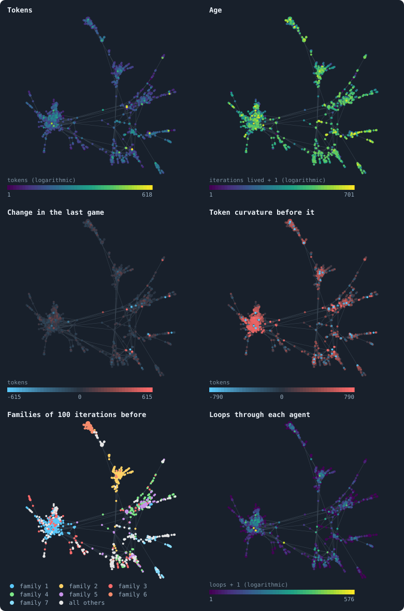
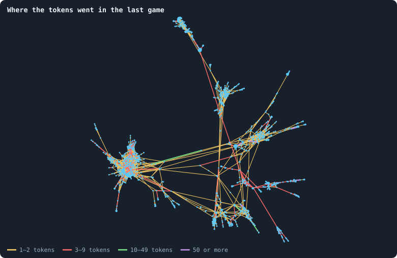

# One world, many colours

Statistics average. A picture does not: it shows **where** things are — which
agents are rich, which are old, which belong together. The viewer draws a
world as dots and lines and can colour them by any quantity it measures
([What the viewer can colour by](../notes/viewer-colours.md)). This chapter
takes one world, the world of seed 1 after its last game, draws it once, and
colours that one drawing six ways, then its connections by the tokens that
crossed them. Each picture is read for what it shows, and for the questions
it raises.

> [!question] Questions of this chapter
> - How is a network drawn, and what does the position of a dot mean?
> - Where in a world are the rich, the old, the gaining, the hills and the
>   valleys of wealth?
> - Do the descendants of one ancestor live together?
> - Which connections carry the tokens?

<!-- runs E02 -->
> [!info] The runs behind this chapter
> **30 runs.** Every condition below is run once for every seed (1 to 30), for 3,000 iterations — or until its world dies out. Every setting is that of the baseline **B1** (the algorithm exactly as a new run is offered it) unless the condition changes it.
>
> - **baseline** — changes nothing: B1 as it is; 10,000 tokens. Runs `B1-10000-s001` … `B1-10000-s030`.
>
> To make these runs again: `python3 gol_lab.py run E02`, or ▶ in the Book tab of a computer running `gol_server.py`. Each run writes its settings, seed and engine version beside its frames, in `GraphOfLifeRuns/<run>/meta.json` and `provenance.json`.

> [!info]- Every setting of these runs
> | setting | baseline | what it is |
> |---|---|---|
> | [`total_tokens`](../notes/settings.md#total_tokens) | 10,000 | The number of tokens in the world, *T*. It never changes during a run. |
> | [`n_nodes`](../notes/settings.md#n_nodes) | 0 | How many founders the world starts with. 0 means one founder per hundred tokens: *n* = ⌊*T* / 100⌋. |
> | [`k_neighbors`](../notes/settings.md#k_neighbors) | 0 | How many neighbours each founder starts with in the ring. 0 means *k* = max(⌊*n* / 100⌋, 5); an odd *k* is wired as *k* − 1. |
> | [`rewire_p`](../notes/settings.md#rewire_p) | 0.2 | In the starting ring, the probability that a connection is moved to a founder chosen at random (Watts–Strogatz). |
> | [`hidden_layers`](../notes/settings.md#hidden_layers) | 50, 45, 40, 35, 30 | The widths of the brain's hidden layers, in order from input to output. |
> | [`brain_kind`](../notes/settings.md#brain_kind) | float16 | How weights are stored: `float` (64-bit), `float16` (16-bit, computed in 64-bit) or `binary` (−1, 0, +1). |
> | [`brain_bits`](../notes/settings.md#brain_bits) | 16 | Only for binary brains: how many input rows encode one number. Unused by float and float16 brains. |
> | [`message_amount`](../notes/settings.md#message_amount) | 30 | How many numbers one message holds. Each agent sends one message to itself and one to each neighbour, every phase. |
> | [`random_input_amount`](../notes/settings.md#random_input_amount) | 5 | How many random numbers, drawn uniformly from −2 to 2, a brain reads per neighbour, every time it looks. |
> | [`exchange_messages`](../notes/settings.md#exchange_messages) | on | Whether agents send and read messages at all. |
> | [`message_prepass`](../notes/settings.md#message_prepass) | on | Whether every phase begins with an extra look in which agents only write messages, so the look that acts reads messages written this phase. |
> | [`allow_handover`](../notes/settings.md#allow_handover) | on | Whether a parent may move some of its own connections to its newborn child. |
> | [`allow_revolutions`](../notes/settings.md#allow_revolutions) | on | Whether a coalition of smaller stakers can take a node from its largest staker (see the note *How a coalition takes a node*). |
> | [`allow_gifting`](../notes/settings.md#allow_gifting) | off | Whether agents may give tokens to neighbours during reproduction. Off in every run of this book. |
> | [`random_decisions`](../notes/settings.md#random_decisions) | off | The control: every number a brain would produce is replaced by a random draw from the standard normal distribution. |
> | [`prune_after`](../notes/settings.md#prune_after) | blotto | After which phase connections that carried no tokens are cut: `blotto` (the game), `reproduction`, or `both`. |
> | [`inactive_window`](../notes/settings.md#inactive_window) | phase | How long a connection may go unused: `phase` means it must carry tokens in the phase being judged; `iteration` allows the two last phases. |
> | [`redistribution`](../notes/settings.md#redistribution) | uniform | How the tokens of removed agents are shared: `uniform` gives every survivor the same chance at each token; `by_tokens` weights by what a survivor holds. |
> | [`tokens_created_per_phase`](../notes/settings.md#tokens_created_per_phase) | 0 | Tokens added to the world at every cleanup. 0 keeps the supply fixed. |
> | [`mutation_probability`](../notes/settings.md#mutation_probability) | 0.2 | The probability that a brain changes when it is copied to a child, and again, for every brain, after every game. |
> | [`mutation_noise_std`](../notes/settings.md#mutation_noise_std) | 0.2 | How large a change to one weight is: a normal draw with standard deviation this times 1/√(fan-in) of its layer. |
> | [`mutation_sparsity`](../notes/settings.md#mutation_sparsity) | 0.1 | The share of a brain's numbers a change touches; also the probability, for each weight matrix and bias vector, of a rarer reset that redraws that share of it. |
> | [`extinction_threshold`](../notes/settings.md#extinction_threshold) | 20 | A run stops, as extinct, when an iteration ends (after its game) with this many agents or fewer. |
> | seeds | 1 to 30 | one run per seed |
> | iterations | 3,000 | how far each run goes, unless its world dies first |
>
> A value in **bold** differs from the baseline B1.
<!-- /runs -->

## How a network is drawn

A network has no positions; a drawing has to invent them. The usual way is a
**force-directed layout**: every connection pulls its two agents together like
a spring, every pair of agents pushes apart like charges, and the dots are
moved step by step until the forces balance. The pictures here use
ForceAtlas2 (Jacomy, Venturini, Heymann and Bastian 2014), with a fixed seed so
that it can be made again; the viewer does the same thing live, in three
dimensions.

Reading such a drawing needs one rule: **only closeness means anything.**
Agents joined to each other, or to the same neighbours, end up close; a tight
group of mutual connections becomes a clump; a chain becomes an arm. Left and
right, up and down mean nothing — rotate the picture and it says the same.

## Six views of one world

<!-- figure colours/six-views -->

**The world of seed 1 after its last game, six ways.** Every agent alive after the game of iteration 2,999 of the world with seed 1 is a dot, every connection a faint line, and the dots sit in the same places in all six pictures (a ForceAtlas2 layout, seed 1, which pulls joined agents together). Each picture colours the dots by one of the quantities the viewer offers ([What the viewer can colour by](../notes/viewer-colours.md)): tokens and age on logarithmic scales; the change of tokens in the last game and the token curvature at its start on a signed scale, blue below zero, red above, dark at zero (both stretched logarithmically, the curvature cut at its 1st and 99th percentile); the family — which of the genotypes alive 100 iterations earlier each agent's genotype descends from, the seven largest in colour; and how many loops of a breadth-first cycle basis pass through each agent.

> [!example]- How to make this figure
> **Runs.** `B1-10000-s001`.
>
> **Data.** From each run's frames, `GraphOfLifeRuns/<run>/frames/`, read with `gol_store.read_frame(run, index)`; frame `2·t` is iteration *t* after reproduction and frame `2·t + 1` after the game.
>
> 1. Read frames `5998` (start of the last game) and `5999` (after it): `ids`, `tokens`, `ages`, `delta`, `brain_ids`, `edges`.
> 2. Curvature: in frame 5998, Σ over neighbours of (their tokens − own tokens).
> 3. Families: read frames 5799 to 5999, note each genotype's parent, and climb from each living genotype to one alive after the game of iteration 2,899.
> 4. Loops: as in [Chapter 31](31-the-geometry-of-a-world.md).
> 5. Lay out with `networkx.forceatlas2_layout(G, max_iter=200, seed=1)` and colour.
>
> **To make it again:** `python3 book_figures.py colours`.
<!-- /figure -->

1,336 agents, the same places in every picture. What each colouring shows:

- **Tokens.** The rich are scattered: a bright dot here and there, in clumps
  and on arms. No region holds the wealth. The richest agent holds 618 tokens.
- **Age.** The oldest agents — up to 700 iterations — sit far out on the arms;
  the clumps around the hubs are younger. A plausible reason: the
  neighbourhoods of hubs are where most children are born and most nodes change
  hands ([Chapter 28](28-how-agents-have-children.md), [Chapter 27](27-where-the-tokens-flow.md)),
  while the ends of arms are quiet. One picture is not a proof; it is a
  question worth measuring.
- **Change in the last game.** Almost everything is dark: most agents ended the
  game with what they had or close to it ([Chapter 26](26-gains-and-losses.md)).
  The few bright dots are the big winners and losers of the game.
- **Token curvature before the game.** Blue dots are richer than their
  neighbourhood (hills), red dots poorer (valleys). The hubs are blue, and the
  clump around the largest hub is red: every agent there is poorer than its
  rich neighbour. The landscape of wealth is a set of peaks with valleys
  around them — and tokens flow downhill, from the peaks into the valleys
  ([Chapter 26](26-gains-and-losses.md)).
- **Families.** Each agent is coloured by the genotype, among those alive 100
  iterations earlier, from which its own genotype descends
  ([Families](../notes/families.md)). The seven largest families hold 339, 167,
  135, 123, 103, 96 and 77 agents; 296 belong to smaller ones. And the families
  **live together**: one fills the big clump on the left, another an arm at the
  top, others the clusters on the right. A family is a region.
- **Loops.** The clumps around hubs carry the loops — up to 576 of the world's
  1,112 independent loops pass through one agent — and the arms carry none
  ([Chapter 31](31-the-geometry-of-a-world.md)).

## Where the tokens went

<!-- figure colours/flows -->

**Where the tokens went in the last game.** The same world and layout; every connection is coloured by how many tokens crossed it in the last game, in both directions together, and drawn the wider the more crossed. Every connection that is left carried at least one token — the others were cut at the end of the game. Agents are small dots.

> [!example]- How to make this figure
> **Runs.** `B1-10000-s001`.
>
> **Data.** From each run's frames, `GraphOfLifeRuns/<run>/frames/`, read with `gol_store.read_frame(run, index)`; frame `2·t` is iteration *t* after reproduction and frame `2·t + 1` after the game.
>
> 1. In frame `5999`, read `decisions.allocations`: for every agent and target ≠ itself, add the `alloc` to the connection between them.
> 2. Colour each connection of `edges` by its class.
>
> **To make it again:** `python3 book_figures.py colours`.
<!-- /figure -->

Every connection left after the game carried at least one token across it —
the others were cut. Of the 2,447 connections, **2,145 carried only one or two
tokens**, both directions together; 292 carried 3 to 9; 4 carried 10 to 49;
6 carried 50 or more. Almost every connection of the world is kept alive at
about the lowest price a connection can have, one token a game
([Chapter 32](32-how-a-world-breaks.md)). The traffic of a world is thin and
everywhere, not heavy on a few roads.

## Reading pictures well

Four cautions, which apply to every picture the viewer draws:

- **The layout is one of many.** A different seed gives a different drawing of
  the same network. Clumps and arms are real; their places are not.
- **Colours are relative to the frame.** A colour scale runs from the frame's
  smallest value to its largest (or is centred on zero for signed quantities),
  so the same colour can mean different values in different frames. Read the
  legend.
- **Logarithmic colour scales** spread out the small values. On a linear
  scale, a world with one agent at 618 tokens would show everyone else as the
  same dark colour.
- **A picture is one moment.** It suggests; a statistic over many moments and
  many worlds decides.

## What this means

- **Families live together.** Descent is regional: a line of brains holds a
  part of the world, not scattered agents. Spatial structure like this is what
  kin selection and network reciprocity need ([Chapter 34](34-do-agents-cooperate.md)
  asks whether it is used).
- **Wealth is a landscape of peaks and valleys,** peaks at the hubs.
- **Connections are kept at their minimum price,** one or two tokens a game.
- **Pictures raise questions.** Two from this chapter: do the old live at the
  periphery in every world, and do families always occupy regions? The second
  is measured in the next chapter.

To make every figure of this chapter: `python3 book_figures.py colours`.

<!-- turns -->
---

← [Chapter 32 · How a world breaks](32-how-a-world-breaks.md) · [Contents](../README.md) · [Chapter 34 · Do agents cooperate?](34-do-agents-cooperate.md) →
<!-- /turns -->
