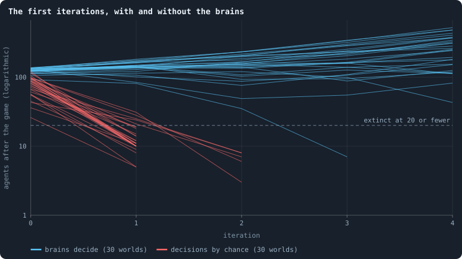
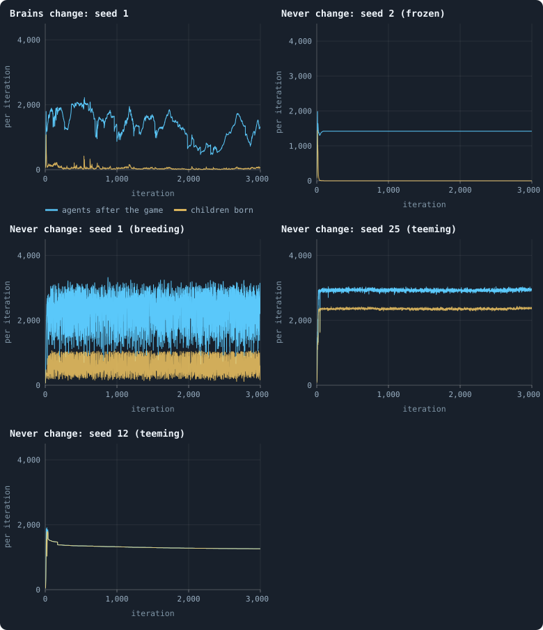
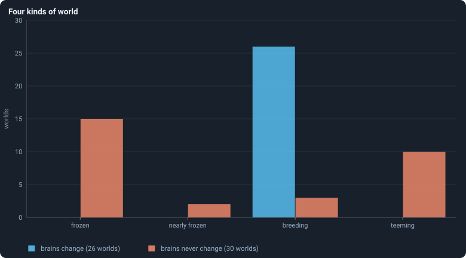
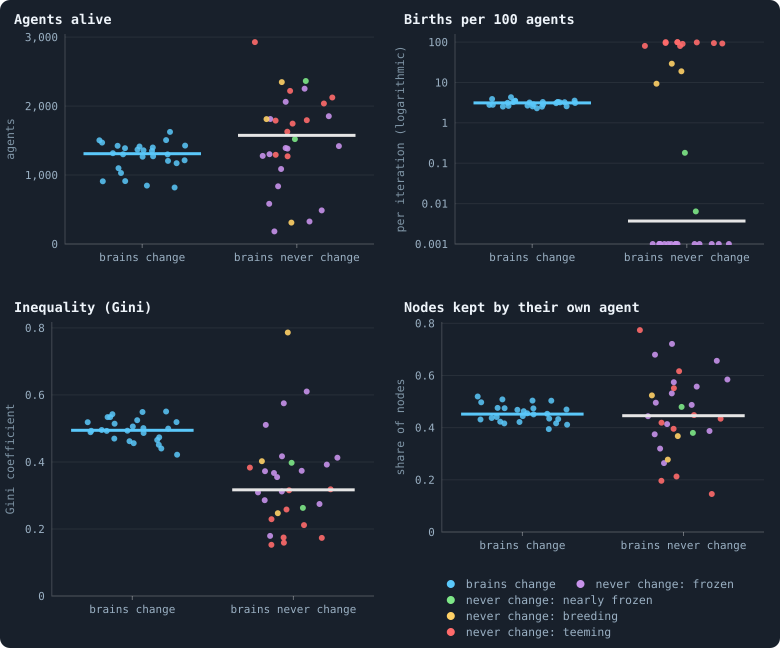
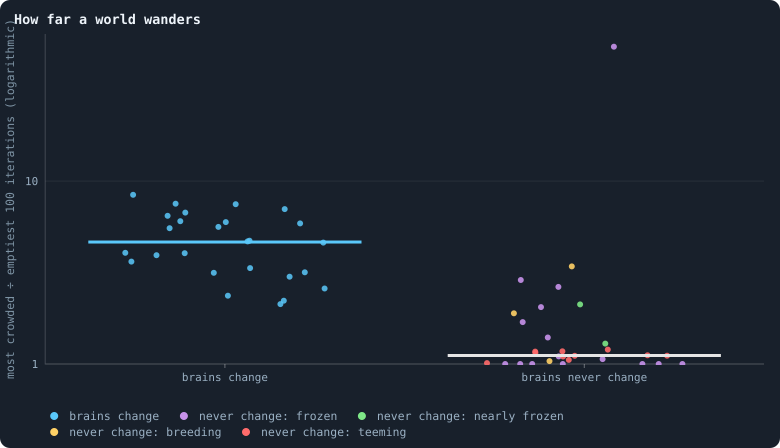
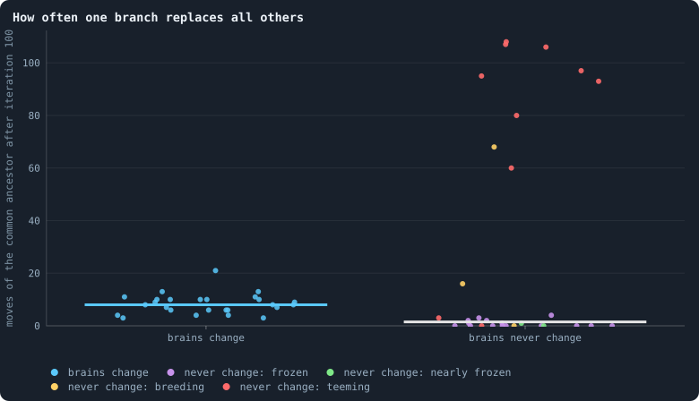

# Do the brains matter?

Everything Part II found is a fact about the baseline, with nothing to hold
it against ([Chapter 24](24-meta-1.md)). This chapter takes the brains away,
in two different ways, and compares.

> [!question] Questions of this chapter
> - Can a world live if its agents decide by pure chance?
> - What happens to a world whose brains never change — whose agents keep
>   the founders' brains, copied, forever?
> - Do the worlds that evolve and the worlds that do not differ on average,
>   or in how alike they are?
> - Do lines still take over a world in which no brain is better than
>   another?

<!-- runs E07 -->
> [!info] The runs behind this chapter
> **90 runs.** Every condition below is run once for every seed (1 to 30), for 3,000 iterations — or until its world dies out. Every setting is that of the baseline **B1** (the algorithm exactly as a new run is offered it) unless the condition changes it.
>
> - **baseline** — changes nothing: B1 as it is; 10,000 tokens. Runs `B1-10000-s001` … `B1-10000-s030`.
> - **brains never change** — changes `mutation_sparsity` = 0; 10,000 tokens. Runs `B1-10000-a8525d-s001` … `B1-10000-a8525d-s030`.
> - **decisions by chance** — changes `random_decisions` = on; 10,000 tokens. Runs `B1-10000-e7f450-s001` … `B1-10000-e7f450-s030`.
>
> To make these runs again: `python3 gol_lab.py run E07`, or ▶ in the Book tab of a computer running `gol_server.py`. Each run writes its settings, seed and engine version beside its frames, in `GraphOfLifeRuns/<run>/meta.json` and `provenance.json`.

> [!info]- Every setting of these runs
> | setting | baseline | brains never change | decisions by chance | what it is |
> |---|---|---|---|---|
> | [`total_tokens`](../notes/settings.md#total_tokens) | 10,000 | 10,000 | 10,000 | The number of tokens in the world, *T*. It never changes during a run. |
> | [`n_nodes`](../notes/settings.md#n_nodes) | 0 | 0 | 0 | How many founders the world starts with. 0 means one founder per hundred tokens: *n* = ⌊*T* / 100⌋. |
> | [`k_neighbors`](../notes/settings.md#k_neighbors) | 0 | 0 | 0 | How many neighbours each founder starts with in the ring. 0 means *k* = max(⌊*n* / 100⌋, 5); an odd *k* is wired as *k* − 1. |
> | [`rewire_p`](../notes/settings.md#rewire_p) | 0.2 | 0.2 | 0.2 | In the starting ring, the probability that a connection is moved to a founder chosen at random (Watts–Strogatz). |
> | [`hidden_layers`](../notes/settings.md#hidden_layers) | 50, 45, 40, 35, 30 | 50, 45, 40, 35, 30 | 50, 45, 40, 35, 30 | The widths of the brain's hidden layers, in order from input to output. |
> | [`brain_kind`](../notes/settings.md#brain_kind) | float16 | float16 | float16 | How weights are stored: `float` (64-bit), `float16` (16-bit, computed in 64-bit) or `binary` (−1, 0, +1). |
> | [`brain_bits`](../notes/settings.md#brain_bits) | 16 | 16 | 16 | Only for binary brains: how many input rows encode one number. Unused by float and float16 brains. |
> | [`message_amount`](../notes/settings.md#message_amount) | 30 | 30 | 30 | How many numbers one message holds. Each agent sends one message to itself and one to each neighbour, every phase. |
> | [`random_input_amount`](../notes/settings.md#random_input_amount) | 5 | 5 | 5 | How many random numbers, drawn uniformly from −2 to 2, a brain reads per neighbour, every time it looks. |
> | [`exchange_messages`](../notes/settings.md#exchange_messages) | on | on | on | Whether agents send and read messages at all. |
> | [`message_prepass`](../notes/settings.md#message_prepass) | on | on | on | Whether every phase begins with an extra look in which agents only write messages, so the look that acts reads messages written this phase. |
> | [`allow_handover`](../notes/settings.md#allow_handover) | on | on | on | Whether a parent may move some of its own connections to its newborn child. |
> | [`allow_revolutions`](../notes/settings.md#allow_revolutions) | on | on | on | Whether a coalition of smaller stakers can take a node from its largest staker (see the note *How a coalition takes a node*). |
> | [`allow_gifting`](../notes/settings.md#allow_gifting) | off | off | off | Whether agents may give tokens to neighbours during reproduction. Off in every run of this book. |
> | [`random_decisions`](../notes/settings.md#random_decisions) | off | off | **on** | The control: every number a brain would produce is replaced by a random draw from the standard normal distribution. |
> | [`prune_after`](../notes/settings.md#prune_after) | blotto | blotto | blotto | After which phase connections that carried no tokens are cut: `blotto` (the game), `reproduction`, or `both`. |
> | [`inactive_window`](../notes/settings.md#inactive_window) | phase | phase | phase | How long a connection may go unused: `phase` means it must carry tokens in the phase being judged; `iteration` allows the two last phases. |
> | [`redistribution`](../notes/settings.md#redistribution) | uniform | uniform | uniform | How the tokens of removed agents are shared: `uniform` gives every survivor the same chance at each token; `by_tokens` weights by what a survivor holds. |
> | [`tokens_created_per_phase`](../notes/settings.md#tokens_created_per_phase) | 0 | 0 | 0 | Tokens added to the world at every cleanup. 0 keeps the supply fixed. |
> | [`mutation_probability`](../notes/settings.md#mutation_probability) | 0.2 | 0.2 | 0.2 | The probability that a brain changes when it is copied to a child, and again, for every brain, after every game. |
> | [`mutation_noise_std`](../notes/settings.md#mutation_noise_std) | 0.2 | 0.2 | 0.2 | How large a change to one weight is: a normal draw with standard deviation this times 1/√(fan-in) of its layer. |
> | [`mutation_sparsity`](../notes/settings.md#mutation_sparsity) | 0.1 | **0** | 0.1 | The share of a brain's numbers a change touches; also the probability, for each weight matrix and bias vector, of a rarer reset that redraws that share of it. |
> | [`extinction_threshold`](../notes/settings.md#extinction_threshold) | 20 | 20 | 20 | A run stops, as extinct, when an iteration ends (after its game) with this many agents or fewer. |
> | seeds | 1 to 30 | 1 to 30 | 1 to 30 | one run per seed |
> | iterations | 3,000 | 3,000 | 3,000 | how far each run goes, unless its world dies first |
>
> A value in **bold** differs from the baseline B1.
<!-- /runs -->

## The three conditions

Each changes one setting of the baseline B1, for the same thirty seeds:

- **baseline** — the thirty runs of [Chapter 9](09-thirty-worlds.md),
  reused.
- **brains never change** — [`mutation_sparsity`](../notes/settings.md#mutation_sparsity)
  = 0. A brain still "changes" with probability one in five, at birth and
  after every game, and gets a new genotype number when it does — but not
  one of its weights moves ([How a brain changes](../notes/mutation.md)). So
  the only brains a world ever has are its founders', copied; the family tree
  still branches exactly as often as in the baseline, which keeps it
  comparable. Once one founder's descendants fill a world, every agent in it
  carries the same brain.
- **decisions by chance** — [`random_decisions`](../notes/settings.md#random_decisions)
  on. Agents never read their inputs: every number a brain would have given
  is drawn from a standard normal distribution instead, and every decision
  follows from that by the usual rules.

## Chance cannot keep a world

<!-- figure brains/chance -->

**The first iterations, with and without the brains.** Each line is one world: the agents alive after the game of iterations 0 to 4. Blue: the baseline, whose agents decide with their brains; red: the same 30 seeds with every decision drawn at random. A red line ends where its world died.

> [!example]- How to make this figure
> **Runs.** The 90 runs of Experiment 7 — B1 at 10,000 tokens, seeds 1 to 30, 3,000 iterations — in three conditions: the 30 baseline runs `B1-10000-s001` … `-s030`; *brains never change*, `B1-10000-a8525d-s001` … `-s030` (`mutation_sparsity` 0); and *decisions by chance*, `B1-10000-e7f450-s001` … `-s030` (`random_decisions` on). They are made with `python3 gol_lab.py run E07`; every setting is listed in the box at the top of the chapter.
>
> **Data.** From each run's `GraphOfLifeRuns/<run>/stats.jsonl`, which holds one row per recorded phase: `phase` 1 is the world just after reproduction, `phase` 2 just after the game, and every statistic is a field of the row (see [What a run records](../notes/frames-and-stats.md)).
>
> 1. Plot `nodes` of the rows with `phase` = 2 and `iteration` ≤ 4, one line per run.
>
> **To make it again:** `python3 book_figures.py brains`.
<!-- /figure -->

All thirty worlds deciding by chance died: 25 after their second iteration,
5 after their third. In the last game of the median one, 62% of the agents
were cut off and another 15% starved. Random stakes leave connections
without tokens; a connection that carries no tokens in a game is cut at its
end, and anything no longer joined to the largest piece of the world is
removed ([Chapter 3](03-one-iteration.md)).

The baseline's founders start with brains nobody chose either — random
weights — and their worlds live. Why the difference? Perhaps because even a
random brain is a *function* of what it sees: what it does on one connection
hangs together with what it does on the next, and with what it did in the
last game. Noise has nothing of the kind. This is a guess the experiment
does not test.

Decisions by chance are also a crude control in another way: a draw from the
standard normal distribution makes, for instance, a parent give exactly half
of its tokens, or all of them, far more often than any settled world does
([Chapter 28](28-how-agents-have-children.md)). A sharper control draws every
decision at random **from the distribution of that decision in the evolved
worlds themselves** — first as it is overall, then given the agent's own
tokens and connections. Agents that decide like that behave, on average,
exactly like evolved ones, but respond to nothing. If such a world looks like
the baseline, what the brains contribute is their average; if it does not,
what they respond to matters. It is planned as Chapter 40.

## Without change: frozen or teeming

Five single worlds, to see what the conditions do:

<!-- figure brains/traces -->

**Five single worlds.** Each panel is one world: the number of agents alive after every game (blue) and of children born in every reproduction phase (yellow), on the same scale in every panel. Top left: a baseline world, whose brains change (seed 1). The others are worlds whose brains never change: seed 2, frozen — no child born after iteration 95, the same agents game after game; seed 1, breeding; seeds 25 and 12, teeming — about one child for every agent in every iteration. In seed 12 every child is lost again at once, so the yellow line lies above the blue.

> [!example]- How to make this figure
> **Runs.** `B1-10000-s001` (baseline), and `B1-10000-a8525d-s002`, `-s001`, `-s025` and `-s012` (brains never change), all from Experiment 7.
>
> **Data.** From each run's `GraphOfLifeRuns/<run>/stats.jsonl`, which holds one row per recorded phase: `phase` 1 is the world just after reproduction, `phase` 2 just after the game, and every statistic is a field of the row (see [What a run records](../notes/frames-and-stats.md)).
>
> 1. Plot `nodes` of the rows with `phase` = 2 and `births` of the rows with `phase` = 1 against `iteration`.
>
> **To make it again:** `python3 book_figures.py brains`.
<!-- /figure -->

Sorted by how many children they have from iteration 500 on, the thirty
worlds whose brains never change fall into kinds the baseline never shows:

<!-- figure brains/kinds -->

**Four kinds of world.** Every world that lived to iteration 3,000, sorted by its mean births per 100 agents per iteration from iteration 500 on: frozen — none at all; nearly frozen — fewer than 0.5; breeding — 0.5 to 50; teeming — more than 50, about one child per agent per iteration.

> [!example]- How to make this figure
> **Runs.** The 90 runs of Experiment 7 — B1 at 10,000 tokens, seeds 1 to 30, 3,000 iterations — in three conditions: the 30 baseline runs `B1-10000-s001` … `-s030`; *brains never change*, `B1-10000-a8525d-s001` … `-s030` (`mutation_sparsity` 0); and *decisions by chance*, `B1-10000-e7f450-s001` … `-s030` (`random_decisions` on). They are made with `python3 gol_lab.py run E07`; every setting is listed in the box at the top of the chapter.
>
> **Data.** From each run's `GraphOfLifeRuns/<run>/stats.jsonl`, which holds one row per recorded phase: `phase` 1 is the world just after reproduction, `phase` 2 just after the game, and every statistic is a field of the row (see [What a run records](../notes/frames-and-stats.md)).
>
> 1. Compute each run's births per 100 agents as for the figure of births above.
> 2. Sort the runs into the four kinds by that number and count them.
>
> **To make it again:** `python3 book_figures.py brains`.
<!-- /figure -->

- **frozen** — 15 worlds without a single birth after iteration 500. Their
  last child was born between iterations 29 and 439. Fourteen of them then
  kept exactly the same number of agents to the end of the run — between 183
  and 2,252, depending on the world — playing the game every iteration with
  no one born and no one dying. The fifteenth, seed 20, lost agents without
  ever replacing them, from 1,165 at iteration 300 to 23 by iteration 2,024,
  and then sat at 23, three above the line at which a run counts as extinct.
- **nearly frozen** — 2 worlds, with a birth in about one iteration in ten.
- **breeding** — 3 worlds, with 8 to 24 births per hundred agents per
  iteration.
- **teeming** — 10 worlds, with 75 to 100 births per hundred agents per
  iteration: about one child for every agent, every iteration, and about as
  many agents lost again in the following game. In seed 12 every child is
  lost the moment it is born, joined to no one: its 1,297 agents try to have
  a child in every iteration, and not one ever lives.

All 26 baseline worlds that lived to the end are breeding, at three births
per hundred agents. And not one of the thirty worlds without change died
out, against four of the baseline's thirty.

## Where the worlds settle

Each world is one dot, at its mean over iterations 500 to 2,999; the worlds
without change are coloured by their kind:

<!-- figure brains/settled -->

**Where the worlds settle, with and without change.** One dot per world that lived to iteration 3,000, at its mean over iterations 500 to 2,999. In each panel, the left column holds the 26 baseline worlds, whose brains change (blue); the right column the 30 worlds whose brains never change, coloured by the kind of world each became (see the figure of the four kinds below): violet frozen, green nearly frozen, yellow breeding, red teeming. The bars are the medians. The panel of births has a logarithmic axis; the 15 frozen worlds, which had no births at all, are drawn at its bottom, 0.001. No world deciding by chance lived more than 3 iterations, so that condition has no dots. The dots are spread sideways only so that they do not hide each other.

> [!example]- How to make this figure
> **Runs.** The 90 runs of Experiment 7 — B1 at 10,000 tokens, seeds 1 to 30, 3,000 iterations — in three conditions: the 30 baseline runs `B1-10000-s001` … `-s030`; *brains never change*, `B1-10000-a8525d-s001` … `-s030` (`mutation_sparsity` 0); and *decisions by chance*, `B1-10000-e7f450-s001` … `-s030` (`random_decisions` on). They are made with `python3 gol_lab.py run E07`; every setting is listed in the box at the top of the chapter.
>
> **Data.** From each run's `GraphOfLifeRuns/<run>/stats.jsonl`, which holds one row per recorded phase: `phase` 1 is the world just after reproduction, `phase` 2 just after the game, and every statistic is a field of the row (see [What a run records](../notes/frames-and-stats.md)).
>
> 1. For agents, the Gini coefficient and nodes kept: average `nodes`, `gini` and `heldHomeShare` over the rows with `phase` = 2 and 500 ≤ `iteration` ≤ 2,999.
> 2. For births: divide `births` in each row with `phase` = 1 by the row's `nodes_before`, multiply by 100, and average from iteration 500 to 2,999.
> 3. Sort the worlds whose brains never change into the four kinds by their births (frozen: none; nearly frozen: below 0.5; teeming: above 50; breeding: between).
> 4. Plot one dot per run that reached iteration 3,000, one column per condition.
>
> **To make it again:** `python3 book_figures.py brains`.
<!-- /figure -->

- **Agents.** The worlds without change have a median of 1,574 agents
  against 1,309, but they range from 183 to 2,928, against 819 to 1,626.
  Their [spread](../notes/spread-between-worlds.md) is 0.45, against 0.17.
- **Births.** The evolving worlds all sit near 3 per hundred agents (between
  2.3 and 4.3); the worlds without change range from none at all to one per
  agent — a spread of 1.39, against 0.19.
- **Inequality.** Wealth is more evenly spread without change: a median Gini
  of 0.32 against 0.49 (paired by seed, a difference of 0.17, 95% interval
  0.11 to 0.23, by the [bootstrap](../notes/bootstrap.md)), and most evenly in
  the teeming worlds.
- **Nodes kept.** On average the same, 45% in both — but from 15% to 77%
  without change, against 39% to 52%.

The same holds for every other statistic of Part II: the share of stakes put
at home (30% in both, 4% to 51% without change), the nodes taken by
coalitions, the core, the bridges, the clustering. On average a world without
change looks much like an evolving one. But the evolving worlds sit close
together, and the worlds without change spread over almost everything each
statistic can be.

## How much a world wanders

<!-- figure brains/wander-dots -->

**How far a world wanders.** For each world that lived to the end, coloured as in the figure above: cut its life from iteration 100 to 2,999 into 29 stretches of 100 iterations, take its mean number of agents in each, and divide the largest of the 29 by the smallest. 1 means a world that never moved; 4 that its most crowded stretch held four times as many agents as its emptiest.

> [!example]- How to make this figure
> **Runs.** The 90 runs of Experiment 7 — B1 at 10,000 tokens, seeds 1 to 30, 3,000 iterations — in three conditions: the 30 baseline runs `B1-10000-s001` … `-s030`; *brains never change*, `B1-10000-a8525d-s001` … `-s030` (`mutation_sparsity` 0); and *decisions by chance*, `B1-10000-e7f450-s001` … `-s030` (`random_decisions` on). They are made with `python3 gol_lab.py run E07`; every setting is listed in the box at the top of the chapter.
>
> **Data.** From the analysis of Experiment 7 (`python3 gol_lab.py analyse E07`), whose results file holds every run's ratio under `wandering.nodes`; or from each run's `GraphOfLifeRuns/<run>/stats.jsonl`, which holds one row per recorded phase: `phase` 1 is the world just after reproduction, `phase` 2 just after the game, and every statistic is a field of the row (see [What a run records](../notes/frames-and-stats.md)).
>
> 1. Cut iterations 100–2,999 into 29 stretches of 100 and average `nodes` in each.
> 2. Divide the largest of the 29 by the smallest.
>
> **To make it again:** `python3 book_figures.py brains`.
<!-- /figure -->

A world without change hardly wanders. Its most crowded stretch of a hundred
iterations holds a median 1.11 times as many agents as its emptiest, against
4.65 for an evolving world (paired by seed, a difference of 3.5, 95%
interval 2.8 to 4.2). And its first half says almost everything about its
second: the [correlation](../notes/correlation.md) across the thirty worlds
is 0.96, against 0.12 in the baseline. Of all the variation in the number of
agents, 96% lies between the worlds without change, and 17% between the
baseline's ([Between and within](../notes/between-and-within.md)).

## Lines by chance

In a world whose brains never change, the founders' lines still compete
until one of them fills the world — between iterations 75 and 100 in the
median world (125 in the baseline). From then on every agent carries the same
brain, and which genotype spreads is pure chance.

<!-- figure brains/moves-dots -->

**How often one branch replaces all others.** For each world that lived to the end, coloured as above: how many times after iteration 100 the newest common ancestor of all the living moved forward to a younger genotype ([The common ancestor](../notes/common-ancestor.md)). In a world whose brains never change, every genotype is a renamed copy of one founder's brain once that founder's line fills the world, so which branch wins is chance.

> [!example]- How to make this figure
> **Runs.** The 90 runs of Experiment 7 — B1 at 10,000 tokens, seeds 1 to 30, 3,000 iterations — in three conditions: the 30 baseline runs `B1-10000-s001` … `-s030`; *brains never change*, `B1-10000-a8525d-s001` … `-s030` (`mutation_sparsity` 0); and *decisions by chance*, `B1-10000-e7f450-s001` … `-s030` (`random_decisions` on). They are made with `python3 gol_lab.py run E07`; every setting is listed in the box at the top of the chapter.
>
> **Data.** From the lineage analysis of Experiment 7, `book/results/E07.json` (`lineage.<condition>.runs.<run>.ancestor.moves`).
>
> 1. As in [Chapter 17](17-genotypes-and-lineages.md), for every run.
>
> **To make it again:** `python3 book_figures.py brains`.
<!-- /figure -->

In the frozen worlds the common ancestor hardly moves once one founder's
line has filled the world (a median of 0 moves): nodes still change hands,
but no later branch takes the whole world again. In four worlds without
change (seeds 7, 14, 18 and 19) the living still descended from more than
one founder at the end. In the teeming worlds, chance sweeps the whole world
about every thirty iterations — a median of 94 moves, more than ten times as
often as the baseline's 8.

So chance alone can make one line take a world over — much faster than in
the baseline, or never, depending on how often agents are born and die. The
sweeps of [Chapter 17](17-genotypes-and-lineages.md) are therefore not, by
themselves, evidence of selection: a fair comparison needs a world that is
born and dies as the baseline does while no brain is better than another,
and none of these is one. The three breeding worlds come closest, with 0, 16
and 68 moves.

## What was expected

Before the runs, as Experiment 7:

<!-- thesis E07 -->
> [!quote] The thesis of Experiment 7, written down before any of its runs existed
> **The claim.** Evolution is what makes the worlds alike. A world whose brains never change is stuck with the brain of whichever founder's line takes it over, and worlds of different seeds, stuck with different founders, end up far more different from each other than worlds that keep evolving: some still, some teeming.
>
> **Why it would be so.** In the baseline the seed hardly matters (Chapter 4): every world wanders through the same range. Two pilots of a world without change, run to plan this chapter, ended up nothing alike. In one, the descendants of a single founder filled the world by iteration 50, and from about iteration 100 no one was born and no one died: the same 1,420 agents, game after game. In the other, a different founder's descendants kept the world in boom and bust, between about 1,000 and 3,200 agents, with hundreds of births in every iteration. With no new brains, nothing can move a world off the policy it was dealt.
>
> **It holds if:** Over the settled life of the runs, from iteration 500 on: the number of agents varies across the surviving worlds without change by at least twice as much as across the baseline's (a spread, sd ÷ mean, of at least 0.34 against 0.17); births vary across them at least twice as much as well; and more than half of all the variation in a world's number of agents lies between the worlds rather than within each of them over time (against 0.17 in the baseline).
>
> **It fails if:** The worlds without change are about as alike as the baseline's, and wander as much. Then evolution is not what keeps the seed from mattering, and the brain a world starts with does not decide its fate.
<!-- /thesis -->

("Chapter 4" in the thesis is today's [Chapter 13](13-how-much-does-the-seed-decide.md).)

The thesis **holds**, on all three counts and by wide margins: the spread of
the number of agents is 0.45 against 0.17 (it asked for at least 0.34);
births spread 1.39 against 0.19 (at least twice the baseline's); and 96% of
the variation in the number of agents lies between the worlds without
change (it asked for more than half).

## What this means

- **The brains matter.** No world survives on decisions taken at random;
  even unselected random brains keep a world alive.
- **Evolution is what makes the worlds alike.** Without it, a world is stuck
  with the brains of whichever founder's line fills it — usually within a
  hundred iterations — and the brains a hundred random founders bring are
  anything but alike: half of them stop having children altogether, a third
  have a child every iteration. The seed decides which, and with it nearly
  everything about the world. With evolution, the 26 worlds that lived to
  the end, each from a different set of founders, all end up in the same
  narrow band.
- **Is that selection?** Arriving at the same place from different starting
  points is what selection towards a shared optimum would look like. It is
  not proof of it: the churn of mutation could also keep brains from
  settling anywhere extreme. A next experiment can tell the two apart:
  change how often brains change. If three births per hundred agents is what
  selection finds, it should hold at other rates of mutation; if it is
  mutation's churn, it should move with them.
- **The wander needs evolution.** A world without change hardly wanders at
  all. Whether the sweeps drive the wander, rather than mutation in general,
  is still open ([Chapter 24](24-meta-1.md)).

> [!info] Where everything came from
> - **Survived to iteration 3,000:** baseline 26, brains never change 30,
>   decisions by chance 0 (25 died after 2 iterations, 5 after 3).
> - **Engine:** snapshot `f820369a1583af53`, commit `4bc7165`, for all 90 runs.
> - **Cost:** the new runs took 35 hours of computing, done in 9.1 hours on
>   four workers; 11 GB on disk; at most 746 MB of memory for one run.
> - **Comparisons:** paired by seed; intervals by resampling the
>   differences, *p* by flipping their signs at random, 10,000 times each
>   ([Permutation tests](../notes/permutation-test.md)).
> - **Results:** `book/results/E07.json`, made with `python3 gol_lab.py analyse E07`
>   (about 14 minutes: the lineages read every frame of every run); the
>   figures with `python3 book_figures.py brains`.

<!-- turns -->
---

← [Chapter 36 · Meta II · What the measurements say about open-ended evolution](36-meta-2.md) · [Contents](../README.md) · [Chapter 38 · How does a world's size follow its tokens?](38-how-does-a-worlds-size-follow-its-tokens.md) →
<!-- /turns -->
