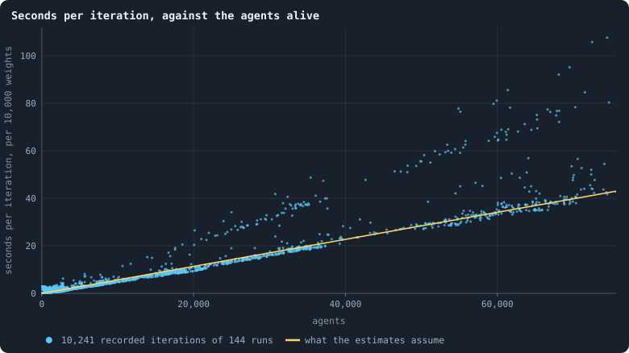

# What a simulation costs

Every experiment in this book is sized by what it costs: the hours a
computer spends on it, the memory a run needs, and the disk its frames take.
Those are measured, not guessed. Every iteration a run records carries its
own wall-clock seconds, its processor seconds and the most memory its process
has held, and `python3 gol_lab.py costs` fits the numbers below to all of
them. This page is rewritten as the measurements accumulate.

## The model

The cost of a run is close to proportional to the number of agents it has
and to the size of their brains, because every agent's brain looks at every
neighbour, twice per phase.

What is measured, and how each figure is estimated:

- **time** — seconds per agent per iteration, for every 10,000 weights in a
  brain;
- **agents** — agents alive per token of the supply, from iteration 100 on,
  once a world has settled;
- **disk** — bytes per agent per iteration, with every frame and its
  decisions kept;
- **memory** — the most a run holds: a base, plus a multiple of every byte of
  every brain, since the game copies them and a checkpoint stacks them.

<!-- costs -->
- **Time:** 0.57 ms per agent per iteration, for every 10,000 weights in a brain.
- **Agents:** 0.14 alive per token of the world, once settled.
- **Disk:** 72 bytes per agent per iteration.
- **Memory:** 300 MB, plus 68.6 times every byte of every brain.

Fitted to 144 recorded runs on 2026-10-09 by `python3 gol_lab.py costs`.
<!-- /costs -->

Each kind of run — the same settings apart from the size of the world and
the seed — is fitted on its own, because kinds differ in more than the size
of their brains: the baseline's brains are half as big again as the ones
before it, and cost an agent hardly any more, since its agents have fewer
neighbours to look at. Until a kind has been measured, it borrows from all
runs; until anything has, the calibration of 2 October 2026 on the baseline
stands: about 1.3 ms per agent per iteration in the lab, 0.18 agents per
token once a world has settled, and 70 bytes per agent per iteration.

**Seconds per iteration, against the agents alive.** Every dot is one
recorded iteration of one run of the lab: the agents alive (x) against the
seconds the iteration took, per 10,000 weights in a brain (y). The line is
what the estimates assume. The figure is redrawn by `python3 gol_lab.py costs`.

## What the baseline set cost

The thirty runs of [Chapter 9](09-thirty-worlds.md) — 10,000 tokens, 3,000 iterations each — took
26 hours of computing, done in 7.2 hours on four workers, and fill 7.8 GB.
No run needed more than 651 MB of memory. That is the unit the experiments
of Parts II and III are sized in: one condition of thirty seeds at 10,000 tokens is
about seven hours.

## The rules for sizing an experiment

- An experiment takes **about 12 hours** of the computer, and never more than
  two days. The lab estimates the time on its workers before ▶ and says how
  much is left while it runs; the estimate is what fits the plan to this.
- A run's time grows with its world: at the baseline, a world of *T* tokens
  settles at about 0.12 × *T* agents (measured on worlds of 10,000 tokens),
  and an agent costs about 0.87 ms per iteration, so 10,000 tokens cost about
  1.1 seconds per iteration. If the number of agents grows in step with the
  tokens, 200,000 tokens cost about 22 —
  [Chapter 32](32-how-does-a-worlds-size-follow-its-tokens.md) will say whether it does.
- Memory limits big worlds before time does: the lab starts a run only when
  its estimated peak fits next to the runs already going, in three quarters
  of the machine's memory.
- Disk is about 65 bytes per agent per iteration with every frame kept. The
  lab will not start a run the disk cannot hold.
- The workers default to four, the machine's fast cores. More are possible
  from the Book tab; the slower cores add less than a fast one each.

<!-- turns -->
---

← [Chapter 33 · How fast should brains change?](33-how-fast-should-brains-change.md) · [Contents](../README.md)
<!-- /turns -->
