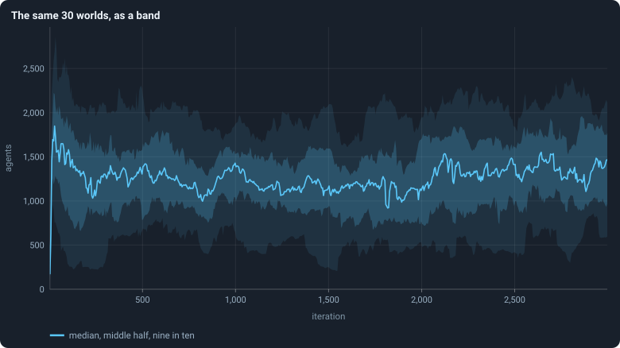

# Bands: many worlds in one figure

Thirty worlds, each with a value at each of 3,000 iterations, drawn as
thirty lines, are a tangle nobody can read. The book draws them as a **band**
instead: a line for the typical world, and shaded regions for how far the
others spread around it.

## How a band is made

Given a statistic and a set of runs (say, the number of agents after every
game in the 30 baseline runs):

1. **Stretches.** Cut the iterations into consecutive stretches. For a
   statistic measured every iteration over 3,000 iterations: 600 stretches of
   5 iterations (0–4, 5–9, …). For a graph statistic, measured only every 25
   iterations: 120 stretches of 25.
2. **One value per world and stretch.** For each world, the mean of the
   statistic over the iterations of the stretch at which it was measured.
3. **Across the worlds.** In each stretch, take the
   [quantiles](median-and-quantiles.md) of those values over the worlds that
   have one — a world that died has none after its death:
   - the **line** is the median, *Q*(0.5);
   - the **darker band** runs from *Q*(0.25) to *Q*(0.75): the middle half
     of the worlds;
   - the **paler band** runs from *Q*(0.05) to *Q*(0.95): nine worlds in ten.
4. **Draw** the line and the bands at the middle of each stretch.

In the code: `bands` in `gol_analysis.py`.

## How to read one

- The line is the **typical world**, not any single world. No world need
  follow it.
- A **narrow band** means the worlds agree at that moment; a wide one that
  they differ.
- A band says nothing about how a single world moves through time. A world
  near the top of the band at one moment can be near the bottom later. To see
  single worlds, the book draws them separately, as in
  [Chapter 9](../chapters/09-a-worlds-life.md).
- After a world dies, the band is made of fewer worlds. In the baseline,
  four of thirty died; the last thousand iterations are bands of 26.

<!-- turns -->
[Contents](../README.md)
<!-- /turns -->
