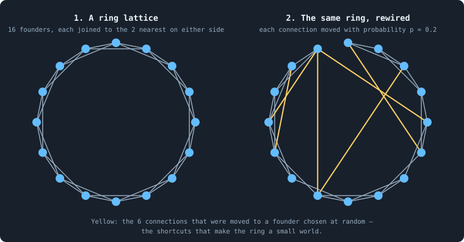

# The starting ring

Every world starts as a **ring of founders with a few shortcuts** — the
"small-world" network of Watts and Strogatz (1998). This note says exactly
how it is built.

## Step by step

Let *T* be the number of tokens ([`total_tokens`](settings.md#total_tokens)).

1. **The founders.** There are *n* = ⌊*T*/100⌋ of them
   ([`n_nodes`](settings.md#n_nodes)), numbered 0 to *n* − 1 — these are
   also their agent ids. Picture them in order around a circle.
2. **The ring.** With *k* = max(⌊*n*/100⌋, 5)
   ([`k_neighbors`](settings.md#k_neighbors)), every founder *i* is joined to
   the founders *i* ± 1, *i* ± 2, …, *i* ± ⌊*k*/2⌋, counting round the circle
   (so founder 0 is next to founder *n* − 1). That makes *n*·⌊*k*/2⌋
   connections, and every founder has 2⌊*k*/2⌋ of them.
3. **The shortcuts.** Go once round the circle through the connections
   {*i*, *i* + 1}, *i* = 0, 1, …, *n* − 1; then once more through the
   connections {*i*, *i* + 2}; and so on up to {*i*, *i* + ⌊*k*/2⌋}. Each
   connection is **rewired** with probability *p* = 0.2
   ([`rewire_p`](settings.md#rewire_p)): its far end *i* + *j* is replaced by
   a founder chosen uniformly at random among those that are not *i* and not
   already joined to *i*. Rewiring moves connections; it never adds or
   removes one.
4. **Tokens.** Every founder gets ⌊*T*/*n*⌋ tokens. If *n* does not divide
   *T*, the *T* − *n*⌊*T*/*n*⌋ tokens left over are dealt out by one
   multinomial draw in which every founder has the same chance at every
   token.
5. **Brains.** Every founder gets a brain whose weights are drawn at random
   ([Chapter 4](../chapters/04-the-brain.md)), each a genotype of its own,
   numbered 1 to *n*.

Steps 1–3 are done by the networkx function `watts_strogatz_graph(n, k, p,
seed)`, which draws from a random generator of its own started from the
run's seed. Steps 4–5 draw from the world's random stream
([Seeds and the random stream](random-numbers.md)).

## The baseline's ring

With *T* = 10,000: *n* = 100 founders of 100 tokens each, *k* = 5, so every
founder is joined to 2 on each side — degree 4 — and the ring has
100 · 2 = 200 connections. On average 0.2 · 200 = 40 of them are rewired.

## Why a small world?

A plain ring is **clustered**: two neighbours of a founder are often
neighbours of each other. With 2 neighbours on each side, a founder's 4
neighbours have 6 pairs among them, of which 3 are joined, so the clustering
([Clustering](clustering.md)) is 3/6 = 0.5. But a plain ring is **long**: to
get from one founder to the one opposite takes about *n*/(2·2) = 25 steps,
and the average distance between two founders is about 12.9 steps.

A few random shortcuts change that. They destroy little of the clustering,
but every shortcut joins two far-apart parts of the circle, and a handful are
enough to make every distance short. In the real ring of the run with seed 1,
37 of the 200 connections were rewired: the clustering fell to 0.27, the
average distance to 4.4 steps ([Chapter 2](../chapters/02-the-world.md)).

The first games of a world cut every connection that carries no tokens, so
the ring is forgotten within a few iterations. It matters mainly as a fair,
connected start: every founder can reach every other.

<!-- turns -->
[Contents](../README.md)
<!-- /turns -->
